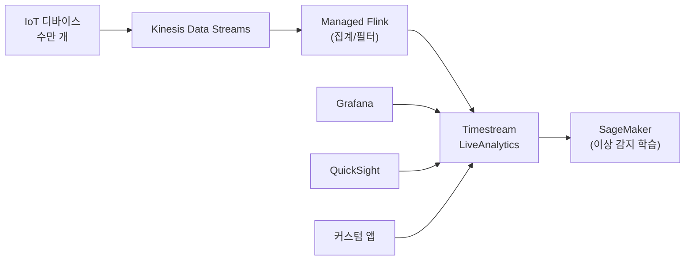

## 정의

**Amazon Timestream** 은 AWS 의 *관리형 시계열 데이터베이스* (Time-Series Database). 2024년부터 두 가지 별도 제품:

- **Timestream for LiveAnalytics** - 서버리스, SQL, 초기 Timestream 원류
- **Timestream for InfluxDB** - 관리형 InfluxDB v2.x (Flux/InfluxQL)

**시계열 데이터의 특성**:
- Append-only (수정 거의 없음)
- 시간 순 조회 (최근 데이터 조회 빈도 압도적)
- 대량 인제스션 (초당 수백만 포인트)
- Aggregation / rollup 이 표준 쿼리
- 오래된 데이터는 저해상도로 압축 (downsampling)

일반 [[postgresql|Postgres]] / [[dynamodb|DynamoDB]] 로도 가능하지만, 시계열 전용 저장/쿼리 최적화가 없어 규모가 커지면 비쌈/느림.

## 두 제품 비교

| 축 | Timestream for LiveAnalytics | Timestream for InfluxDB |
|:---|:---|:---|
| **아키텍처** | 서버리스, memory + magnetic 티어 | 관리형 InfluxDB v2 인스턴스 |
| **쿼리 언어** | SQL (Timestream 방언) | Flux, InfluxQL |
| **인스턴스** | 없음 (서버리스) | `db.influx.medium` ~ `db.influx.24xlarge` |
| **오픈소스 호환** | X (AWS 전용) | O (InfluxDB v2 호환) |
| **write 성능** | 자동 확장 | 인스턴스 크기 |
| **쿼리 지연** | 수백 ms | 한 자릿수 ms |
| **최대 저장** | 사실상 무제한 (magnetic) | 최대 16 TiB / instance |
| **Multi-AZ** | 자동 | 옵션 |
| **과금** | write / query / storage 단위 | 인스턴스 시간 + 스토리지 |
| **적합** | IoT 대규모, DevOps 모니터링, AWS 네이티브 | 기존 InfluxDB 사용자, 저지연 필요 |

## Timestream for LiveAnalytics (원류, 서버리스)

### 스토리지 티어

두 계층 자동 이동.

| 티어 | 위치 | 지연 | 보존 |
|:---|:---|:---|:---|
| **Memory Store** | 인메모리 | 매우 낮음 | 시간 - 일 (설정) |
| **Magnetic Store** | 자기 저장 | 낮음 | 일 - 년 (설정, 최대 200년) |

- 새 데이터 -> Memory Store 로
- Memory 보존 기간 지나면 자동으로 Magnetic 으로 티어링
- 쿼리는 두 티어를 투명하게 조회

### 데이터 모델

```
Database
└── Table
    └── Record
        ├── Dimensions (메타) : device_id, region, ...
        ├── Measure (측정)    : temperature=25.3
        └── Timestamp
```

### Write 예제

```python
import boto3
client = boto3.client('timestream-write')

client.write_records(
    DatabaseName='iot',
    TableName='sensor_readings',
    Records=[{
        'Dimensions': [
            {'Name': 'device_id', 'Value': 'sensor-42'},
            {'Name': 'region', 'Value': 'seoul'},
        ],
        'MeasureName': 'temperature',
        'MeasureValue': '25.3',
        'MeasureValueType': 'DOUBLE',
        'Time': str(int(time.time() * 1000)),
        'TimeUnit': 'MILLISECONDS',
    }]
)
```

**멀티 측정 (Multi-measure)**: 한 레코드에 여러 측정값을 담아 쓰기.

### Query 예제

```sql
-- 최근 1시간 device 별 평균 온도
SELECT
  device_id,
  BIN(time, 5m) AS bin,
  AVG(measure_value::double) AS avg_temp
FROM iot.sensor_readings
WHERE measure_name = 'temperature'
  AND time > ago(1h)
GROUP BY device_id, BIN(time, 5m)
ORDER BY bin DESC;

-- Interpolation (누락 보간)
SELECT INTERPOLATE_LINEAR(
  CREATE_TIME_SERIES(time, measure_value::double),
  SEQUENCE(ago(1h), now(), 1m)
)
FROM iot.sensor_readings
WHERE device_id = 'sensor-42' AND measure_name = 'temperature';

-- 이동 평균
SELECT time, measure_value::double,
       AVG(measure_value::double) OVER (
         PARTITION BY device_id
         ORDER BY time ROWS BETWEEN 10 PRECEDING AND CURRENT ROW
       ) AS moving_avg
FROM iot.sensor_readings
WHERE device_id = 'sensor-42' AND time > ago(1d);
```

**시계열 특화 함수**:
- `BIN(time, INTERVAL)` - 시간 버킷
- `INTERPOLATE_LINEAR / CUBIC / LOCF` - 보간
- `CREATE_TIME_SERIES` - 배열로 변환
- `PARTIAL_APPROX_DISTINCT` - 근사 distinct

### 요금 (LiveAnalytics)

| 항목 | 요금 (us-east-1, 2026) |
|:---|:---|
| **Write** | ~$0.50 / 1M writes (1 KB) |
| **Memory Store** | ~$0.036 / GB-시간 (매우 비쌈) |
| **Magnetic Store** | ~$0.03 / GB-월 |
| **Query** | ~$0.01 / GB scanned (10 MB 최소) |

**최적화**:
- Memory store 보존을 최소로 (실시간 쿼리 필요 만큼만)
- Magnetic 으로 빨리 티어링
- Multi-measure 쓰기 (write 수 절감)
- 쿼리 결과 캐싱

## Timestream for InfluxDB (2024+)

**관리형 InfluxDB v2**. 오픈소스 InfluxDB 를 AWS 가 완전 관리.

### 특징

- InfluxDB **v2.7** (2026 기준)
- **Flux + InfluxQL** 지원
- **Line Protocol** 로 write (InfluxDB 표준)
- Organizations + Buckets 모델 (InfluxDB 네이티브)
- 관리형: 백업, SW 업데이트, Multi-AZ
- 인스턴스: `db.influx.medium` ~ `db.influx.24xlarge`
- 스토리지: 3K / 12K / 16K IOPS 티어, 최대 16 TiB

### Write (Line Protocol)

```
sensor,device=sensor-42,region=seoul temperature=25.3,humidity=60 1706600000000000000
```

```python
from influxdb_client import InfluxDBClient, Point

client = InfluxDBClient(url="https://ts-influx-xxx.timestream-influxdb.amazonaws.com:8086",
                        token=TOKEN, org="my-org")

point = Point("sensor") \
    .tag("device", "sensor-42") \
    .tag("region", "seoul") \
    .field("temperature", 25.3) \
    .field("humidity", 60)

client.write_api().write(bucket="iot", record=point)
```

### Query (Flux)

```flux
from(bucket: "iot")
  |> range(start: -1h)
  |> filter(fn: (r) => r._measurement == "sensor" and r._field == "temperature")
  |> group(columns: ["device"])
  |> aggregateWindow(every: 5m, fn: mean)
```

### 요금 (InfluxDB)

- 인스턴스 시간 (`db.influx.medium`: ~$0.09/hr, `db.influx.24xlarge`: ~$5.6/hr)
- 스토리지 GB-월
- 데이터 전송 표준

**vs LiveAnalytics 비용 감각**:
- 인스턴스 기반 = 사용량 무관 고정
- LiveAnalytics 는 write/query 볼륨 기반
- 워크로드 예측 후 선택

## 언제 무엇을 쓰나

| 시나리오 | 선택 |
|:---|:---|
| AWS 네이티브 + IoT 대규모 write | **LiveAnalytics** |
| DevOps/APM 모니터링 대시보드 | **InfluxDB** (Grafana 통합 우수) |
| 기존 InfluxDB 마이그레이션 | **InfluxDB** |
| 서버리스, 트래픽 예측 불가 | **LiveAnalytics** |
| 저지연 (< 10 ms) 쿼리 | **InfluxDB** |
| 200년 보존이 필요한 규제 | **LiveAnalytics** (magnetic) |
| Flux / InfluxQL 코드 재사용 | **InfluxDB** |
| Timestream SQL 로 [[aws-athena\|Athena]] 스타일 쿼리 | **LiveAnalytics** |

## 대안 시계열 저장

| 옵션 | 특징 |
|:---|:---|
| **Timestream (both)** | 관리형 |
| **[[postgresql\|Postgres]] + TimescaleDB** | 오픈소스 확장, SQL |
| **ClickHouse** | 컬럼형 OLAP, 매우 빠름, 셀프 호스팅 |
| **Prometheus** | 모니터링 표준 (단기 저장) |
| **VictoriaMetrics** | Prometheus 호환, 장기 저장 |
| **OpenSearch (Metrics)** | 로그와 통합 |
| **[[aws-s3\|S3]] + [[apache-parquet\|Parquet]] + [[aws-athena\|Athena]]** | 대규모 저비용, 배치 |

**결정 기준**: 실시간성 / 규모 / 예산 / 팀 익숙도.

## 데이터 인제스션 패턴



## 통합

| 서비스 | 통합 |
|:---|:---|
| **AWS IoT Core** | 규칙으로 직접 write |
| **[[aws-kinesis-data-streams\|Kinesis]]** | Firehose / Managed Flink 통해 |
| **Grafana** | 데이터 소스 플러그인 |
| **QuickSight** | 데이터 소스 |
| **Telegraf** | InfluxDB / LiveAnalytics 둘 다 |
| **SageMaker** | 이상 감지 학습 데이터 |
| **CloudWatch** | 시스템 메트릭 -> Timestream |
| **JDBC** | BI 도구 (LiveAnalytics) |

## 함정

> [!WARNING]
> **Memory Store 는 매우 비쌈**. 필요한 최소 기간만 유지 (기본 6시간, 필요에 따라 조정). 오래 두면 요금 폭탄.

> [!CAUTION]
> **한 번 magnetic 으로 티어링된 데이터는 다시 memory 로 못 옮김**. 최근 데이터 쿼리가 잦으면 memory 보존 늘리기.

> [!WARNING]
> **Timestream SQL 은 표준 ANSI SQL 아님**. 방언이 있어 [[postgresql|Postgres]] / [[aws-athena|Athena]] SQL 그대로 안 됨.

> [!IMPORTANT]
> **write 최대 크기: 1 MB / record, 100 records / batch**. IoT 게이트웨이가 배치를 잘 구성해야 함.

> [!CAUTION]
> **InfluxDB 인스턴스는 유휴 시에도 시간당 청구**. 트래픽 없어도 비용 발생. Serverless 원하면 LiveAnalytics.

> [!WARNING]
> **cardinality explosion**: dimension 조합이 수백만 개 넘어가면 (예: user_id × device_id × session_id) 저장/쿼리 성능 급락. Dimension 설계 신중.

> [!IMPORTANT]
> **BI 대시보드 백엔드로 잦은 쿼리** = 쿼리 요금 폭탄. 결과 캐싱 (QuickSight SPICE) 또는 미리 계산.

## 관련 위키

- [[aws-kinesis-data-streams|Kinesis Data Streams]] - 인제스션 pipeline
- [[aws-kinesis-data-analytics|Managed Flink]] - 실시간 집계
- [[dynamodb|DynamoDB]] - NoSQL 대안 (덜 최적화)
- [[aws-athena|Athena]] - 배치 시계열 (S3 + Parquet)
- [[aws-rds|RDS]] / [[postgresql|Postgres]] - TimescaleDB 대안
- [[aws-cloudwatch|CloudWatch]] - AWS 자체 모니터링
- [[etl|ETL]] - 데이터 파이프라인
