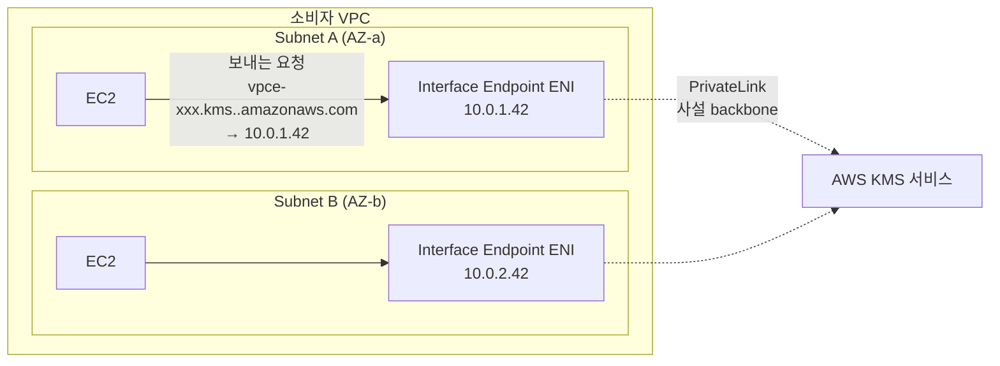
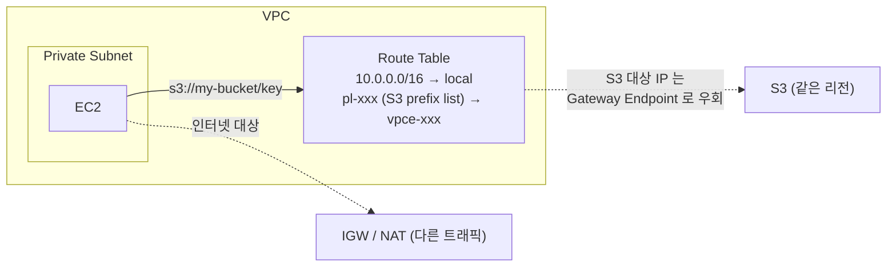
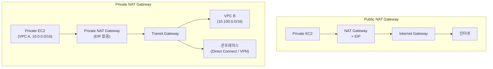
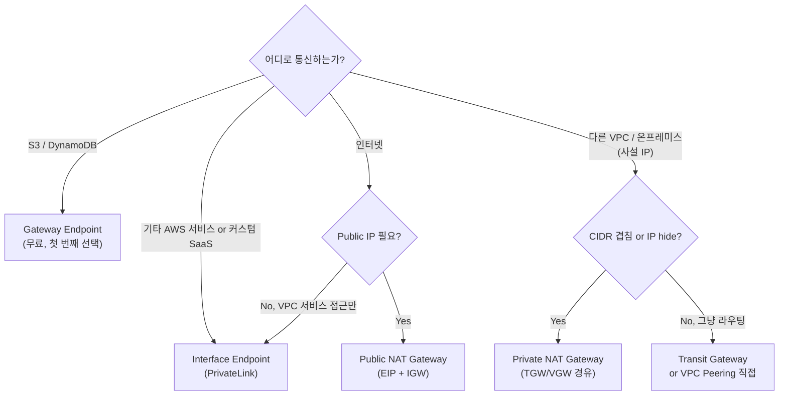
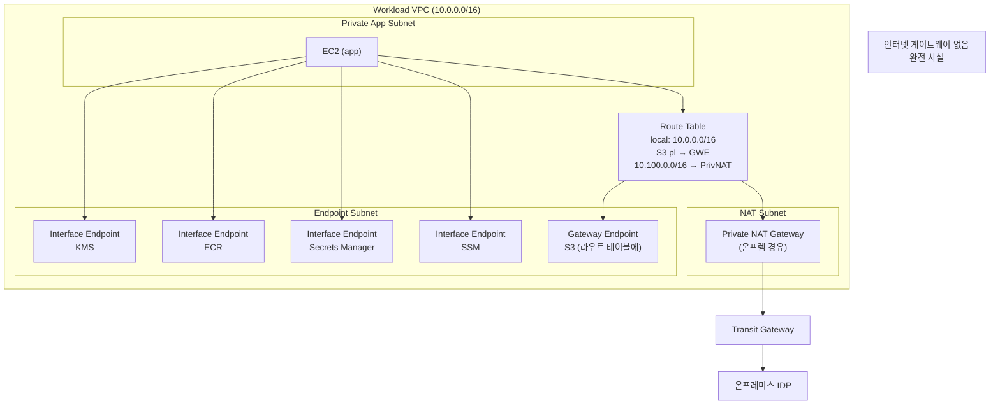

## 정의

*AWS 리소스가 인터넷을 거치지 않고 서로 통신하도록* 만드는 세 가지 도구.

- **Interface Endpoint** ([[aws-privatelink|PrivateLink]] 기반) - VPC 서브넷 안에 사설 IP 를 갖는 ENI 를 생성해 대부분의 AWS 서비스나 사용자가 만든 endpoint service 와 연결
- **Gateway Endpoint** - **[[aws-s3|S3]] / [[dynamodb|DynamoDB]] 전용**. 라우트 테이블에 목적지를 추가해서 트래픽을 우회. 무료
- **Private NAT Gateway** - NAT Gateway 의 "private" 연결 유형. 인터넷 게이트웨이 없이 [[aws-vpc|VPC]] 간 or 온프레미스 사이 outbound NAT

세 가지 모두 *"인터넷 게이트웨이 없이 AWS 서비스 or 외부와 통신"* 이라는 공통 목표를 다른 방식으로 해결.

## 왜 필요한가

인터넷 통해 [[aws-s3|S3]] 나 다른 서비스 접근하는 것의 문제:

- **인터넷 노출 위험** - 데이터 트래픽이 공개 네트워크로 흘러감
- **NAT Gateway 요금** - private subnet 에서 인터넷 나가려면 NAT 필요 (시간 + GB 요금)
- **지연** - AWS 리전 안에서도 인터넷 hop 을 거침
- **규제** - "인터넷을 절대 거치면 안 됨" 정책 (금융 / 정부)

세 endpoint 는 각각 다른 시나리오로 이 문제 해결.

## 세 종류 비교

| 축 | **Interface Endpoint** | **Gateway Endpoint** | **Private NAT Gateway** |
|:---|:---|:---|:---|
| **기반 기술** | [[aws-privatelink\|PrivateLink]] + [[aws-eni\|ENI]] | Route Table 항목 | NAT 기술 |
| **대상 서비스** | 대부분 AWS 서비스 + 커스텀 endpoint service | **S3, DynamoDB 만** | 임의 (TGW / VGW 경유) |
| **VPC 안 표현** | 서브넷의 ENI (사설 IP) | Route table target | ENI 하나 (NAT용) |
| **DNS** | 사설 DNS 이름 → 사설 IP | 서비스 endpoint 그대로 → 라우트가 우회 | N/A |
| **요금 (기본)** | **엔드포인트-시간 (AZ별) + GB 처리** | **무료** | 시간당 + GB 처리 |
| **Region 제약** | 동일 리전 (cross-region 옵션 있음) | 동일 리전만 | 동일 리전 |
| **적합** | S3/DynamoDB 외 서비스, 커스텀 SaaS | S3, DynamoDB (사실상 첫 번째 선택) | VPC 간 or on-prem NAT |

## Interface Endpoint

VPC 서브넷 안에 사설 IP 를 갖는 **ENI 를 생성**. 클라이언트는 이 사설 IP 로 서비스 호출.



**동작 원리**:
1. 사용자가 서비스 (예: KMS) 에 대한 Interface Endpoint 를 지정한 서브넷들에 생성
2. AWS 가 **각 서브넷마다** 하나의 ENI 를 만듬 (해당 AZ 의 서비스 인스턴스에 매핑)
3. Route 53 Private Hosted Zone 이 자동 생성되어 서비스 DNS 이름을 endpoint ENI 사설 IP 로 해석
4. 클라이언트가 평소처럼 `kms.<region>.amazonaws.com` 를 호출 → DNS 가 사설 IP 반환 → 인터넷 없이 접근

**중요 특성**:
- **AZ 단위**: 각 AZ 에 ENI 하나. 프로덕션은 다중 AZ 권장 (HA)
- **Security Group 부착 가능** - endpoint 접근 제어
- **Endpoint Policy** - 어떤 API 를 허용할지 세밀 제어
- **Private DNS 활성화** 시 서비스 원본 DNS 이름이 자동으로 endpoint IP 로 해석
- **200+ AWS 서비스** 지원 (KMS, ECR, SNS, SQS, Secrets Manager, CloudWatch 등)
- **커스텀 endpoint service** 도 가능 ([[aws-privatelink|PrivateLink]] 로 자체 서비스 공개)

**요금**: [PrivateLink Pricing](https://aws.amazon.com/privatelink/pricing/) 기준 *AZ 별 endpoint 시간당* + *처리 데이터 GB* 요금. 여러 AZ, 오래 유지, 많은 트래픽이면 부담.

## Gateway Endpoint

**S3 와 DynamoDB 전용**. ENI 를 안 만들고 **라우트 테이블 항목 하나** 로 우회.



**동작 원리**:
1. Gateway Endpoint 생성 시 VPC 와 서비스 (S3 or DynamoDB) 지정
2. AWS 가 해당 서비스의 **prefix list** (IP 대역 그룹) 를 자동 관리
3. 사용자가 라우트 테이블에 "prefix list → endpoint" 항목 추가
4. 서브넷의 트래픽이 S3/DynamoDB IP 로 향하면 인터넷 대신 endpoint 로 우회
5. 완전 사설 통신, NAT 없이 인터넷 트래픽 절감

**중요 특성**:
- **무료** - endpoint 시간 요금 없음, GB 처리 요금 없음
- **동일 리전 만** - VPC 와 S3/DynamoDB 가 같은 리전이어야
- **ENI 없음** - 라우트 항목만
- **Endpoint Policy** 로 특정 S3 버킷만 접근 허용 등 제어

**Interface vs Gateway (S3/DynamoDB 결정)**:
- 대부분: **Gateway Endpoint** (무료 + 동일 기능)
- Interface Endpoint 가 나은 경우:
  - **온프레미스에서 접근** (Direct Connect 통해 endpoint IP 로) - Gateway 는 VPC 내부만
  - **크로스 리전** 접근 필요

## Private NAT Gateway

NAT Gateway 의 두 가지 유형 중 "private" 쪽. **Elastic IP 없이 outbound NAT 만** 수행.

### Public NAT Gateway vs Private NAT Gateway



| 축 | **Public NAT Gateway** | **Private NAT Gateway** |
|:---|:---|:---|
| **Elastic IP** | 필요 | 없음 (있으면 안 됨) |
| **Internet Gateway 요구** | 필요 | 없어도 됨 (있어도 무의미) |
| **트래픽 방향** | 인터넷으로 outbound NAT | 다른 VPC / 온프레미스로 outbound NAT (TGW / VGW 경유) |
| **인터넷 접근** | 가능 | **불가능** (IGW 로 라우팅해도 drop) |
| **대표 용도** | Private subnet 의 인터넷 접근 | CIDR 겹치는 사설 네트워크 간 통신 |

### 언제 Private NAT Gateway 를 쓰나

**핵심 사용 사례: CIDR 겹치는 사설 네트워크 통신**

```
VPC A: 10.0.0.0/16 (프로덕션)
VPC B: 10.0.0.0/16 (M&A 로 인수한 회사, CIDR 우연히 같음)

문제: 두 VPC 를 그냥 Transit Gateway 로 연결하면 IP 충돌
해결:
  1. VPC A 에 별도 서브넷 172.16.0.0/24 생성
  2. 그 서브넷에 Private NAT Gateway 배치
  3. VPC A 의 EC2 가 VPC B 로 접근 시 Private NAT 를 경유
  4. Private NAT 가 VPC A EC2 의 소스 IP 를 172.16.0.x 로 변환
  5. VPC B 는 172.16.0.x 만 봄 → CIDR 겹침 문제 해소
```

**다른 시나리오**:
- 온프레미스 → 사설 VPC 접근 시 소스 IP hide
- 규제상 실제 인스턴스 IP 노출 금지
- 인터넷 접근은 절대 필요 없지만 여러 사설 네트워크로 트래픽 필요

**중요 함정**:
- Private NAT Gateway 의 라우트를 실수로 `0.0.0.0/0 → IGW` 로 설정 = **트래픽 drop** (private NAT 는 인터넷 통신 안 함)
- EIP 를 부착하려 시도하면 실패

## 결정 흐름



## 통합 아키텍처 예제

*금융권 완전 사설 VPC*:



- **AWS 서비스 접근**: Interface + Gateway Endpoint 조합
- **온프레미스 IDP 접근**: Private NAT Gateway → TGW
- **인터넷**: 완전 차단 (IGW 미배치)
- 결과: workload EC2 는 인터넷 없이도 KMS, ECR, S3, SSM 활용 + 온프렘 서비스 호출 가능

## 관측

- **VPC Flow Logs**: endpoint / NAT 트래픽 관찰
- **CloudWatch metrics**: Interface Endpoint (`ActiveConnections`, `BytesProcessed`), NAT Gateway (`BytesInFromDestination` 등)
- **CloudTrail**: endpoint 생성/삭제 감사

## 함정

> [!WARNING]
> **Gateway Endpoint 는 S3 / DynamoDB 만**. 다른 서비스는 Interface Endpoint 를 사용해야 함. 헷갈리기 쉬움.

> [!CAUTION]
> **Interface Endpoint 요금 폭발**. AZ 별 시간당 + 데이터 처리 요금. 여러 서비스 × 여러 AZ 로 endpoint 를 만들면 월 수십-수백 달러. 자주 안 쓰는 서비스는 정말 필요한지 재검토.

> [!WARNING]
> **Gateway Endpoint 는 동일 리전만**. 다른 리전 S3 접근이 필요하면 Interface Endpoint 사용.

> [!IMPORTANT]
> **Private Hosted Zone 자동 생성 시 기존 도메인과 충돌** 주의. "Private DNS enabled" 옵션 활성 전 기존 사설 DNS 확인.

> [!CAUTION]
> **Private NAT Gateway 를 인터넷 라우팅에 연결** 하면 트래픽 drop. IGW 로 route 시도 X. Public NAT 를 사용.

> [!WARNING]
> **Endpoint Policy 를 안 설정** = 그 endpoint 로 모든 API + 모든 리소스 접근 가능. 최소 권한 원칙으로 특정 API / 리소스만 허용.

> [!IMPORTANT]
> **온프레미스에서 Gateway Endpoint 못 씀**. Gateway Endpoint 는 VPC 라우트 테이블에만 반응. 온프레미스에서 S3 를 사설로 접근하려면 Interface Endpoint 필요 (또는 S3 Multi-Region Access Point).

## 관련 위키

- [[aws-privatelink|AWS PrivateLink]] - Interface Endpoint 의 기반 기술
- [[aws-vpc|AWS VPC]] - 배치 컨텍스트
- [[aws-eni|ENI]] - Interface Endpoint 가 만드는 인터페이스
- [[aws-s3|AWS S3]] - Gateway Endpoint 대표 대상
- [[dynamodb|DynamoDB]] - Gateway Endpoint 대표 대상
- [[aws-sg|Security Group]] - Interface Endpoint 접근 제어
- [[aws-vpc|VPC]] Peering / Transit Gateway - 대안 연결 수단
- [[aws-direct-connect|Direct Connect]] - 온프레미스 사설 연결
