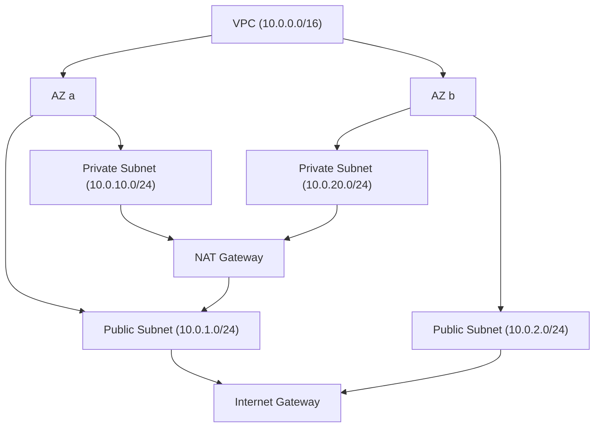

## 정의

**VPC (Virtual Private Cloud)** = AWS 안의 *논리적 격리 네트워크*. CIDR 정의 + subnet 분할 + 라우팅.

## 구조



## Subnet 종류

| 종류 | 정의 |
|---|---|
| **Public** | route to IGW |
| **Private** | route 없음 또는 NAT 경유 |
| **Isolated** | route 완전 없음 |

## Route Table

```
Destination       Target
10.0.0.0/16       local        ← VPC 안 통신
0.0.0.0/0         igw-xxx       ← Public subnet (인터넷)
0.0.0.0/0         nat-xxx       ← Private subnet (NAT 경유)
192.168.0.0/16    pcx-xxx       ← peering 다른 VPC
```

## NAT Gateway vs NAT Instance

| | NAT Gateway | NAT Instance |
|---|---|---|
| 관리 | AWS | 사용자 |
| 가격 | 비싸다 (시간 + GB) | EC2 시간 |
| 가용성 | AZ 별 (multi-AZ 권장) | EC2 다운 = 다운 |
| 처리량 | up to 100 Gbps | EC2 type |

> [!CAUTION]
> *NAT Gateway 비용* 이 *VPC 의 가장 큰 함정*. GB 당 비용 + 시간당 비용. 자세한 정리는 *VPC Endpoint* (S3/DynamoDB 등) 로 NAT 우회.

## VPC Endpoint

```mermaid
flowchart LR
    Pod[Pod in Private Subnet] -.NAT 경유.-> S3
    Pod -->|VPC Endpoint (gateway)| S3
```

| 종류 | 의미 |
|---|---|
| **Gateway Endpoint** | S3, DynamoDB 전용 (무료) |
| **Interface Endpoint** | 다른 AWS service (PrivateLink) |

> *Gateway Endpoint 추가* 만으로 S3/DynamoDB 트래픽이 *NAT 우회 + 무료*.

## Connectivity 옵션

| 옵션 | 의미 |
|---|---|
| **Internet Gateway** | 외부 인터넷 |
| **NAT Gateway** | private → 인터넷 |
| **VPC Peering** | 1:1 VPC 연결 |
| **Transit Gateway** | Hub-spoke, 다수 VPC + on-prem |
| **VPN Gateway** | 사이트 VPN |
| **Direct Connect** | 전용 회선 (큰 대역폭) |
| **VPC Endpoint (PrivateLink)** | AWS service / 다른 VPC 의 SaaS |

## Security Group vs NACL

자세한 건 [[aws-sg-vs-nacl]].

| | SG | NACL |
|---|---|---|
| Layer | Stateful | Stateless |
| 대상 | ENI / instance | Subnet |
| 규칙 | allow 만 | allow + deny |
| 기본 | deny all | allow all |

## IPv4 CIDR 선택

```
권장: RFC 1918 사설 대역
10.0.0.0/8       (큰)
172.16.0.0/12    (중간)
192.168.0.0/16   (작은)

피하기: 다른 시스템과 겹칠 가능성
```

> [!IMPORTANT]
> VPC 의 *CIDR 충돌* 이 peering / TGW 의 가장 큰 함정. *organization 차원 IPAM* 으로 사전 분배.

## 흔한 함정

> [!WARNING]
> 1. **NAT Gateway 비용 폭증** = GB 당. S3 endpoint 누락 시 대규모 비용.
> 2. **단일 AZ NAT** = AZ 장애 시 *해당 AZ private subnet 모두 인터넷 차단*. multi-AZ.
> 3. **CIDR 너무 작음** = EKS pod IP 고갈. /16 권장.
> 4. **Public subnet 에 *모든 것*** = 잘못된 보안 모델. *기본 private + 필요한 것만 public*.

## 관련 위키

- [[aws-sg-vs-nacl]]
- [[aws-alb-nlb]]
- [[network-cidr-subnetting]]
- [[aws-route53]]
