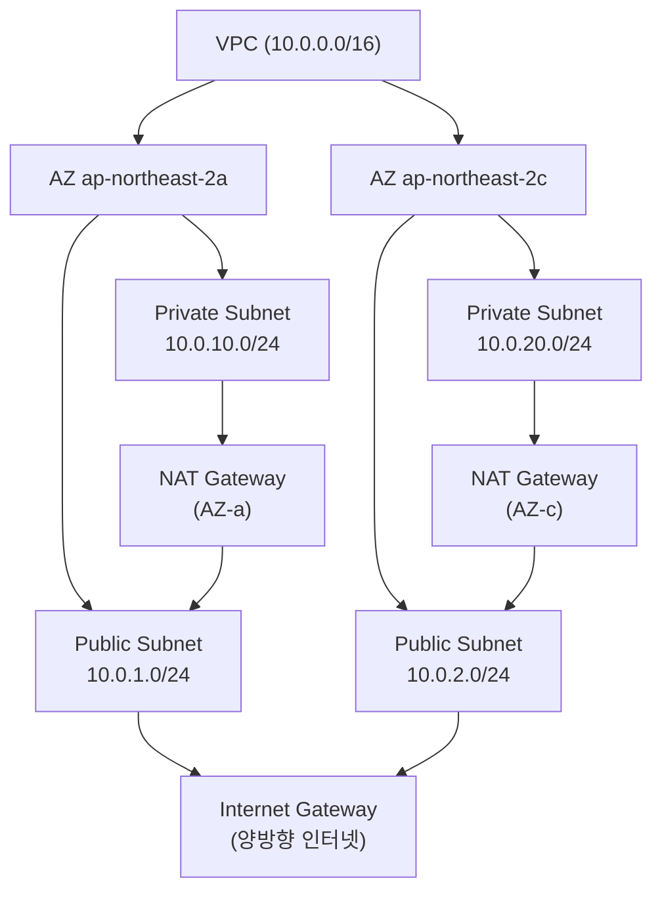
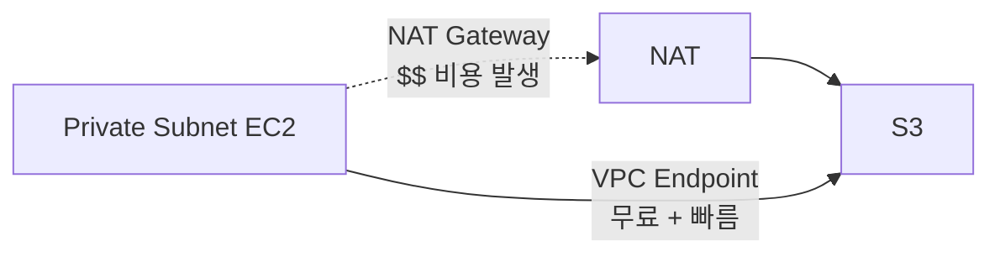
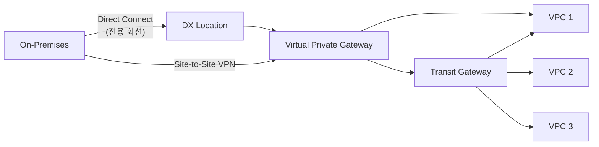
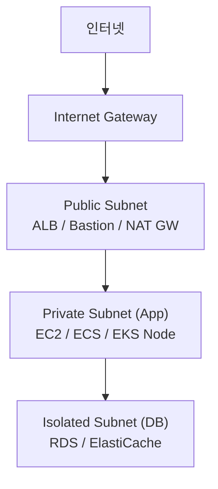

## 정의

**VPC (Virtual Private Cloud)** = AWS 안의 *논리적 격리 네트워크*. CIDR 정의 + subnet 분할 + 라우팅. AWS 리소스를 격리된 네트워크에 배치.

## 구조



## Subnet 종류

| 종류 | 정의 | 용도 |
|:---|:---|:---|
| **Public** | route table 에 IGW 항목 있음 | ALB, Bastion, NAT GW |
| **Private** | IGW 없음, NAT GW 경유 | EC2, EKS node, RDS |
| **Isolated** | 외부 route 전혀 없음 | DB, 내부 서비스 |

## Route Table

subnet 별로 route table 연결. 규칙은 가장 구체적인 prefix 가 우선.

```
# Public subnet route table
Destination       Target
10.0.0.0/16       local          # VPC 내부 통신
0.0.0.0/0         igw-xxx        # 인터넷

# Private subnet route table
Destination       Target
10.0.0.0/16       local
0.0.0.0/0         nat-xxx        # NAT 경유 아웃바운드
192.168.0.0/16    pcx-xxx        # VPC Peering 대상
10.1.0.0/16       tgw-xxx        # Transit Gateway
```

## NAT Gateway vs NAT Instance

아웃바운드 전용 인터넷 접근 (private subnet → 인터넷).

| 항목 | NAT Gateway | NAT Instance |
|:---|:---|:---|
| 관리 | AWS | 사용자 |
| 가격 | 비쌈 (시간당 $0.059 + GB당 $0.059) | EC2 온디맨드 |
| 가용성 | AZ 별 redundant | EC2 단일 장애점 |
| 처리량 | 최대 100 Gbps 자동 확장 | EC2 type 한정 |
| SG 적용 | 불가 | 가능 |

> [!CAUTION]
> NAT Gateway 비용이 VPC 의 가장 큰 함정. GB 당 비용 + 시간당 비용 누적. S3/DynamoDB 는 VPC Endpoint 로 반드시 우회.

## VPC Endpoint

Private subnet 에서 AWS 서비스를 인터넷 없이 접근.



| 종류 | 대상 | 비용 |
|:---|:---|:---|
| **Gateway Endpoint** | S3, DynamoDB | 무료 |
| **Interface Endpoint** | 대부분의 AWS 서비스 | 시간당 + 처리량 비용 |

> Gateway Endpoint 추가만으로 S3/DynamoDB 트래픽이 NAT 우회 + 무료. 모든 VPC 에 기본 추가.

## Connectivity 옵션

| 옵션 | 방향 | 용도 |
|:---|:---|:---|
| **Internet Gateway (IGW)** | 양방향 | public subnet 인터넷 |
| **NAT Gateway** | 아웃바운드만 | private → 인터넷 |
| **VPC Peering** | 양방향 | 1:1 VPC 연결 (same/cross account) |
| **Transit Gateway** | 양방향 | Hub-spoke, 다수 VPC + on-prem |
| **Site-to-Site VPN** | 양방향 | on-prem 연결 (암호화) |
| **Direct Connect** | 양방향 | 전용 회선, 대역폭 보장 |
| **VPC Endpoint (PrivateLink)** | 단방향 | AWS 서비스 / SaaS |



## VPC Peering vs Transit Gateway

| 항목 | VPC Peering | Transit Gateway |
|:---|:---|:---|
| 연결 수 | 1:1 | N:N (hub-spoke) |
| 전이적 라우팅 | 불가 | 가능 |
| 비용 | 데이터 전송만 | 시간당 + 처리량 |
| 교차 계정 | 가능 | 가능 |
| 교차 리전 | 가능 | 가능 |

**2-3개 VPC** = Peering 충분. **4개 이상 또는 온프레미스 연결** = Transit Gateway.

## Security Group vs NACL

자세한 비교는 [[aws-sg-vs-nacl]].

| 항목 | Security Group | NACL |
|:---|:---|:---|
| 계층 | Stateful | Stateless |
| 적용 대상 | ENI / instance | Subnet |
| 규칙 종류 | allow 만 | allow + deny |
| 기본 동작 | deny all (inbound) | allow all |
| 규칙 평가 | 모든 규칙 OR | 번호 순서대로 |

## IPv4 CIDR 설계

```
RFC 1918 사설 대역
10.0.0.0/8        크고 광범위 (AWS 기업 권장)
172.16.0.0/12     중간
192.168.0.0/16    작음 (홈/소규모)

권장 VPC CIDR: /16 (65,534 IP)
권장 Subnet CIDR: /24 (254 IP)
```

**IPAM (IP Address Manager)**: AWS Organizations 전체의 CIDR 충돌 방지 중앙 관리.

> [!IMPORTANT]
> VPC 의 CIDR 충돌이 peering / Transit Gateway 의 가장 큰 함정. 한번 생성한 VPC CIDR 는 변경 불가. Organization 차원에서 사전 IPAM 계획 필수.

## 비용

| 항목 | 요금 |
|:---|:---|
| VPC 생성 | 무료 |
| IGW | 무료 |
| NAT Gateway | $0.059/시간 + $0.059/GB |
| VPC Peering 데이터 | AZ 간 $0.01/GB, 리전 간 표준 요금 |
| Transit Gateway | $0.05/attachment/시간 + $0.02/GB |
| Interface Endpoint | $0.01/시간/AZ + $0.01/GB |
| Gateway Endpoint | 무료 |

**NAT Gateway 비용 최적화**:
1. S3, DynamoDB → Gateway Endpoint 로 대체
2. ECR → Interface Endpoint (대용량 이미지 pull 시 효과적)
3. 단일 AZ 테스트 환경에서는 NAT Instance 고려

## VPC Flow Logs

VPC 내 모든 ENI 트래픽 기록. 보안 감사, 트래픽 분석, 침해 탐지.

```bash
# VPC 수준 Flow Log 활성화
aws ec2 create-flow-logs \
  --resource-type VPC \
  --resource-ids vpc-xxx \
  --traffic-type ALL \
  --log-destination-type cloud-watch-logs \
  --log-group-name /vpc/flow-logs \
  --deliver-logs-permission-arn arn:aws:iam::123:role/flow-log-role
```

**로그 필드** (기본): version, account-id, interface-id, srcaddr, dstaddr, srcport, dstport, protocol, packets, bytes, start, end, action (ACCEPT/REJECT), log-status.

Flow Log 를 S3 에 저장 후 Athena 로 쿼리 가능 (대용량 분석).

## 설계 패턴

### 3-tier 아키텍처



**원칙**: 외부 접근이 필요한 것만 Public. 앱 서버는 Private. DB 는 인터넷 접근 완전 차단.

### Multi-Account 설계

```
Organization
├── 네트워크 계정 (Transit Gateway 허브)
│   └── TGW ← 모든 VPC 연결
├── 프로덕션 계정
│   └── VPC (10.0.0.0/16) → TGW
├── 스테이징 계정
│   └── VPC (10.1.0.0/16) → TGW
└── 개발 계정
    └── VPC (10.2.0.0/16) → TGW
```

**AWS Organizations + RAM (Resource Access Manager)** 로 TGW 를 여러 계정에 공유.

## PrivateLink

자체 서비스를 VPC 내에서 비공개로 제공. 인터넷 경유 없이 다른 VPC 또는 계정에 서비스 노출.


- SaaS 공급자: 고객 VPC 에 endpoint 서비스 제공
- 내부 공유 서비스: 여러 팀 VPC 에서 중앙 API 접근
- AWS 서비스 (ECR, SSM, Secrets Manager 등) 비공개 접근

## 흔한 함정

> [!WARNING]
> 1. **NAT Gateway 비용 폭증**: GB 당 과금. S3 endpoint 미설정 시 대규모 비용. 예산 alarm 설정 필수.
> 2. **단일 AZ NAT**: AZ 장애 시 해당 AZ private subnet 전체 아웃바운드 차단. AZ 별 NAT 권장.
> 3. **CIDR 너무 작음**: EKS pod IP 고갈. /16 이상 권장. 서브넷은 secondary CIDR 로 확장 가능.
> 4. **Public subnet 에 DB 배치**: 보안 모델 오류. DB 는 Private/Isolated 에 배치.
> 5. **NACL 에서 임시 포트 block**: stateless 이므로 응답 트래픽 허용 규칙 별도 필요 (1024-65535).

> [!CAUTION]
> VPC 삭제는 내부 리소스 모두 삭제. 기본 VPC 수정 후 복구 어려움. 기본 VPC 를 그대로 사용하지 않고 전용 VPC 설계 권장.

## 관련 위키

- [[aws-sg-vs-nacl]] - 보안 그룹 vs NACL 상세 비교
- [[aws-alb-nlb]] - 로드밸런서 (public subnet 배치)
- [[network-cidr-subnetting]] - CIDR 서브넷 계산
- [[aws-route53]] - DNS (Route 53 Resolver for VPC)
- [[aws-eks]] - VPC CNI, pod IP 설계
- [[aws-privatelink]] - PrivateLink 서비스
- [[aws-direct-connect]] - 전용 회선 연결
