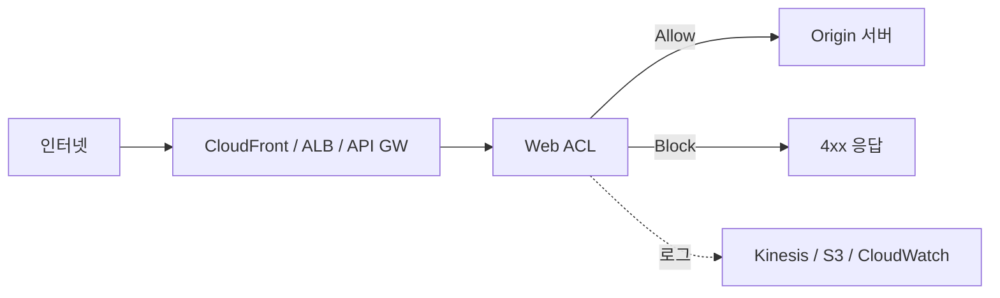
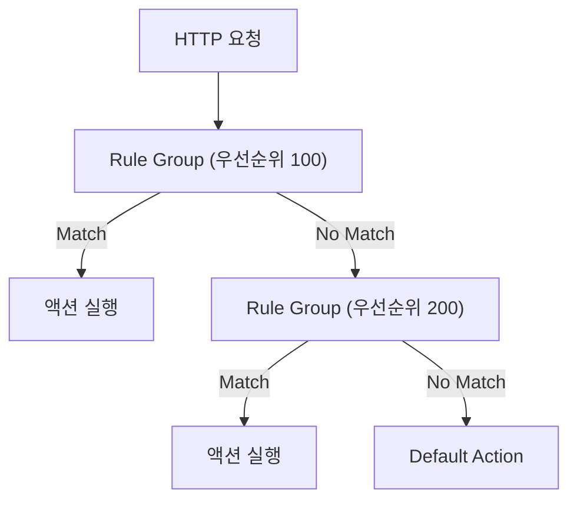

## 정의

**AWS WAF (Web Application Firewall)** 는 HTTP/HTTPS 요청을 검사하는 **Layer 7 방화벽** 서비스입니다. CloudFront, ALB, API Gateway 등 앞단에 붙어 SQL injection, XSS, 악의적 봇, 비정상 Rate 등을 요청 단위로 차단합니다.

**한 줄 요약**: 개별 웹 요청의 URL, 헤더, 바디, 쿠키를 룰로 필터링하는 앱 계층 방화벽.

## Layer 3/4 방화벽의 한계

[[aws-sg-vs-nacl|Security Group / NACL]] 은 IP/포트/프로토콜 레벨만 처리합니다:

- HTTP URL 경로 기반 차단 불가: `/admin` 만 막고 싶어도 IP 막는 수 밖에 없음
- 요청 헤더/바디 검사 불가: SQL injection payload 감지 없음
- 사용자별 Rate Limit 불가: 동일 IP 에서 초당 1000 요청이 와도 허용
- 국가/지역 기반 필터 불가

WAF 는 HTTP 요청을 7계층에서 분해해서 룰과 매칭합니다.

## 핵심 개념

### Web ACL

WAF 의 최상위 단위. 여러 **Rule / Rule Group** 을 포함하고 각 AWS 리소스에 연결합니다.

- **Default Action**: 매칭 룰 없을 때 `Allow` 또는 `Block` 결정
- 하나의 Web ACL 을 여러 리소스에 공유 가능
- 리전 또는 글로벌 (CloudFront 전용) 스코프

### Rule Group

Rule 을 묶는 컨테이너. 우선순위 숫자로 평가 순서 결정 (낮을수록 먼저).

**세 종류**:
- **AWS Managed Rules**: AWS 관리, 자동 업데이트, 즉시 사용 가능
- **AWS Marketplace Rules**: Fortinet, F5, Imperva 등 3rd-party 벤더
- **Custom Rules**: 직접 작성

### Rule

매칭 조건 + 액션 단위.

**Statement (매칭 조건)**:

| Statement | 설명 |
|:---|:---|
| `ByteMatchStatement` | 특정 문자열 포함 여부 |
| `SqliMatchStatement` | SQL injection 패턴 |
| `XssMatchStatement` | XSS 패턴 |
| `IPSetReferenceStatement` | IP 집합 (최대 10,000 IP) |
| `GeoMatchStatement` | 국가 코드 |
| `RateBasedStatement` | IP 당 요청 수 (5분 창) |
| `RegexMatchStatement` | 정규식 |
| `AndStatement` / `OrStatement` | 조건 조합 |
| `NotStatement` | 조건 부정 |

**검사 대상 필드**: URI, Query String, Header, Cookie, HTTP Method, Body, JSON Body.

**Action**: `Allow`, `Block`, `Count`, `Challenge`, `CAPTCHA`

- `Count`: 실제 차단 않고 카운트만. False Positive 분석에 활용.
- `Challenge`: JS 챌린지로 봇 여부 판별.
- `CAPTCHA`: 사람인지 확인.

### WCU (Web ACL Capacity Units)

각 룰마다 WCU 비용이 있고, Web ACL 은 최대 **5000 WCU** 까지.

- `SqliMatchStatement`: 10~20 WCU
- `XssMatchStatement`: 40 WCU
- `RateBasedStatement + 조건 결합`: 규칙별 추가
- Managed Rule Group: 각 그룹에서 선언한 WCU 합산

복잡한 커스텀 룰은 WCU 를 빠르게 소진합니다.

## 통합 대상

| 리소스 | 특이사항 |
|:---|:---|
| **CloudFront** | Web ACL 은 `us-east-1` 에 생성 필수 |
| **ALB** | 동일 리전에 생성 |
| **API Gateway** (REST / HTTP API) | Stage 단위 연결 |
| **AppSync** |  |
| **Cognito User Pool** |  |
| **App Runner** |  |
| **Verified Access** |  |

## 아키텍처



### 요청 평가 흐름



## AWS Managed Rules

**무료 포함** (별도 비용 없음, WCU 만 소비):

| 그룹 | 내용 |
|:---|:---|
| `AWSManagedRulesCommonRuleSet` | OWASP Top 10, SQLi, XSS, LFI, RFI |
| `AWSManagedRulesKnownBadInputsRuleSet` | Log4Shell, Spring4Shell 등 CVE |
| `AWSManagedRulesAmazonIpReputationList` | AWS 위협 인텔리전스 IP 목록 |
| `AWSManagedRulesAnonymousIpList` | VPN, Tor, proxy |
| `AWSManagedRulesLinuxRuleSet` | Linux OS 관련 취약점 |
| `AWSManagedRulesSQLiRuleSet` | SQL injection 전용 (더 세밀) |
| `AWSManagedRulesBotControlRuleSet` | **별도 요금**, 봇 분류/차단 |
| `AWSManagedRulesFraudControlAccountTakeoverPreventionRuleSet` | **별도 요금**, 계정 탈취 방지 |

**Override Action**: 특정 룰을 `Count` 로 전환해 테스트 가능. 배포 전 False Positive 파악에 필수.

## 커스텀 Rule 예시

```json
{
  "Name": "BlockSQLi",
  "Priority": 10,
  "Statement": {
    "OrStatement": {
      "Statements": [
        {
          "SqliMatchStatement": {
            "FieldToMatch": { "QueryString": {} },
            "TextTransformations": [{"Priority": 0, "Type": "URL_DECODE"}]
          }
        },
        {
          "SqliMatchStatement": {
            "FieldToMatch": { "Body": {"OversizeHandling": "CONTINUE"} },
            "TextTransformations": [{"Priority": 0, "Type": "HTML_ENTITY_DECODE"}]
          }
        }
      ]
    }
  },
  "Action": { "Block": {} },
  "VisibilityConfig": {
    "SampledRequestsEnabled": true,
    "CloudWatchMetricsEnabled": true,
    "MetricName": "BlockSQLi"
  }
}
```

### Rate-based Rule

IP 당 5분 창 기준 요청 수로 차단:

```json
{
  "Name": "RateLimitPerIP",
  "Priority": 5,
  "Statement": {
    "RateBasedStatement": {
      "Limit": 2000,
      "AggregateKeyType": "IP"
    }
  },
  "Action": { "Block": {} }
}
```

IP 당 5분에 2000 요청 초과 시 차단. 집계 키를 `FORWARDED_IP` 나 `HTTP_HEADER` 로 변경 가능.

### Geo Blocking

```json
{
  "Name": "GeoBlockKP",
  "Statement": {
    "GeoMatchStatement": { "CountryCodes": ["KP", "IR"] }
  },
  "Action": { "Block": {} }
}
```

## Bot Control

`AWSManagedRulesBotControlRuleSet` (별도 요금, 월 + 요청 당):

- **Common 레벨**: User-Agent, IP 기반 봇 감지. 크롤러, 스캐너, 스크래퍼.
- **Targeted 레벨**: JavaScript challenge, CAPTCHA 포함. 정교한 봇도 탐지.

**레벨별 차이**:

| 레벨 | 비용 | 탐지 범위 |
|:---|:---|:---|
| `COMMON` | 낮음 | 일반 봇, User-Agent 기반 |
| `TARGETED` | 높음 | 정교한 봇, JS 실행 가능 여부 검사 |

### Fraud Control

- **ATP (Account Takeover Prevention)**: 로그인 폼 브루트포스, 비밀번호 스터핑 방어
- **ACFP (Account Creation Fraud Prevention)**: 가짜 계정 대량 생성 방어

별도 요금이며, 특정 URI 경로 (로그인/회원가입 엔드포인트) 에만 적용.

## 로깅

WAF 요청 로그 대상:

- **Kinesis Data Firehose**: S3 / Redshift / OpenSearch 실시간 전송
- **CloudWatch Logs**: 로그 그룹 직접 전송
- **S3**: 직접 저장

**로그 필터**: 특정 조건 (Block 된 것만 등) 매칭 요청만 로깅해 비용 절감.

**샘플링**: Sampled Requests (최근 500개 샘플) 는 무료로 콘솔에서 확인 가능.

## 비용 모델

| 항목 | 요금 (USD, ap-northeast-2 기준) |
|:---|:---|
| Web ACL 월 | 5.00 USD |
| Rule Group 월 | 1.00 USD / 그룹 |
| 요청 처리 | 0.60 USD / 100만 요청 |
| Bot Control Common | 10.00 USD / 월 + 1.00 USD / 100만 요청 |
| Bot Control Targeted | 10.00 USD / 월 + 1.50 USD / 100만 요청 |
| ATP / ACFP | 10.00 USD / 월 + 추가 요청 요금 |

**참고**: 요금은 변동될 수 있으므로 AWS 공식 페이지 확인.

## WAF vs 유사 서비스

| 서비스 | 역할 | 계층 |
|:---|:---|:---|
| **WAF** | 개별 HTTP 요청 검사, 룰 기반 필터링 | Layer 7 |
| **[[aws-shield|Shield]]** | 대용량 DDoS 트래픽 볼륨 완화 | Layer 3/4 + 7 |
| **[[aws-network-firewall|Network Firewall]]** | VPC 수준 DPI, 도메인 필터, IPS (Suricata) | Layer 3-7 |
| **[[aws-guardduty|GuardDuty]]** | 이상 행위 탐지, 위협 인텔리전스 (차단 아님) | 계정 수준 |

**판단 기준**:
- 웹 앱 SQL injection / XSS / 봇 방어 → **WAF**
- 수 Gbps 볼륨 DDoS 완화 → **Shield**
- VPC 내부 East-West + IPS → **Network Firewall**
- 위협 탐지 + 가시성 (이상 행위 알림) → **GuardDuty**

실제 운영에서는 조합: CloudFront + WAF + Shield Advanced + GuardDuty.

## 실전 배포 패턴

### CloudFront + WAF (권장)

```
[사용자] → CloudFront + Web ACL → ALB → EC2/ECS
```

엣지에서 먼저 차단하므로 Origin 까지 트래픽 전달 최소화. 글로벌 지연 없음.

### ALB 전용

```
[사용자] → ALB + Web ACL → Target Group
```

CloudFront 없는 구성, 리전 내 요청만 처리.

### API Gateway 보호

```
[클라이언트] → API Gateway + Web ACL → Lambda / 백엔드
```

Rate Limit + IP 차단으로 API 남용 방어.

## 함정

> [!WARNING]
> **Managed Rule False Positive**. `AWSManagedRulesCommonRuleSet` 이 정상 요청을 차단할 수 있습니다. 첫 배포는 반드시 `Override Action: Count` 로 실행 후 로그 분석.

> [!CAUTION]
> **WCU 5000 한계**. 복잡한 커스텀 룰 + 여러 Managed Rule Group 조합 시 WCU 초과. 불필요 룰 제거 또는 단순화 필요.

> [!WARNING]
> **CloudFront WAF 는 us-east-1 고정**. 다른 리전에 Web ACL 을 만들면 CloudFront 에 연결 불가.

> [!CAUTION]
> **로그 비용 폭발**. 대용량 트래픽에서 전체 로그 활성화 시 Kinesis / S3 비용 급증. 로그 필터 또는 샘플링 먼저 설정.

> [!IMPORTANT]
> **Rate-based rule 집계 지연**. 5분 창 기반이라 순간 버스트는 차단이 늦을 수 있습니다. 짧은 burst 방어에는 [[aws-shield|Shield]] 보완.

> [!WARNING]
> **Managed Rule 자동 업데이트 주의**. AWS 가 룰 업데이트 시 신규 룰이 정상 트래픽을 막을 수 있습니다. SNS 알림 구독 + 스테이징 환경에서 먼저 적용 후 프로덕션 반영.

## 관련 위키

- [[aws-shield|Shield]] - DDoS 볼륨 방어
- [[aws-network-firewall|Network Firewall]] - VPC 수준 IPS
- [[aws-guardduty|GuardDuty]] - 위협 탐지
- [[aws-security-hub|Security Hub]] - 통합 보안 대시보드
- [[aws-cloudfront-cdn|CloudFront]] - 엣지 배포 + WAF 주 연결 대상
- [[aws-alb-nlb|ALB/NLB]] - 앱 로드 밸런서
- [[aws-api-gateway|API Gateway]]
- [[aws-cloudwatch|CloudWatch]] - WAF 메트릭 / 알림
- [[aws-sg-vs-nacl|SG vs NACL]] - Layer 3/4 방화벽 비교
