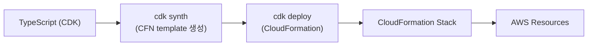

## 정의

**AWS CDK** = *TS/Python/Java/Go 로 AWS 인프라 정의* → *CloudFormation* 으로 컴파일 → 배포. *AWS 전용*.

## 흐름



## 예시

```typescript
import { Stack, StackProps, RemovalPolicy } from 'aws-cdk-lib';
import { Bucket, BucketEncryption } from 'aws-cdk-lib/aws-s3';
import { Function, Runtime, Code } from 'aws-cdk-lib/aws-lambda';
import { Construct } from 'constructs';

export class MyStack extends Stack {
  constructor(scope: Construct, id: string, props?: StackProps) {
    super(scope, id, props);

    const bucket = new Bucket(this, 'Data', {
      versioned: true,
      encryption: BucketEncryption.KMS_MANAGED,
      removalPolicy: RemovalPolicy.RETAIN,
    });

    const fn = new Function(this, 'Processor', {
      runtime: Runtime.NODEJS_22_X,
      handler: 'index.handler',
      code: Code.fromAsset('lambda'),
    });

    bucket.grantReadWrite(fn);   // ← IAM 자동 생성!
  }
}
```

> *`bucket.grantReadWrite(fn)` 한 줄* = bucket policy + IAM role + 권한 → 자동 생성. 가장 강력한 추상화.

## Construct Level (L1, L2, L3)

| Level | 의미 |
|---|---|
| **L1 (Cfn*)** | CloudFormation 그대로 (`CfnBucket`) |
| **L2** | 추상화 (`Bucket`, `Function`) |
| **L3 (Patterns)** | 합성 (`LoadBalancedFargateService`) |

```typescript
// L3 example: ALB + Fargate 한 줄
new ApplicationLoadBalancedFargateService(this, 'Service', {
  cluster,
  taskImageOptions: {
    image: ContainerImage.fromRegistry('nginx'),
  },
  desiredCount: 3,
});
```

## CDK 명령

```bash
cdk init app --language=typescript
cdk synth                    # CFN template 생성
cdk diff                     # 현 stack vs 예정 변경
cdk deploy MyStack
cdk destroy MyStack
cdk bootstrap                # CDK 의 metadata bucket 생성 (account 당 1회)
```

## CDK vs Terraform vs Pulumi

| 항목 | CDK | Terraform | Pulumi |
|---|---|---|---|
| 언어 | TS/Python/Java/Go | HCL | TS/Python/Go |
| Multi-cloud | *AWS only* | 예 | 예 |
| State | CFN (managed) | 별도 backend | 별도 backend |
| 추상화 | *L1/L2/L3* | provider | 코드 |
| 학습 곡선 | AWS 잘 알면 쉬움 | HCL 학습 | 코드 자유 |
| AWS 통합 | *최고* | 예 | 예 |

## CDK for Terraform (cdktf)

```typescript
import { S3Bucket } from '@cdktf/provider-aws/lib/s3-bucket';

new S3Bucket(this, 'data', {
  bucket: 'myapp-data',
  ...
});
```

> *코드 (TS/Python) + Terraform backend*. CDK 의 *언어 + Terraform 의 multi-cloud*.

## 흔한 함정

> [!WARNING]
> 1. **`cdk bootstrap` 한 번 필요** = account+region 당. CI/CD 에서 잊음.
> 2. **CFN limit** = stack 당 500 resource. *Nested stack* 으로.
> 3. **CDK Asset 의 S3 누적** = bootstrap bucket 비용. 정기 정리.
> 4. **Snapshot 테스트 (jest)** = 큰 stack 의 변경 추적. CI 에 필수.

## 관련 위키

- [[terraform]]
- [[pulumi]]
- [[aws-lambda]]
- [[aws-s3]]
