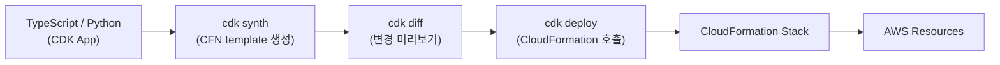
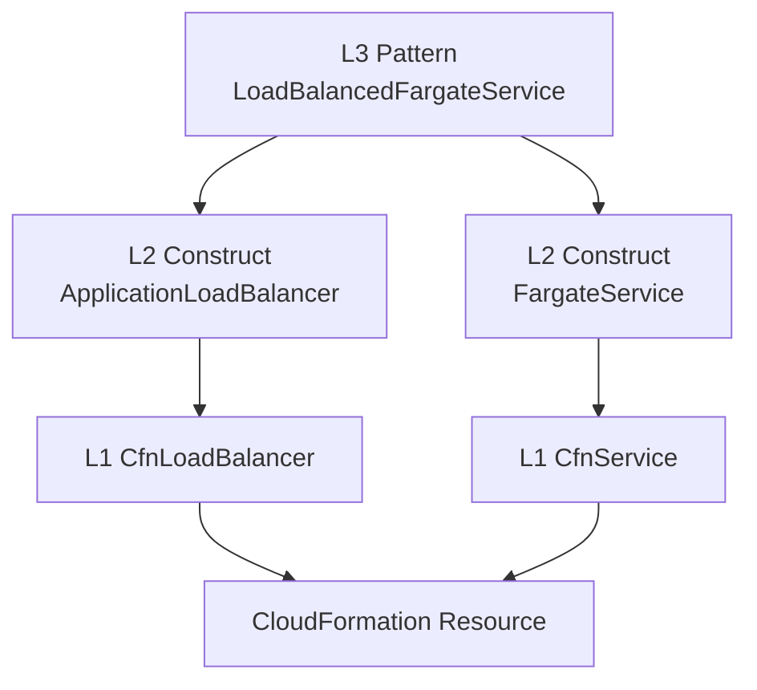

## 정의

**AWS CDK** = *TS/Python/Java/Go 로 AWS 인프라 정의* → *CloudFormation* 으로 컴파일 → 배포. AWS 전용 IaC 도구.

[[aws-cloudformation|CloudFormation]] YAML 을 직접 쓰는 대신 프로그래밍 언어로 인프라를 선언. 타입 안전성, 추상화, 재사용, 테스트 가능.

## 흐름



## Construct Level (L1, L2, L3)

CDK 의 핵심 추상화 단위는 *Construct*. 3단계 레벨로 분류.

| Level | 이름 | 의미 | 예시 |
|:---|:---|:---|:---|
| **L1** | CloudFormation Resources | CFN 그대로, 자동 생성 | `CfnBucket`, `CfnFunction` |
| **L2** | Curated Constructs | 추상화 + 기본값 제공 | `Bucket`, `Function`, `Table` |
| **L3** | Patterns | 합성 (여러 L2 묶음) | `LoadBalancedFargateService` |



## 예시: S3 + Lambda

```typescript
import { Stack, StackProps, RemovalPolicy } from 'aws-cdk-lib';
import { Bucket, BucketEncryption } from 'aws-cdk-lib/aws-s3';
import { Function, Runtime, Code } from 'aws-cdk-lib/aws-lambda';
import { Construct } from 'constructs';

export class MyStack extends Stack {
  constructor(scope: Construct, id: string, props?: StackProps) {
    super(scope, id, props);

    const bucket = new Bucket(this, 'Data', {
      versioned: true,
      encryption: BucketEncryption.KMS_MANAGED,
      removalPolicy: RemovalPolicy.RETAIN,
    });

    const fn = new Function(this, 'Processor', {
      runtime: Runtime.NODEJS_22_X,
      handler: 'index.handler',
      code: Code.fromAsset('lambda'),
      environment: {
        BUCKET_NAME: bucket.bucketName,
      },
    });

    // IAM 자동 생성: bucket policy + role + policy
    bucket.grantReadWrite(fn);
  }
}
```

> `bucket.grantReadWrite(fn)` 한 줄 = bucket resource policy + Lambda IAM role + policy 연결 자동. 가장 강력한 추상화.

## L3 패턴 예시: ALB + Fargate

```typescript
import { ApplicationLoadBalancedFargateService } from 'aws-cdk-lib/aws-ecs-patterns';
import { ContainerImage } from 'aws-cdk-lib/aws-ecs';

new ApplicationLoadBalancedFargateService(this, 'Service', {
  cluster,
  taskImageOptions: {
    image: ContainerImage.fromRegistry('nginx:latest'),
    containerPort: 80,
  },
  desiredCount: 3,
  cpu: 256,
  memoryLimitMiB: 512,
  publicLoadBalancer: true,
});
```

ALB + Target Group + Fargate Task Definition + ECS Service + Security Group + IAM Role 을 한 번에 생성.

## CDK 명령

```bash
cdk init app --language=typescript    # 프로젝트 초기화
cdk bootstrap                         # CDK metadata bucket 생성 (account+region 당 1회)
cdk synth                             # CFN template 생성 (cdk.out/)
cdk diff                              # 현재 배포 vs 변경 예정 diff
cdk deploy MyStack                    # 배포
cdk deploy --all                      # 전체 stack 배포
cdk destroy MyStack                   # 삭제
cdk ls                                # stack 목록
```

## Aspects: 전체 적용 정책

Aspect = CDK tree 를 순회하며 모든 construct 에 적용하는 visitor.

```typescript
import { Aspects, IAspect, IConstruct } from 'aws-cdk-lib';
import { CfnBucket } from 'aws-cdk-lib/aws-s3';

class EnforceEncryption implements IAspect {
  visit(node: IConstruct): void {
    if (node instanceof CfnBucket) {
      node.bucketEncryption = {
        serverSideEncryptionConfiguration: [{
          serverSideEncryptionByDefault: { sseAlgorithm: 'AES256' },
        }],
      };
    }
  }
}

// 앱 전체에 적용
Aspects.of(app).add(new EnforceEncryption());
```

**사용 사례**: 전사 보안 정책 강제, 태그 자동 추가, cost center 라벨링.

## Snapshot 테스트

```typescript
import { Template } from 'aws-cdk-lib/assertions';
import { App } from 'aws-cdk-lib';
import { MyStack } from '../lib/my-stack';

test('snapshot', () => {
  const app = new App();
  const stack = new MyStack(app, 'TestStack');
  const template = Template.fromStack(stack);

  // 특정 리소스 확인
  template.hasResourceProperties('AWS::S3::Bucket', {
    VersioningConfiguration: { Status: 'Enabled' },
  });

  // 전체 스냅샷 (변경 추적)
  expect(template.toJSON()).toMatchSnapshot();
});
```

> CI 에 스냅샷 테스트 필수. 의도치 않은 인프라 변경을 PR 단계에서 캐치.

## CDK vs Terraform vs Pulumi

| 항목 | CDK | Terraform | Pulumi |
|:---|:---|:---|:---|
| 언어 | TS/Python/Java/Go | HCL | TS/Python/Go/C# |
| Multi-cloud | AWS 위주 | 예 | 예 |
| State | CFN managed | 별도 backend | Pulumi Cloud |
| 추상화 | L1/L2/L3 | provider | 코드 |
| 타입 안전성 | 완전 (TS) | 제한적 | 완전 |
| 테스트 | jest / pytest | terratest | 언어 내장 |
| AWS 새 서비스 대응 | 즉시 | provider 업데이트 필요 | provider 업데이트 필요 |
| 학습 곡선 | AWS 잘 알면 낮음 | HCL 별도 학습 | 코드 자유도 높음 |

**판단 기준**:
- AWS-only + 개발자 친화성 + 타입 안전성 → CDK
- Multi-cloud + 인프라 팀 중심 → Terraform
- Multi-cloud + 완전한 프로그래밍 언어 → Pulumi

## Custom Construct 패턴

재사용 가능한 인프라 패턴을 Construct 로 추상화.

```typescript
import { Construct } from 'constructs';
import { Function, Runtime, Code } from 'aws-cdk-lib/aws-lambda';
import { Queue } from 'aws-cdk-lib/aws-sqs';
import { SqsEventSource } from 'aws-cdk-lib/aws-lambda-event-sources';

// 재사용 가능한 Lambda + SQS Construct
export class WorkerConstruct extends Construct {
  public readonly queue: Queue;
  public readonly fn: Function;

  constructor(scope: Construct, id: string, props: { handler: string }) {
    super(scope, id);

    this.queue = new Queue(this, 'Queue', {
      visibilityTimeout: cdk.Duration.seconds(300),
    });

    this.fn = new Function(this, 'Worker', {
      runtime: Runtime.NODEJS_22_X,
      handler: props.handler,
      code: Code.fromAsset('lambda'),
    });

    this.fn.addEventSource(new SqsEventSource(this.queue, {
      batchSize: 10,
      reportBatchItemFailures: true,
    }));
  }
}

// 사용: 두 줄로 SQS + Lambda 구성 완료
const worker = new WorkerConstruct(this, 'ImageProcessor', {
  handler: 'image.handler',
});
```

## Pipelines (CI/CD)

CDK Pipelines = 코드로 선언한 배포 파이프라인.

```typescript
import { CodePipeline, ShellStep, CodePipelineSource } from 'aws-cdk-lib/pipelines';

const pipeline = new CodePipeline(this, 'Pipeline', {
  pipelineName: 'MyPipeline',
  synth: new ShellStep('Synth', {
    input: CodePipelineSource.gitHub('org/repo', 'main'),
    commands: ['npm ci', 'npx cdk synth'],
  }),
});

// 스테이지 추가
pipeline.addStage(new MyAppStage(this, 'Prod', {
  env: { account: '123', region: 'ap-northeast-2' },
}));
```

**self-mutating**: pipeline 자체도 코드에서 관리. 파이프라인 정의 변경 시 자동 업데이트.

## CDK for Terraform (cdktf)

```typescript
import { S3Bucket } from '@cdktf/provider-aws/lib/s3-bucket';
import { App, TerraformStack } from 'cdktf';

class MyStack extends TerraformStack {
  constructor(scope: App, id: string) {
    super(scope, id);
    new S3Bucket(this, 'data', { bucket: 'myapp-data' });
  }
}
```

CDK 의 언어 (TS/Python) + Terraform 의 multi-cloud backend. HashiCorp 와 협력.

## 비용

CDK 자체는 무료. 생성되는 AWS 리소스 요금 + bootstrap bucket (S3) 비용.

**비용 최적화**:
- `cdk deploy --hotswap`: Lambda / ECS 변경을 CFN 대신 직접 배포 (개발 속도 향상)
- bootstrap bucket 의 오래된 asset 주기적 정리
- `cdk diff` 로 불필요한 replacement 사전 차단

## 흔한 함정

> [!WARNING]
> 1. **`cdk bootstrap` 누락**: account+region 당 1회 필요. CI/CD 파이프라인에서 첫 실행 시 실패.
> 2. **CFN limit 500 resource**: 대형 stack 은 Nested stack 으로 분리.
> 3. **CDK Asset S3 누적**: bootstrap bucket 에 Lambda zip 등 asset 누적. 정기 정리 또는 lifecycle 설정.
> 4. **L2 기본값 함정**: `Bucket` 은 public access block 기본 활성. 의도한 설정인지 확인.
> 5. **snapshot 테스트 미적용**: stack 변경 시 의도치 않은 resource 재생성 (replacement) 놓침.

> [!CAUTION]
> `RemovalPolicy.DESTROY` 는 stack 삭제 시 S3 버킷, RDS 등 **데이터 포함 삭제**. 프로덕션 리소스는 반드시 `RETAIN`.

## 관련 위키

- [[aws-cloudformation]] - CDK 의 컴파일 대상
- [[terraform]] - 대안 IaC (Multi-cloud)
- [[pulumi]] - 대안 IaC
- [[aws-lambda]] - 가장 많이 쓰이는 CDK L2 대상
- [[aws-s3]] - asset + 데이터 스토어
- [[aws-iam]] - construct 의 grant* 메서드가 자동 생성
- [[aws-eks]] - EKS cluster CDK 구성
