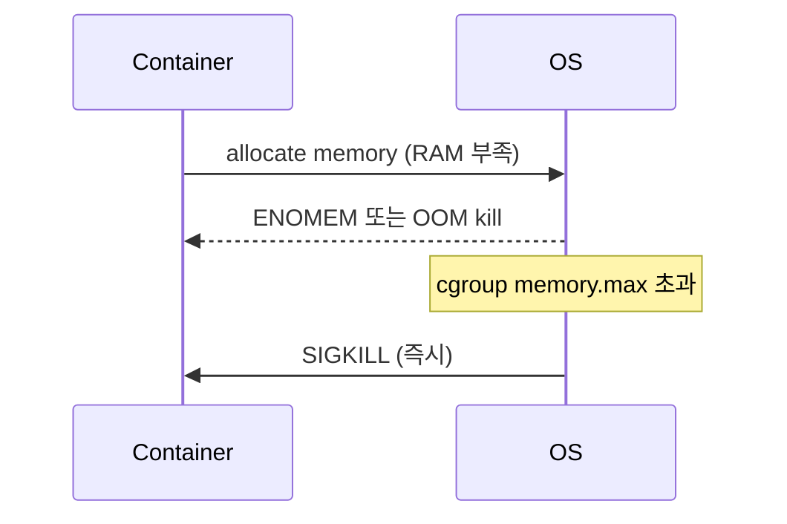

## 정의

컨테이너 = *namespaces + cgroups + 파일시스템 (overlay)*. *VM 이 아니라 host 의 프로세스* + *격리*.

```mermaid
flowchart LR
    Container[Container]
    Container --> NS[Namespaces<br/>(격리)]
    Container --> CG[cgroups<br/>(자원 제한)]
    Container --> FS[Overlay FS<br/>(layered FS)]
```

## Namespaces (격리)

| Namespace | 격리 대상 |
|---|---|
| `pid` | 프로세스 ID (안에서 PID=1) |
| `mnt` | 파일시스템 마운트 |
| `net` | 네트워크 인터페이스, 라우팅, 방화벽 |
| `uts` | hostname, domain |
| `ipc` | System V IPC, POSIX msg queue |
| `user` | UID/GID 매핑 (root in container ≠ root in host) |
| `cgroup` | cgroup root |
| `time` | clock |

```bash
# 새 namespace 에서 명령 실행
unshare --pid --mount --net --fork bash
```

## cgroups (자원 제한)

```mermaid
flowchart TB
    Root[/sys/fs/cgroup/]
    Root --> ContainerA[container-a/]
    Root --> ContainerB[container-b/]
    ContainerA --> CPU[cpu.max = 50000 100000<br/>(50% CPU)]
    ContainerA --> Mem[memory.max = 512M]
    ContainerA --> IO[io.max = read 100MB/s]
    ContainerB --> CPU2[cpu.max = 200000 100000]
    ContainerB --> Mem2[memory.max = 2G]
```

| Controller | 제한 |
|---|---|
| `cpu` | CPU 시간 |
| `memory` | RAM + swap |
| `io` | block I/O |
| `pid` | 프로세스 수 |
| `network` (BPF) | NIC bandwidth |
| `hugetlb` | huge pages |

## cgroup v1 vs v2

| | v1 | v2 |
|---|---|---|
| 출시 | 2007 | 2016 |
| 계층 | controller 별 다수 | *단일 통합 계층* |
| 권장 | legacy | *모든 현대 distro* |

> *Ubuntu 22.04+, Fedora 31+, K8s 1.25+* 가 cgroup v2 기본.

## OCI Runtime spec 에서

```json
{
  "linux": {
    "namespaces": [
      { "type": "pid" },
      { "type": "network" },
      { "type": "ipc" },
      { "type": "uts" },
      { "type": "mount" }
    ],
    "resources": {
      "memory": { "limit": 536870912 },
      "cpu": { "shares": 1024, "quota": 50000, "period": 100000 }
    }
  }
}
```

## OOM kill (cgroup memory)



> [!CAUTION]
> *Memory limit 초과 = SIGKILL (graceful 없음)*. 애플리케이션이 *준비 안 됨*. limit 보수적으로.

## User Namespace

```
container 내부 root (uid 0)
host: uid 100000 (제한된 일반 사용자)
```

> *컨테이너 내부 root 가 host root 아님*. 보안 강화. *rootless container* (podman) 의 토대.

## OverlayFS

```
lowerdir (read-only): image layers
upperdir (read-write): container 변경
merged: 통합 view
```

```anim:linked-list
{}
```

> Layered FS 의 *append-only* 동작 직관 (Linked list 의 *읽기 시 위에서 아래로* 와 유사).

## 흔한 함정

> [!WARNING]
> 1. **`--privileged`** = 모든 namespace 해제. 컨테이너 의미 없음. *capabilities* 만 추가.
> 2. **호스트 PID/IPC/Network 공유** = 컨테이너 = host process. 격리 없음.
> 3. **CPU limit 의 throttle** = container 가 *느려짐* (kill 아님). 메트릭으로 확인.
> 4. **Memory limit 너무 작음** = OOM kill 반복. 측정.

## 관련 위키

- [[docker]]
- [[oci-image]]
- [[k8s-pod]]
- [[container-image-best-practices]]
