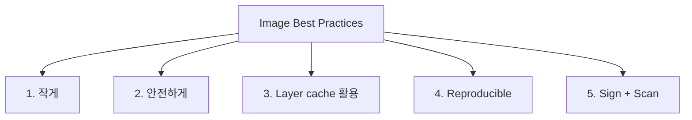

## 5가지 원칙



## 1. Base Image 선택

| Base | 크기 | 적합 |
|---|---|---|
| `ubuntu:24.04` | ~70 MB | 개발 / 디버깅 친화 |
| `debian:12-slim` | ~40 MB | 일반 |
| `alpine:3.20` | ~5 MB | 작음, musl libc (glibc 의존성 주의) |
| `distroless/static` | ~2 MB | Go / Rust 정적 binary |
| `distroless/nodejs22` | ~150 MB | Node, 안전 |
| `distroless/java21` | ~200 MB | Java |
| `scratch` | 0 | 정적 binary 만 |

> *Distroless* = *shell / package manager 없음*. 공격 면 감소. Google 권장.

## 2. Multi-stage build

```dockerfile
FROM golang:1.23 AS builder
WORKDIR /src
COPY go.* ./
RUN go mod download
COPY . .
RUN CGO_ENABLED=0 go build -o /app ./cmd/server

FROM gcr.io/distroless/static:nonroot
COPY --from=builder /app /app
USER nonroot:nonroot
ENTRYPOINT ["/app"]
```

> *최종 image 에 빌드 도구 없음*. 수십 MB → 수 MB.

## 3. Layer Cache

```dockerfile
# ❌ 모든 코드 복사 후 install
COPY . .
RUN npm ci

# ✅ 의존성 파일만 먼저
COPY package*.json ./
RUN npm ci
COPY . .
```

> *코드 변경* 시 *npm ci layer 캐시 활용*. 빌드 시간 *수배 단축*.

## 4. Non-root User

```dockerfile
RUN addgroup -g 1000 app && adduser -D -u 1000 -G app app
USER 1000:1000
```

또는 distroless 의 `:nonroot`.

## 5. Secret 처리

```dockerfile
# BuildKit secret (image layer 에 안 남음)
RUN --mount=type=secret,id=npmrc cp /run/secrets/npmrc ~/.npmrc \
    && npm ci
```

```bash
docker buildx build --secret id=npmrc,src=$HOME/.npmrc .
```

> [!CAUTION]
> *ARG / ENV 로 secret 전달 절대 금지*. layer 에 *영구 남음*.

## 6. .dockerignore

```
node_modules
.git
.env
**/*.log
.DS_Store
dist
coverage
```

## 7. HEALTHCHECK

```dockerfile
HEALTHCHECK --interval=30s --timeout=3s --start-period=10s --retries=3 \
  CMD curl -f http://localhost:8080/health || exit 1
```

> K8s 에서는 Liveness/Readiness probe 가 우선이지만 *docker run* 환경에서는 HEALTHCHECK 가 유용.

## 8. Image Scan

```bash
trivy image myapp:1.0
# CVE 검사

cosign sign myapp:1.0
cosign verify myapp:1.0
# 서명 + 검증

syft myapp:1.0 -o spdx-json > sbom.json
# SBOM 생성
```

| 도구 | 용도 |
|---|---|
| Trivy | CVE / misconfig scan |
| Grype | CVE scan |
| Cosign | 서명 + verify |
| Syft | SBOM 생성 |
| Notary | image trust |

## 9. Reproducible Build

```dockerfile
ARG BUILD_DATE
ARG GIT_SHA
LABEL org.opencontainers.image.created=$BUILD_DATE
LABEL org.opencontainers.image.revision=$GIT_SHA
```

> 같은 입력 → 같은 output. *supply chain security* 의 토대.

## 흔한 함정

> [!WARNING]
> 1. **`apt install ... && apt clean` 한 줄로** = layer 작아짐. 별도 RUN 이면 *clean 효과 없음*.
> 2. **`COPY . /app`** = .dockerignore 없으면 *.git, node_modules 까지*.
> 3. **`latest` tag** = build 마다 다른 결과.
> 4. **root 사용자 + privileged** = 컨테이너 의미 없음.

## 관련 위키

- [[docker]]
- [[oci-image]]
- [[cgroups-namespaces]]
- [[k8s-pod]]
- [[aws-secrets-manager]]
