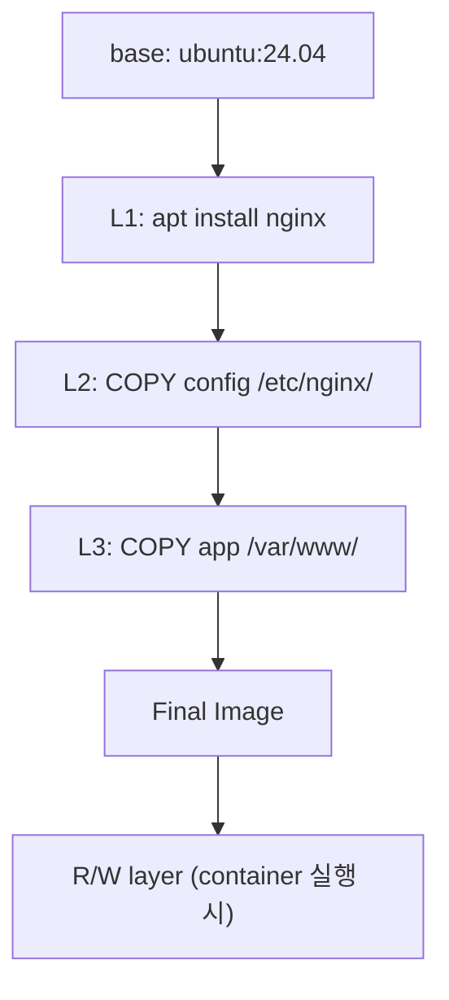
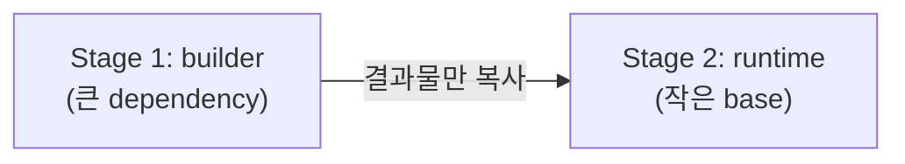

## 정의

**Docker** = 컨테이너 *빌드 + 실행 + 배포* 의 표준 도구. 2013 출시 → *컨테이너 시대* 의 시작. 현재는 *OCI 표준* 으로 진화 (`containerd`, `runc`, `podman` 등 호환).

## Layered Filesystem



> 각 *Dockerfile instruction* = *별도 layer*. *불변* + *재사용 (cache)*.

## Dockerfile

```dockerfile
# 멀티 스테이지 빌드
FROM node:22-alpine AS builder
WORKDIR /app
COPY package*.json ./
RUN npm ci
COPY . .
RUN npm run build

FROM nginx:alpine AS runtime
COPY --from=builder /app/dist /usr/share/nginx/html
EXPOSE 80
CMD ["nginx", "-g", "daemon off;"]
```

| instruction | 의미 |
|---|---|
| `FROM` | base image |
| `WORKDIR` | 작업 디렉토리 |
| `COPY` / `ADD` | 파일 복사 |
| `RUN` | 빌드 시 실행 |
| `CMD` / `ENTRYPOINT` | 컨테이너 시작 명령 |
| `EXPOSE` | 포트 (문서화, 자동 노출 아님) |
| `ENV` | 환경 변수 |
| `ARG` | 빌드 시 변수 |
| `VOLUME` | mount point |
| `USER` | 실행 사용자 |
| `HEALTHCHECK` | health probe |

## 멀티 스테이지 빌드



> *빌드 도구는 final image 에 안 들어감*. 최종 image 가 *작고 안전*.

## Image Registry

| Registry | 특징 |
|---|---|
| Docker Hub | 공식, rate limit |
| GHCR (GitHub) | github 통합 |
| ECR (AWS) | IAM 통합 |
| Artifact Registry (GCP) | GCP 통합 |
| Harbor | self-host |

## Build vs Buildx (BuildKit)

```bash
# 옛 docker build
docker build -t myapp .

# Buildx (멀티 아키 + 캐시 + 병렬)
docker buildx build --platform linux/amd64,linux/arm64 -t myapp --push .
```

> *BuildKit 가 2026 표준*. ARM/x86 *멀티 아키 동시 build* + 효율적 cache.

## .dockerignore

```
node_modules
.git
.env
**/*.log
dist
```

> *.gitignore 같은*. *build context 작게* → 빠른 build.

## Layer Cache 활용

```dockerfile
# ❌ 의존성과 코드 같이 복사 → 코드 변경 시 npm ci 재실행
COPY . .
RUN npm ci

# ✅ 의존성 먼저
COPY package*.json ./
RUN npm ci
COPY . .
```

## 흔한 함정

> [!WARNING]
> 1. **`latest` tag** = build 마다 다른 결과. *명시 tag 또는 digest sha256*.
> 2. **root 사용자** = 보안 위험. `USER 1000` 명시.
> 3. **secret 을 ENV / ARG** = image layer 에 평문 남음. BuildKit `--secret`.
> 4. **거대한 image** = transfer 느림. distroless / scratch / alpine 활용.

## 관련 위키

- [[oci-image]]
- [[cgroups-namespaces]]
- [[container-image-best-practices]]
- [[k8s-pod]]
