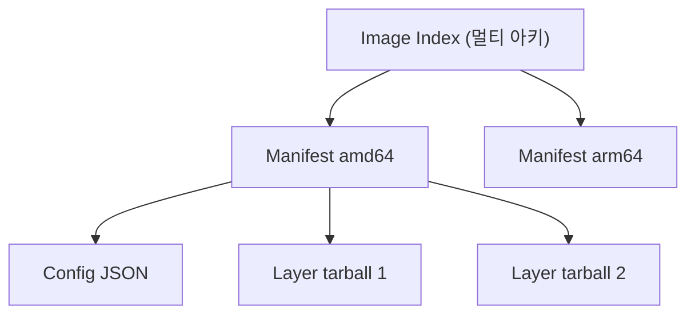
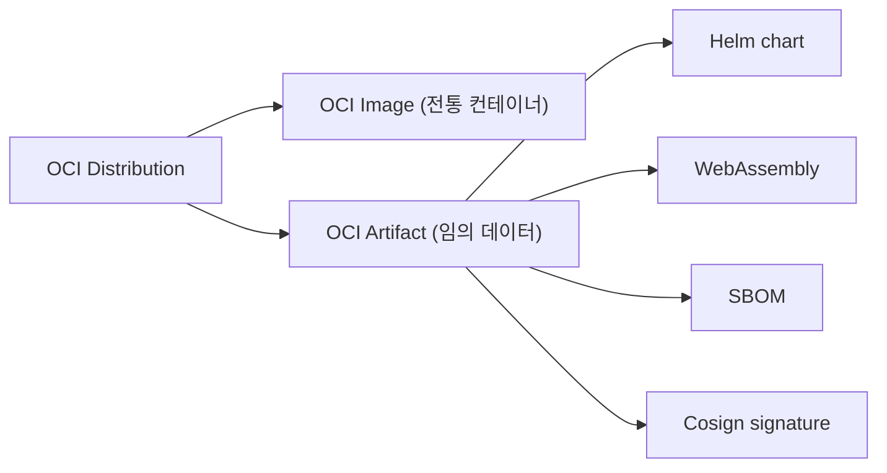
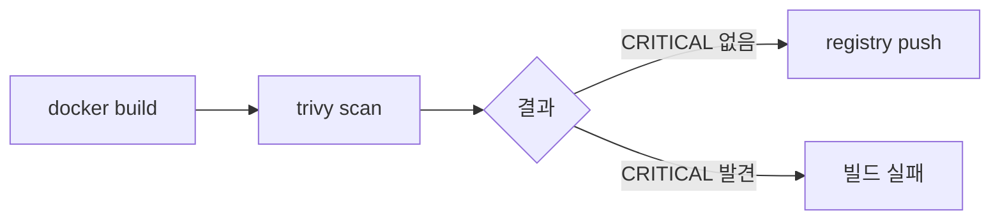

## 정의

**OCI (Open Container Initiative)** = *컨테이너 표준* (Linux Foundation, 2015). *image format + runtime + distribution* 3가지 spec.

## 사용 상황

| 상황 | 핵심 개념 |
|---|---|
| 멀티 아키 이미지 빌드 (AMD64 + ARM64) | Image Index, BuildKit + QEMU |
| 이미지 공급망 보안 | Cosign 서명, SBOM |
| 이미지 경량화 | Dockerfile 레이어 최적화 |
| 취약점 스캔 자동화 | Trivy, Grype |
| Registry 비용 최적화 | Lifecycle Policy |
| Docker 외 런타임 사용 (K8s, K3s) | containerd, CRI-O |

## 3개 OCI Spec

| Spec | 의미 |
|---|---|
| **Image** | tarball + JSON metadata 구조 |
| **Runtime** | `runc` 같은 *컨테이너 실행 표준* |
| **Distribution** | `docker push/pull` 같은 *레지스트리 API* |

## Image 구조

```
manifest.json
  - config.json (image config)
  - layers
    - layer0.tar.gz
    - layer1.tar.gz
    - layer2.tar.gz
```



## Image Index (멀티 아키)

```json
{
  "schemaVersion": 2,
  "manifests": [
    {
      "mediaType": "application/vnd.oci.image.manifest.v1+json",
      "digest": "sha256:abc...",
      "platform": { "os": "linux", "architecture": "amd64" }
    },
    {
      "mediaType": "application/vnd.oci.image.manifest.v1+json",
      "digest": "sha256:def...",
      "platform": { "os": "linux", "architecture": "arm64" }
    }
  ]
}
```

> *한 tag (nginx:1.27)* 으로 *여러 아키* 자동 선택. pull 시 *클라이언트 아키 매칭*.

## Manifest

```json
{
  "schemaVersion": 2,
  "config": {
    "mediaType": "application/vnd.oci.image.config.v1+json",
    "digest": "sha256:abc..."
  },
  "layers": [
    { "mediaType": "application/vnd.oci.image.layer.v1.tar+gzip",
      "digest": "sha256:111..." },
    { "mediaType": "application/vnd.oci.image.layer.v1.tar+gzip",
      "digest": "sha256:222..." }
  ]
}
```

## Image vs OCI Artifact



> *OCI registry 가 *컨테이너 image 만이 아닌* 일반 artifact store* 로 진화. Helm chart, WASM, SBOM, signature 모두.

## 구현체

| | 의미 |
|---|---|
| `runc` | OCI Runtime 의 표준 구현 |
| `containerd` | container 라이프사이클 (Docker / K8s 가 사용) |
| `CRI-O` | K8s 전용 OCI runtime |
| `podman` | Docker 호환, daemonless |
| `buildah` | image build 전용 |
| `skopeo` | image 복사 / 검사 |

## Content-Addressed Storage

```
image digest = sha256(manifest JSON)
layer digest = sha256(layer tarball)
```

> *tag* 는 *변할 수* 있지만 *digest* 는 *불변*. *프로덕션 배포* 는 항상 *digest* 로:

```
nginx:1.27                            # tag (mutable)
nginx@sha256:abc123...                # digest (immutable)
```

## Dockerfile 레이어 최적화

레이어는 캐시됨. 변경 빈도 낮은 것을 위에.

```dockerfile
# 잘못된 순서 (매번 deps 재설치)
FROM node:20-alpine
COPY . .
RUN npm install

# 올바른 순서 (package.json 변경 없으면 캐시 재사용)
FROM node:20-alpine
WORKDIR /app
COPY package*.json ./
RUN npm ci --only=production
COPY . .

# 멀티스테이지: 빌드 산출물만 최종 이미지에 포함
FROM node:20-alpine AS builder
WORKDIR /app
COPY package*.json ./
RUN npm ci
COPY . .
RUN npm run build

FROM node:20-alpine AS runner
WORKDIR /app
COPY --from=builder /app/dist ./dist
COPY --from=builder /app/node_modules ./node_modules
CMD ["node", "dist/index.js"]
```

레이어 크기 확인:

```bash
docker history myapp:latest
dive myapp:latest   # dive 툴로 레이어별 상세 분석
```

## BuildKit + QEMU (멀티 아키 빌드)

```bash
# buildx + QEMU 설치
docker buildx create --name multi-arch --driver docker-container --use
docker run --privileged --rm tonistiigi/binfmt --install all

# AMD64 + ARM64 동시 빌드 + push
docker buildx build \
  --platform linux/amd64,linux/arm64 \
  --tag myregistry/myapp:1.0.0 \
  --push \
  .
```

CI/CD (GitHub Actions) 에서:

```yaml
- uses: docker/setup-qemu-action@v3
- uses: docker/setup-buildx-action@v3
- uses: docker/build-push-action@v6
  with:
    platforms: linux/amd64,linux/arm64
    push: true
    tags: myregistry/myapp:${{ github.sha }}
    cache-from: type=gha
    cache-to: type=gha,mode=max
```

## Image 취약점 스캔 (Trivy)

```bash
# 이미지 스캔
trivy image --severity HIGH,CRITICAL nginx:1.27

# CI에서 CRITICAL 발견 시 실패
trivy image \
  --exit-code 1 \
  --severity CRITICAL \
  --ignore-unfixed \
  myapp:latest

# SBOM 출력
trivy image --format cyclonedx --output sbom.json myapp:latest
```



## Cosign 이미지 서명

공급망 보안. 이미지 무결성, 출처 검증.

```bash
# keyless 서명 (OIDC 기반, Sigstore)
cosign sign \
  --yes \
  myregistry/myapp@sha256:abc123...

# 검증
cosign verify \
  --certificate-identity-regexp "https://github.com/myorg/myrepo/.*" \
  --certificate-oidc-issuer https://token.actions.githubusercontent.com \
  myregistry/myapp:latest
```

GitHub Actions에서 자동 서명:

```yaml
- uses: sigstore/cosign-installer@v3
- name: Sign image
  env:
    COSIGN_EXPERIMENTAL: 1
  run: |
    cosign sign --yes ${{ env.REGISTRY }}/${{ env.IMAGE }}@${{ steps.build.outputs.digest }}
```

> keyless 서명은 private key 관리 불필요. OIDC token으로 Fulcio CA가 단기 인증서 발급.

## SBOM (Software Bill of Materials)

이미지에 포함된 소프트웨어 목록. 취약점 추적, 규정 준수.

```bash
# syft로 SBOM 생성
syft myapp:latest -o cyclonedx-json > sbom.json
syft myapp:latest -o spdx-json > sbom.spdx.json

# SBOM을 OCI Artifact로 registry에 첨부
cosign attach sbom \
  --sbom sbom.json \
  myregistry/myapp@sha256:abc123...

# Grype로 SBOM 기반 취약점 스캔
grype sbom:sbom.json
```

## Registry Lifecycle Policy (ECR 예시)

오래된 이미지 자동 삭제로 스토리지 비용 절감.

```json
{
  "rules": [
    {
      "rulePriority": 1,
      "description": "30일 이상 된 untagged 이미지 삭제",
      "selection": {
        "tagStatus": "untagged",
        "countType": "sinceImagePushed",
        "countUnit": "days",
        "countNumber": 30
      },
      "action": { "type": "expire" }
    },
    {
      "rulePriority": 2,
      "description": "최근 10개 tagged 이미지 유지",
      "selection": {
        "tagStatus": "tagged",
        "tagPrefixList": ["v"],
        "countType": "imageCountMoreThan",
        "countNumber": 10
      },
      "action": { "type": "expire" }
    }
  ]
}
```

## 흔한 함정

> [!WARNING]
> 1. **Tag mutability** = 어제 build 한 image 가 *오늘 다른 내용*. digest pinning.
> 2. **Image scan 누락** = 취약점 image. Trivy / Grype / Clair.
> 3. **Cross-arch test 안 함** = AMD64 만 build → ARM 노드 실패.
> 4. **Layer 너무 많음** = layer 한도 (보통 127). 가능하면 묶기.
> 5. **root로 실행** = Dockerfile 에 `USER nonroot` 없으면 컨테이너가 root 권한으로 실행. 보안 위험.
> 6. **base image 업데이트 안 함** = OS 취약점 방치. 정기 `FROM ubuntu:24.04` 재빌드.
> 7. **빌드 시 secrets 레이어에 남음** = `RUN --mount=type=secret` 사용. ENV로 비밀 전달 금지.
> 8. **SBOM/서명 없는 배포** = K8s Policy (Kyverno) 로 서명 없는 이미지 배포 차단 권장.

## 관련 위키

- [[docker]]
- [[cgroups-namespaces]]
- [[container-image-best-practices]]
- [[k8s-pod]]
- [[k8s-architecture]]
- [[vm-vs-container]]
- [[aws-ecr]]
