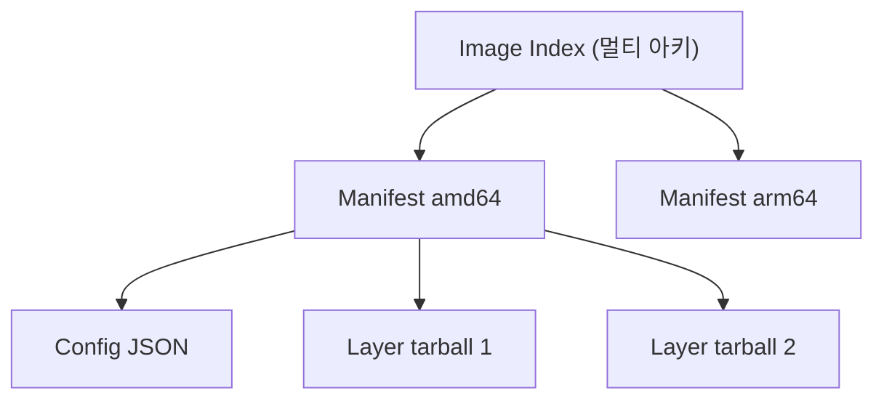
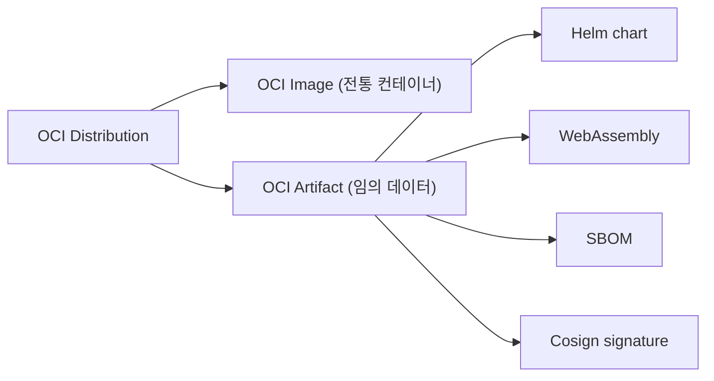

## 정의

**OCI (Open Container Initiative)** = *컨테이너 표준* (Linux Foundation, 2015). *image format + runtime + distribution* 3가지 spec.

## 3개 OCI Spec

| Spec | 의미 |
|---|---|
| **Image** | tarball + JSON metadata 구조 |
| **Runtime** | `runc` 같은 *컨테이너 실행 표준* |
| **Distribution** | `docker push/pull` 같은 *레지스트리 API* |

## Image 구조

```
manifest.json
  - config.json (image config)
  - layers
    - layer0.tar.gz
    - layer1.tar.gz
    - layer2.tar.gz
```



## Image Index (멀티 아키)

```json
{
  "schemaVersion": 2,
  "manifests": [
    {
      "mediaType": "application/vnd.oci.image.manifest.v1+json",
      "digest": "sha256:abc...",
      "platform": { "os": "linux", "architecture": "amd64" }
    },
    {
      "mediaType": "application/vnd.oci.image.manifest.v1+json",
      "digest": "sha256:def...",
      "platform": { "os": "linux", "architecture": "arm64" }
    }
  ]
}
```

> *한 tag (nginx:1.27)* 으로 *여러 아키* 자동 선택. pull 시 *클라이언트 아키 매칭*.

## Manifest

```json
{
  "schemaVersion": 2,
  "config": {
    "mediaType": "application/vnd.oci.image.config.v1+json",
    "digest": "sha256:abc..."
  },
  "layers": [
    { "mediaType": "application/vnd.oci.image.layer.v1.tar+gzip",
      "digest": "sha256:111..." },
    { "mediaType": "application/vnd.oci.image.layer.v1.tar+gzip",
      "digest": "sha256:222..." }
  ]
}
```

## Image vs OCI Artifact



> *OCI registry 가 *컨테이너 image 만이 아닌* 일반 artifact store* 로 진화. Helm chart, WASM, SBOM, signature 모두.

## 구현체

| | 의미 |
|---|---|
| `runc` | OCI Runtime 의 표준 구현 |
| `containerd` | container 라이프사이클 (Docker / K8s 가 사용) |
| `CRI-O` | K8s 전용 OCI runtime |
| `podman` | Docker 호환, daemonless |
| `buildah` | image build 전용 |
| `skopeo` | image 복사 / 검사 |

## Content-Addressed Storage

```
image digest = sha256(manifest JSON)
layer digest = sha256(layer tarball)
```

> *tag* 는 *변할 수* 있지만 *digest* 는 *불변*. *프로덕션 배포* 는 항상 *digest* 로:

```
nginx:1.27                            ← tag (mutable)
nginx@sha256:abc123...                ← digest (immutable)
```

## 흔한 함정

> [!WARNING]
> 1. **Tag mutability** = 어제 build 한 image 가 *오늘 다른 내용*. digest pinning.
> 2. **Image scan 누락** = 취약점 image. Trivy / Grype / Clair.
> 3. **Cross-arch test 안 함** = AMD64 만 build → ARM 노드 실패.
> 4. **Layer 너무 많음** = layer 한도 (보통 127). 가능하면 묶기.

## 관련 위키

- [[docker]]
- [[cgroups-namespaces]]
- [[container-image-best-practices]]
- [[k8s-pod]]
