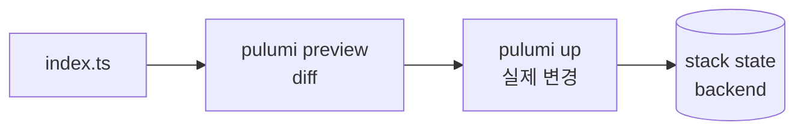

## 정의

**Pulumi** = *일반 프로그래밍 언어로 IaC*. TypeScript, Python, Go, .NET, Java. Terraform 의 *HCL DSL* 대신 *코드 자유도*.

## TS 예시

```typescript
import * as aws from "@pulumi/aws";
import * as pulumi from "@pulumi/pulumi";

const config = new pulumi.Config();
const env = pulumi.getStack();

const bucket = new aws.s3.Bucket("data", {
  bucket: `myapp-data-${env}`,
  tags: { Environment: env, ManagedBy: "pulumi" },
});

new aws.s3.BucketVersioningV2("data-version", {
  bucket: bucket.id,
  versioningConfiguration: { status: "Enabled" },
});

export const bucketName = bucket.id;
```

## 흐름



## 명령

```bash
pulumi new aws-typescript    # 새 프로젝트
pulumi stack init dev        # 새 stack (Terraform workspace 비슷)
pulumi config set region us-east-1
pulumi config set --secret db-password xxx
pulumi preview               # diff
pulumi up                    # apply
pulumi destroy
pulumi stack output bucketName
pulumi import aws:s3/bucket:Bucket data my-legacy-bucket
```

## Backend (state)

| Backend | 의미 |
|---|---|
| Pulumi Cloud | managed (기본, free tier) |
| AWS S3 | self-host |
| Azure Blob / GCS | self-host |
| Local file | 개발 |

```bash
pulumi login s3://my-pulumi-state
pulumi login --local
```

## 차이: HCL vs 코드

```typescript
// Pulumi: 조건/반복은 코드 그대로
const instances = ["alice", "bob", "charlie"].map((name) =>
  new aws.iam.User(name, { name })
);

// 의존성 자동
const role = new aws.iam.Role("app", { ... });
new aws.iam.RolePolicyAttachment("attach", {
  role: role.name,    // pulumi.Output<string>, 의존성 자동
  policyArn: policy.arn,
});
```

## Pulumi vs Terraform

| 항목 | Pulumi | Terraform |
|---|---|---|
| 언어 | TS/Python/Go/.NET/Java | HCL |
| 표현력 | *높음* (코드 자유) | DSL 한정 |
| 학습 곡선 | 일반 코드 알면 쉬움 | HCL 학습 |
| 테스트 | *unit test 가능* | tflint, terratest 등 별도 |
| 생태계 | 작음 | *가장 큼* |
| 가격 | Cloud paid (free tier) | OSS / OpenTofu |
| 멀티 클라우드 | 예 | 예 |

## Automation API

```typescript
import * as automation from "@pulumi/pulumi/automation";

const stack = await automation.LocalWorkspace.createOrSelectStack({
  stackName: "prod",
  projectName: "myapp",
  program: async () => {
    new aws.s3.Bucket("data", { ... });
  },
});

await stack.up({ onOutput: console.log });
```

> *Terraform 의 CLI 의존성 없이* Pulumi 를 *프로그램 안에서 호출*. *self-service portal* 같은 *내부 도구* 에 강력.

## 흔한 함정

> [!WARNING]
> 1. **`pulumi.Output` 처리 미숙** = `.apply()`, `interpolate` 사용. promise/await 와 다름.
> 2. **Secret 코드에 평문** = `pulumi config set --secret`.
> 3. **Stack 간 reference** = `StackReference` 로 cross-stack output 읽기.
> 4. **변수 vs config** = `config` 가 stack 별. 변수는 코드.

## 관련 위키

- [[terraform]]
- [[cdk]]
- [[github-actions]]
