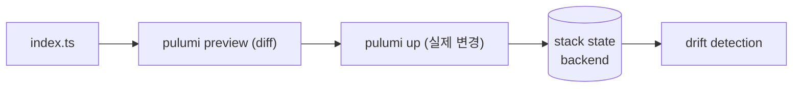

## 정의

**Pulumi** = *일반 프로그래밍 언어로 IaC*. TypeScript, Python, Go, .NET, Java. Terraform 의 *HCL DSL* 대신 *코드 자유도*.

## 사용 상황

| 상황 | 이유 |
|---|---|
| 반복/조건 분기가 많은 인프라 | 언어 자유도 활용 |
| 내부 플랫폼 도구 (self-service portal) | Automation API |
| 멀티 스택, 환경 분리 | Stack + ESC |
| 기존 Terraform 마이그레이션 | import + 호환 provider |
| 인프라에 unit test 적용 | Pulumi testing SDK |
| Policy as Code | CrossGuard |

## TS 예시

```typescript
import * as aws from "@pulumi/aws";
import * as pulumi from "@pulumi/pulumi";

const config = new pulumi.Config();
const env = pulumi.getStack();

const bucket = new aws.s3.Bucket("data", {
  bucket: `myapp-data-${env}`,
  tags: { Environment: env, ManagedBy: "pulumi" },
});

new aws.s3.BucketVersioningV2("data-version", {
  bucket: bucket.id,
  versioningConfiguration: { status: "Enabled" },
});

export const bucketName = bucket.id;
```

## 흐름



## 명령

```bash
pulumi new aws-typescript    # 새 프로젝트
pulumi stack init dev        # 새 stack (Terraform workspace 비슷)
pulumi config set region us-east-1
pulumi config set --secret db-password xxx
pulumi preview               # diff
pulumi up                    # apply
pulumi destroy
pulumi stack output bucketName
pulumi import aws:s3/bucket:Bucket data my-legacy-bucket
```

## Backend (state)

| Backend | 의미 |
|---|---|
| Pulumi Cloud | managed (기본, free tier) |
| AWS S3 | self-host |
| Azure Blob / GCS | self-host |
| Local file | 개발 |

```bash
pulumi login s3://my-pulumi-state
pulumi login --local
```

## 차이: HCL vs 코드

```typescript
// Pulumi: 조건/반복은 코드 그대로
const instances = ["alice", "bob", "charlie"].map((name) =>
  new aws.iam.User(name, { name })
);

// 의존성 자동
const role = new aws.iam.Role("app", { assumeRolePolicy: "..." });
new aws.iam.RolePolicyAttachment("attach", {
  role: role.name,    // pulumi.Output<string>, 의존성 자동
  policyArn: policy.arn,
});
```

## Pulumi vs Terraform

| 항목 | Pulumi | Terraform |
|---|---|---|
| 언어 | TS/Python/Go/.NET/Java | HCL |
| 표현력 | *높음* (코드 자유) | DSL 한정 |
| 학습 곡선 | 일반 코드 알면 쉬움 | HCL 학습 |
| 테스트 | *unit test 가능* | tflint, terratest 등 별도 |
| 생태계 | 작음 | *가장 큼* |
| 가격 | Cloud paid (free tier) | OSS / OpenTofu |
| 멀티 클라우드 | 예 | 예 |

## Stack 관리

Stack = 환경 단위 (dev, staging, prod). 각 stack은 독립적 state.

```bash
pulumi stack init staging
pulumi stack select dev
pulumi stack ls
pulumi stack rm old-stack --force
```

### Stack 별 config

```typescript
const config = new pulumi.Config();
const region = config.require("region");       // 없으면 에러
const debug = config.getBoolean("debug") ?? false;
```

```bash
# dev 스택
pulumi config set region ap-northeast-2 --stack dev

# prod 스택
pulumi config set region us-east-1 --stack prod
```

### Stack References (cross-stack output)

```typescript
// 네트워크 스택에서 VPC ID 읽기
const netStack = new pulumi.StackReference("org/network/prod");
const vpcId = netStack.getOutput("vpcId");

const cluster = new aws.ecs.Cluster("app", {
  tags: { VpcId: vpcId.apply(id => String(id)) },
});
```

> 스택 간 의존성을 명시적으로 표현. Terraform `data.terraform_remote_state` 와 동일 패턴.

## Component Resources

재사용 가능한 고수준 추상화.

```typescript
class SecureBucket extends pulumi.ComponentResource {
  public readonly bucket: aws.s3.Bucket;
  public readonly bucketName: pulumi.Output<string>;

  constructor(name: string, opts?: pulumi.ComponentResourceOptions) {
    super("myapp:index:SecureBucket", name, {}, opts);

    this.bucket = new aws.s3.Bucket(name, {
      acl: "private",
      serverSideEncryptionConfiguration: {
        rule: {
          applyServerSideEncryptionByDefault: {
            sseAlgorithm: "AES256",
          },
        },
      },
    }, { parent: this });

    this.bucketName = this.bucket.id;
    this.registerOutputs({ bucketName: this.bucketName });
  }
}

// 사용
const dataBucket = new SecureBucket("data");
```

## CrossGuard (Policy as Code)

인프라 정책을 코드로. 배포 전 자동 검사.

```typescript
// policy-pack/index.ts
import { PolicyPack, validateResourceOfType } from "@pulumi/policy";
import * as aws from "@pulumi/aws";

new PolicyPack("aws-security", {
  policies: [
    {
      name: "s3-no-public-read",
      description: "S3 버킷 public read 금지",
      enforcementLevel: "mandatory",
      validateResource: validateResourceOfType(aws.s3.Bucket, (bucket, args, report) => {
        if (bucket.acl === "public-read") {
          report("public-read ACL 은 금지입니다.");
        }
      }),
    },
  ],
});
```

```bash
pulumi up --policy-pack ./policy-pack
```

## 단위 테스트

```typescript
// __tests__/infra.test.ts
import * as pulumi from "@pulumi/pulumi";
import * as aws from "@pulumi/aws";

pulumi.runtime.setMocks({
  newResource: (type, name, inputs) => ({ id: `${name}-id`, state: inputs }),
  call: (token, args, provider) => ({ result: args }),
});

import { SecureBucket } from "../src/secure-bucket";

test("S3 bucket 암호화 활성화", async () => {
  const bucket = new SecureBucket("test");
  const sse = await bucket.bucket.serverSideEncryptionConfiguration.get();
  expect(sse?.rule?.applyServerSideEncryptionByDefault?.sseAlgorithm).toBe("AES256");
});
```

```bash
npx vitest run     # 또는 jest
```

## Automation API

```typescript
import * as automation from "@pulumi/pulumi/automation";

const stack = await automation.LocalWorkspace.createOrSelectStack({
  stackName: "prod",
  projectName: "myapp",
  program: async () => {
    new aws.s3.Bucket("data", { acl: "private" });
  },
});

await stack.up({ onOutput: console.log });
```

> *Terraform 의 CLI 의존성 없이* Pulumi 를 *프로그램 안에서 호출*. *self-service portal* 같은 *내부 도구* 에 강력.

## Pulumi ESC (Environments, Secrets, Configuration)

환경별 비밀, 설정을 중앙 관리. OIDC로 동적 credentials 발급.

```yaml
# esc-env.yaml
values:
  aws:
    login:
      fn::open::aws-login:
        oidc:
          duration: 1h
          roleArn: arn:aws:iam::123:role/pulumi-esc
          sessionName: pulumi-esc

  environmentVariables:
    AWS_ACCESS_KEY_ID: ${aws.login.accessKeyId}
    AWS_SECRET_ACCESS_KEY: ${aws.login.secretAccessKey}
    AWS_SESSION_TOKEN: ${aws.login.sessionToken}
```

```bash
esc env open myorg/prod
esc run myorg/prod -- pulumi up
```

## GitHub Actions CI/CD

```yaml
name: Pulumi Deploy
on:
  push:
    branches: [main]

jobs:
  deploy:
    runs-on: ubuntu-latest
    permissions:
      id-token: write   # OIDC
      contents: read
    steps:
      - uses: actions/checkout@v4
      - uses: pulumi/actions@v5
        with:
          command: up
          stack-name: prod
          cloud-url: s3://my-pulumi-state
        env:
          PULUMI_ACCESS_TOKEN: ${{ secrets.PULUMI_ACCESS_TOKEN }}
          AWS_REGION: ap-northeast-2
```

## 흔한 함정

> [!WARNING]
> 1. **`pulumi.Output` 처리 미숙** = `.apply()`, `interpolate` 사용. promise/await 와 다름.
> 2. **Secret 코드에 평문** = `pulumi config set --secret` 사용.
> 3. **Stack 간 reference** = `StackReference` 로 cross-stack output 읽기.
> 4. **변수 vs config** = `config` 가 stack 별. 변수는 코드.
> 5. **ComponentResource 에서 `parent: this` 누락** = state 에 고아 리소스. 항상 `{ parent: this }` 전달.
> 6. **`pulumi destroy` 순서** = 의존 stack 먼저 destroy. StackReference 있으면 역순.
> 7. **drift 탐지** = `pulumi refresh` 로 실제 인프라 상태와 state 동기화.

## 관련 위키

- [[terraform]]
- [[cdk]]
- [[github-actions]]
- [[aws-cloudformation]]
- [[argocd]]
- [[gitops-patterns]]
