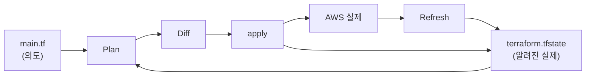
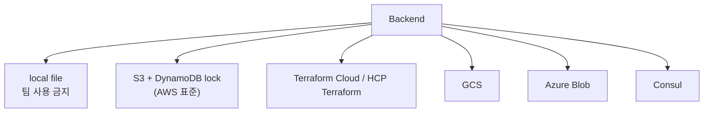
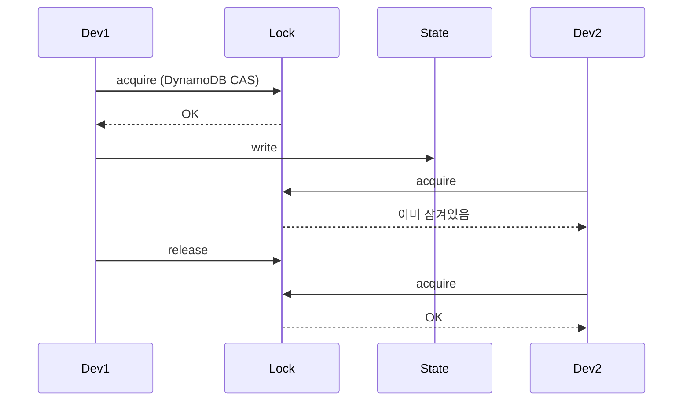
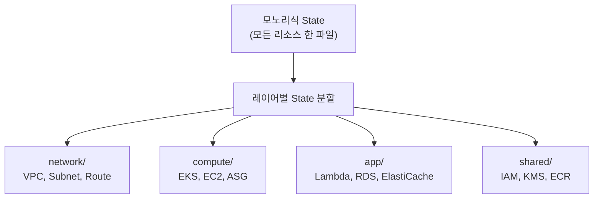

## 정의

**Terraform State** = *코드 (의도) vs 실제 인프라 매핑*. JSON 파일. *모든 Terraform 작업의 핵심*. `plan`, `apply`, `destroy` 모두 state 를 기반으로 diff 계산.

## 사용 상황

| 상황 | Terraform State 주요 고려사항 |
|---|---|
| 팀 협업 | Remote backend 필수 (S3/TFC), local file 금지 |
| 여러 환경 분리 | Workspace 또는 별도 backend key |
| 기존 인프라 도입 | `terraform import` 로 state 등록 |
| 인프라 드리프트 감지 | `terraform plan -refresh-only` 정기 실행 |
| 대규모 모노리식 state | 레이어별 state 분할 전략 |
| Secret 관리 | output sensitive + [[aws-secrets-manager]] 또는 Vault |

## State 가 하는 일



| 역할 | 의미 |
|---|---|
| **Mapping** | resource 이름 ↔ AWS ARN/ID |
| **Metadata** | 의존성 그래프, 버전 정보 |
| **Performance** | refresh 캐시 (매번 AWS API 호출 안 해도 됨) |
| **Sensitive** | output value 보관 (*평문*) |

## State 파일 내부 구조

```json
{
  "version": 4,
  "terraform_version": "1.8.0",
  "serial": 42,
  "lineage": "550e8400-...",
  "outputs": {
    "vpc_id": {
      "value": "vpc-0abc123",
      "type": "string",
      "sensitive": false
    }
  },
  "resources": [
    {
      "mode": "managed",
      "type": "aws_s3_bucket",
      "name": "data",
      "provider": "provider[\"registry.terraform.io/hashicorp/aws\"]",
      "instances": [
        {
          "schema_version": 0,
          "attributes": {
            "id": "my-data-bucket",
            "bucket": "my-data-bucket",
            "region": "us-east-1"
          }
        }
      ]
    }
  ]
}
```

- `serial`: apply 마다 증가. 충돌 감지.
- `lineage`: state 파일 고유 ID. 다른 state 교체 방지.
- `sensitive` 출력값도 JSON 에 *평문 저장*. Backend 암호화 필수.

## Backend 종류



### S3 + DynamoDB (AWS 표준)

```hcl
terraform {
  backend "s3" {
    bucket         = "my-tf-state"
    key            = "prod/web/terraform.tfstate"
    region         = "us-east-1"
    encrypt        = true
    kms_key_id     = "arn:aws:kms:us-east-1:123:key/..."
    dynamodb_table = "tf-lock"
  }
}
```

| 컴포넌트 | 역할 |
|---|---|
| S3 bucket | state 저장 + versioning 활성화 |
| KMS | server-side 암호화 |
| DynamoDB | distributed lock (conditional write) |

## State Locking



> *동시 apply 충돌 방지*. DynamoDB 의 *conditional write* (CAS: Compare-And-Swap).

Lock 강제 해제 (비정상 종료 후):
```bash
terraform force-unlock LOCK_ID
```

## Drift Detection

```bash
# 코드 변경 없이 실제 vs state 차이만 확인
terraform plan -refresh-only
```

| 상황 | 원인 | 대응 |
|---|---|---|
| state < 실제 | 콘솔 직접 수정 | `terraform refresh` + 코드 반영 |
| state > 실제 | 수동 삭제 | `terraform state rm` 후 재적용 |
| 정기 감지 | 드리프트 자동화 | CI 에서 `plan -refresh-only` 스케줄링 |

> *Prod 수동 변경 감지*. 정기 drift check 는 CI 파이프라인에 포함.

## State 분할 전략



| 레이어 | 예시 리소스 | 변경 빈도 |
|---|---|---|
| network | VPC, Subnet, Route Table | 매우 낮음 |
| shared | IAM Role, KMS Key, ECR | 낮음 |
| compute | EKS, EC2, Auto Scaling | 중간 |
| app | Lambda, RDS, ElastiCache | 높음 |

*분할 이점*: plan 시간 단축, 블라스트 반경 감소, 팀별 소유권 분리.
*분할 방법*: `terraform_remote_state` 로 다른 state 의 output 참조.

```hcl
data "terraform_remote_state" "network" {
  backend = "s3"
  config = {
    bucket = "my-tf-state"
    key    = "prod/network/terraform.tfstate"
    region = "us-east-1"
  }
}

resource "aws_eks_cluster" "main" {
  vpc_config {
    subnet_ids = data.terraform_remote_state.network.outputs.private_subnet_ids
  }
}
```

## State 조작 명령

```bash
terraform state list                           # 모든 리소스 목록
terraform state show aws_s3_bucket.data        # 단일 리소스 상세
terraform state mv old.name new.name           # rename (리팩토링 시)
terraform state rm aws_s3_bucket.old           # state 에서만 제거 (AWS 실제 리소스 남음)
terraform state pull > backup.tfstate          # state 다운로드 (백업)
terraform state push backup.tfstate            # state 업로드 (위험, 수동)

terraform import aws_instance.web i-1234abcd  # 기존 리소스를 state 에 등록
```

> [!CAUTION]
> `state push` 는 `serial` 번호 역전 방지 없이 덮어씀. 잘못된 state 로 인프라 삭제 위험.

## Import (기존 리소스 등록)

### CLI import (Terraform 1.5+)

```hcl
import {
  to = aws_s3_bucket.legacy
  id = "my-legacy-bucket"
}

resource "aws_s3_bucket" "legacy" {
  bucket = "my-legacy-bucket"
}
```

```bash
# 코드 자동 생성
terraform plan -generate-config-out=generated.tf
terraform apply
```

### 구버전 CLI import

```bash
terraform import aws_s3_bucket.legacy my-legacy-bucket
```

코드는 직접 작성. import 후 `terraform plan` 으로 drift 없는지 확인.

## Workspace (환경 분리)

```bash
terraform workspace new prod
terraform workspace new staging
terraform workspace select prod
terraform workspace list
```

```hcl
locals {
  env = terraform.workspace   # "prod" / "staging"
}

resource "aws_instance" "web" {
  instance_type = local.env == "prod" ? "c5.xlarge" : "t3.small"
}
```

> *한 backend 에 여러 state* 관리. 단, *separate backend (별도 S3 key) 가 더 안전*. Workspace 는 동일 AWS 계정에서 사용 → 실수로 Prod 에 staging 적용 위험.

## Terragrunt 연계

*Terraform 의 DRY wrapper*. 여러 환경/레이어의 중복 backend 설정 제거.

```hcl
# terragrunt.hcl
remote_state {
  backend = "s3"
  config = {
    bucket  = "my-tf-state-${get_aws_account_id()}"
    key     = "${path_relative_to_include()}/terraform.tfstate"
    region  = "us-east-1"
    encrypt = true
    dynamodb_table = "tf-lock"
  }
}
```

```
environments/
  prod/
    network/   ← terragrunt.hcl 상속
    compute/
    app/
  staging/
    network/
    compute/
```

## CI/CD 연계

| 단계 | 명령 | 설명 |
|---|---|---|
| PR | `terraform plan` | diff 리뷰, 변경 범위 확인 |
| Merge | `terraform apply -auto-approve` | 자동 적용 |
| 정기 | `terraform plan -refresh-only` | drift 감지 |
| 공유 | plan 결과를 PR comment 로 | Atlantis / Spacelift / TFC |

*Atlantis* 나 *Terraform Cloud* 는 PR 이벤트에 plan 자동 실행 + 승인 후 apply.

## State 의 위험

> [!WARNING]
> 1. **State 의 secret 평문** = `terraform output` 의 password 등 그대로. 접근 제한 + KMS + IAM.
> 2. **수동 state 편집** = 형식 깨짐 위험. *반드시 `terraform state` 명령 사용*.
> 3. **State 손실** = 추적 불가 (코드와 실제 매핑 소실). S3 versioning + 정기 백업.
> 4. **여러 사람 동시 apply** = lock 없으면 state 깨짐. DynamoDB lock 필수.
> 5. **Local backend 를 팀이 공유** = git 에 state 올리면 secret 노출 + 충돌. Remote backend 전환.

## 관련 위키

- [[terraform]]
- [[aws-s3]]
- [[aws-kms]]
- [[aws-iam]]
- [[aws-cloudtrail]] (state 변경 감사)
