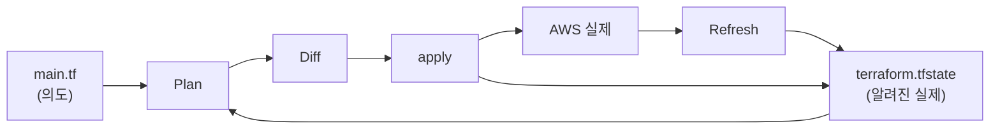
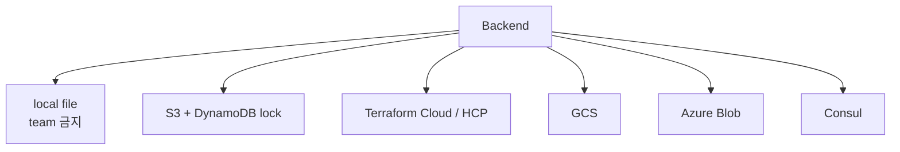
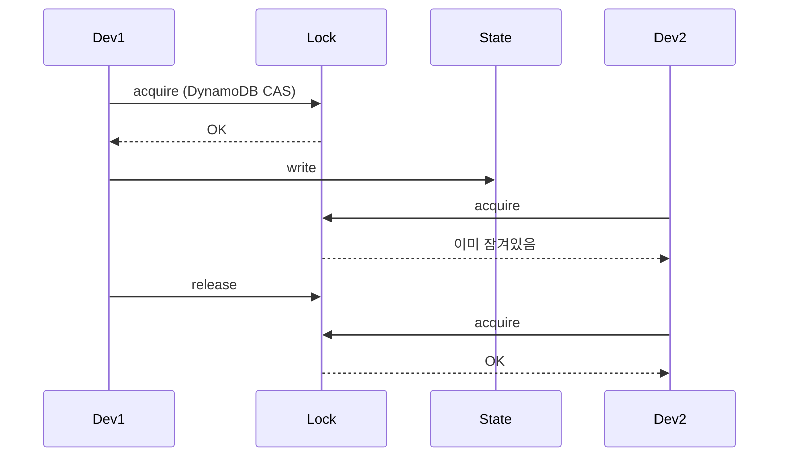
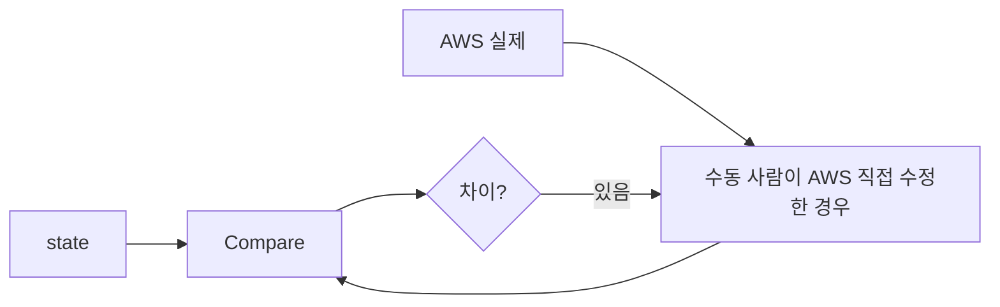

## 정의

**Terraform State** = *코드 ↔ 실제 인프라 매핑*. JSON 파일. *모든 Terraform 작업의 핵심*.

## State 가 하는 일



| 역할 | 의미 |
|---|---|
| **Mapping** | resource 이름 ↔ AWS ARN |
| **Metadata** | dependency, version |
| **Performance** | refresh 캐시 |
| **Sensitive** | output value 보관 (*평문*) |

## Backend 종류



### S3 + DynamoDB (AWS 표준)

```hcl
terraform {
  backend "s3" {
    bucket         = "my-tf-state"
    key            = "prod/web/terraform.tfstate"
    region         = "us-east-1"
    encrypt        = true
    kms_key_id     = "arn:aws:kms:..."
    dynamodb_table = "tf-lock"
  }
}
```

| 컴포넌트 | 역할 |
|---|---|
| S3 bucket | state 저장 + versioning |
| KMS | 암호화 |
| DynamoDB | distributed lock |

## State Locking



> *동시 apply 충돌 방지*. DynamoDB 의 *conditional write*.

## Drift Detection



```bash
terraform plan -refresh-only
# 코드 변경 없이 실제 vs state 차이만 확인
```

> *prod 의 *수동 변경* 감지*. 정기 drift check.

## State 조작 명령

```bash
terraform state list                          # 모든 리소스
terraform state show aws_s3_bucket.data       # 단일 정보
terraform state mv old.name new.name          # rename
terraform state rm aws_s3_bucket.old          # state 에서만 제거 (AWS 안 지움)
terraform state pull > out.tfstate            # download
terraform state push out.tfstate              # upload (위험!)

terraform import aws_instance.web i-1234abcd  # 기존 리소스 등록
```

## Import (기존 리소스 등록)

```hcl
import {
  to = aws_s3_bucket.legacy
  id = "my-legacy-bucket"
}

resource "aws_s3_bucket" "legacy" {
  bucket = "my-legacy-bucket"
}
```

```bash
terraform plan -generate-config-out=generated.tf
```

> 옛 리소스를 Terraform 관리로 옮길 때.

## Workspace (환경 분리)

```bash
terraform workspace new prod
terraform workspace new staging
terraform workspace select prod
```

```hcl
locals {
  env = terraform.workspace   # "prod" / "staging"
}
```

> 한 backend 의 *여러 state*. 단 *separate backend* 가 더 안전.

## State 의 위험

> [!WARNING]
> 1. **State 의 *secret 평문*** = `terraform output` 의 password 등 그대로. 접근 제한 + KMS.
> 2. **수동 state 편집** = 망가짐. *반드시 명령으로*.
> 3. **State 손실** = 추적 불가. *S3 versioning + 정기 백업*.
> 4. **여러 사람 동시 apply** = lock 없으면 state 깨짐. DynamoDB lock 필수.

## 관련 위키

- [[terraform]]
- [[aws-s3]]
- [[aws-kms]]
- [[aws-iam]]
