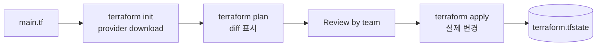
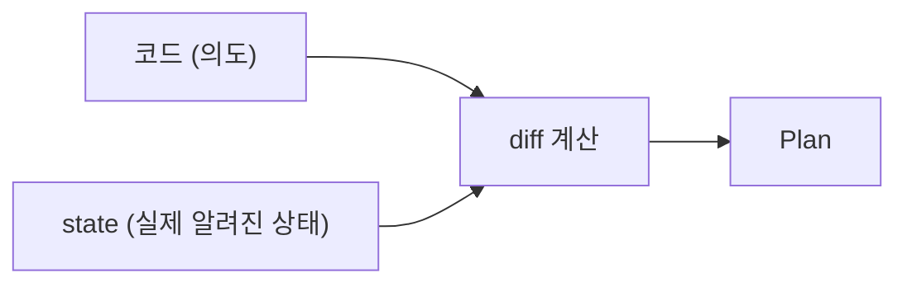
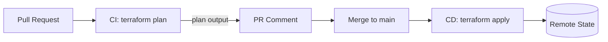

## 정의

**Terraform** = *선언적 인프라 코드*. HCL (HashiCorp Configuration Language) 로 *리소스 정의* → AWS/GCP/Azure 등 *provider* 가 실제 생성.

> [!NOTE]
> 2024 라이센스 변경 (BSL) 으로 *OpenTofu* fork 등장. OSS 분기. *2026 시점 OpenTofu 도 안정적*.

## 흐름



## HCL 예시

```hcl
terraform {
  required_version = ">= 1.6"
  required_providers {
    aws = {
      source  = "hashicorp/aws"
      version = "~> 5.0"
    }
  }
  backend "s3" {
    bucket         = "my-tf-state"
    key            = "prod/terraform.tfstate"
    region         = "us-east-1"
    dynamodb_table = "tf-lock"
    encrypt        = true
  }
}

provider "aws" {
  region = var.region
}

variable "region" {
  type    = string
  default = "us-east-1"
}

resource "aws_s3_bucket" "data" {
  bucket = "myapp-data-${terraform.workspace}"
  
  tags = {
    Environment = terraform.workspace
    ManagedBy   = "terraform"
  }
}

resource "aws_s3_bucket_versioning" "data" {
  bucket = aws_s3_bucket.data.id
  versioning_configuration { status = "Enabled" }
}

output "bucket_name" {
  value = aws_s3_bucket.data.id
}
```

## 핵심 명령

```bash
terraform init       # provider + module download
terraform fmt        # 코드 포맷
terraform validate   # 문법
terraform plan       # diff (실행 X)
terraform apply      # 실제 변경
terraform destroy    # 모두 삭제
terraform show       # state 출력
terraform state list # 리소스 목록
terraform import     # 기존 리소스 → state 등록
terraform workspace  # 환경 분리
```

## State



| 저장 | 적합 |
|---|---|
| Local file | *팀 작업 금지* |
| S3 + DynamoDB lock | AWS 표준 |
| Terraform Cloud / HCP | managed |
| GCS / Azure Blob | GCP / Azure |

자세한 건 [[terraform-state]].

## Module (재사용)

```hcl
module "vpc" {
  source = "terraform-aws-modules/vpc/aws"
  version = "5.5.0"
  
  name = "prod-vpc"
  cidr = "10.0.0.0/16"
  azs  = ["us-east-1a", "us-east-1b", "us-east-1c"]
  ...
}
```

> *Terraform Registry* (수천 모듈), *자체 모듈*, *Git 소스* 가능.

## Lifecycle Meta-arguments

```hcl
resource "aws_instance" "web" {
  ...
  lifecycle {
    create_before_destroy = true   # 새 생성 후 옛 삭제
    prevent_destroy       = true   # apply -destroy 차단
    ignore_changes        = [tags] # 특정 필드 무시
  }
}
```

## for_each / count

```hcl
# count: 단순 N
resource "aws_instance" "web" {
  count = 3
  ami = "ami-..."
}

# for_each: 명시적 키 (변경 안전)
resource "aws_iam_user" "team" {
  for_each = toset(["alice", "bob", "charlie"])
  name     = each.key
}
```

## Terraform vs Pulumi vs CDK

| | Terraform | Pulumi | AWS CDK |
|---|---|---|---|
| 언어 | HCL | TS/Python/Go/.NET | TS/Python/Java |
| Multi-cloud | *예* | 예 | AWS only |
| 학습 곡선 | 중간 | 높음 (코드 자유) | 중간 |
| 생태계 | *가장 큼* | 성장 | AWS 강 |

## 흔한 함정

> [!WARNING]
> 1. **State git commit** = secret 노출. *원격 backend* + 암호화.
> 2. **`apply` 직전 `plan` 안 봄** = 의도하지 않은 destroy.
> 3. **`destroy` 사고 (production)** = `prevent_destroy` lifecycle + IAM 보호.
> 4. **버전 미고정** = provider 새 버전 = 다른 결과. `~>` 또는 lock file.

## Workspace (환경 분리)

```bash
terraform workspace new prod
terraform workspace new staging
terraform workspace select prod
terraform workspace list
```

```hcl
locals {
  env_config = {
    prod    = { instance_type = "r6i.2xlarge", min_size = 3 }
    staging = { instance_type = "t3.medium",   min_size = 1 }
  }
  cfg = local.env_config[terraform.workspace]
}
```

> *workspace = state 파일만 분리*. 실제 환경 격리에는 *별도 AWS account* 권장. workspace 는 단순 분기에 적합.

## Moved 블록 (리팩터링 안전)

```hcl
moved {
  from = aws_s3_bucket.data
  to   = module.storage.aws_s3_bucket.data
}
```

> 리소스를 모듈로 이동 시 destroy + recreate 방지. state 파일만 업데이트.

## Import 블록 (선언적 import)

```hcl
import {
  to = aws_s3_bucket.existing
  id = "my-existing-bucket-name"
}
```

> 기존 인프라를 terraform 관리로 전환. `terraform import` 명령어 대신 선언적으로.

## Terraform Test (1.6+)

```hcl
# tests/s3.tftest.hcl
variables {
  region = "us-east-1"
}

run "creates_bucket" {
  assert {
    condition     = aws_s3_bucket.data.bucket != ""
    error_message = "bucket name must not be empty"
  }
}
```

```bash
terraform test    # built-in testing framework
```

## CI/CD 통합



| 도구 | 특징 |
|---|---|
| Atlantis | PR comment 기반, self-hosted |
| Terraform Cloud | HashiCorp managed, plan 저장 |
| GitHub Actions | 커스텀 워크플로 |
| Spacelift | policy-as-code, OPA 통합 |

> 시크릿은 *절대 코드에 넣지 않음*. CI 환경변수 또는 Vault 사용.

## Terragrunt (DRY 관리)

```hcl
# terragrunt.hcl
terraform {
  source = "github.com/myorg/tf-modules//aws/vpc"
}

inputs = {
  cidr = "10.0.0.0/16"
  env  = "prod"
}
```

> Terraform 의 DRY 한계 (module 반복, backend 중복) 를 Terragrunt 가 보완. 대규모 멀티 계정 환경에서 유용.

## 관련 위키

- [[terraform-state]]
- [[pulumi]]
- [[cdk]]
- [[aws-iam]]
- [[github-actions]]
- [[aws-cloudformation]]
