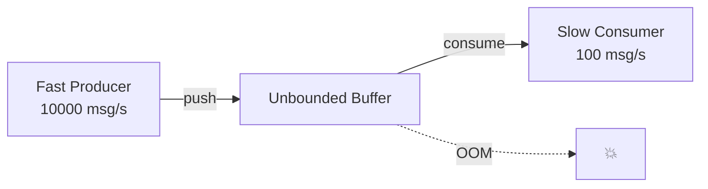
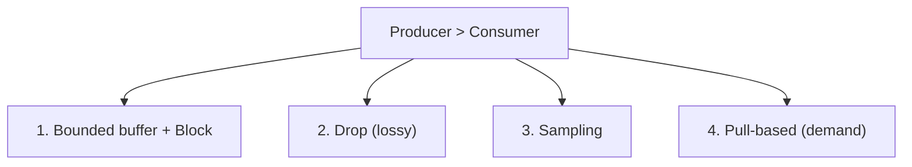
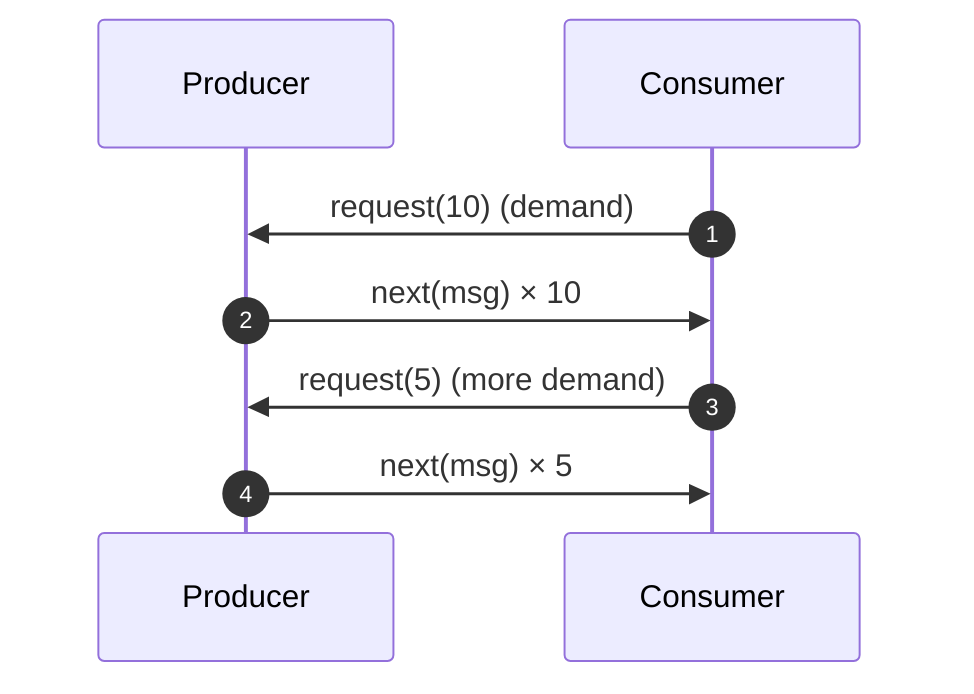
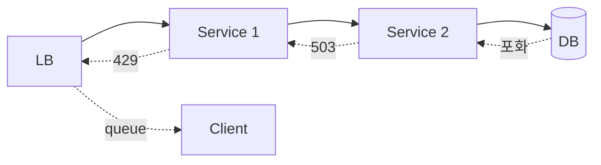
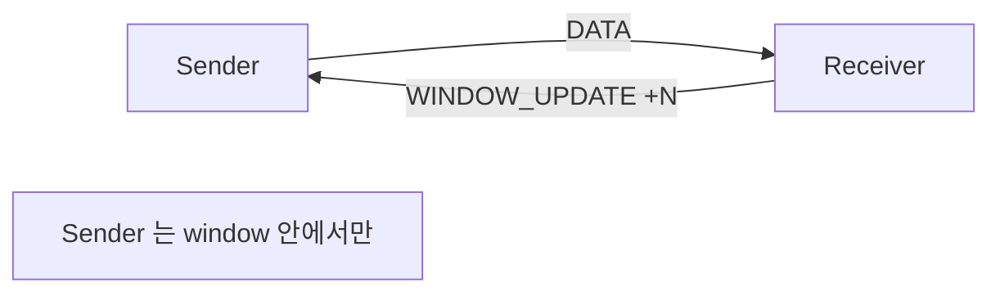
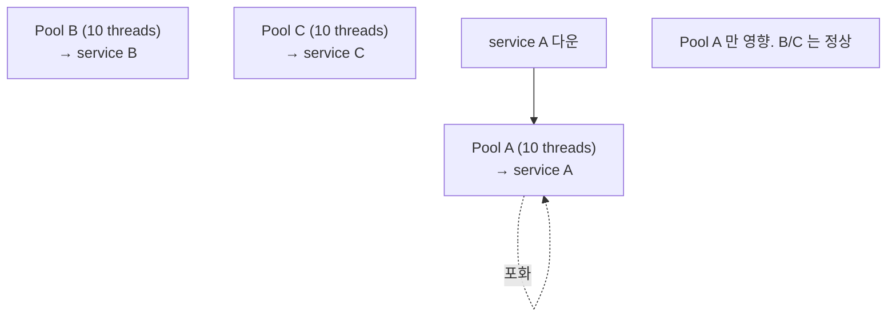
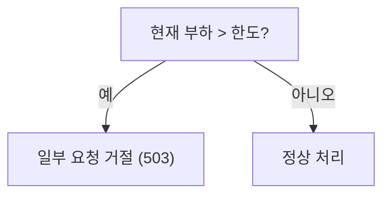
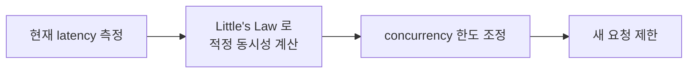
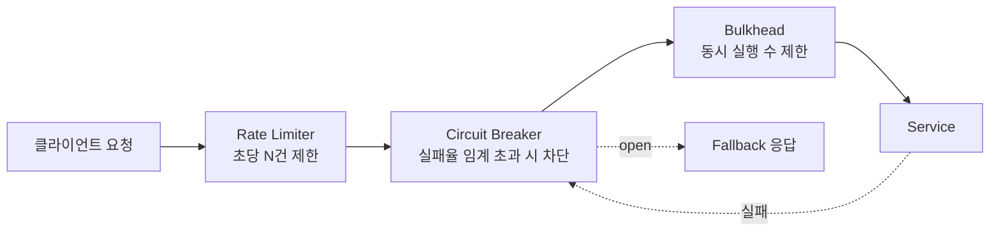

## 정의

**Backpressure** = *생산자가 소비자 속도에 맞춰 자기 속도 조절*. 분산 시스템의 *cascade failure* 방지.

> [!IMPORTANT]
> Backpressure 의 핵심: *"받는 쪽이 처리 못 함" 을 *주는 쪽이 알아야* 한다*. 모르면 *버퍼 폭발 + OOM + 시스템 다운*.

## 문제: 비대칭 속도



```anim:java-blocking-queue-pc
{}
```

> Producer-Consumer 에서 *Producer 가 항상 빠르면* buffer 가 *무한* 으로. *backpressure 의 본질적 시나리오*.

## 4가지 전략



### 1. Bounded Buffer + Block

```python
queue = BoundedQueue(maxsize=1000)

# Producer
queue.put(msg)   # 가득 차면 block 또는 timeout
```

- 단순.
- Producer 가 *blocking* → 상위 backpressure 자동 전파.

### 2. Drop (Lossy)

```python
try:
    queue.put_nowait(msg)
except QueueFull:
    pass  # 드롭
```

- *metrics / log* 같은 *손실 OK* 데이터.
- Drop policy: oldest, newest, sample.

### 3. Sampling

```python
if random.random() < 0.1:   # 10% 만 처리
    queue.put(msg)
```

- 대규모 telemetry.
- 통계적으로 유의미.

### 4. Pull-based (Reactive Streams)



> *Consumer 가 요청한 만큼만 전송*. *Producer 가 자기 속도 자동 조절*.

라이브러리: Project Reactor (Java), RxJava, ReactiveX, Akka Streams.

## 시스템 레벨 Backpressure



| 레이어 | 신호 |
|---|---|
| LB | 429 Too Many Requests |
| Service | 503 Service Unavailable |
| DB | connection pool 고갈 |
| Network | TCP window 축소 |

## HTTP/2, QUIC 의 flow control



자세한 건 [[HTTP/2]] 의 flow control 절.

## TCP 의 flow control

TCP 의 *sliding window* 가 *전송 레이어 backpressure*. 자세한 건 [[tcp]].

## Bulkhead



> *Thread pool 을 service 별로 분리* → 한 service 다운이 *전체 다운* 안 되게.

## Shedding (Load Shedding)



> 모든 요청을 *느리게 처리* 하는 것보다 *일부 거절하고 나머지는 빠르게*. Google SRE 의 *graceful degradation*.

## Adaptive Concurrency



- Netflix Concurrency Limits.
- Envoy adaptive concurrency.
- *latency 가 늘면 동시성 줄임*.

## 흔한 함정

> [!WARNING]
> 1. **Unbounded queue** = OOM 보장. *모든 buffer 는 bounded*.
> 2. **Drop 정책 *명확하지 않음*** = 운영자가 *어떤 데이터 사라지는지* 모름. 메트릭 필수.
> 3. **Backpressure *전파 안 됨*** = 한 계층만 잡고 *위*에서 압박 지속. cascade fail.
> 4. **Pull-based 의 *너무 큰 request(N)*** = 사실상 push 와 같음. *적절한 batch size*.

## Java: Reactive Streams API 구현

Project Reactor (Spring WebFlux 기반) 를 사용한 pull-based backpressure 예시:

```java
Flux<String> upstream = Flux.generate(sink -> sink.next(fetchNextItem()));

upstream
    .onBackpressureBuffer(1000)           // bounded buffer
    .publishOn(Schedulers.boundedElastic())
    .subscribe(new BaseSubscriber<String>() {
        @Override
        protected void hookOnSubscribe(Subscription subscription) {
            request(50);  // 최초 50개 요청
        }

        @Override
        protected void hookOnNext(String value) {
            process(value);
            request(1);   // 처리 완료 후 1개씩 추가 요청
        }
    });
```

`onBackpressureBuffer` / `onBackpressureDrop` / `onBackpressureLatest` 로 정책 선택:

| 연산자 | 전략 | 사용 시나리오 |
|---|---|---|
| `onBackpressureBuffer(n)` | Bounded buffer | 순간 burst 허용, OOM 방지 |
| `onBackpressureDrop()` | Drop newest | 실시간 센서 데이터, 손실 OK |
| `onBackpressureLatest()` | Keep latest only | UI 화면 갱신, 최신값만 유의미 |
| `onBackpressureError()` | 즉시 오류 | 손실 불허 파이프라인 |

자세히는 [[spring-webflux]] 참고.

## Kafka Producer 설정

Kafka 에서 producer 의 backpressure 는 `max.block.ms` 와 `buffer.memory` 로 제어한다.

```properties
# Producer 설정
buffer.memory=33554432        # 총 버퍼 크기 (32 MB)
max.block.ms=60000            # 버퍼가 가득 찼을 때 block 최대 시간
batch.size=16384              # batch 크기
linger.ms=5                   # 배치 대기 시간
```

버퍼가 가득 차면 `KafkaProducer.send()` 가 `max.block.ms` 동안 blocking. 그래도 공간이 안 나면 `TimeoutException`. 이것이 Kafka producer 레벨의 backpressure. Consumer lag 기반 스케일링은 [[kafka-consumer-group]] 참고.

## Resilience4j 와의 연계

Backpressure 는 단독으로 사용하기보다 circuit breaker, rate limiter 와 조합한다.



`Resilience4j` 에서 셋을 조합한 예시:

```java
Supplier<String> decorated = Decorators.ofSupplier(() -> remoteService.call())
    .withRateLimiter(rateLimiter)
    .withCircuitBreaker(circuitBreaker)
    .withBulkhead(bulkhead)
    .decorate();
```

[[circuit-breaker]] 와 [[rate-limiting]] 함께 설계해야 실질적인 cascade failure 방지가 된다.

## 관찰 가능성 (Observability)

Backpressure 가 발동하고 있는지 모르면 운영 중에 발견하지 못한다. 필수 메트릭:

| 메트릭 | 설명 | 경보 기준 |
|---|---|---|
| `queue.size` / `buffer.used` | 현재 버퍼 점유율 | > 80% |
| `drop.rate` | 초당 드롭된 메시지 수 | > 0 (손실 불허 시) |
| `block.time` | producer block 시간 | > SLO 임계 |
| `consumer.lag` | Kafka consumer lag | 지속 증가 |
| `http.server.requests` + 429/503 비율 | HTTP 레이어 shed 비율 | 급증 시 알람 |

Micrometer + Prometheus + Grafana 스택으로 위 메트릭을 시각화하면 backpressure 발동 시점과 원인을 즉시 파악할 수 있다.

## 관련 위키

- [[connection-pool]]
- [[circuit-breaker]]
- [[rate-limiting]]
- [[retry-with-backoff]]
- [[spring-webflux]]
- [[kafka-consumer-group]] (lag 기반 scaling)
- [[http-2]] (flow control)
- [[tcp]] (TCP sliding window)
