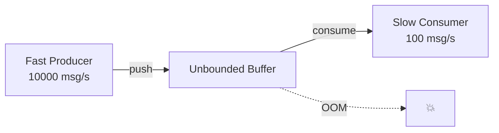
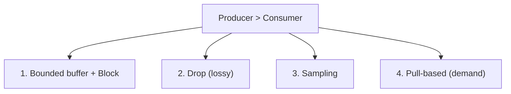
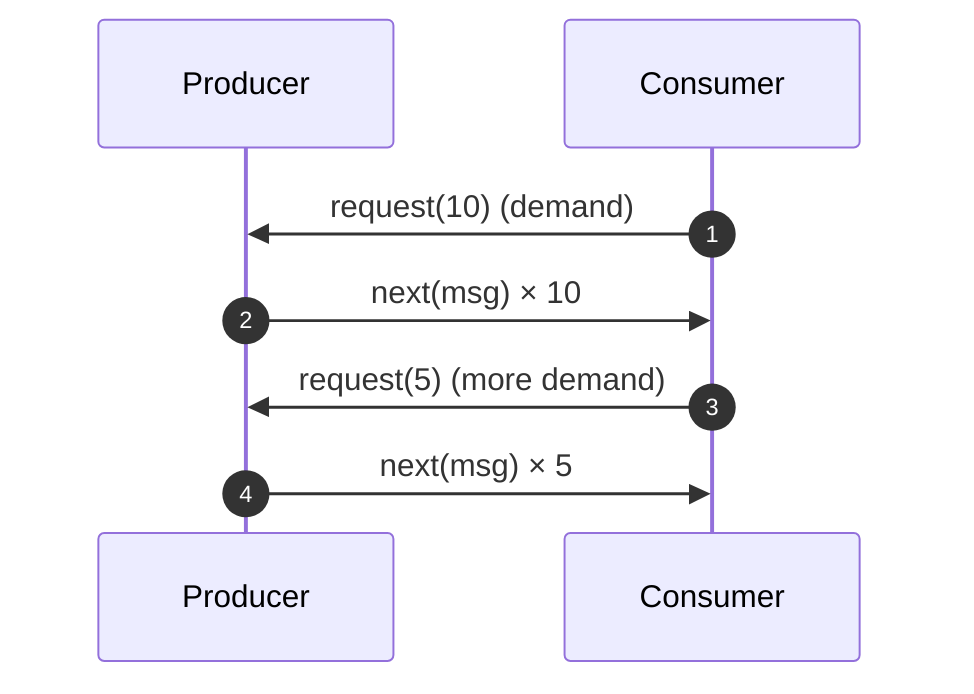
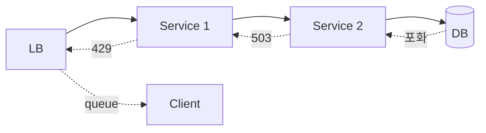
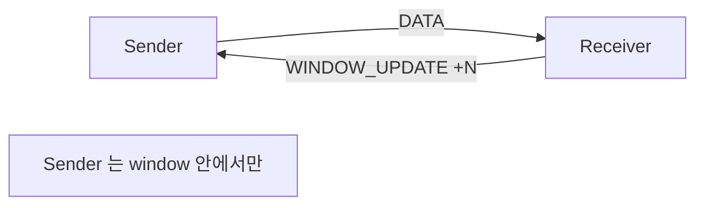
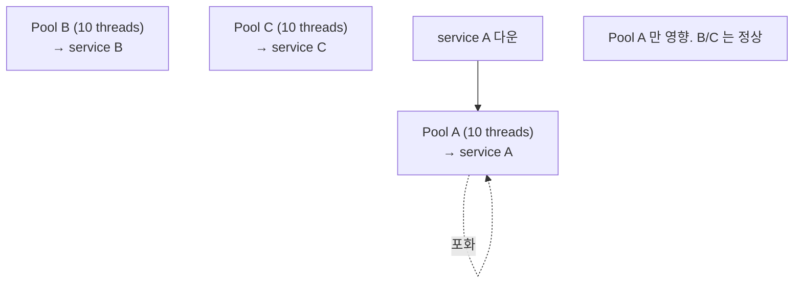
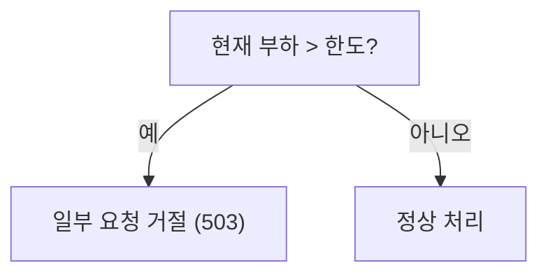
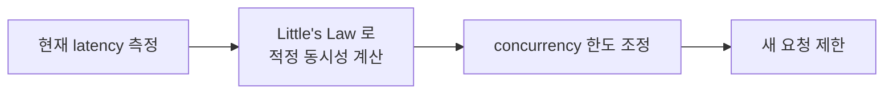

## 정의

**Backpressure** = *생산자가 소비자 속도에 맞춰 자기 속도 조절*. 분산 시스템의 *cascade failure* 방지.

> [!IMPORTANT]
> Backpressure 의 핵심: *"받는 쪽이 처리 못 함" 을 *주는 쪽이 알아야* 한다*. 모르면 *버퍼 폭발 + OOM + 시스템 다운*.

## 문제: 비대칭 속도



```anim:java-blocking-queue-pc
{}
```

> Producer-Consumer 에서 *Producer 가 항상 빠르면* buffer 가 *무한* 으로. *backpressure 의 본질적 시나리오*.

## 4가지 전략



### 1. Bounded Buffer + Block

```python
queue = BoundedQueue(maxsize=1000)

# Producer
queue.put(msg)   # 가득 차면 block 또는 timeout
```

- 단순.
- Producer 가 *blocking* → 상위 backpressure 자동 전파.

### 2. Drop (Lossy)

```python
try:
    queue.put_nowait(msg)
except QueueFull:
    pass  # 드롭
```

- *metrics / log* 같은 *손실 OK* 데이터.
- Drop policy: oldest, newest, sample.

### 3. Sampling

```python
if random.random() < 0.1:   # 10% 만 처리
    queue.put(msg)
```

- 대규모 telemetry.
- 통계적으로 유의미.

### 4. Pull-based (Reactive Streams)



> *Consumer 가 요청한 만큼만 전송*. *Producer 가 자기 속도 자동 조절*.

라이브러리: Project Reactor (Java), RxJava, ReactiveX, Akka Streams.

## 시스템 레벨 Backpressure



| 레이어 | 신호 |
|---|---|
| LB | 429 Too Many Requests |
| Service | 503 Service Unavailable |
| DB | connection pool 고갈 |
| Network | TCP window 축소 |

## HTTP/2, QUIC 의 flow control



자세한 건 [[HTTP/2]] 의 flow control 절.

## TCP 의 flow control

TCP 의 *sliding window* 가 *전송 레이어 backpressure*. 자세한 건 [[tcp]].

## Bulkhead



> *Thread pool 을 service 별로 분리* → 한 service 다운이 *전체 다운* 안 되게.

## Shedding (Load Shedding)



> 모든 요청을 *느리게 처리* 하는 것보다 *일부 거절하고 나머지는 빠르게*. Google SRE 의 *graceful degradation*.

## Adaptive Concurrency



- Netflix Concurrency Limits.
- Envoy adaptive concurrency.
- *latency 가 늘면 동시성 줄임*.

## 흔한 함정

> [!WARNING]
> 1. **Unbounded queue** = OOM 보장. *모든 buffer 는 bounded*.
> 2. **Drop 정책 *명확하지 않음*** = 운영자가 *어떤 데이터 사라지는지* 모름. 메트릭 필수.
> 3. **Backpressure *전파 안 됨*** = 한 계층만 잡고 *위*에서 압박 지속. cascade fail.
> 4. **Pull-based 의 *너무 큰 request(N)*** = 사실상 push 와 같음. *적절한 batch size*.

## 관련 위키

- [[connection-pool]]
- [[circuit-breaker]]
- [[rate-limiting]]
- [[Kafka Consumer Group]] (lag 기반 scaling)
- [[HTTP/2]] (flow control)
