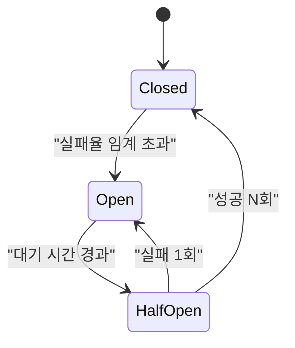
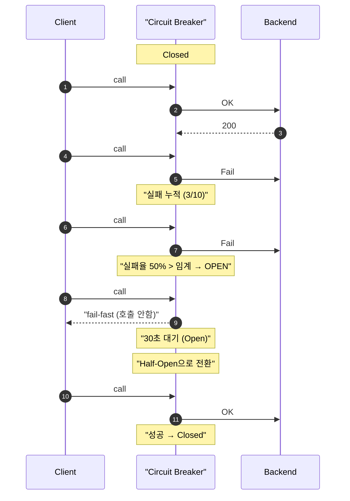
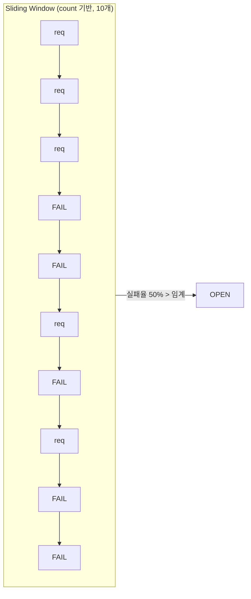
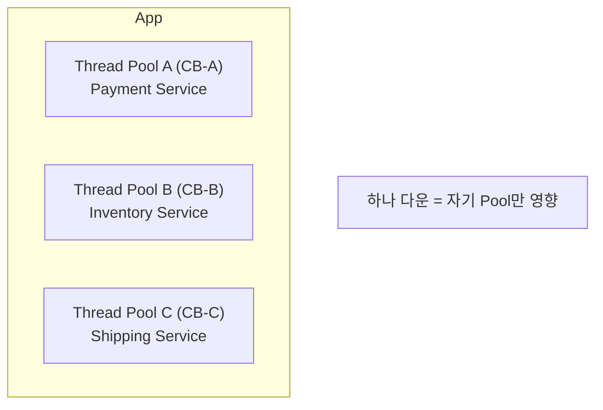

## 정의

**Circuit Breaker** = 전기 회로의 차단기처럼, *백엔드 다운 / 느림 시 호출 자체를 차단* → *빠른 실패 + 백엔드 회복 시간*.

[[backpressure]]와 함께 *cascade failure* 방어의 핵심 패턴. 호출 실패가 연쇄적으로 전파되는 것을 막는다.

## 3가지 상태



| 상태 | 의미 | 동작 |
|---|---|---|
| **Closed** | 정상 | 모든 호출 통과, 실패 카운트 |
| **Open** | 차단 | *호출 안 함*, 즉시 fail (또는 fallback) |
| **Half-Open** | 시험 | *제한된 호출* 시도, 성공/실패로 다음 상태 |

## 시나리오 시퀀스



## 트리거 조건

| 옵션 | 의미 | 권장 설정 |
|---|---|---|
| Failure rate | *실패율 > X%* (sliding window) | 50% |
| Slow call rate | *N초 이상 응답 비율 > X%* | 100ms 초과 50% |
| Consecutive failures | *연속 N회 실패* | 5회 |
| Minimum calls | 통계 유효 최소 호출 수 | 10회 |

## 실전 파라미터 상세



| 파라미터 | 의미 | 기본값 |
|---|---|---|
| `slidingWindowSize` | 통계 집계 요청 수 (count) 또는 시간 (time) | 100 |
| `failureRateThreshold` | Open 전환 실패율 (%) | 50 |
| `slowCallDurationThreshold` | slow call 기준 시간 | 60s |
| `slowCallRateThreshold` | slow call 비율 임계 (%) | 100 |
| `waitDurationInOpenState` | Open 유지 시간 | 60s |
| `permittedNumberOfCallsInHalfOpenState` | Half-Open 시 허용 호출 수 | 10 |
| `minimumNumberOfCalls` | 통계 유효 최소 호출 수 | 100 |

## Resilience4j 설정 예시

### application.yml

```yaml
resilience4j:
  circuitbreaker:
    instances:
      payment-service:
        slidingWindowType: COUNT_BASED
        slidingWindowSize: 10
        minimumNumberOfCalls: 5
        failureRateThreshold: 50
        slowCallDurationThreshold: 2000ms
        slowCallRateThreshold: 80
        waitDurationInOpenState: 30s
        permittedNumberOfCallsInHalfOpenState: 3
        automaticTransitionFromOpenToHalfOpenEnabled: true
        recordExceptions:
          - java.io.IOException
          - java.util.concurrent.TimeoutException
        ignoreExceptions:
          - com.example.BusinessException
```

### Java 코드

```java
@Service
public class PaymentService {

    private final CircuitBreaker cb;
    private final ExternalPaymentClient client;

    public PaymentService(CircuitBreakerRegistry registry, ExternalPaymentClient client) {
        this.cb = registry.circuitBreaker("payment-service");
        this.client = client;
    }

    public PaymentResult charge(ChargeRequest req) {
        return cb.executeSupplier(() -> client.charge(req));
    }

    // Fallback 포함
    public PaymentResult chargeWithFallback(ChargeRequest req) {
        return Try.ofSupplier(
            CircuitBreaker.decorateSupplier(cb, () -> client.charge(req))
        ).recover(ex -> PaymentResult.queued(req.getId())).get();
    }
}
```

### 이벤트 리스너 (모니터링)

```java
cb.getEventPublisher()
    .onStateTransition(e ->
        log.warn("CB [{}] {} -> {}",
            e.getCircuitBreakerName(),
            e.getStateTransition().getFromState(),
            e.getStateTransition().getToState()))
    .onCallNotPermitted(e ->
        metrics.increment("cb.rejected", "name", e.getCircuitBreakerName()));
```

## 라이브러리

| 라이브러리 | 언어 | 비고 |
|---|---|---|
| Resilience4j | Java | Hystrix 후계, 현재 표준 |
| Polly | .NET | 표준 |
| Sentinel | Java/Go | Alibaba, 트래픽 제어 통합 |
| pybreaker | Python | 단순 |
| opossum | Node | EventEmitter 친화 |
| Envoy outlier detection | proxy | sidecar 자동 |
| Istio | service mesh | Envoy 기반 자동 CB |

## Hystrix vs Resilience4j

| | Hystrix (2018 EOL) | Resilience4j |
|---|---|---|
| Thread pool 격리 | *기본* | 옵션 |
| Semaphore | OK | OK |
| Reactive | 일부 | *기본 (Reactor/RxJava)* |
| Lightweight | X | *O (8 MB)* |
| 활성 개발 | *X* | O |
| Spring Boot 통합 | Spring Cloud Netflix | Spring Cloud CircuitBreaker |
| 설정 방식 | `@HystrixCommand` | `@CircuitBreaker` + yml |

> [!IMPORTANT]
> Hystrix는 2018년 EOL. Spring Cloud Netflix Hystrix도 deprecated. 신규 프로젝트는 **Resilience4j** 사용. 기존 Hystrix 코드는 `@HystrixCommand` → `@CircuitBreaker` + Resilience4j 설정으로 마이그레이션.

## Fallback

```python
@circuit_breaker(name="payment")
def call_payment():
    return external.charge()

@call_payment.fallback
def cached_response():
    return { "status": "queued" }   # degraded but usable
```

```java
// Resilience4j + Spring
@CircuitBreaker(name = "inventory", fallbackMethod = "inventoryFallback")
public InventoryStatus checkInventory(String productId) {
    return inventoryClient.check(productId);
}

public InventoryStatus inventoryFallback(String productId, Exception ex) {
    log.warn("Inventory CB open, returning cached: {}", productId);
    return cache.getOrDefault(productId, InventoryStatus.UNKNOWN);
}
```

> 단순 fail-fast보다 *부분적이라도 응답*이 *사용자 경험*에 좋다. 단 *잘못된 캐시* 응답이 *위험*한 영역 (결제 / 재고)은 금지.

## Bulkhead와의 조합



> 자세한 건 [[backpressure]]의 Bulkhead.

```yaml
resilience4j:
  bulkhead:
    instances:
      payment-service:
        maxConcurrentCalls: 20
        maxWaitDuration: 100ms
  thread-pool-bulkhead:
    instances:
      inventory-service:
        maxThreadPoolSize: 10
        coreThreadPoolSize: 5
        queueCapacity: 100
```

## Envoy / Istio outlier detection

서비스 메시 레벨에서 *자동 CB*. 코드 변경 *없이* 적용:

```yaml
# Istio DestinationRule
apiVersion: networking.istio.io/v1alpha3
kind: DestinationRule
metadata:
  name: payment-service
spec:
  host: payment-service
  trafficPolicy:
    outlierDetection:
      consecutive5xxErrors: 5
      interval: 30s
      baseEjectionTime: 30s
      maxEjectionPercent: 50
      minHealthPercent: 30
```

- `consecutive5xxErrors`: 연속 5xx 횟수 → 해당 pod 제외
- `baseEjectionTime`: 제외 기간 (ejection 횟수에 비례해 증가)
- `maxEjectionPercent`: 최대 제외 비율 (전체 다운 방지)

## 모니터링

CB 상태를 모르면 운영 불가. 필수 메트릭:

```
resilience4j_circuitbreaker_state{name="payment-service"} 0  # 0=CLOSED, 1=OPEN, 2=HALF_OPEN
resilience4j_circuitbreaker_failure_rate{name="payment-service"} 45.2
resilience4j_circuitbreaker_calls_total{name="payment-service", kind="successful"} 1234
resilience4j_circuitbreaker_calls_total{name="payment-service", kind="failed"} 56
resilience4j_circuitbreaker_not_permitted_calls_total{name="payment-service"} 89
```

Grafana 대시보드 권장 패널:
- CB 상태 타임라인 (CLOSED/OPEN/HALF-OPEN)
- 실패율 추이
- 차단된 호출 수 (not_permitted)
- 응답 시간 p99

## 흔한 함정

> [!WARNING]
> 1. **임계가 *너무 민감*** = 일시 jitter로 false open. *짧은 window*에서 조심. `minimumNumberOfCalls` 충분히 설정.
> 2. **Half-Open 호출 다수 동시** = 한 번에 *모든 호출 통과* → 다시 다운. *동시 호출 1개 또는 적은 수* (`permittedNumberOfCallsInHalfOpenState: 3`).
> 3. **Fallback이 *다른 backend 호출*** = fallback도 다운되면 *재귀 fail*. fallback은 *로컬 / 캐시 only*.
> 4. **CB 메트릭 누락** = open 상태인지 운영자가 모름. 알림 필수.
> 5. **`ignoreExceptions` 미설정** = 비즈니스 예외 (400 Bad Request)도 실패로 카운트 → false open.

## 관련 위키

- [[backpressure]]
- [[retry-with-backoff]]
- [[rate-limiting]]
- [[Service Mesh]] (Envoy/Istio)
- [[api-gateway]]
- [[idempotency-keys]] (retry 시 중복 방지)
