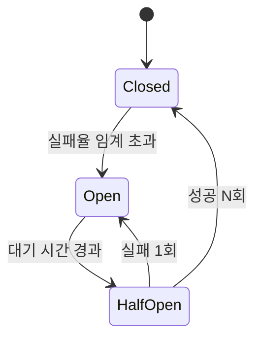
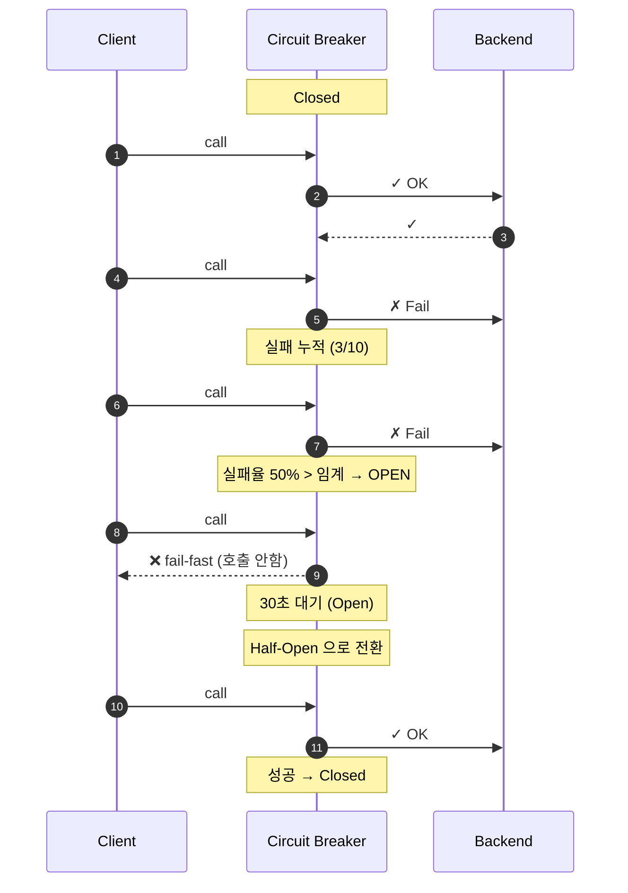
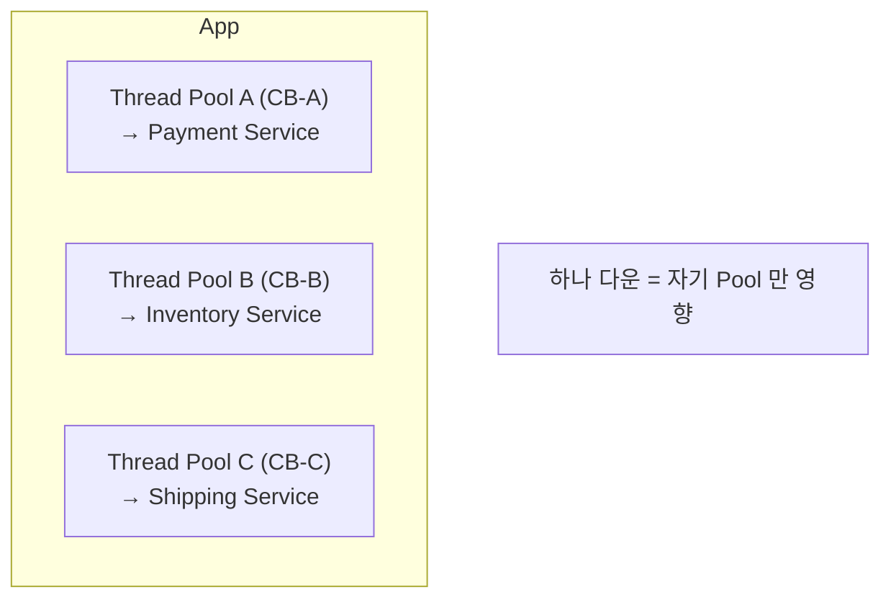

## 정의

**Circuit Breaker** = 전기 회로의 차단기처럼, *백엔드 다운 / 느림 시 호출 자체를 차단* → *빠른 실패 + 백엔드 회복 시간*.

## 3가지 상태



| 상태 | 의미 | 동작 |
|---|---|---|
| **Closed** | 정상 | 모든 호출 통과, 실패 카운트 |
| **Open** | 차단 | *호출 안 함*, 즉시 fail (또는 fallback) |
| **Half-Open** | 시험 | *제한된 호출* 시도, 성공/실패로 다음 상태 |

## 시나리오



## 트리거 조건

| 옵션 | 의미 |
|---|---|
| Failure rate | *실패율 > X%* (sliding window) |
| Slow call rate | *N초 이상 응답 비율 > X%* |
| Consecutive failures | *연속 N회 실패* |

## 라이브러리

| 라이브러리 | 언어 | 비고 |
|---|---|---|
| Resilience4j | Java | Hystrix 후계 |
| Polly | .NET | 표준 |
| Sentinel | Java/Go | Alibaba |
| pybreaker | Python | 단순 |
| opossum | Node | EventEmitter 친화 |
| Envoy outlier detection | proxy | sidecar 자동 |

## Hystrix vs Resilience4j

| | Hystrix (2018 EOL) | Resilience4j |
|---|---|---|
| Thread pool 격리 | *기본* | 옵션 |
| Semaphore | OK | OK |
| Reactive | 일부 | *기본* |
| Lightweight | X | *O* (8 MB) |
| 활성 개발 | *X* | O |

## Fallback

```python
@circuit_breaker(name="payment")
def call_payment():
    return external.charge()

@call_payment.fallback
def cached_response():
    return { "status": "queued" }   # degraded but usable
```

> 단순 fail-fast 보다 *부분적이라도 응답* 이 *사용자 경험* 에 좋다. 단 *잘못된 캐시* 응답이 *위험* 한 영역 (결제 / 재고) 은 금지.

## Bulkhead 와의 조합



> 자세한 건 [[backpressure]] 의 Bulkhead.

## Envoy / Istio outlier detection

서비스 메시 레벨에서 *자동 CB*. 코드 변경 *없이* 적용:

```yaml
# Istio DestinationRule
spec:
  trafficPolicy:
    outlierDetection:
      consecutive5xxErrors: 5
      interval: 30s
      baseEjectionTime: 30s
```

## 흔한 함정

> [!WARNING]
> 1. **임계가 *너무 민감*** = 일시 jitter 로 false open. *짧은 window* 에서 조심.
> 2. **Half-Open 호출 다수 동시** = 한 번에 *모든 호출 통과* → 다시 다운. *동시 호출 1개 또는 적은 수*.
> 3. **Fallback 이 *다른 backend 호출*** = fallback 도 다운되면 *재귀 fail*. fallback 은 *로컬 / 캐시 only*.
> 4. **CB 메트릭 누락** = open 상태인지 운영자가 모름. 알림 필수.

## 관련 위키

- [[backpressure]]
- [[retry-with-backoff]]
- [[Service Mesh]] (Envoy/Istio)
- [[api-gateway]]
