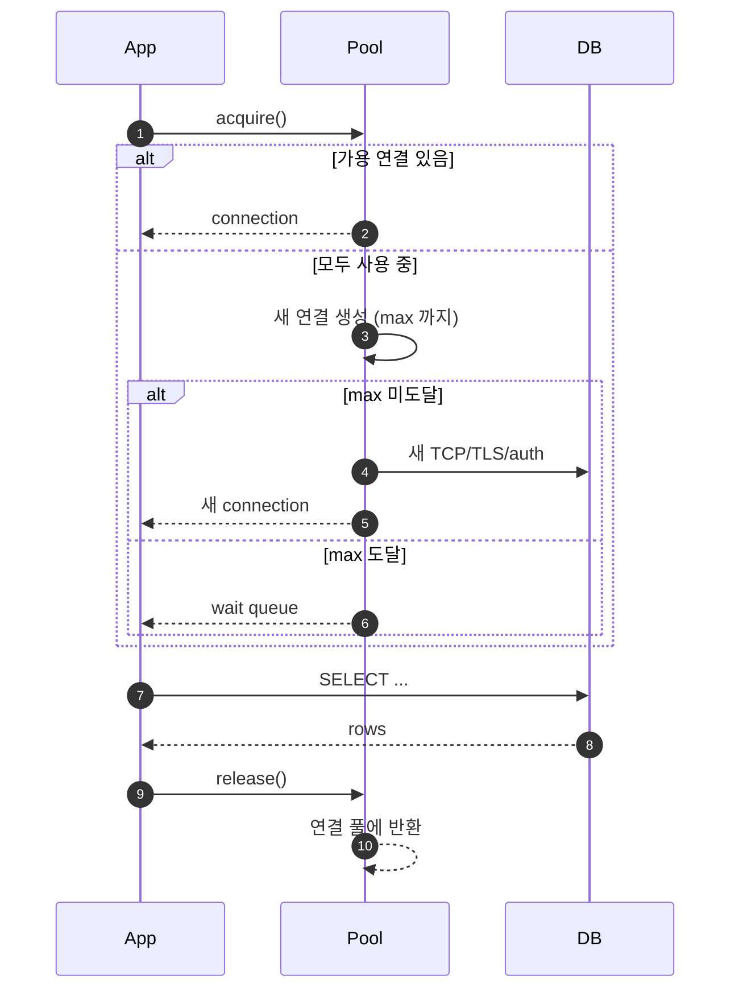
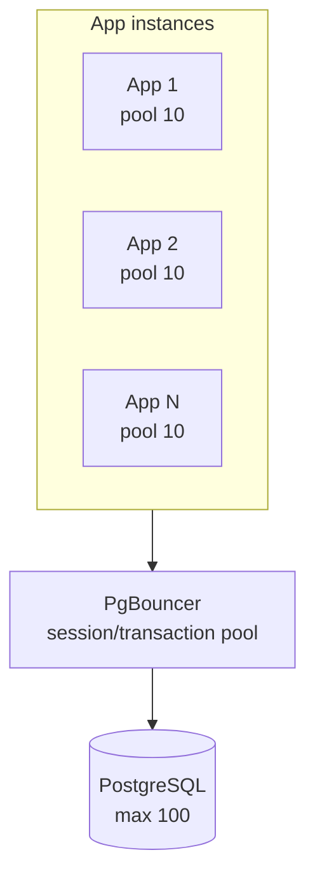
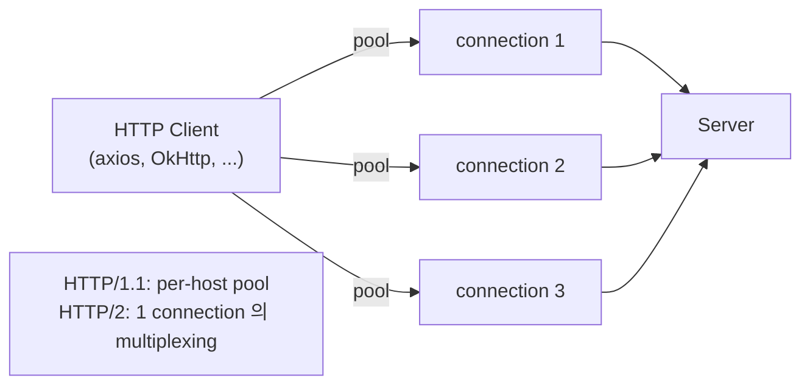

## 정의

**Connection Pool** = *연결을 미리 만들어 두고 재사용*. 매 요청마다 *TCP + TLS + auth* 비용을 회피.

```anim:java-blocking-queue-pc
{}
```

> Pool 의 동작 = *producer (request) / consumer (worker thread)* 의 *blocking queue* 직관과 일치.

## 왜 필요?

| 매 요청 새 연결 | Connection Pool |
|---|---|
| TCP handshake (~ms) | *0* (재사용) |
| TLS handshake (~수십 ms) | *0* |
| DB auth + session 설정 | *0* |
| OS file descriptor 한도 부담 | 제한적 |
| TIME_WAIT socket 폭증 | 없음 |

## 흐름



## 주요 파라미터

| 파라미터 | 의미 |
|---|---|
| `min_size` / `idle` | 최소 idle 연결 |
| `max_size` | 최대 연결 |
| `acquire_timeout` | acquire 대기 한도 |
| `idle_timeout` | idle 연결 만료 |
| `max_lifetime` | 연결의 최대 수명 |
| `validation_query` | health check (`SELECT 1`) |
| `leak_detection` | 반환 안 된 연결 추적 |

## Pool 크기 계산

```
Pool size ≈ (cores × 2) + effective_spindle_count
```

- CPU 가 *N 코어* 면 *동시 처리 가능한 작업 ~ 2N*.
- *너무 큼* = context switch / lock 경쟁 / DB 부담.
- *너무 작음* = wait queue 길어짐.

### Little's Law

```
L = λ × W
연결 수 = 처리량 (req/s) × 응답 시간 (s)
```

예: 1000 req/s, 100ms 응답 → *100 connections* 가 *충분*.

> [!IMPORTANT]
> *대부분의 운영 사고는 pool size 가 너무 크기* 때문. PG 의 `max_connections=200` 에 *50 app instance × pool=10* = 500 시도 → DB 거절.

## DB Connection Pool 구조



> *PgBouncer* 같은 *external pooler* 가 *N × app pool* 을 *PG 의 작은 pool* 로 *압축*.

| Mode | 의미 |
|---|---|
| `session` | 클라이언트가 disconnect 할 때까지 연결 점유 |
| `transaction` | 트랜잭션 동안만 (가장 효율) |
| `statement` | 매 statement (위험, prepared 안 됨) |

## HTTP Connection Pool



## 흔한 함정

> [!WARNING]
> 1. **Pool size *너무 큼*** = DB 거절 + thrashing. Little's Law 로 계산.
> 2. **`max_lifetime` 없음** = LB / firewall 의 *idle disconnect* 후 stale connection 시도 → 에러.
> 3. **Leak (release 안 함)** = pool 고갈. *try-with-resources / context manager* 강제.
> 4. **Validation query 부재** = stale 연결로 *간헐적 에러*. `SELECT 1` 또는 *pool 자체의 keep-alive*.

## HikariCP / 표준 라이브러리

| 라이브러리 | 언어 |
|---|---|
| HikariCP | Java (가장 빠름) |
| pgx / pgxpool | Go |
| psycopg pool, SQLAlchemy | Python |
| node-postgres | Node |
| ActiveRecord | Ruby |

## 관련 위키

- [[postgresql]], [[mysql-innodb]]
- [[Load Balancer]]
- [[backpressure]]
