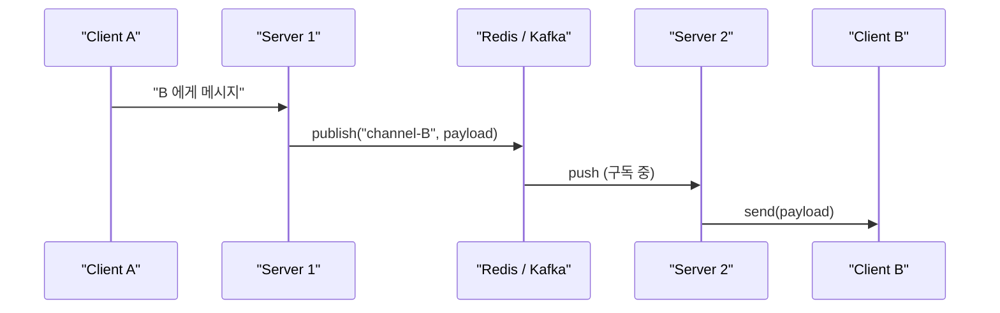
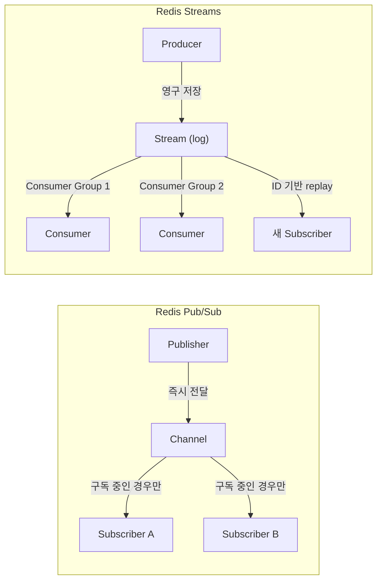
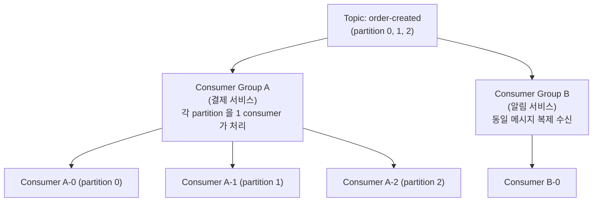

## 정의

**Pub/Sub Bus** (Publish-Subscribe bus)는 메시지 송신자(publisher)와 수신자(subscriber)가 서로를 모르고도 통신할 수 있게 해주는 중간 메시지 라우팅 계층이다.

- **Publisher**: 특정 채널/토픽에 메시지를 발행
- **Subscriber**: 관심 있는 채널을 구독, 발행된 메시지 수신
- **Bus**: 둘 사이의 라우팅 담당 (Redis, Kafka, NATS, RabbitMQ 등)

```anim:pubsub-bus
{}
```

## 왜 필요한가, 분산 [[Stateful]] 서버의 확장 문제

WebSocket 같은 지속 연결 서버를 여러 인스턴스로 확장하면 새로운 문제가 생긴다.

```
Client A → Server 1
Client B → Server 2 (다른 서버)

질문: A 가 B 에게 메시지를 보내려면?
```

서버 1 은 B 와 연결되어 있지 않으니 직접 send 할 수 없다.

### 해결책: Pub/Sub Bus



서버는 자기 클라이언트만 관리하면 됨. 서버 간 라우팅은 bus 가 담당.

## 동작 패턴

### Channel 기반

특정 이름의 채널에 발행/구독.

```javascript
// Publisher
redis.publish('chat:room:123', JSON.stringify({ from: 'A', text: 'hello' }));

// Subscriber
redis.subscribe('chat:room:123', (message) => {
  const data = JSON.parse(message);
  forwardToClient(data);
});
```

### Pattern 기반 (와일드카드)

```javascript
redis.psubscribe('chat:room:*', (channel, message) => {
  // chat:room:123, chat:room:456 모두 매칭
});
```

### Topic 기반 (계층화)

Kafka 등에서 토픽을 partition 단위로 분배.

```
topic: user-events
  partition 0: user_id % 3 == 0 인 이벤트
  partition 1: user_id % 3 == 1
  partition 2: ...
```

## Socket.IO + Redis Adapter 패턴

가장 흔한 실무 패턴.

```javascript
import { Server } from 'socket.io';
import { createAdapter } from '@socket.io/redis-adapter';
import { createClient } from 'redis';

const io = new Server(httpServer);

const pubClient = createClient({ url: 'redis://localhost:6379' });
const subClient = pubClient.duplicate();

await Promise.all([pubClient.connect(), subClient.connect()]);
io.adapter(createAdapter(pubClient, subClient));

// 이후엔 같은 코드로 서버 간 브로드캐스트가 동작
io.to('room-123').emit('msg', payload);
//   → Redis publish → 모든 서버 인스턴스 → 각자 자기 클라이언트에게 전달
```

서버 코드는 단일 인스턴스 때와 동일. Bus 가 multi-server 라우팅을 투명하게 처리한다.

## Redis Pub/Sub vs Redis Streams

Redis 에는 두 가지 메시지 메커니즘이 있다.



| 항목 | Redis Pub/Sub | Redis Streams |
|:---|:---|:---|
| 메시지 보관 | 없음 (fire-and-forget) | 영구 로그 |
| 오프라인 수신자 | 메시지 유실 | 나중에 읽기 가능 |
| Consumer Group | 없음 | 있음 (at-most-once / at-least-once) |
| 순서 보장 | 채널 내 순서 보장 | Stream ID 순서 보장 |
| 사용처 | 실시간 브로드캐스트 | 이벤트 소싱, 감사 로그 |

```javascript
// Redis Streams (Kafka 대안)
await redis.xAdd('user-events', '*', { userId: '42', action: 'login' });

// Consumer Group 으로 읽기 (at-least-once)
const [stream, messages] = await redis.xReadGroup(
  'myGroup', 'consumer-1', 'user-events', '>', { COUNT: 10 }
);
```

## Pub/Sub vs Message Queue (차이점)

| | Pub/Sub | Message Queue |
|:---|:---|:---|
| 메시지 보관 | 즉시 전달 (fire-and-forget) | 큐에 보관, 컨슈머가 pull |
| 다중 수신자 | 모든 subscriber 가 받음 | 보통 1 consumer 가 받음 |
| 메시지 유실 | subscriber 가 offline 이면 잃을 수 있음 | persistent 가능 |
| 예시 | Redis Pub/Sub, NATS | RabbitMQ, SQS, Kafka (consumer group 모드) |

**Redis Pub/Sub** 은 단순 Pub/Sub. **Kafka** 는 두 모드 모두 가능 (broadcast + consumer group).

## Kafka: Pub/Sub 과 Consumer Group

Kafka 는 두 패턴을 동시에 지원한다.



- **같은 Group 내**: partition 마다 1 consumer 배정 (큐 방식, 메시지 1회 처리)
- **다른 Group**: 독립 오프셋, 같은 메시지를 각 Group 이 개별 수신 (Pub/Sub 방식)

## 순서 보장

```
Redis Pub/Sub: 채널 내 단일 subscriber 에 대한 순서는 보장
              하지만 여러 서버에 broadcast 시 도달 순서는 보장 안 함

Kafka:        partition 내 순서만 보장
              여러 partition 에 걸치면 순서 보장 안 함
              → 같은 key 를 같은 partition 으로 라우팅해서 순서 보장
```

```javascript
// Kafka: key 로 partition 고정 → 순서 보장
await producer.send({
  topic: 'user-events',
  messages: [{ key: userId.toString(), value: JSON.stringify(event) }]
  //          ↑ 같은 userId 는 항상 같은 partition
});
```

## 부하 특성

| 구성 요소 | 부하 |
|:---|:---|
| **Publisher 서버** | 메시지마다 publish 호출 (~0.1 ms) |
| **Bus** | 모든 publish 가 통과, 가장 부담 큰 단일 지점 |
| **Subscriber 서버** | 수신 + 자기 클라이언트에게 forward |

> [!IMPORTANT]
> **Bus 가 SPOF (단일 장애점)** 가 될 수 있다. 고가용성 클러스터 (Redis Sentinel/Cluster, Kafka multi-broker) 가 필수.
> 또 다른 함정: 모든 메시지가 bus 를 통과하므로 **bus 처리량이 시스템 전체의 상한**이 된다.

## 사용 시나리오

### 1. WebSocket 클러스터

위에서 설명한 Socket.IO + Redis Adapter 패턴.

### 2. 마이크로서비스 간 이벤트 전파

```
주문 서비스 → publish "order.created"
  → 결제 서비스 (subscribe)
  → 재고 서비스 (subscribe)
  → 알림 서비스 (subscribe)
```

각 서비스가 독립적으로 진화 가능.

### 3. 실시간 알림 시스템

```
이벤트 발생 → publish "notify:user-{id}"
  → 사용자가 접속한 서버가 subscribe → 전달
```

### 4. Cache invalidation

```
DB 업데이트 → publish "cache-invalidate:user-{id}"
  → 모든 서버가 자기 로컬 캐시 무효화
```

## 함정

> [!WARNING]
> **subscriber 가 오프라인이면 Redis Pub/Sub 메시지는 유실**된다. 장애 복구 후 재구독해도 그 사이 메시지는 없다. 내구성이 필요하면 Redis Streams 또는 Kafka 사용.

> [!WARNING]
> **Hot channel 문제**: 특정 채널에 메시지가 폭발적으로 몰리면 bus 에 부하가 집중된다. 채널을 partition 단위로 분리하거나 [[backpressure]] 적용.

> [!CAUTION]
> **Kafka consumer lag**: Consumer 가 처리 속도를 따라가지 못하면 lag 가 쌓인다. `kafka-consumer-groups.sh --describe` 로 모니터링 필수.

## 대안과 trade-off

### gRPC streaming + 서비스 디스커버리

서비스 간 직접 stream. Bus 없음. 더 빠르지만 N×M 연결 관리.

### Service mesh (Istio 등)

L7 라우팅으로 메시지 전달. 더 강력하지만 복잡.

### Database notification

PostgreSQL `LISTEN/NOTIFY` 같은 DB 내장 Pub/Sub. 외부 인프라 불필요.

```sql
-- Publisher (PostgreSQL)
NOTIFY user_events, '{"userId": 42, "action": "login"}';

-- Subscriber (psycopg2)
conn.set_isolation_level(ISOLATION_LEVEL_AUTOCOMMIT)
cur.execute("LISTEN user_events;")
select.select([conn], [], [])
conn.poll()
for notify in conn.notifies:
    print(notify.payload)
```

## 관련 위키

- [[Stateful]] - Pub/Sub bus 가 필요한 이유: 상태를 가진 서버 확장
- [[Sticky Session]] - 대안적 접근: 특정 서버에 클라이언트 고정
- [[backpressure]] - 메시지 폭발 시 publisher 속도 제어
- [[circuit-breaker]] - Bus 장애 시 graceful degradation
- [[rate-limiting]] - publisher 속도 제어
