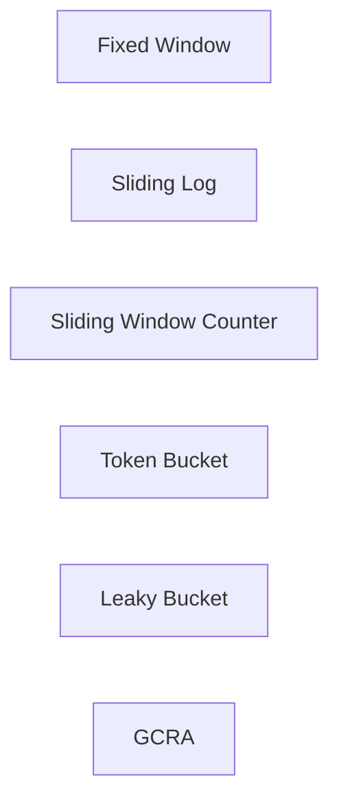
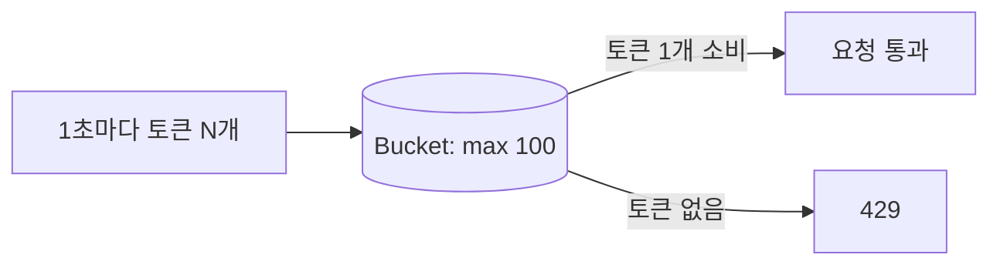
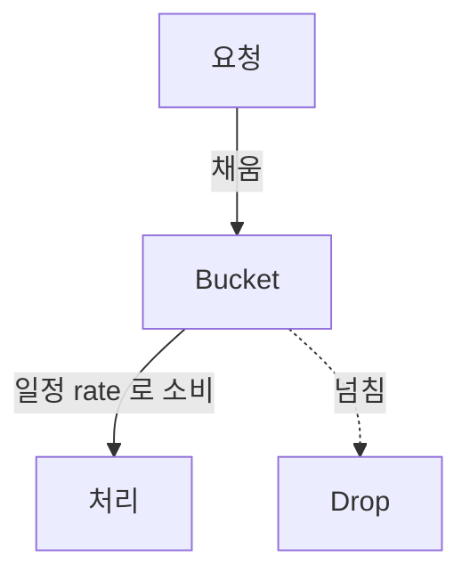
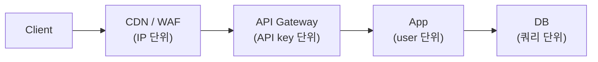
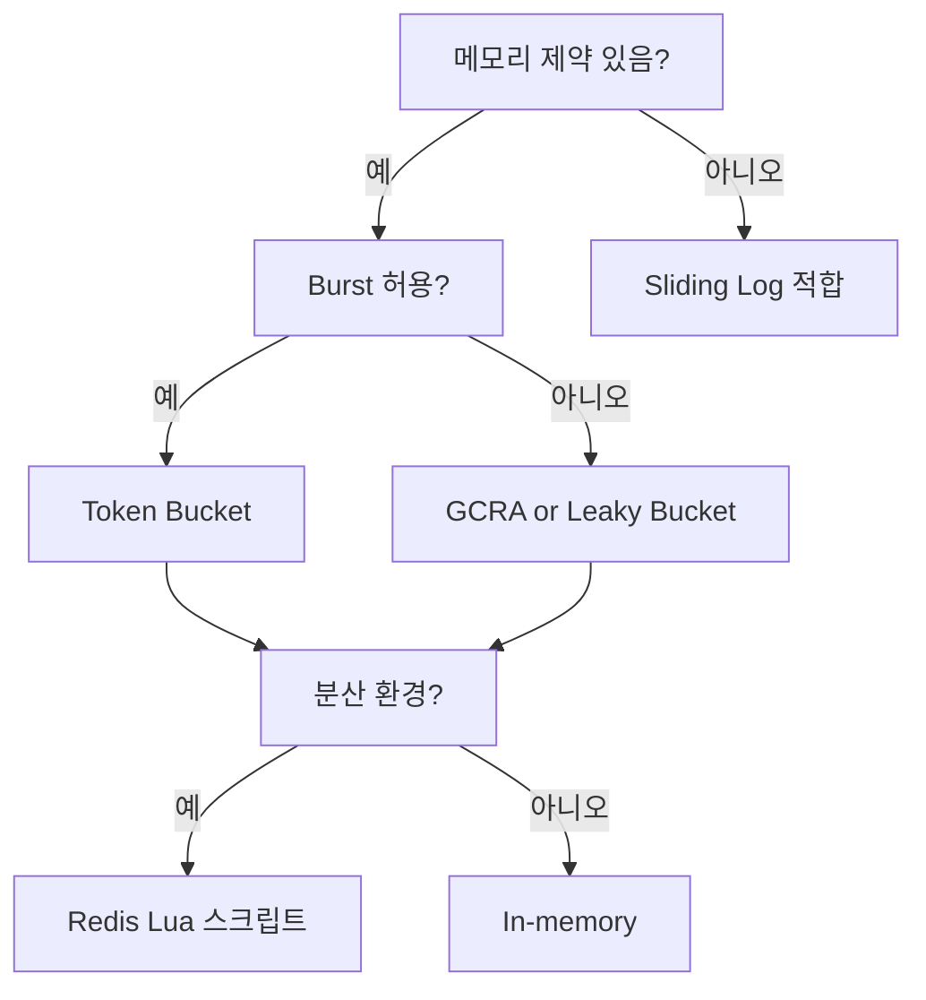

## 정의

**Rate Limiting** = *시간당 요청 수 제한*. API 보호, fair use, 비용 제어, DDoS 완화.

## 5가지 알고리즘



### 1. Fixed Window

```
[00:00 ~ 00:01] count = 100 (한도)
[00:01 ~ 00:02] count 리셋 → 100
```

```python
key = f"rl:{user}:{minute_bucket}"
count = redis.incr(key)
redis.expire(key, 60)
if count > 100: deny()
```

- 단순.
- *경계 burst*: 00:00:59 에 100 + 00:01:00 에 100 = *2초 안에 200*.

### 2. Sliding Log

*모든 요청의 timestamp* 저장 → 윈도우 안 카운트.

```python
key = f"rl:log:{user}"
now = time.time()
redis.zadd(key, { req_id: now })
redis.zremrangebyscore(key, 0, now - 60)
count = redis.zcard(key)
if count > 100: deny()
```

- *정확*.
- *메모리 큼* (요청마다 entry).

### 3. Sliding Window Counter

*Fixed Window + 이전 window 비율*.

```
current_count + previous_count * (1 - elapsed_in_current/window)
```

- *근사*.
- *적은 메모리 + Fixed 의 burst 완화*.

### 4. Token Bucket



- *Burst 허용* (bucket 차있을 때).
- *평균 rate* 보장.
- AWS / GitHub / Discord API 표준.

### 5. Leaky Bucket



- *완전 평탄화*. burst 흡수 + 일정 출력.
- queue 기반.

### 6. GCRA (Generic Cell Rate Algorithm)

```
TAT (Theoretical Arrival Time) 계산
요청 시각이 TAT 보다 충분히 앞이면 허용
```

- *Token Bucket 수학적 변형*.
- *단일 변수* 로 표현. *Redis 1 명령* 으로 가능.
- Cloudflare, Stripe 가 사용.

## 비교 매트릭스

| 알고리즘 | 메모리 | 정확도 | Burst | 구현 |
|---|---|---|---|---|
| Fixed Window | *적음* | 낮음 (경계 burst) | 큼 | 가장 단순 |
| Sliding Log | *큼* | 정확 | 없음 | Sorted Set |
| Sliding Window Counter | 적음 | 보통 | 작음 | 2 counter |
| Token Bucket | 적음 | 좋음 | 허용 | 간단 |
| Leaky Bucket | 중간 | 좋음 | 평탄 | Queue |
| GCRA | *최소* (단일 변수) | 정확 | 가능 | 수학적 |

## 분산 환경 구현 (Redis)

```python
# Token Bucket (Lua atomic)
TOKEN_BUCKET_LUA = """
local key = KEYS[1]
local now = tonumber(ARGV[1])
local rate = tonumber(ARGV[2])         -- tokens per sec
local capacity = tonumber(ARGV[3])

local last = redis.call('HMGET', key, 'tokens', 'last')
local tokens = tonumber(last[1]) or capacity
local last_ts = tonumber(last[2]) or now

local delta = math.max(0, now - last_ts) * rate
tokens = math.min(capacity, tokens + delta)
local allowed = tokens >= 1
if allowed then tokens = tokens - 1 end

redis.call('HMSET', key, 'tokens', tokens, 'last', now)
redis.call('EXPIRE', key, math.ceil(capacity / rate * 2))

return allowed and 1 or 0
"""
```

> [!IMPORTANT]
> 분산 rate limit 는 *Redis 한 곳* 으로 *원자적 카운터*. *분산 락 없이* Lua 스크립트.

## HTTP 응답 표준

```http
HTTP/1.1 429 Too Many Requests
Retry-After: 30
X-RateLimit-Limit: 100
X-RateLimit-Remaining: 0
X-RateLimit-Reset: 1719318060

{"error": "rate_limit_exceeded", "retry_after": 30}
```

## 어디서?



| 레이어 | 단위 |
|---|---|
| CDN | IP, geographic |
| WAF | 의심 패턴 |
| API Gateway | API key, OAuth token |
| App | user, tenant |
| DB | query, connection |

## Tier-based Rate Limit

```python
limits = {
    "free":    {"per_min": 60, "burst": 100},
    "pro":     {"per_min": 600, "burst": 1000},
    "enterprise": {"per_min": 10000, "burst": 50000},
}
```

> Stripe, OpenAI 같은 *유료 API* 의 표준.

## 흔한 함정

> [!WARNING]
> 1. **단일 노드 in-memory counter** = N 노드면 N배 한도. *분산 store 필수*.
> 2. **IP 기반만** = NAT 뒤 *수천 사용자가 한 IP*. user + IP 조합.
> 3. **Retry-After 무시 (클라이언트)** = 무한 retry → DDoS 자기 자신.
> 4. **Burst 너무 큼** = bucket 가득 차면 *순간 throughput 폭증*. 백엔드 보호 안 됨.

## 알고리즘 선택 기준



## 클라이언트 구현 패턴

클라이언트 측에서 429 를 올바르게 처리하지 않으면 오히려 서버에 더 큰 부하를 줄 수 있습니다.

```python
import time
import random

def api_call_with_backoff(fn, max_retries=5):
    for attempt in range(max_retries):
        response = fn()
        if response.status_code != 429:
            return response

        retry_after = int(response.headers.get('Retry-After', 1))
        # 지수 백오프 + 지터
        wait = retry_after + (2 ** attempt) + random.uniform(0, 1)
        time.sleep(wait)

    raise Exception("Rate limit 초과: 재시도 실패")
```

> [!IMPORTANT]
> `Retry-After` 헤더를 반드시 준수하세요. 무시하고 즉시 재시도하면 자기 DDoS 가 됩니다.

## Rate Limit 모니터링

관찰해야 할 핵심 지표:

| 지표 | 설명 |
|:---|:---|
| `rate_limit_hits_total` | 총 차단 횟수, spike = 공격 또는 버그 |
| `tokens_remaining` | 버킷 잔여 토큰, 낮으면 한도 근접 |
| `p99 latency` | Redis 조회 추가 지연 모니터링 |
| Top-N blocked users | 악의적 사용자 또는 버그 클라이언트 탐지 |

```python
# Prometheus 메트릭 예시
from prometheus_client import Counter

rate_limit_hits = Counter(
    'rate_limit_hits_total',
    'Rate limit 에 걸린 요청 수',
    ['endpoint', 'user_tier']
)

@app.route('/api/resource')
def resource():
    if not rate_limiter.allow(request.user):
        rate_limit_hits.labels(
            endpoint='/api/resource',
            user_tier=request.user.tier
        ).inc()
        return jsonify(error='rate_limit_exceeded'), 429
```

## 실전 운영 고려사항

- **Warm-up 정책**: 신규 사용자는 초반 더 관대하게 처리하여 정상 사용 패턴 파악.
- **Rate Limit 예외**: 내부 서비스, health check endpoint 는 화이트리스트 처리.
- **비동기 카운터**: 극한 성능 필요 시 로컬 카운터로 먼저 판단, Redis 는 비동기 동기화 (근사).
- **다중 버킷**: 분당 + 초당 동시 적용.

```python
limits = {
    'per_second': 10,
    'per_minute': 100,
    'per_hour': 2000,
}
# 셋 다 통과해야 허용 (AND 조건)
```

## 관련 위키

- [[backpressure]]
- [[circuit-breaker]]
- [[retry-with-backoff]]
- [[api-gateway]]
- [[redis-sorted-sets|Redis Sorted Sets]]
- [[redis-strings|Redis Strings]]
