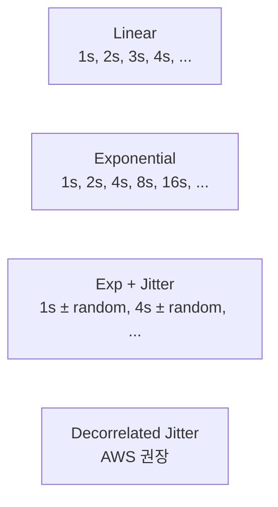
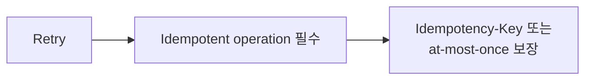
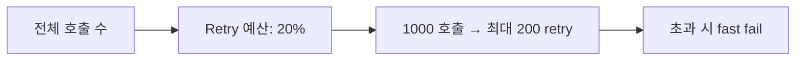

## 정의

**Retry with Exponential Backoff + Jitter** = *실패 시 점점 긴 간격으로 재시도, 랜덤 분산*. 분산 시스템의 *thundering herd / retry storm* 방지의 *표준*.

## 4가지 전략



### Exponential

```python
sleep = base * (2 ** attempt)
# attempt 0: 1s, 1: 2s, 2: 4s, 3: 8s, ...
```

문제: *모든 클라이언트가 같은 시각에 재시도* → thundering herd.

### Exponential + Full Jitter

```python
sleep = random.uniform(0, base * (2 ** attempt))
```

*완전 분산*. AWS / Stripe 표준.

### Decorrelated Jitter

```python
sleep = random.uniform(base, prev_sleep * 3)
```

*과거 sleep 의 함수*. *완전 무작위 + 점진 증가*. 평균적으로 가장 짧은 retry 시간.

## 비교 시뮬레이션

<ChartJs
  client:visible
  type="line"
  title="100 클라이언트 동시 실패 후 재시도 시간 분포"
  caption="Jitter 가 *동시 호출 폭증* 을 평탄화. Decorrelated 가 평균 retry 시간 최소."
  height="280px"
  data={{
    labels: ['0s', '1s', '2s', '4s', '8s', '16s', '32s'],
    datasets: [
      {
        label: 'Exponential (jitter 없음)',
        data: [0, 100, 0, 100, 0, 100, 0],
        borderColor: '#ef4444',
        backgroundColor: 'transparent',
        borderWidth: 2.5,
      },
      {
        label: 'Exp + Full Jitter',
        data: [0, 35, 30, 20, 10, 5, 0],
        borderColor: '#22c55e',
        backgroundColor: 'transparent',
        borderWidth: 2.5,
      },
      {
        label: 'Decorrelated Jitter',
        data: [0, 25, 35, 25, 10, 5, 0],
        borderColor: '#3b82f6',
        backgroundColor: 'transparent',
        borderWidth: 2.5,
      },
    ],
  }}
  options={{
    scales: { y: { title: { display: true, text: '동시 retry 수' } } },
  }}
/>

## Retry 가능한 에러만 retry

```mermaid
flowchart TD
    E[에러 종류]
    E -->|5xx, timeout, conn refused| R[Retry OK]
    E -->|4xx (400, 401, 403, 404)| NoR[Retry 금지]
    E -->|429 Too Many Requests| Special[Retry-After 헤더 따름]
    E -->|409 Conflict (idempotent 아니면)| NoR
    E -->|503 + Retry-After| Special
```

> [!IMPORTANT]
> *4xx 는 클라이언트 오류*. retry 해도 같은 결과. 5xx / network 만 retry 가치.

## Idempotency 와 짝



비-멱등 (POST 결제) 은 *retry 가 중복 처리 위험*. [[idempotency-keys]] 가 *짝*.

## 상한 설정

| 설정 | 권장 |
|---|---|
| Max attempts | 3-5 |
| Max total time | 30-60s |
| Per-attempt timeout | 5-10s |
| Max sleep | 16-32s |

> 무한 retry = 사용자 *영원히 대기*. 빠른 *deadline* + fallback.

## Retry-After 헤더

```http
HTTP/1.1 429 Too Many Requests
Retry-After: 30

또는

Retry-After: Wed, 25 Jun 2026 12:30:00 GMT
```

> *서버가 client 에게 *얼마 후* 다시 시도* 알림. 클라이언트는 *반드시* 존중.

## SDK / Library

| 도구 | 언어 |
|---|---|
| AWS SDK | 모든 언어 (자동 retry) |
| Polly | .NET |
| Resilience4j Retry | Java |
| tenacity | Python |
| node-fetch + retry | Node |
| backoff (Go) | Go |

## Retry Budget



> 한 service 의 retry 가 *전체 호출의 큰 비중* 이면 *retry storm*. *예산 한도* 로 보호. gRPC 의 retry budget, Envoy retry policy.

## 흔한 함정

> [!WARNING]
> 1. **Jitter 없음** = thundering herd. *전체 fleet 동시 retry*.
> 2. **모든 에러 retry** = 4xx 도 retry → 의미 없는 부하.
> 3. **Idempotent 아닌데 retry** = 결제 중복. Idempotency-Key 필수.
> 4. **Max attempt 무한** = 사용자 영원히 대기. timeout + fallback.
> 5. **Nested retry** = 계층마다 retry (client → SDK → SDK 내부) → *retry × retry* 폭증. 한 곳에서만.

## 관련 위키

- [[circuit-breaker]]
- [[idempotency-keys]]
- [[backpressure]]
- [[rate-limiting]]
