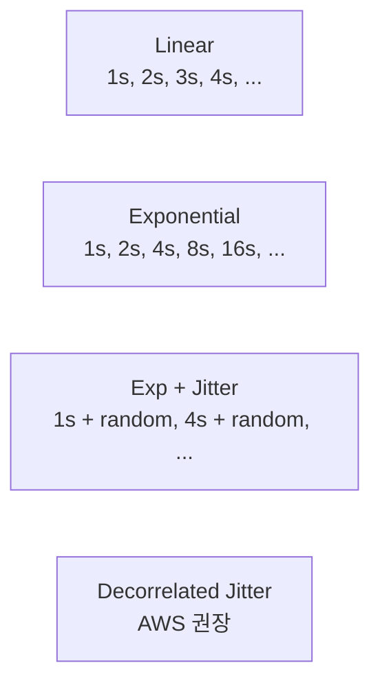
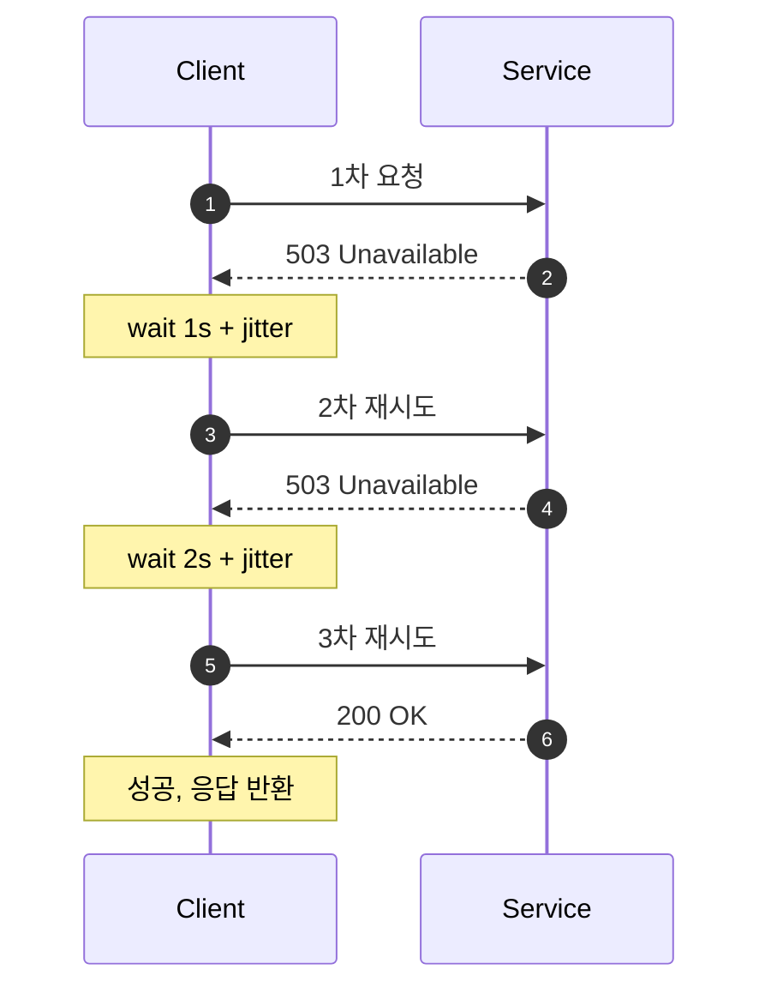
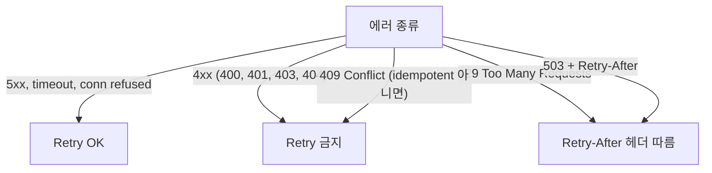
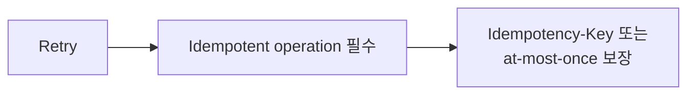
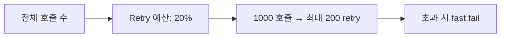

## 정의

**Retry with Exponential Backoff + Jitter** = *실패 시 점점 긴 간격으로 재시도, 랜덤 분산*. 분산 시스템의 *thundering herd / retry storm* 방지의 *표준*.

## 4가지 전략



### Exponential

```python
sleep = base * (2 ** attempt)
# attempt 0: 1s, 1: 2s, 2: 4s, 3: 8s, ...
```

문제: *모든 클라이언트가 같은 시각에 재시도* → thundering herd.

### Exponential + Full Jitter

```python
sleep = random.uniform(0, base * (2 ** attempt))
```

*완전 분산*. AWS / Stripe 표준.

### Decorrelated Jitter

```python
sleep = random.uniform(base, prev_sleep * 3)
```

*과거 sleep 의 함수*. *완전 무작위 + 점진 증가*. 평균적으로 가장 짧은 retry 시간.

## 재시도 상태 머신



각 retry 사이에 `sleep` 을 두고, sleep 은 attempt 가 늘어날수록 exponentially 커진다. jitter 로 동일 시각 재시도를 분산한다.

## 비교 시뮬레이션

<ChartJs
  client:visible
  type="line"
  title="100 클라이언트 동시 실패 후 재시도 시간 분포"
  caption="Jitter 가 *동시 호출 폭증* 을 평탄화. Decorrelated 가 평균 retry 시간 최소."
  height="280px"
  data={{
    labels: ['0s', '1s', '2s', '4s', '8s', '16s', '32s'],
    datasets: [
      {
        label: 'Exponential (jitter 없음)',
        data: [0, 100, 0, 100, 0, 100, 0],
        borderColor: '#ef4444',
        backgroundColor: 'transparent',
        borderWidth: 2.5,
      },
      {
        label: 'Exp + Full Jitter',
        data: [0, 35, 30, 20, 10, 5, 0],
        borderColor: '#22c55e',
        backgroundColor: 'transparent',
        borderWidth: 2.5,
      },
      {
        label: 'Decorrelated Jitter',
        data: [0, 25, 35, 25, 10, 5, 0],
        borderColor: '#3b82f6',
        backgroundColor: 'transparent',
        borderWidth: 2.5,
      },
    ],
  }}
  options={{
    scales: { y: { title: { display: true, text: '동시 retry 수' } } },
  }}
/>

## Retry 가능한 에러만 retry



> [!IMPORTANT]
> *4xx 는 클라이언트 오류*. retry 해도 같은 결과. 5xx / network 만 retry 가치.

## Idempotency 와 짝



비-멱등 (POST 결제) 은 *retry 가 중복 처리 위험*. [[idempotency-keys]] 가 *짝*.

## 상한 설정

| 설정 | 권장 |
|---|---|
| Max attempts | 3-5 |
| Max total time | 30-60s |
| Per-attempt timeout | 5-10s |
| Max sleep | 16-32s |

> 무한 retry = 사용자 *영원히 대기*. 빠른 *deadline* + fallback.

## Deadline 전파

분산 시스템에서는 클라이언트가 설정한 deadline 을 **모든 하위 서비스로 전파**해야 한다. 그렇지 않으면 클라이언트는 이미 timeout 되었는데 하위 서비스는 계속 retry 한다.

```python
import grpc
from datetime import datetime, timedelta

# gRPC: deadline 을 context 로 전파
with grpc.insecure_channel("service:50051") as channel:
    stub = ServiceStub(channel)
    deadline = datetime.utcnow() + timedelta(seconds=10)
    # timeout 이 남은 시간으로 자동 설정
    resp = stub.CallMethod(request, timeout=10.0)
```

HTTP 에서는 `X-Request-Deadline` 같은 커스텀 헤더 또는 `X-B3-Deadline` 로 전파한다.

> [!CAUTION]
> deadline 전파 없이 retry 하면 *zombie retry* 가 발생한다. 클라이언트는 504 를 받고 떠났는데 서버 내부에서는 수 분간 재시도가 계속된다. 자원 낭비 + 부하 증폭.

## 구현 예시

### Python: tenacity

```python
from tenacity import (
    retry,
    stop_after_attempt,
    wait_exponential,
    wait_random,
    retry_if_exception_type,
)
import requests

@retry(
    stop=stop_after_attempt(5),
    wait=wait_exponential(multiplier=1, min=1, max=16) + wait_random(0, 2),
    retry=retry_if_exception_type((requests.ConnectionError, requests.Timeout)),
    reraise=True,
)
def call_api(url: str) -> dict:
    resp = requests.get(url, timeout=5)
    resp.raise_for_status()
    return resp.json()
```

### Java: Resilience4j

```java
RetryConfig config = RetryConfig.custom()
    .maxAttempts(5)
    .intervalFunction(IntervalFunction.ofExponentialRandomBackoff(500, 2.0, 0.5))
    .retryOnException(e -> e instanceof HttpServerErrorException)
    .build();

Retry retry = Retry.of("api-call", config);
Supplier<String> decorated = Retry.decorateSupplier(retry, () -> callDownstream());
Try.ofSupplier(decorated).recover(ex -> fallback()).get();
```

### Go: backoff 라이브러리

```go
import "github.com/cenkalti/backoff/v4"

b := backoff.NewExponentialBackOff()
b.InitialInterval = 1 * time.Second
b.MaxInterval = 16 * time.Second
b.MaxElapsedTime = 60 * time.Second

err := backoff.RetryNotify(
    func() error {
        return callAPI(ctx)
    },
    backoff.WithContext(b, ctx),
    func(err error, d time.Duration) {
        log.Printf("retry after %v: %v", d, err)
    },
)
```

## Hedged Requests

Retry 와 다른 전략: *첫 요청이 일정 시간 내에 응답 안 오면 두 번째 요청을 병렬로 보내고, 먼저 오는 응답을 사용*. 실패 없이 tail latency 를 낮추는 패턴.

```
t=0:   → request 1
t=50ms → (응답 없음) → request 2 병렬 시작
t=80ms ← response 2 도착 → response 1 취소
```

```python
import asyncio

async def hedged_call(url: str, hedge_delay=0.05) -> dict:
    async with aiohttp.ClientSession() as session:
        task1 = asyncio.create_task(session.get(url))
        await asyncio.sleep(hedge_delay)
        task2 = asyncio.create_task(session.get(url))
        done, pending = await asyncio.wait(
            [task1, task2], return_when=asyncio.FIRST_COMPLETED
        )
        for t in pending:
            t.cancel()
        return await done.pop()
```

> [!IMPORTANT]
> Hedging 은 *non-idempotent 요청 (POST 결제 등) 에는 금지*. 멱등 읽기 (GET, SELECT) 에만 사용.

## Retry-After 헤더

```http
HTTP/1.1 429 Too Many Requests
Retry-After: 30

또는

Retry-After: Wed, 25 Jun 2026 12:30:00 GMT
```

> *서버가 client 에게 *얼마 후* 다시 시도* 알림. 클라이언트는 *반드시* 존중.

## SDK / Library

| 도구 | 언어 |
|---|---|
| AWS SDK | 모든 언어 (자동 retry) |
| Polly | .NET |
| Resilience4j Retry | Java |
| tenacity | Python |
| node-fetch + retry | Node |
| backoff (Go) | Go |

## Retry Budget



> 한 service 의 retry 가 *전체 호출의 큰 비중* 이면 *retry storm*. *예산 한도* 로 보호. gRPC 의 retry budget, Envoy retry policy.

## 흔한 함정

> [!WARNING]
> 1. **Jitter 없음** = thundering herd. *전체 fleet 동시 retry*.
> 2. **모든 에러 retry** = 4xx 도 retry → 의미 없는 부하.
> 3. **Idempotent 아닌데 retry** = 결제 중복. Idempotency-Key 필수.
> 4. **Max attempt 무한** = 사용자 영원히 대기. timeout + fallback.
> 5. **Nested retry** = 계층마다 retry (client → SDK → SDK 내부) → *retry × retry* 폭증. 한 곳에서만.
> 6. **Deadline 미전파** = 클라이언트 timeout 후에도 하위 서비스가 계속 재시도.

## 관련 위키

- [[circuit-breaker]]
- [[idempotency-keys]]
- [[backpressure]]
- [[rate-limiting]]
- [[api-gateway]], gateway 레벨 retry 정책 설정
