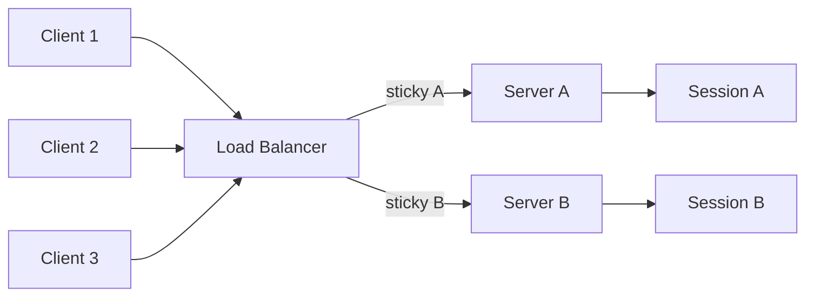
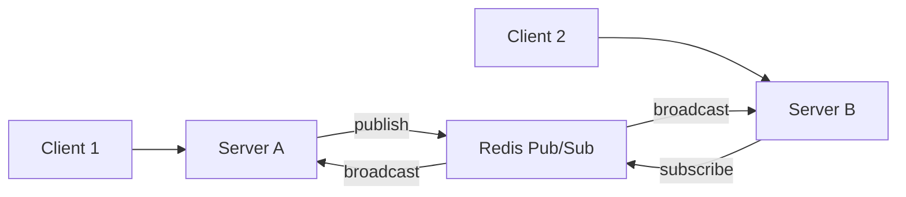

## 정의

**Stateful (상태유지)** 서버는 클라이언트와의 세션·연결 컨텍스트를 메모리에 유지한다. 후속 요청·이벤트는 이 컨텍스트를 활용해 처리된다.

같은 클라이언트의 요청은 같은 서버로 가야 의미가 있다. 그래서 수평 확장이 복잡해진다.

전체 비교는 [[Stateless vs Stateful]] 페이지를 참조.

## 핵심 특성

| 측면 | 동작 |
|:---|:---|
| **세션 상태** | 서버 메모리에 보관 |
| **수평 확장** | [[Sticky Session]] 또는 외부 store 필수 |
| **장애 복원** | 서버 다운 시 세션 손실 (외부 store 시 완화) |
| **인증 정보** | 세션 ID 발급, 서버가 검증 |
| **캐싱** | 사용자별 응답 → 캐시 효율 낮음 |

## 수평 확장 시각화

### Sticky Session 구성



LB 가 쿠키 또는 IP hash 로 클라이언트를 특정 서버에 고정한다. Server A 가 다운되면 그 세션들이 모두 손실된다.

### WebSocket 클러스터 (Pub/Sub 버스)



서버 A 가 클라이언트 B 에게 메시지를 전달해야 할 때, Redis Pub/Sub 버스를 통해 서버 B 가 대신 전달한다. Socket.IO + Redis Adapter 패턴이 전형.

## 어디에 상태가 사는가

### 1. 인메모리 (가장 흔함)

```javascript
const sessions = new Map(); // sessionId → user_data
```

빠르지만 휘발성. 서버 재시작 = 세션 손실.

### 2. 활성 연결 자체

WebSocket, SSE 의 경우 **TCP 연결 자체가 상태 컨텍스트**다.

```javascript
const wss = new WebSocketServer({ ... });
wss.on('connection', (ws) => {
  ws.userId = decodeAuth(ws.upgradeReq);
  ws.rooms = new Set();
  // 이 ws 객체가 사라질 때까지 컨텍스트 유지
});
```

연결 끊김 = 컨텍스트 손실 → 재연결 + 재인증 필요.

### 3. 외부 store (사실상 Stateless 화)

세션 데이터를 Redis 같은 외부 store 에 두면 형식상 Stateless 서버가 된다.

```javascript
// Express + connect-redis
app.use(session({
  store: new RedisStore({ client: redis }),
  secret: 'xxx',
}));
```

## Stateful 서버의 수평 확장

여러 서버로 트래픽을 분산할 때 마주치는 문제.

### 문제, 같은 클라이언트가 다른 서버로 가면?

```
Client X 가 Server A 에 로그인 → A의 메모리에 세션 저장
Client X 의 다음 요청 → LB가 Server B 로 라우팅 → B는 세션 모름 → 인증 실패
```

### 해결책 1: [[Sticky Session]]

LB 가 같은 클라이언트를 같은 서버로. 가장 흔하고 가장 단순.

단점: 서버 다운 시 세션 손실, 부하 불균형 가능.

### 해결책 2: 외부 세션 store

세션 데이터를 Redis 등에 두면 어느 서버나 조회 가능. 사실상 Stateless 화.

```
Client X → 아무 서버 → Redis 에서 세션 조회 → 처리
```

매 요청마다 store I/O 추가.

### 해결책 3: [[Pub/Sub bus]] (지속 연결 전용)

서버 간 메시지 라우팅용. WebSocket 같이 연결 자체가 본질적인 경우.

```
Server A 가 Client X 보유 / Server B 가 Client Y 보유
A 에 'Y 에게 메시지' 도착 → Redis publish → B subscribe → Y 에게 전달
```

Socket.IO + Redis Adapter 패턴이 전형.

## Kubernetes StatefulSet

Stateful 워크로드는 Kubernetes `StatefulSet` 으로 운영한다. Deployment 와 달리 각 pod 에 **안정적인 이름과 순서**가 보장된다.

```yaml
apiVersion: apps/v1
kind: StatefulSet
metadata:
  name: chat-server
spec:
  serviceName: "chat"
  replicas: 3
  selector:
    matchLabels:
      app: chat-server
  template:
    spec:
      containers:
        - name: chat-server
          image: chat:latest
          volumeMounts:
            - name: data
              mountPath: /data
  volumeClaimTemplates:
    - metadata:
        name: data
      spec:
        accessModes: ["ReadWriteOnce"]
        resources:
          requests:
            storage: 10Gi
```

StatefulSet 이 생성하는 pod 이름: `chat-server-0`, `chat-server-1`, `chat-server-2`.
DNS 이름: `chat-server-0.chat.default.svc.cluster.local`.

> [!IMPORTANT]
> StatefulSet 은 *삭제 순서도 역순으로 보장*한다. 데이터베이스처럼 replica 순서가 중요한 시스템에 필수.

[[k8s-statefulset]] 에서 더 자세한 설명을 볼 수 있다.

## 세션 어피니티 (Sticky Session) 상세

### NGINX sticky cookie

```nginx
upstream backend {
    ip_hash;              # IP 기반 고정
    server server1:8080;
    server server2:8080;
}

# 또는 쿠키 기반
upstream backend {
    server server1:8080;
    server server2:8080;
    sticky cookie srv_id expires=1h;
}
```

### AWS ALB sticky session

```json
{
  "TargetGroupAttributes": [
    { "Key": "stickiness.enabled", "Value": "true" },
    { "Key": "stickiness.type", "Value": "lb_cookie" },
    { "Key": "stickiness.lb_cookie.duration_seconds", "Value": "86400" }
  ]
}
```

고정이 너무 강하면 특정 서버에 트래픽이 쏠린다. `ip_hash` 보다 `least_conn` + sticky cookie 조합이 부하 분산에 유리하다.

## 그레이스풀 드레인

Stateful 서버를 재배포할 때 활성 세션을 잃지 않으려면 graceful drain 이 필수다.

```
1. LB 가 해당 인스턴스를 풀에서 제거 (신규 트래픽 차단)
2. 기존 연결이 자연스럽게 끝나길 대기 (drain timeout: 보통 30-60s)
3. drain timeout 초과 → 강제 종료 (SIGKILL)
```

```yaml
# Kubernetes: terminationGracePeriodSeconds
spec:
  terminationGracePeriodSeconds: 60
  containers:
    - name: chat-server
      lifecycle:
        preStop:
          exec:
            command: ["/bin/sh", "-c", "sleep 5"]
```

WebSocket 의 경우 drain 신호를 받으면 클라이언트에게 `close frame` 을 보내 재연결을 유도한다.

## 실무 예시

### WebSocket 채팅 서버

```javascript
import { WebSocketServer } from 'ws';
const rooms = new Map(); // room → Set<ws>

const wss = new WebSocketServer({ port: 8080 });
wss.on('connection', (ws) => {
  ws.on('message', (data) => {
    const { type, room, payload } = JSON.parse(data);
    if (type === 'join') {
      if (!rooms.has(room)) rooms.set(room, new Set());
      rooms.get(room).add(ws);
    } else if (type === 'message') {
      rooms.get(room)?.forEach((peer) => {
        if (peer !== ws) peer.send(payload);
      });
    }
  });
});
```

`rooms` Map 이 메모리 상태. 서버 재시작 = 모든 룸 정보 손실.

### 실시간 게임 서버

플레이어 위치·인벤토리·전투 상태를 서버 메모리에 유지. tick 단위로 업데이트.

수평 확장은 보통 **샤딩**, "월드 1 은 Server A, 월드 2 는 Server B" 식으로 분할.

### 협업 도구 (Figma, Notion)

문서 단위로 stateful 서버 1대가 모든 활성 사용자의 변경사항(OT/CRDT)을 메모리에 유지.

## 함정과 한계

### 1. 메모리 폭발

활성 연결마다 메모리. WebSocket + Socket.IO 5K 연결 = ~400-500 MB.

### 2. 서버 다운 = 사용자 인지 가능한 손실

다운 직후 활성 세션 / 연결이 모두 끊김. 재연결 + 재인증 + 잃어버린 메시지 재요청.

### 3. 운영 복잡도

- [[Sticky Session]] 설정
- 배포·롤링 업데이트 시 세션 마이그레이션 또는 graceful drain
- 모니터링 (활성 연결 수, 메모리, GC 등)

### 4. 비용

같은 동접 처리 시 Stateless 보다 더 많은 서버 인스턴스 필요 (메모리 빠르게 소진).

## 통신 프로토콜과의 관계

| 프로토콜 | Stateful 여부 |
|:---|:---|
| HTTP 의미상 | Stateless |
| Server-Sent Events | ✓ Stateful (지속 연결) |
| WebSocket | ✓ Stateful (지속 양방향) |
| WebRTC | ✓ Stateful (P2P 세션) |
| Long Polling | 의미상 Stateless, 운영상 비슷 |
| WebTransport | ✓ Stateful |

지속 연결 기반 프로토콜은 본질적으로 Stateful.

## 관련 위키

- [[Stateless]]
- [[Stateless vs Stateful]], 전체 비교
- [[Sticky Session]], 수평 확장의 핵심 회피책
- [[Pub/Sub bus]], WebSocket 클러스터 확장 패턴
- [[k8s-statefulset]], Kubernetes StatefulSet 상세
- [[connection-pool]], 외부 store 연결 관리
