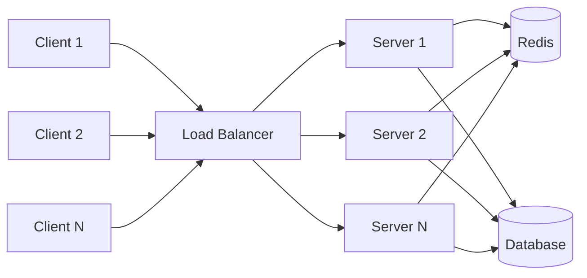
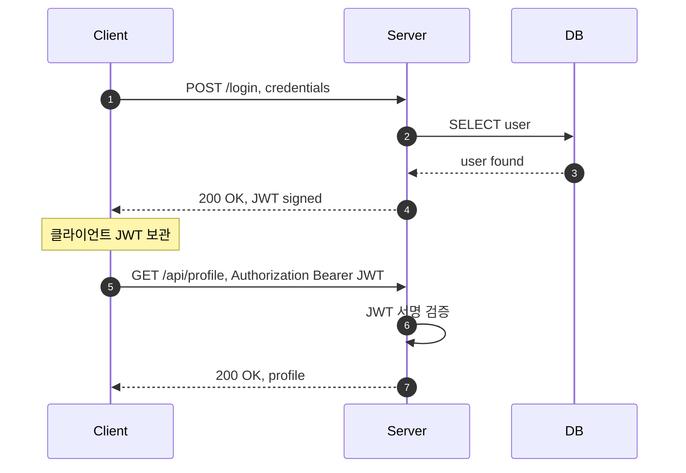

## 정의

**Stateless (무상태)** 서버는 클라이언트의 요청 간 상태를 기억하지 않는다. 각 요청은 완전히 독립적이며, 처리에 필요한 모든 정보는 요청 자체에 담겨 있어야 한다.

같은 요청이라면 어느 서버 인스턴스가 처리하든 결과가 같다는 게 핵심 속성. 이게 수평 확장을 단순하게 만든다.

전체 비교는 [[Stateless vs Stateful]] 페이지를 참조.

## 핵심 특성

| 측면 | 동작 |
|:---|:---|
| **세션 상태** | 서버 메모리에 없음 |
| **수평 확장** | 무제한, round-robin LB |
| **장애 복원** | 서버 교체 시 사용자 무영향 |
| **인증 정보** | 매 요청마다 토큰/키 첨부 |
| **캐싱** | URL 기반 캐시 매우 효율적 |

## 수평 확장 아키텍처



모든 서버가 동일한 Redis 와 DB 를 바라본다. LB 가 어느 서버로 요청을 보내도 같은 결과가 나온다. 서버 추가는 인스턴스 수만 늘리면 끝이다.

Health check 로 고장 난 서버를 풀에서 제거해도 나머지 서버가 즉시 트래픽을 흡수한다. 사용자에게는 무영향이다.

## 어떻게 stateless 를 유지하는가

상태가 정말 필요 없는 경우는 드물다. 보통은 "**상태를 서버 메모리에 두지 않는다**" 가 핵심이다. 어디에 두는가가 선택이다.

### 1. 외부 store 위임

세션·캐시·잠금 등을 Redis, DynamoDB, DB 에 둔다. 모든 서버 인스턴스가 같은 store 에 접근.

```
요청 → 어느 서버든 OK → Redis 에서 세션 조회 → 응답
```

비용: 매 요청마다 store I/O (보통 1-3 ms). 운영 단순성을 위한 합리적 trade-off.

### 2. 클라이언트 측 상태 (JWT, Cookie)

상태를 클라이언트가 들고 다님. 서버는 검증만.

```
로그인 → JWT 발급 → 클라이언트가 보관
이후 요청 → Authorization: Bearer <JWT> → 서명 검증으로 사용자 식별
```

### 3. URL/Query 에 상태 인코딩

페이지네이션 커서, 필터 조건 등을 URL 에 담는다.

```
GET /products?cursor=eyJpZCI6MTIzfQ&limit=20
```

서버는 cursor 만 읽고 응답.

## JWT 인증 플로우



서버는 요청 사이에 아무것도 기억하지 않는다. JWT 서명 키만 있으면 어느 인스턴스든 동일한 검증이 가능하다.

## 실무 예시

### REST API

```http
GET /api/users/42
Authorization: Bearer eyJhbGc...

→ 서버: JWT 검증, DB 에서 user 42 조회, 응답
   메모리에 세션 X
```

### CDN / 정적 자원

```
GET /static/main.css
→ 어느 edge 서버든 같은 응답
→ 캐시 적중률 매우 높음
```

### Serverless 함수 (AWS Lambda 등)

함수 실행마다 컨테이너가 새로 만들어질 수 있음 → stateless 가 강제됨.
세션은 DynamoDB / Redis 등에 위임 필수.

## Redis 세션 스토어 구현

JWT 대신 서버 측 세션 ID 를 유지해야 할 때도, 외부 store 에 세션을 두면 서버 자체는 stateless 로 운영할 수 있다.

```python
import uuid, json
import redis

r = redis.Redis(host="redis-host", port=6379)
TTL = 3600  # 1 hour

def create_session(user_id: str) -> str:
    sid = str(uuid.uuid4())
    r.setex(f"session:{sid}", TTL, json.dumps({"user_id": user_id}))
    return sid

def get_session(sid: str) -> dict | None:
    raw = r.get(f"session:{sid}")
    return json.loads(raw) if raw else None

def delete_session(sid: str) -> None:
    r.delete(f"session:{sid}")
```

Redis Sentinel 또는 Redis Cluster 로 단일 장애점을 제거해야 한다. Redis 다운 = 전체 서비스 인증 불능이 되기 때문이다.

```yaml
# Redis Sentinel docker-compose 간략 예시
services:
  redis-master:
    image: redis:7
  redis-replica:
    image: redis:7
    command: redis-server --replicaof redis-master 6379
  redis-sentinel:
    image: redis:7
    command: redis-sentinel /etc/sentinel.conf
```

## Kubernetes에서의 Stateless

Stateless 서버는 Kubernetes `Deployment` 로 운영한다. [[k8s-statefulset]] 이 필요 없다.

```yaml
apiVersion: apps/v1
kind: Deployment
metadata:
  name: api-server
spec:
  replicas: 3
  selector:
    matchLabels:
      app: api-server
  template:
    spec:
      containers:
        - name: api-server
          image: myapp:latest
          env:
            - name: REDIS_URL
              valueFrom:
                secretKeyRef:
                  name: redis-secret
                  key: url
```

HPA 로 CPU / RPS 기반 자동 스케일도 가능하다.

```bash
kubectl autoscale deployment api-server --cpu-percent=70 --min=2 --max=20
```

pod 에 순서나 안정적인 네트워크 ID 가 없어도 상관없다. stateless 서버에는 이게 오히려 장점이다.

## 언제 Stateless를 선택하는가

| 상황 | 권장 |
|:---|:---|
| REST API, 배치 처리 | Stateless |
| 퍼블릭 마이크로서비스 | Stateless |
| Serverless / Lambda | Stateless |
| 실시간 채팅, 게임 서버 | [[Stateful]] 고려 |
| 비디오 스트리밍 세션 | [[Stateful]] 고려 |
| P2P 협업 도구 | [[Stateful]] 고려 |

수평 확장·배포 단순성이 목표면 stateless 가 기본 선택이다. 저지연 양방향 통신이 핵심이면 [[Stateful]] 을 고려한다.

## 함정과 한계

### 1. "Stateless 인데 외부 store 가 단일 장애점"

Redis 다운 → 모든 서버가 세션 조회 실패. Stateless 한 서버를 만들어놓고 외부 store 에 의존하면 그게 SPOF 가 된다. **고가용성 Redis 클러스터, fallback 전략 필요**.

### 2. JWT 즉시 취소 어려움

JWT 는 만료 전까지 유효. 사용자 권한 변경/로그아웃을 즉시 반영하려면 **블랙리스트** 같은 별도 store 가 필요 → 일부 stateful 화.

### 3. Per-request 토큰 검증 비용

매 요청마다 JWT 서명 검증 (CPU) + 외부 store 조회 (I/O). 트래픽이 많으면 누적된다.

## 통신 프로토콜과의 관계

| 프로토콜 | Stateless 친화도 |
|:---|:---|
| HTTP/1.1, 2, 3 | ✓ 완벽 (메시지 의미상) |
| Short Polling | ✓ |
| Long Polling | ✓ (HTTP 의미상, 운영상은 연결 점유) |
| Server-Sent Events | ✗ Stateful (지속 연결) |
| WebSocket | ✗ [[Stateful]] |
| WebRTC | ✗ Stateful |

대부분의 REST API · CDN · 정적 사이트는 자연스럽게 stateless.

## 관련 위키

- [[Stateful]]
- [[Sticky Session]], Stateful 의 회피책
- [[Stateless vs Stateful]], 전체 비교
- [[connection-pool]], 외부 store 연결 관리
- [[rate-limiting]], Stateless API 보호
- [[jwt]], 클라이언트 측 상태 토큰
- [[redis]], 외부 세션 스토어
- [[k8s-statefulset]], Stateful 워크로드용 K8s 리소스
