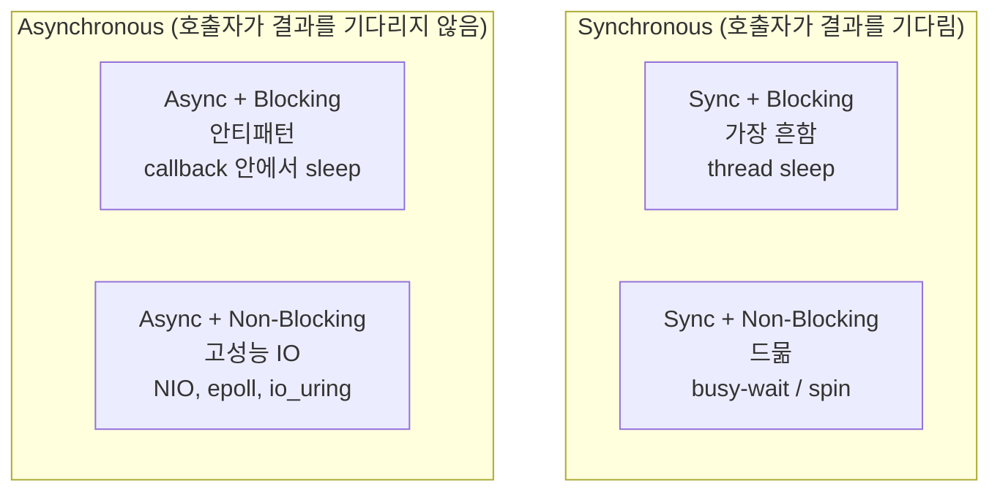
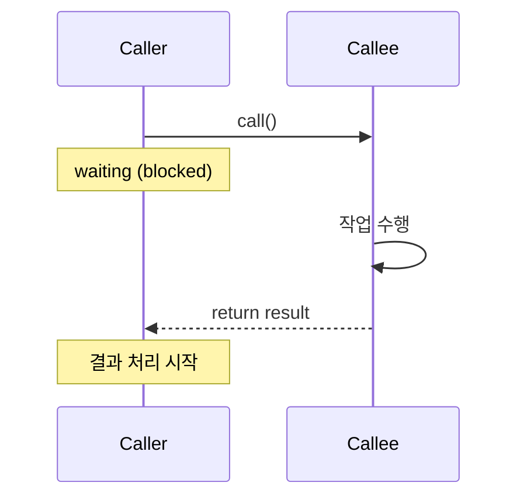
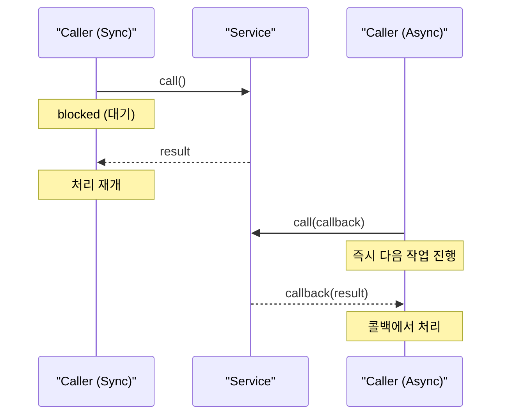

## 정의

**Synchronous (동기)** 는 호출자가 **결과가 나올 때까지 기다리는** 실행 모델. 함수를 호출한 코드는 그 함수가 반환할 때까지 **다음 줄로 진행하지 않는다**.

이 정의는 Java의 `synchronized` 키워드와는 **별개의 개념**이다. `synchronized`는 동시성 제어 (mutual exclusion), Synchronous는 호출 모델 (control flow).

[[Asynchronous]]와의 대비, 그리고 [[Blocking]]과의 관계가 핵심.

## 가장 단순한 형태

```java
// Synchronous
String result = http.get("/api/users");   // 응답이 올 때까지 대기
process(result);                          // 그 다음 진행
```

호출자는 응답이 오기 전까지는 다음 줄을 실행하지 않는다. 코드 작성과 디버깅이 가장 쉽다.

## 4가지 조합

동기/비동기와 블로킹/논블로킹은 **독립적인 두 축**이다. 조합하면 4가지가 나온다.



| 조합 | 호출자 대기 | 스레드 상태 | 예시 |
|:---|:---:|:---:|:---|
| **Sync + Blocking** | O | sleep | `socket.read()`, `Thread.sleep()` |
| **Sync + Non-Blocking** | O | active (spin) | `Thread.onSpinWait()`, busy-loop |
| **Async + Blocking** | X | sleep (안티패턴) | callback 안에서 `Thread.sleep()` |
| **Async + Non-Blocking** | X | active (event loop) | Node.js, Netty, epoll |

## Sync의 두 형태: blocking vs non-blocking

Synchronous는 호출자가 **결과를 기다린다**는 의미이지, 그 동안 **CPU를 점유**하는지는 별개. 따라서 두 가지가 가능.

### Synchronous + Blocking (가장 흔함)

호출자가 결과를 기다리는 동안 **스레드가 멈춘다 (block)**. OS가 스레드를 sleep 상태로 만들고 CPU를 다른 스레드에게 양보.

```java
// 전형적인 sync + blocking
Socket s = serverSocket.accept();         // 연결이 올 때까지 block
String line = reader.readLine();          // 데이터가 올 때까지 block
Thread.sleep(1000);                       // 1초 block
```

### Synchronous + Non-Blocking (드물지만 가능)

호출자가 결과를 기다리지만 **스레드는 활성 상태**로 계속 돈다. busy-waiting 또는 polling.

```java
while (!result.isReady()) {
    Thread.onSpinWait();   // hint, 스레드 양보 안 함
}
String value = result.get();
```

CPU를 낭비하므로 거의 안 쓴다. 매우 짧은 대기에만 쓰이는 마이크로 최적화.

## 동기 호출 흐름



호출자와 호출자의 스택 프레임이 **일직선**으로 이어진다. 디버깅 시 stack trace가 그대로 보인다.

## 동기 vs 비동기 대비



## 장점

- **읽기 쉽다**: 위에서 아래로 흐름이 명확
- **에러 처리가 자연스럽다**: `try / catch`가 호출자 스택에 닿는다
- **디버깅이 쉽다**: breakpoint가 작동, stack trace가 일관
- **테스트가 쉽다**: 순차 실행이라 결과 비교 단순

## 단점

- **느린 작업은 스레드를 묶는다**: 동시에 1000명 응답하려면 1000개 스레드
- **CPU 활용도가 낮을 수 있다**: I/O 대기 중에는 CPU idle
- **응답성 저하**: 한 요청이 다른 요청의 진행을 막을 수 있다

## 언제 동기가 적절한가

- **응답이 빠르고 일관적**: 5ms 이내의 DB 쿼리 같은 작업
- **순차 흐름이 본질**: 단계 A의 결과로 단계 B를 결정
- **저부하 시스템**: 동시 접속 < 수백 수준
- **테스트, 스크립트, 마이그레이션 도구**

## 언제 [[Asynchronous]]가 더 나은가

- 외부 API 호출 (수 초 걸릴 수 있음)
- 수만 명 동시 접속을 받는 서버
- UI가 멈추면 안 되는 클라이언트
- 여러 작업을 병렬로 진행해야 할 때

## Java의 동기 IO 예

### HTTP 클라이언트 (sync)

```java
// HttpClient 동기 모드
HttpClient client = HttpClient.newHttpClient();
HttpResponse<String> response = client.send(
    HttpRequest.newBuilder(URI.create("https://api.example.com")).build(),
    BodyHandlers.ofString()
);
// 응답이 도착할 때까지 block
```

### File I/O (sync)

```java
String content = Files.readString(Path.of("data.txt"));
// 파일을 다 읽을 때까지 block
```

### Socket (sync)

```java
ServerSocket server = new ServerSocket(8080);
Socket client = server.accept();           // 연결을 받을 때까지 block
String line = new BufferedReader(...).readLine();   // 데이터를 받을 때까지 block
```

## 언어별 동기 IO 패턴

### Python (requests)

```python
import requests

# 동기 (기본)
response = requests.get("https://api.example.com/users")
data = response.json()   # 응답 올 때까지 block

# 비동기 대안: httpx + asyncio
import httpx, asyncio

async def fetch():
    async with httpx.AsyncClient() as client:
        response = await client.get("https://api.example.com/users")
        return response.json()
```

### Node.js

```javascript
// 동기 (fs.readFileSync) - 이벤트 루프 블로킹
const data = fs.readFileSync("data.txt", "utf8");   // 블로킹!

// 비동기 (권장)
const data = await fs.promises.readFile("data.txt", "utf8");
```

> [!WARNING]
> Node.js에서 `*Sync` 함수 (예: `readFileSync`, `execSync`)는 이벤트 루프 전체를 블로킹한다. 서버 코드에서는 절대 사용 금지. 스크립트나 초기화 코드에서만 허용.

## Sync 모델의 동시성: 스레드 풀

대량 동시성을 위해 sync 코드는 **스레드 풀**을 쓴다. 각 요청을 별도 스레드에 할당해 병렬 처리.

```java
ExecutorService pool = Executors.newFixedThreadPool(100);
// 매 요청마다
pool.submit(() -> {
    String r = http.get(url);    // sync call, but in separate thread
    process(r);
});
```

이 방식의 한계:
- 스레드 1개당 메모리 ~1MB
- 100 스레드 = 100MB
- 10,000 동시 연결 → ~10GB, 비현실적

Java 21+의 **Virtual Threads (JEP 444)**가 이 한계를 깬다. 동기 코드 그대로 두면서도 수백만 동시 연결을 가능하게 만든다.

```java
// Virtual Threads: 동기 코드 그대로, 스레드 수 제한 없음
try (var executor = Executors.newVirtualThreadPerTaskExecutor()) {
    executor.submit(() -> {
        String r = http.get(url);   // 여전히 sync, 하지만 virtual thread
        process(r);
    });
}
```

## sync와 [[Blocking]]의 관계

| 표현 | 의미 |
|:---|:---|
| **synchronous** | 호출자가 결과를 기다린다 (control flow) |
| **blocking** | 그 동안 스레드가 멈춘다 (thread state) |

같이 쓰이지만 다른 차원. 대부분의 sync 코드는 blocking이지만, **non-blocking sync**도 가능 (`Thread.onSpinWait()`, busy-loop)하다.

반대로 **async + blocking**도 가능 (콜백 안에서 다시 sleep하는 경우, 자주 보는 안티패턴).

## 흔한 함정

> [!WARNING]
> 1. **동기 = 느림이라는 오해**: 동기 자체가 느린 게 아니라, *느린 I/O를 동기로 기다리는 것*이 문제. 빠른 I/O는 동기가 더 단순하고 충분히 빠르다.
> 2. **스레드 풀 크기 과소 설정**: 동시 요청 수 > 스레드 수 → 큐 대기 → 응답 지연. 모니터링 필수.
> 3. **Virtual Thread에서 synchronized 블록**: Java 21 Virtual Thread는 `synchronized` 블록 안에서 blocking 시 carrier thread를 점유 (pinning). `ReentrantLock` 사용 권장.
> 4. **Node.js에서 Sync 함수 사용**: 이벤트 루프 전체 블로킹. 서버 코드에서 절대 금지.

## 관련 위키

- [[Asynchronous]]
- [[Blocking]]
- [[Non-Blocking]]
- [[비동기와 타이밍, 콜백부터 async/await까지의 발전사]]
- [[backpressure]] (동기 호출 과부하 시 흐름 제어)
