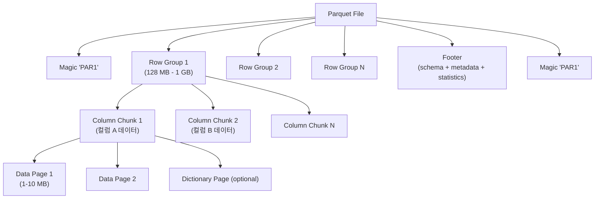

## 정의

**Apache Parquet** 은 *분석 쿼리에 최적화된 오픈소스 컬럼형 이진 파일 포맷*. 2013년 Twitter + Cloudera 가 Google Dremel 논문 (2010) 을 참고해 발표. 현재 [[data-warehouse|데이터 웨어하우스]] / data lake 의 사실상 표준 저장 포맷.

같은 데이터를 CSV/JSON 대비 *10-100배 작게*, 분석 쿼리를 *10-100배 빠르게* 실행.

## 왜 컬럼형인가

```
Row-based (CSV, JSON, Avro):
  Row 1: [id=1, name="A", age=30, ..., col50]
  Row 2: [id=2, name="B", age=25, ..., col50]

  SELECT AVG(age) → 모든 컬럼을 읽고 age 만 뽑음.

Column-based (Parquet, ORC):
  id:   [1, 2, 3, ...]
  name: [A, B, C, ...]
  age:  [30, 25, 40, ...]  ← 이 컬럼만 스캔
  ...

  SELECT AVG(age) → age 컬럼만 I/O. 나머지 스킵.
```

**컬럼형의 세 가지 이점**:

1. **I/O 절감** - 필요한 컬럼만 읽음 (컬럼 프로젝션)
2. **압축률** - 같은 타입/유사값이 연속 -> 사전, RLE, delta 압축이 잘 먹힘 (5-10배)
3. **CPU 효율** - 같은 타입이 연속 -> SIMD 벡터 명령, late materialization

## 파일 구조



| 계층 | 크기 (권장) | 역할 |
|:---|:---|:---|
| **File** | 임의 | 하나의 물리 파일 (`.parquet`) |
| **Row Group** | 128 MB - 1 GB | 수평 파티션, 병렬 read/write 단위 |
| **Column Chunk** | Row group / N | 한 컬럼의 데이터가 연속으로 |
| **Data Page** | 1 - 10 MB | 압축/인코딩 단위 |
| **Dictionary Page** | Column chunk 당 1개 (선택) | 값 -> 정수 매핑 |
| **Footer** | 파일 끝 | schema + row group 위치 + 통계 |

**Footer 가 파일 끝에 있는 이유**: streaming write 를 지원하려면 파일을 다 쓴 뒤에야 전체 통계/위치를 알 수 있음. 대신 read 시 seek 두 번 (끝으로 -> footer 읽기 -> 필요한 row group 위치로).

## 인코딩 (Encoding)

압축 전 값을 정수/오프셋으로 표현하는 단계. 컬럼 특성에 따라 자동 선택.

| Encoding | 적용 타입 | 최적 케이스 | 압축비 |
|:---|:---|:---|:---|
| **PLAIN** | 모든 타입 | fallback, 무압축 | 1x |
| **RLE_DICTIONARY** | 모든 타입 (일반적) | 낮은 카디널리티 (성별, 국가) | 10-100x |
| **DELTA_BINARY_PACKED** | INT32/INT64 | 정렬/순차 정수 (id, timestamp) | 5-20x |
| **DELTA_LENGTH_BYTE_ARRAY** | BYTE_ARRAY | 문자열 길이 varying | 3-10x |
| **DELTA_BYTE_ARRAY** | BYTE_ARRAY | 정렬된 문자열 | 5-15x |
| **BYTE_STREAM_SPLIT** | FLOAT/DOUBLE | 부동소수점 (뒤 codec 과 조합 개선) | 압축 개선 |

*Dictionary encoding 이 기본*. 카디널리티가 임계값을 넘으면 PLAIN 으로 fallback.

## 압축 (Compression Codec)

인코딩된 페이지를 물리적으로 압축. 인코딩 위에 codec 을 한 번 더 적용.

| Codec | 압축비 | 압축 속도 | 해제 속도 | 권장 |
|:---|:---|:---|:---|:---|
| **SNAPPY** | 2-4x | 매우 빠름 | 매우 빠름 | 옛 기본값, 균형형 |
| **ZSTD** | 3-6x | 빠름 | 빠름 | *현대 기본값 권장* |
| **GZIP** | 4-8x | 느림 | 느림 | 최대 압축 필요 시 |
| **LZ4** | 2-3x | 최고 | 최고 | 실시간 스트리밍 |
| **BROTLI** | 5-10x | 매우 느림 | 중간 | 아카이빙 (드묾) |
| **LZO** | 2-4x | 빠름 | 빠름 | Legacy (사실상 대체됨) |
| **UNCOMPRESSED** | 1x | - | - | 디버깅만 |

> [!IMPORTANT]
> **ZSTD 가 현대 기본값**. SNAPPY 보다 압축비가 좋고 GZIP 보다 빠름. 새 파일은 ZSTD 로 시작.

## 통계 (Statistics) & Predicate Pushdown

각 row group / column chunk / page 는 `min`, `max`, `null_count` 통계를 저장. Reader 는 이 통계만 보고 *데이터를 읽지 않고 스킵* 가능.

```
Query: SELECT * FROM t WHERE order_date >= '2026-01-01'

Row Group 1: min=2025-01-01, max=2025-12-31  →  skip (max < filter)
Row Group 2: min=2026-01-01, max=2026-06-30  →  read
Row Group 3: min=2026-07-01, max=2026-12-31  →  read
```

**Bloom Filter** (선택): 컬럼 값의 hash 집합. `WHERE user_id = 12345` 처럼 등호 조건에서 row group 을 확률적으로 스킵. 크기 ~1-2% 오버헤드.

**Page Index** (Parquet 2.5+): row group 안의 페이지 수준 min/max 를 별도로 저장. 페이지 단위 스킵.

## 스키마 진화 (Schema Evolution)

Parquet 은 다음을 지원:

- **컬럼 추가**: 새 컬럼 (기본값 or NULL)
- **컬럼 제거**: reader 무시
- **컬럼 이름 변경**: 메타 수정
- **타입 승격**: INT32 -> INT64, FLOAT -> DOUBLE
- **중첩 구조 변경**: struct 필드 추가

**주의**: 타입 강등 (INT64 -> INT32) 은 안전하지 않음. 오래된 파일과 새 스키마가 섞이면 reader 마다 처리 다름.

트랜잭션 스키마 진화가 필요하면 *Iceberg / Delta Lake / Hudi* 같은 table format 층을 위에 얹음.

## 논리 타입 (Logical Types, Parquet 2.x)

물리 타입 (INT32, INT64, BYTE_ARRAY 등) 위에 의미를 부여:

| Logical Type | 물리 타입 | 의미 |
|:---|:---|:---|
| `STRING` | BYTE_ARRAY | UTF-8 문자열 |
| `DATE` | INT32 | epoch 이후 일수 |
| `TIMESTAMP` | INT64 | 밀리/마이크로/나노초 |
| `DECIMAL(p,s)` | INT32/64/FIXED/BYTE_ARRAY | 고정소수점 |
| `UUID` | FIXED_LEN_BYTE_ARRAY(16) | 128비트 UUID |
| `JSON` | BYTE_ARRAY | JSON 문자열 |
| `VARIANT` | (nested) | 반정형 데이터 (Parquet 2.11+) |
| `GEOMETRY/GEOGRAPHY` | BYTE_ARRAY | WKT/WKB (Parquet 2.11+) |

## 중첩 구조 (Nested Schema)

Dremel 의 핵심 기여: *임의 깊이의 중첩 구조를 컬럼형으로 저장*. Struct, List, Map 을 각 leaf 컬럼별 (definition level, repetition level) 로 인코딩.

```
schema: {
  user: {
    id: int64,
    tags: list<string>,
    addresses: list<{city: string, zip: string}>
  }
}

물리 저장:
  user.id                    (INT64)
  user.tags.list.element     (STRING) + rep/def levels
  user.addresses.list.city   (STRING) + rep/def levels
  user.addresses.list.zip    (STRING) + rep/def levels
```

Reader 는 rep/def level 로 원래 nested 구조를 복원. JSON 을 flatten 하지 않고도 컬럼 프로젝션이 됨.

## Row Group / Page 크기 결정

| 파라미터 | 권장 | 범위 | 트레이드오프 |
|:---|:---|:---|:---|
| **Row Group** | 256-512 MB | 128 MB - 1 GB | 크면 압축 좋음/random access 느림 |
| **Page** | 1-10 MB | 512 KB - 64 MB | 작으면 필터링 세밀/오버헤드 증가 |
| **Rows per Row Group** | 1M-10M | 컬럼 폭에 따라 | 메모리 vs 압축 |

**일반 권장**: 256 MB row group + SNAPPY/ZSTD + Dictionary encoding.

## Parquet vs 다른 포맷

| 포맷 | 저장 | 압축 | 쿼리 속도 | 스키마 진화 | 중첩 | 주요 사용처 |
|:---|:---|:---|:---|:---|:---|:---|
| **Parquet** | Column | 3-6x | 빠름 | 우수 | 우수 | 데이터 레이크, 분석 |
| **ORC** | Column | 4-8x | 빠름 | 우수 | 우수 | Hive/Spark |
| **Avro** | Row | 2-4x | 느림 | 최고 | 우수 | 스트리밍 (Kafka) |
| **CSV** | Row | 1-2x | 매우 느림 | 없음 | 없음 | Legacy, 사람 읽기 |
| **JSON** | Row | 1-3x | 느림 | 우수 | 우수 | API, 반정형 |
| **JSONL/NDJSON** | Row | 1-3x | 느림 | 우수 | 우수 | 로그, 스트리밍 |

**대략**: Parquet 은 CSV 대비 *크기 10-100배 감소*, 분석 쿼리 *10-100배 빠름*.

## 라이브러리

| 언어/도구 | 라이브러리 | 특징 |
|:---|:---|:---|
| **Python** | `pyarrow` | C++ Arrow 백엔드, 권장 |
| **Python** | `pandas` (v2.0+) | 내부적으로 pyarrow 사용 |
| **Python/Rust** | `polars` | 매우 빠름, 최근 표준화 |
| **SQL (in-process)** | `duckdb` | Parquet 을 SQL 로 바로 |
| **JVM** | `parquet-mr`, Spark | Hadoop 생태계 |
| **Go** | `parquet-go` | Segment/InfluxData 활용 |
| **Rust** | `arrow-rs`, `parquet` | zero-copy, 매우 빠름 |

## 실전 예제

### Python (pyarrow)

```python
import pyarrow as pa
import pyarrow.parquet as pq

# 쓰기
table = pa.table({
    'id': [1, 2, 3],
    'name': ['a', 'b', 'c'],
    'ts': pa.array([1706000000, 1706000001, 1706000002], type=pa.timestamp('ms'))
})

pq.write_table(
    table,
    'out.parquet',
    compression='zstd',
    row_group_size=1_000_000,
    use_dictionary=True,
    write_statistics=True,
)

# 읽기 (필요한 컬럼만 + 필터)
table = pq.read_table(
    'out.parquet',
    columns=['id', 'ts'],
    filters=[('id', '>=', 2)],   # predicate pushdown
)
```

### DuckDB (SQL 로 바로)

```sql
-- Parquet 을 테이블처럼 쿼리
SELECT COUNT(*) FROM 's3://bucket/data/**/*.parquet'
WHERE ts >= '2026-01-01';

-- Parquet 으로 저장
COPY (SELECT * FROM orders WHERE year = 2026)
TO 'orders_2026.parquet' (FORMAT PARQUET, COMPRESSION ZSTD);
```

### Spark / [[aws-glue|Glue]]

```python
# read
df = spark.read.parquet("s3://bucket/data/")
df.filter("year = 2026").select("id", "amount").show()

# write with partitioning
df.write \
  .mode("overwrite") \
  .partitionBy("year", "month") \
  .option("compression", "zstd") \
  .parquet("s3://bucket/out/")
```

## 데이터 레이크에서의 파티셔닝 관용

디렉토리 구조로 파티션 표현 (Hive 스타일):

```
s3://bucket/events/
├── year=2026/
│   ├── month=01/
│   │   ├── day=01/
│   │   │   └── part-00000.parquet
│   │   └── day=02/
│   └── month=02/
```

[[aws-athena|Athena]] / [[aws-redshift-spectrum|Spectrum]] / Spark 는 `WHERE year=2026 AND month=01` 을 만나면 그 폴더의 파일만 스캔. *파티션 프루닝* = 비용/시간 절감의 핵심.

## Small Files Problem

파티션이 세분화되거나 스트리밍 flush 가 잦으면 파일이 작아짐 (KB ~ MB). 결과:

- Row group 이 너무 작아 압축비 하락
- 파일 open/close 오버헤드 폭증
- 메타데이터 오버헤드 (파일당 footer)
- [[aws-s3|S3]] LIST/GET 요청 비용 증가
- 쿼리 엔진의 파일 스캔 병렬화 손해

**해결**:
1. **Compaction job**: 작은 파일을 주기적으로 256 MB+ 로 합침
2. **파티션 세분화 완화**: `day` 대신 `month`
3. **Iceberg / Delta Lake / Hudi**: 자동 compaction, snapshot
4. **[[aws-s3|S3]] Tables** (2024+): 관리형 compaction

## 함정

> [!WARNING]
> **INT96 timestamp** = Legacy (Impala 호환). 새 파일은 INT64 + `timestamp` logical type 사용. INT96 은 나노초까지만 표현 못함 + 표준 X.

> [!CAUTION]
> **row group 이 너무 큼** = OOM 위험, 스트리밍 flush 시 지연. 너무 작음 = 위 small files 문제. 256 MB 근처가 sweet spot.

> [!WARNING]
> **Dictionary encoding 이 fallback** 하면 조용히 압축비 붕괴. Column cardinality 를 확인. 필요하면 `dictionary_page_size_limit` 조정.

> [!IMPORTANT]
> **파일 rename/append 없다**. Parquet 은 immutable. 수정하려면 새 파일로 write + 옛 파일 삭제. Iceberg/Delta 가 이 위에 트랜잭션 semantics 를 얹음.

> [!CAUTION]
> **Schema 변경 후 옛 파일과 섞임** = reader 따라 결과 다름. 스키마 이력 관리 (Iceberg schema ID) 또는 partitioned by schema version.

> [!WARNING]
> **UTF-8 아닌 문자열** 을 STRING 으로 저장 = reader 별 처리 다름. BINARY (bytes) 로 저장하고 앱 레벨에서 처리.

> [!IMPORTANT]
> **압축 codec 미지정 = SNAPPY 기본** (라이브러리별). 새 파이프라인은 ZSTD 로 명시. GZIP 은 CPU 부담 크니 아카이빙에만.

## 관련 위키

- [[data-warehouse|Data Warehouse]] - Parquet 의 주된 소비자
- [[etl|ETL / ELT]] - Parquet 을 생성/소비하는 파이프라인
- [[aws-s3|AWS S3]] - Parquet 저장의 표준 백엔드
- [[aws-athena|Amazon Athena]] - S3 의 Parquet 을 SQL 로
- [[aws-redshift-spectrum|Redshift Spectrum]] - Redshift 에서 S3 Parquet 쿼리
- [[aws-glue|AWS Glue]] - Parquet 로 변환하는 Spark ETL
- [[aws-redshift|AWS Redshift]] - COPY 로 Parquet 로드
- [[aws-s3-glacier|S3 Glacier]] - Parquet 파일의 장기 아카이빙
