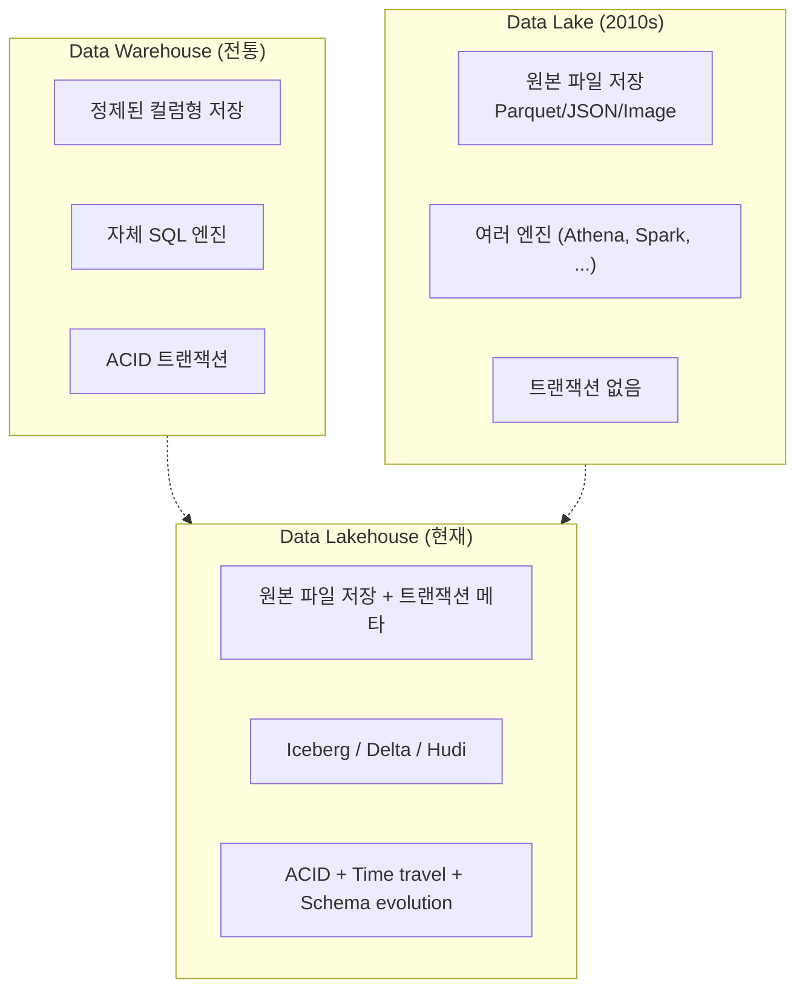
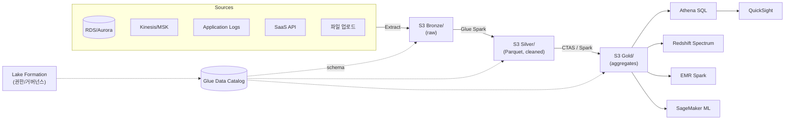

## 정의

**데이터 레이크** (Data Lake) 는 *구조 여부와 무관하게 모든 종류의 데이터를 원본 형식 그대로 저장하는 중앙 저장소*. 스키마를 미리 강제하지 않고 (*schema-on-read*), 필요할 때 쿼리 엔진 / 프레임워크가 스키마를 해석. [[aws-s3|S3]] / GCS / Azure Data Lake Storage 가 사실상 표준 백엔드.

**핵심 대비**: [[data-warehouse|데이터 웨어하우스]] 는 *schema-on-write* (미리 정제된 데이터), 데이터 레이크는 *schema-on-read* (원본 저장 후 해석).

## 왜 데이터 레이크인가

전통 [[data-warehouse|DW]] 만으로는 부족한 이유:

- **비정형 / 반정형** 데이터 (로그, JSON, 이미지, 오디오, 비디오) 를 DW 에 넣기 어려움
- DW 저장은 비쌈, 원본 raw 를 모두 DW 에 두면 비용 폭발
- ML 학습은 종종 *원본 그대로* 가 필요 (변환된 것이 아닌)
- 데이터 소스가 폭증 -> 스키마 강제가 병목

**데이터 레이크의 답**:
- [[aws-s3|S3]] 같은 저비용 객체 스토리지에 원본 그대로 저장
- 소비 시점에 필요한 엔진이 스키마 해석 ([[aws-athena|Athena]] SQL, [[aws-emr|EMR]] Spark, ML 학습)
- 여러 워크로드가 *같은 데이터 한 벌* 을 공유

## 데이터 레이크 vs 데이터 웨어하우스

| 축 | Data Lake | [[data-warehouse\|Data Warehouse]] |
|:---|:---|:---|
| **주 저장** | 원본 파일 ([[apache-parquet\|Parquet]], JSON, CSV, 이미지, ...) | 정제된 컬럼형 테이블 |
| **스키마** | Schema-on-read | Schema-on-write |
| **엔진** | 다양 ([[aws-athena\|Athena]], [[aws-emr\|EMR]], Spark, Presto) | 자체 SQL ([[aws-redshift\|Redshift]], BigQuery) |
| **데이터 종류** | 구조 + 반구조 + 비구조 (전부) | 구조 (테이블) |
| **저장 비용** | 매우 저렴 ([[aws-s3\|S3]] $0.023/GB) | 비쌈 (Redshift RMS 등) |
| **컴퓨트 비용** | 쿼리별 과금 (스캔량) | 클러스터 시간 |
| **워크로드** | ML, batch, 로그, 애드혹 | BI, 대시보드, SQL 분석 |
| **트랜잭션** | 없음 (원시), Iceberg/Delta 로 가능 | ACID |
| **거버넌스** | 어려움 ([[aws-lake-formation\|Lake Formation]]) | 성숙 |
| **거버넌스 안 잡히면** | *data swamp* | 사일로 |
| **대표 스택** | [[aws-s3\|S3]] + [[aws-glue\|Glue]] + [[aws-athena\|Athena]] | [[aws-redshift\|Redshift]] / Snowflake / BigQuery |

**현대적 결론**: *둘 중 하나* 가 아님. **Lakehouse** 로 통합하는 방향 (아래).

## 데이터 레이크 vs 데이터 웨어하우스 vs 레이크하우스



**Lakehouse** = 데이터 레이크의 유연성 + DW 의 트랜잭션/거버넌스. Apache **Iceberg**, **Delta Lake**, **Apache Hudi** 같은 오픈 테이블 포맷이 핵심.

## 데이터 조직화: 계층 (Zones)

원본 그대로 다 섞이면 *data swamp* 가 됨. 계층을 나누는 것이 표준.

### Medallion (Databricks 대중화)

| 계층 | 별칭 | 내용 |
|:---|:---|:---|
| **Bronze** | Raw | 소스에서 온 그대로. 재처리 가능하도록 immutable |
| **Silver** | Cleaned | 타입 정리, dedup, join 가능한 상태 |
| **Gold** | Curated | 비즈니스 도메인별 aggregate. BI 소비 |

### Kimball 스타일 (전통 DW 관용)

| 계층 | 내용 |
|:---|:---|
| Landing / Staging | 원본 착륙 |
| Core / Integrated | 정규화된 통합 저장 |
| Marts | 비즈니스별 fact/dim |

**둘은 사실상 같은 개념**. 이름과 표기가 다를 뿐.

## 표준 아키텍처 (AWS 위)



- **[[aws-s3|S3]]**: 저장의 뿌리 (모든 계층)
- **[[aws-glue|Glue]]**: 카탈로그 + Spark 변환
- **[[aws-lake-formation|Lake Formation]]**: 세분화된 접근 제어
- **[[aws-athena|Athena]] / [[aws-redshift-spectrum|Spectrum]] / [[aws-emr|EMR]]**: 소비 엔진
- **파일 포맷**: [[apache-parquet|Parquet]] + ZSTD 압축이 사실상 표준

## 오픈 테이블 포맷 (Lakehouse 의 핵심)

| 포맷 | 특징 | 지원 엔진 |
|:---|:---|:---|
| **Apache Iceberg** | AWS/Netflix 표준화, hidden partitioning, schema evolution, snapshot | [[aws-athena\|Athena]], [[aws-emr\|EMR]], Spark, Trino, Flink |
| **Delta Lake** | Databricks 원류, transaction log, time travel | Spark, EMR, Databricks |
| **Apache Hudi** | Uber 원류, upsert 최적화, streaming ingest | Spark, Flink, [[aws-emr\|EMR]] |

**공통 기능**:
- **ACID 트랜잭션** (concurrent read/write)
- **Time travel** (스냅샷 이력)
- **Schema evolution** (컬럼 추가/제거)
- **Hidden partitioning** (사용자가 파티션 계산 안 해도 됨)
- **Compaction / vacuum** (small files 자동 관리)

**2024 이후 방향**: [[aws-s3|S3]] Tables (관리형 Iceberg), Snowflake Iceberg 지원, Redshift + Iceberg, Databricks + UniForm.

## S3 데이터 레이크 파일 구조 관용

```
s3://company-data-lake/
├── bronze/                              # raw
│   ├── source=rds_orders/
│   │   └── year=2026/month=07/day=30/
│   │       └── part-00000.parquet
│   ├── source=kinesis_events/
│   │   └── year=2026/month=07/day=30/hour=15/
├── silver/                              # cleaned
│   ├── db=analytics/table=orders/
│   │   └── year=2026/month=07/
│   │       └── part-00000.parquet
├── gold/                                # marts
│   ├── db=marts/table=daily_sales/
├── _catalog/                            # Iceberg/Delta metadata
├── _archive/                            # 오래된 raw (Glacier lifecycle)
└── _tmp/                                # 임시 (life 3d)
```

**파티션 관용**:
- **시계열**: `year=YYYY/month=MM/day=DD`
- **다중 소스**: `source=xxx/year=.../...`
- **테이블 단위**: `db=xxx/table=yyy/`

## 데이터 레이크 성숙도 단계

1. **Raw dump**: 소스에서 그대로. 카탈로그 없음. -> **data swamp** 위험.
2. **Cataloged**: [[aws-glue|Glue Catalog]] 로 스키마 등록. [[aws-athena|Athena]] 로 쿼리 가능.
3. **Zoned**: Bronze/Silver/Gold 계층. 정제/승격 프로세스.
4. **Governed**: [[aws-lake-formation|Lake Formation]] 로 세분화 권한, PII 관리, lineage.
5. **Lakehouse**: Iceberg/Delta 로 트랜잭션, time travel, BI/ML 통합.

## 흔한 실패 패턴: Data Swamp

정제/카탈로그/권한 없이 데이터만 쌓임 -> 아무도 못 씀.

**증상**:
- 팀마다 다른 파일을 "orders" 로 부름
- 파일이 수백만 개 (small files)
- CSV 파일이 컬럼 순서/개수 다름
- PII 가 사방에 흩어짐
- 누가 언제 만든 파일인지 모름

**예방**:
- **데이터 계약** (contract): 소스와 파이프라인 간 스키마/의미 합의
- **[[aws-glue|Glue Catalog]] 등록** 필수
- **Compaction job**: 작은 파일 -> 256 MB+
- **Lifecycle 정책**: 오래된 raw 는 [[aws-s3-glacier|Glacier]] 로
- **PII 스캔**: Macie 등으로 자동 탐지
- **소유자 (owner) 태그**: 모든 폴더/테이블에

## 파일 포맷 선택

| 데이터 종류 | 포맷 | 이유 |
|:---|:---|:---|
| 이벤트 스트림 원본 | JSON / [[apache-parquet\|Parquet]] | JSON = 유연, Parquet = 쿼리 빠름 |
| 분석용 정제 데이터 | **[[apache-parquet\|Parquet]] + ZSTD** | 압축 + 컬럼 프루닝 |
| 트랜잭션 필요 | Iceberg / Delta (Parquet 위) | ACID + time travel |
| 임시 / debug | CSV / JSON | 사람이 읽기 편함 |
| 이미지 / 오디오 | 원본 (binary) | 압축 이미 되어 있음 |
| ML 학습 tensor | Parquet / TFRecord / WebDataset | 병렬 read |

## 성능 & 비용의 3 축

1. **파일 포맷** - Parquet vs CSV 는 [[aws-athena|Athena]] 스캔비에서 10-100배 차이
2. **파티션 프루닝** - 시계열 파티션으로 스캔 대상 축소
3. **파일 크기** - 256 MB - 1 GB 범위 (small files 회피)

자세히: [[apache-parquet|Apache Parquet]], [[aws-athena|Athena]] 함정 섹션.

## 스토리지 계층화 (Lifecycle)

Raw 를 영구 보관하되 비용을 줄이는 관용:

```yaml
Bronze/ (30일)     : S3 Standard
Bronze/ (90일)     : S3 Standard-IA
Bronze/ (1년+)     : S3 Glacier Flexible Retrieval
Bronze/ (7년+)     : S3 Glacier Deep Archive
Silver/            : Standard (자주 read)
Gold/              : Standard
```

자세히: [[aws-s3-glacier|S3 Glacier]], [[aws-s3|S3]] Lifecycle.

## 데이터 레이크 서비스 (AWS)

| 컴포넌트 | 서비스 |
|:---|:---|
| **저장** | [[aws-s3\|S3]], [[aws-s3-glacier\|S3 Glacier]] |
| **카탈로그** | [[aws-glue\|AWS Glue Data Catalog]] |
| **ETL** | [[aws-glue\|Glue]] Spark, EMR, Databricks |
| **거버넌스** | [[aws-lake-formation\|Lake Formation]] |
| **쿼리 (SQL)** | [[aws-athena\|Athena]], [[aws-redshift-spectrum\|Redshift Spectrum]] |
| **쿼리 (Spark)** | [[aws-emr\|EMR]], Glue Spark |
| **인제스션** | Kinesis, [[aws-glue\|Glue]] CDC, DMS |
| **BI** | QuickSight |
| **ML** | SageMaker |
| **PII 감지** | Macie |
| **관리형 Iceberg** | S3 Tables (2024+) |

## 함정

> [!WARNING]
> **원본만 쌓고 계층/카탈로그 없음** = data swamp. 처음부터 zone (Bronze/Silver/Gold) + [[aws-glue|Glue Catalog]] 등록을 강제하는 파이프라인 규약 필요.

> [!CAUTION]
> **CSV / JSON 을 그대로 유지** = 다운스트림 ([[aws-athena|Athena]], [[aws-redshift-spectrum|Spectrum]]) 이 매번 10-100배 스캔량. Silver 계층으로 승격할 때 반드시 [[apache-parquet|Parquet]] 로.

> [!WARNING]
> **PII 무분별 저장** = 규제 위반 (GDPR, KISA). 로드 전 masking / tokenization, Macie 로 지속 탐지, Lake Formation 로 컬럼 접근 제어.

> [!IMPORTANT]
> **Small files 문제 를 무시** = 파티션 세분화 + 스트리밍 flush 로 수백만 파일 = 성능/비용 폭탄. Compaction job 필수, 또는 Iceberg auto-compact.

> [!CAUTION]
> **트랜잭션 없이 UPDATE/DELETE 필요** = 원본 파일을 다시 쓰다가 partial write / 동시성 문제. Iceberg / Delta 로 승격.

> [!WARNING]
> **접근 제어를 IAM/버킷 정책만으로** = 컬럼/row 단위 제어 불가. [[aws-lake-formation|Lake Formation]] 로 세분화.

> [!IMPORTANT]
> **"Data Lake vs Warehouse" 이분법 오류**. 현대는 lakehouse 로 병합. [[data-warehouse|DW]] 는 Gold 계층의 특수 형태로 볼 수 있음.

> [!CAUTION]
> **lineage 없음** = 컬럼 값이 어디서 왔는지 추적 불가 -> 사고 시 원인 파악 불가. [[aws-glue|Glue Catalog]] + dbt docs / OpenLineage / Marquez.

## 관련 위키

- [[data-warehouse|Data Warehouse]] - 정제된 대응
- [[etl|ETL / ELT]] - 데이터 파이프라인
- [[apache-parquet|Apache Parquet]] - 표준 저장 포맷
- [[aws-s3|AWS S3]] - 저장 백엔드
- [[aws-s3-glacier|S3 Glacier]] - Bronze 아카이빙
- [[aws-glue|AWS Glue]] - 카탈로그 + ETL
- [[aws-athena|Amazon Athena]] - SQL 쿼리 엔진
- [[aws-redshift-spectrum|Redshift Spectrum]] - Redshift 에서 lake 쿼리
- [[aws-emr|Amazon EMR]] - Spark/Presto/Hive 클러스터
- [[aws-lake-formation|AWS Lake Formation]] - 거버넌스
- [[aws-redshift|Amazon Redshift]] - DW 대안
