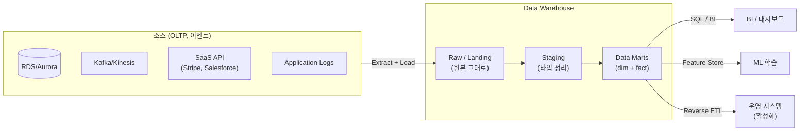

## 정의

**데이터 웨어하우스** (Data Warehouse, DW) 는 *여러 운영 시스템에서 흘러 들어온 이력 데이터를 통합해, 대규모 분석 쿼리를 빠르게 실행하도록 최적화된 중앙 저장소*. 트랜잭션 처리 (OLTP) 가 아니라 *의사결정 지원* (OLAP, BI, 리포팅, ML 특징 엔지니어링) 이 목적.

Bill Inmon (1990) 정의: *주제 지향 (subject-oriented), 통합 (integrated), 시변 (time-variant), 비휘발성 (non-volatile) 데이터 컬렉션*.

## 왜 필요한가

운영 DB ([[postgresql|PostgreSQL]], [[aws-rds|RDS]], MySQL) 를 그대로 분석에 쓰면 문제가 쌓임:

- **OLTP 최적화**: row-based 저장, 인덱스는 point-lookup 위주 -> `SELECT SUM(x) FROM huge_table GROUP BY y` 가 초 단위 -> 시간 단위로 느려짐
- **자원 경합**: 분석 쿼리가 트랜잭션을 락, latency spike
- **스키마 분산**: 서비스별 DB 가 나뉘어 있어 join 이 불가능
- **이력 부족**: 운영 DB 는 최신 상태만, 과거 시점 재구성이 안 됨

DW 는 *분석 전용* 이라 다음을 뒤집음:

- *컬럼형 저장* (필요한 컬럼만 스캔)
- *압축* (컬럼 값이 비슷 -> 5-10배 압축)
- *병렬 실행 (MPP)* (수십/수백 노드로 분산 스캔)
- *append/bulk load 위주* (row-level update 는 거의 없음)
- *스키마 통합 + 시계열 보존* (fact + dimension 모델)

## OLTP vs OLAP

| 축 | OLTP | OLAP (DW) |
|:---|:---|:---|
| **목적** | 트랜잭션 처리 | 분석 / BI / ML |
| **저장 형식** | Row-based | Column-based |
| **쿼리 형태** | 소량 row 조회/갱신 | 대량 aggregation |
| **동시성** | 수천 사용자 point 쿼리 | 수십 분석가 heavy 쿼리 |
| **정규화** | 3NF (중복 최소화) | Denormalized (join 최소화) |
| **인덱스** | B-tree point-lookup | Zone map, min-max, columnar |
| **데이터 신선도** | 실시간 | 분/시간/일 단위 (배치) |
| **변경 빈도** | Row 단위 UPDATE 자주 | Bulk INSERT/APPEND 위주 |
| **트랜잭션** | ACID 필수 | 배치 로드 후 read-only 가까움 |
| **대표 예** | [[postgresql|Postgres]], MySQL, [[dynamodb\|DynamoDB]] | [[aws-redshift\|Redshift]], BigQuery, Snowflake |

## 아키텍처 계층



- **Raw / Landing**: 소스 그대로. 재처리 가능하도록 원본 보존
- **Staging**: 타입 캐스팅, dedup, timestamp 표준화
- **Marts / Curated**: 비즈니스 도메인별 dimension + fact 테이블. 소비자가 직접 쿼리

## 데이터 모델링 방법론

### Kimball (Dimensional / Star Schema)

*업무 프로세스 중심* 으로 fact 테이블 + 주변 dimension 테이블. Bottom-up.

```
       dim_date            dim_product
          │                     │
          └─────► fact_sales ◄──┘
                     │
                     ▼
                dim_customer
                     │
                     ▼
                 dim_store
```

- **Fact table**: 이벤트/측정 (수량, 금액). 좁고 길다 (많은 row).
- **Dimension table**: 컨텍스트 (누가, 무엇을, 언제, 어디서). 넓고 짧다.
- **Grain**: fact 한 행이 무엇을 의미하는지 (한 주문 line, 한 클릭 등) 명확히 정의.
- **SCD (Slowly Changing Dimension)**: Type 1 (overwrite), Type 2 (버전), Type 3 (이전 값 컬럼) 등.

*쉬운 SQL, BI 도구 친화* -> 사실상 산업 표준.

### Inmon (Corporate Information Factory)

*전사 통합 3NF 모델 (EDW)* 을 먼저 만들고, 그 위에 부서별 mart 를 파생. Top-down.

- **엄격한 통합**: 회사 전체 개념 하나의 스키마
- **느린 구축**: 몇 년 걸림
- **일관성 최우선**: 규제 산업 (금융/보험) 에 어울림

### Data Vault 2.0

Hub (business key) + Link (관계) + Satellite (속성 변경 이력) 3 컴포넌트.

- 소스 시스템 변화에 강함
- 감사/이력 추적이 first-class
- 쿼리는 복잡 -> 소비 계층에서 star schema 로 pivot

**현대 실무**: raw/staging 은 Data Vault 스타일, 소비 계층은 Kimball star schema 조합이 많음.

## DW vs Data Lake vs Data Lakehouse

| 축 | Data Warehouse | Data Lake | Data Lakehouse |
|:---|:---|:---|:---|
| **저장** | 구조화 (컬럼형) | 원본 파일 ([[apache-parquet]], JSON, CSV) | 원본 파일 + 트랜잭션 메타 |
| **스키마** | Schema-on-write | Schema-on-read | 둘 다 |
| **엔진** | 자체 SQL (Redshift, BigQuery) | 다양 (Athena, Spark) | Delta Lake, Iceberg, Hudi |
| **워크로드** | BI, SQL 분석 | ML, batch, 로그 원본 | BI + ML 통합 |
| **비용** | 저장 비쌈, 쿼리 저렴 | 저장 매우 저렴 ([[aws-s3\|S3]]), 쿼리 유료 | 중간 |
| **트랜잭션** | ACID | 없음 | ACID (Iceberg/Delta/Hudi) |
| **거버넌스** | 성숙 | 어려움 ("data swamp") | 개선됨 |
| **대표** | [[aws-redshift\|Redshift]], Snowflake, BigQuery | S3 + [[aws-athena\|Athena]] + [[aws-glue\|Glue]] | Databricks, Iceberg on S3 |

*Lakehouse* 는 lake 의 저비용 + warehouse 의 트랜잭션/거버넌스를 결합하려는 시도. 2020 이후 표준 방향.

## 주요 관리형 데이터 웨어하우스

| 제품 | 특징 | 강점 | 약점 |
|:---|:---|:---|:---|
| **[[aws-redshift\|Amazon Redshift]]** | PostgreSQL 기반 MPP, RA3 + Serverless | AWS 통합, [[aws-redshift-spectrum\|Spectrum]], [[aws-glue\|Glue]] 연계 | AWS 락인 |
| **Google BigQuery** | Serverless, Dremel 기반 | 인프라 걱정 없음, 스토리지/쿼리 분리 과금 | GCP 락인 |
| **Snowflake** | Multi-cloud, virtual warehouse | UX 우수, 데이터 공유 | 벤더 비용 |
| **Azure Synapse** | Azure 통합 | Power BI 연계 | 성숙도 |
| **Databricks SQL** | Delta Lake + Photon | Lakehouse, ML 통합 | 세팅 필요 |
| **ClickHouse** | 오픈소스 컬럼 DB | 초고속, 셀프 호스팅 | 관리 부담 |
| **DuckDB** | 임베디드 OLAP | 로컬/노트북 분석 | 단일 노드 |

## 컬럼형 저장이 빠른 이유

```
Row-based:
  [row1: col1, col2, col3, col4, ..., col50]
  [row2: col1, col2, col3, col4, ..., col50]
  → SELECT AVG(col3) 도 전체 row 를 읽어야 함

Column-based:
  [col1: v1, v2, v3, ..., vN]
  [col2: v1, v2, v3, ..., vN]
  [col3: v1, v2, v3, ..., vN]    ← 이 컬럼만 스캔
  → I/O 가 필요한 컬럼만
```

**추가 이득**:
- **압축**: 같은 컬럼 값의 카디널리티가 낮음 -> RLE, Dictionary, Delta 등으로 5-10배 압축
- **SIMD**: 같은 타입이 연속 -> CPU 벡터 명령
- **Zone map / min-max**: 블록 skip
- **Late materialization**: 필터 통과한 row 만 실제 조합

자세히: [[apache-parquet]] (파일 포맷), [[aws-redshift|Redshift]] (엔진 사례).

## 로딩 패턴

### 배치 [[etl]] / [[etl|ELT]]

가장 흔함. 시간/일 단위 배치.

```
[Source DB] ──dump──> [S3 raw] ──[aws-glue|Glue] transform──> [DW]
```

### CDC (Change Data Capture)

소스 DB 의 WAL/binlog 을 스트림으로 수신, 거의 실시간 반영.

- Debezium, AWS DMS, [[aws-redshift|Redshift]] Zero-ETL
- 지연: 초 단위
- 부하: 소스 DB 에 로그 리더 프로세스

### 스트리밍 인제스션

Kafka, Kinesis 에서 직접 DW 로 append.

- [[aws-redshift|Redshift]] Streaming Ingestion, Snowpipe Streaming, BigQuery Storage Write API
- Materialized view 로 auto-aggregate

### Reverse ETL

DW 에서 계산된 지표를 다시 SaaS/운영 시스템으로 push (Hightouch, Census).

## 성능 최적화의 축

1. **파티셔닝 / 정렬 키**: filter predicate 컬럼으로 물리 분리 -> 블록 skip
2. **분산 키** (MPP): join 키가 같은 노드에 -> shuffle 제거
3. **파일 포맷**: [[apache-parquet]] / ORC (컬럼형, 통계, 압축)
4. **파일 크기**: 128 MB ~ 1 GB 권장. 작은 파일 수천 개 = *small files problem*
5. **압축 encoding**: 컬럼별 특성에 맞는 코덱
6. **Materialized view / pre-aggregation**: 반복 쿼리를 미리 계산
7. **Result cache**: 같은 쿼리 결과 재사용
8. **Concurrency scaling**: 읽기 부하 시 클러스터 자동 확장

## 데이터 품질 & 거버넌스

DW 는 "회사의 단일 진실 (Single Source of Truth)" 목표. 품질/거버넌스 없으면 *data swamp*.

- **Data contracts**: 소스와 target 간 스키마/의미 합의
- **Lineage**: 컬럼 값이 어디서 왔는지 추적 ([[aws-glue|Glue]] Data Catalog, dbt docs)
- **Testing**: dbt test, Great Expectations, Soda 로 not null / unique / accepted values 검증
- **Access control**: 컬럼/row 단위 접근 (Redshift RLS, BigQuery column-level security)
- **PII 관리**: KMS 암호화, 마스킹, tokenization
- **Cost governance**: 사용자별 쿼리 한도, workgroup 예산 알림

## 함정

> [!WARNING]
> **DW 를 운영 DB 로 쓰면 재앙**. Row-level UPDATE/DELETE 가 느리고 비쌈. 트랜잭션 워크로드는 [[postgresql|Postgres]] 같은 OLTP 로.

> [!CAUTION]
> **`INSERT` 한 행씩** = MPP 의 최악의 워크로드. 항상 bulk load (COPY, [[apache-parquet|Parquet]] batch).

> [!WARNING]
> **정규화 그대로 이식** = star schema 없이 3NF 를 DW 에 넣으면 join 지옥. Kimball 스타일로 denormalize.

> [!IMPORTANT]
> **schema-on-read 만 믿지 말 것**. Data lake 에 원본만 넣고 스키마 안 잡으면 시간 지날수록 아무도 못 씀. Contract + validation 필수.

> [!CAUTION]
> **비용 폭탄 3대 원인**: `SELECT *`, 파티션 없는 스캔, 작은 파일 수천 개. [[aws-athena|Athena]] / [[aws-redshift-spectrum|Spectrum]] 은 스캔량 과금이라 특히.

> [!WARNING]
> **DW 는 단일 진실이 아니라 "합의된 진실"** 이다. 소스 시스템의 semantics 를 명시적으로 문서화하지 않으면 지표가 팀마다 달라짐.

## 관련 위키

- [[apache-parquet]] - DW/lake 의 사실상 표준 파일 포맷
- [[etl]] - DW 로 데이터를 넣는 파이프라인
- [[aws-redshift|AWS Redshift]] - AWS 관리형 DW
- [[aws-redshift-spectrum|Redshift Spectrum]] - S3 데이터 직접 쿼리
- [[aws-athena|Amazon Athena]] - Serverless 쿼리 엔진
- [[aws-glue|AWS Glue]] - ETL + Data Catalog
- [[aws-s3|AWS S3]] - Data lake 저장소
- [[aws-s3-glacier|S3 Glacier]] - DW 콜드 아카이빙
- [[postgresql|PostgreSQL]] - OLTP 대비 (Redshift 원류)
- [[sharding-vs-partitioning|샤딩 vs 파티셔닝]] - 분산 저장 원리
