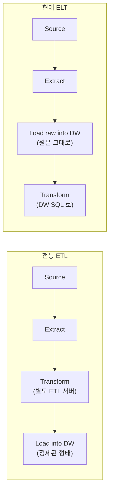
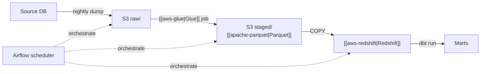
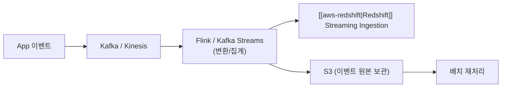

## 정의

**ETL** = **Extract** (추출) + **Transform** (변환) + **Load** (적재). 여러 소스에서 데이터를 뽑아 정제한 뒤 [[data-warehouse|데이터 웨어하우스]] 에 저장하는 파이프라인.

**ELT** 는 순서를 바꿔서 원본 그대로 warehouse 에 먼저 적재하고, warehouse SQL 로 변환. 현대 클라우드 DW ([[aws-redshift|Redshift]], BigQuery, Snowflake) 의 컴퓨트가 강력해지면서 사실상 표준이 됨.

## 3단계

### 1. Extract (추출)

소스 시스템에서 데이터 읽기.

| 소스 유형 | 예시 | 추출 방식 |
|:---|:---|:---|
| 관계형 DB | [[postgresql\|Postgres]], MySQL, [[aws-rds\|RDS]] | JDBC full/incremental, CDC (WAL/binlog) |
| NoSQL | [[dynamodb\|DynamoDB]], [[mongodb\|MongoDB]] | Streams, snapshot |
| SaaS API | Salesforce, Stripe, Zendesk | REST API + pagination |
| 파일 | CSV, JSON, [[apache-parquet\|Parquet]] on [[aws-s3\|S3]] | Object listing + read |
| 이벤트 스트림 | Kafka, Kinesis | Consumer group |
| 로그 | Application logs | Fluent Bit, CloudWatch subscription |

**추출 방식**:
- **Full**: 매번 전체 (작은 테이블)
- **Incremental (updated_at)**: `WHERE updated_at > last_run`
- **CDC (Change Data Capture)**: WAL/binlog 스트림 -> 거의 실시간
- **Snapshot + delta**: 주기적 full + 그 사이 CDC

### 2. Transform (변환)

원본을 사용 가능한 형태로 정제.

- **Cleaning**: null 처리, 이상치 제거, dedup
- **Type casting**: 문자열 -> DATE/NUMERIC 등
- **Standardization**: timezone UTC, currency, unit
- **Enrichment**: 다른 소스 join, geolocation lookup
- **Aggregation**: hourly/daily rollup
- **Denormalization**: [[data-warehouse|DW]] star schema 형태로 flatten
- **Anonymization**: PII 마스킹, hashing

### 3. Load (적재)

Target 시스템 (DW, 데이터 마트, 검색 인덱스, 특징 저장소) 에 씀.

- **Bulk COPY**: [[aws-redshift|Redshift]] `COPY`, Snowflake `COPY INTO`, BigQuery `LOAD DATA`
- **Upsert (MERGE)**: SCD 관리
- **Append-only**: 이벤트 로그, immutable fact
- **Overwrite partition**: 하루치 재처리 시 파티션 단위 삭제 후 재적재

## ETL vs ELT



| 축 | ETL | ELT |
|:---|:---|:---|
| **변환 위치** | 별도 ETL 서버/엔진 | DW 내부 SQL |
| **DW 저장 데이터** | 정제된 최종본 | Raw + staging + 최종본 |
| **재처리** | 파이프라인 다시 실행 (느림) | SQL 로 rebuild (빠름) |
| **스키마 유연성** | 사전 스키마 필요 | Schema-on-read 가능 |
| **DW 비용** | 저장 적음 | 저장 많음 (raw 유지) |
| **컴퓨트 비용** | ETL 서버 (별도) | DW 컴퓨트 사용 |
| **툴** | Informatica, Talend, SSIS, [[aws-glue\|Glue]] | dbt, Dataform, [[aws-redshift\|Redshift]] SQL, Snowflake |
| **적합** | 소스 데이터가 크고 DW 컴퓨트가 비쌀 때 | 클라우드 DW (탄력적 컴퓨트) |
| **디버깅** | 여러 시스템 걸침, 어려움 | DW 안에서 SQL, 쉬움 |

**현대 표준**: 클라우드 DW + dbt + Airflow/Dagster/Prefect. ELT 방향으로 옮겨감.

### 언제 ETL 이 여전히 맞나

- **PII 를 DW 에 저장하면 안 될 때** -> 로드 전 마스킹
- **소스 볼륨이 DW 저장/컴퓨트 대비 압도적으로 클 때** -> 미리 aggregate
- **DW 가 legacy on-prem 이고 확장이 어려울 때**

## 아키텍처 패턴

### 배치 파이프라인

가장 흔함. 시간/일 단위.



- **오케스트레이터**: Airflow, Dagster, Prefect, [[aws-step-functions|Step Functions]], Argo Workflows
- **실행 엔진**: Spark ([[aws-glue|Glue]]), Python, dbt
- **저장**: [[aws-s3|S3]] raw -> [[apache-parquet|Parquet]] staged -> [[aws-redshift|Redshift]] marts

### 스트리밍 파이프라인

거의 실시간 (초/분 단위).



- **엔진**: Apache Flink, Spark Structured Streaming, Kafka Streams, ksqlDB
- **딜리버리**: exactly-once (Flink checkpoints, Kafka transactions)
- **이슈**: late-arriving events, watermark, event time vs processing time

### Lambda / Kappa

- **Lambda**: 실시간 (speed) + 배치 (batch) 이중 파이프라인. 배치가 최종 진실.
- **Kappa**: 스트리밍 only. 재처리도 스트림 재실행.

현대는 Kappa 지향 (하나의 파이프라인).

### CDC 파이프라인

```
[Source DB WAL/binlog] -> Debezium -> Kafka -> Sink (DW / lake / cache)
```

- 소스 스키마 변경 -> 자동 propagation (설정에 따라)
- Sub-second 지연
- [[aws-redshift|Redshift]] Zero-ETL, DMS, Fivetran 등 매니지드 옵션

### Medallion Architecture (Bronze / Silver / Gold)

Databricks 가 대중화한 [[data-warehouse|Lakehouse]] 계층:

- **Bronze**: raw ingestion, 소스 형식 유지
- **Silver**: cleaned, deduped, enriched, join 가능한 상태
- **Gold**: business-level aggregates, BI 소비

Kimball 의 staging / core / mart 와 사실상 같은 개념.

## 오케스트레이션 도구

| 도구 | 특징 |
|:---|:---|
| **Apache Airflow** | Python DAG, 사실상 표준, 규모 크면 세팅 복잡 |
| **Dagster** | 자산 (asset) 중심, 강한 타입, dbt 통합 우수 |
| **Prefect** | Pythonic, 동적 워크플로우, 서버리스 옵션 |
| **[[aws-step-functions\|AWS Step Functions]]** | 서버리스, AWS 네이티브, 상태 머신 |
| **[[aws-glue\|AWS Glue]] Workflows** | Glue 내장, 단순 |
| **Argo Workflows** | Kubernetes 네이티브 |
| **Kestra** | YAML 선언형, 최근 성장 |
| **cron + Bash** | 초기 프로토타입만 |

## 변환 도구

### dbt (data build tool)

*ELT 의 T*. SQL SELECT 문 + Jinja 로 변환 로직을 버전 관리.

```sql
-- models/marts/fact_orders.sql
{{ config(materialized='incremental', unique_key='order_id') }}

SELECT
  o.order_id,
  o.customer_id,
  o.amount,
  o.created_at
FROM {{ ref('stg_orders') }} o

  WHERE o.updated_at > (SELECT MAX(updated_at) FROM {{ this }})

```

- 테스트 (unique, not null, accepted values) 코드로
- Lineage 자동 문서화 (`dbt docs`)
- 사실상 표준

### Spark ([[aws-glue|Glue]], Databricks, EMR)

*큰 변환*, semi-structured, ML 특징 엔지니어링.

### Pandas / [[pandas|pandas]] / Polars / DuckDB

*작은 배치*, 노트북, 프로토타입.

## 데이터 계약 (Data Contracts)

*소스 -> 파이프라인* 사이 스키마/의미 합의. 소스 팀이 스키마를 몰래 바꿔서 파이프라인이 조용히 깨지는 사고를 방지.

```yaml
# 예: user_signup 이벤트 계약
event: user_signup
owner: growth-team
schema:
  user_id: uuid
  email: string, PII
  signup_at: timestamp, utc
  source: enum[web, ios, android]
sla:
  freshness: 5min
  completeness: 99.9%
```

- Protobuf/Avro/JSON Schema 로 코드화
- CI 에서 소스 릴리즈 시 계약 검증
- 위반 시 배포 차단

## Idempotency & Reprocessing

파이프라인은 *같은 입력 -> 같은 출력* 이어야 안전한 재실행이 가능.

**핵심 기법**:
- **파티션 재작성** (`INSERT OVERWRITE` 하루치)
- **자연 키 기반 upsert** (`MERGE`)
- **Watermark** (스트리밍 late-arriving)
- **DAG 실행 ID** 로 stale write 방지

**Anti-pattern**: `INSERT ... SELECT` 를 재실행 -> 중복 축적.

## 데이터 품질 (Data Quality)

파이프라인의 실질적 신뢰도.

| 검증 종류 | 예시 |
|:---|:---|
| **Schema** | 컬럼 타입/개수 |
| **Not null** | 필수 컬럼 |
| **Unique** | 기본 키 |
| **Referential** | fact -> dim FK |
| **Range** | 나이 0-150, 금액 >= 0 |
| **Freshness** | 마지막 update 가 SLA 내 |
| **Completeness** | row 수 이전 배치 대비 -50% 이면 alert |
| **Distribution drift** | 값 분포가 급변하면 alert |

**도구**: dbt tests, Great Expectations, Soda, Monte Carlo, Bigeye.

## 관측성 (Data Observability)

파이프라인의 5가지 축:
1. **Freshness** - 마지막 갱신 시점
2. **Volume** - row 수
3. **Schema** - 스키마 변경
4. **Distribution** - 값 분포
5. **Lineage** - upstream/downstream 영향 범위

## AWS 에서의 ETL 구성

| 컴포넌트 | 선택지 |
|:---|:---|
| **Extract** | [[aws-glue\|Glue]] Crawler, DMS (CDC), Kinesis Firehose |
| **Store** | [[aws-s3\|S3]] (data lake), [[apache-parquet\|Parquet]] 권장 |
| **Transform** | [[aws-glue\|Glue]] Spark job, [[aws-athena\|Athena]] CTAS, [[aws-lambda\|Lambda]] (소규모), dbt on Redshift |
| **Load / Query** | [[aws-redshift\|Redshift]] COPY, [[aws-athena\|Athena]] on S3, [[aws-redshift-spectrum\|Spectrum]] |
| **Orchestrate** | [[aws-step-functions\|Step Functions]], MWAA (managed Airflow), EventBridge Scheduler |
| **Catalog** | [[aws-glue\|Glue]] Data Catalog |
| **Quality** | [[aws-glue\|Glue]] Data Quality (DQDL), Deequ |

## 함정

> [!WARNING]
> **한 파이프라인에 모든 로직 몰아넣기** = 재사용 불가. Extract, Transform, Load 를 태스크 단위로 분리하고 재시도/재실행이 각각 가능해야 함.

> [!CAUTION]
> **파이프라인 실패를 조용히 넘김** = 다운스트림이 stale 데이터로 오판. Freshness alert + SLA 필수.

> [!WARNING]
> **소스 스키마 변경 감지 안 함** = 컬럼 추가/제거/타입 변경 시 파이프라인이 오늘부터 다른 데이터를 만듬. 데이터 계약 + schema evolution 정책 필수.

> [!IMPORTANT]
> **재실행 불가능한 파이프라인** = 프로덕션 사고. `INSERT ... SELECT` 대신 `INSERT OVERWRITE PARTITION` 또는 `MERGE` 로 idempotent 하게 설계.

> [!CAUTION]
> **작은 파일 수천 개 생성** = [[apache-parquet\|Parquet]] 성능 붕괴 + [[aws-athena\|Athena]] / [[aws-redshift-spectrum\|Spectrum]] 비용 폭탄. Compact job 필수 (128 MB - 1 GB 파일 크기 target).

> [!WARNING]
> **PII 를 raw 로 DW 에 로드** = 규제 위반. 로드 전 masking / tokenization, 또는 정책 기반 컬럼 접근 제어.

> [!WARNING]
> **Airflow 의 `execution_date` 혼동** = "실행 시각" 이 아니라 "이 실행이 처리하는 논리 시각" (interval start). 미리 알아두지 않으면 하루 어긋난 데이터가 나옴.

## 관련 위키

- [[data-warehouse|Data Warehouse]] - ETL 의 target
- [[apache-parquet|Apache Parquet]] - 중간/최종 저장 포맷
- [[aws-glue|AWS Glue]] - AWS 관리형 ETL
- [[aws-athena|Amazon Athena]] - S3 데이터 SQL 쿼리
- [[aws-redshift|AWS Redshift]] - AWS 관리형 DW
- [[aws-redshift-spectrum|Redshift Spectrum]] - S3 직접 쿼리
- [[aws-s3|AWS S3]] - Data lake 저장소
- [[aws-s3-glacier|S3 Glacier]] - 원본 장기 보관
- [[aws-lambda|AWS Lambda]] - 이벤트 기반 소규모 변환
- [[aws-step-functions|AWS Step Functions]] - 서버리스 오케스트레이션
