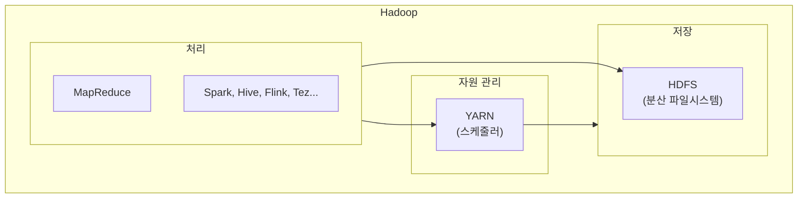
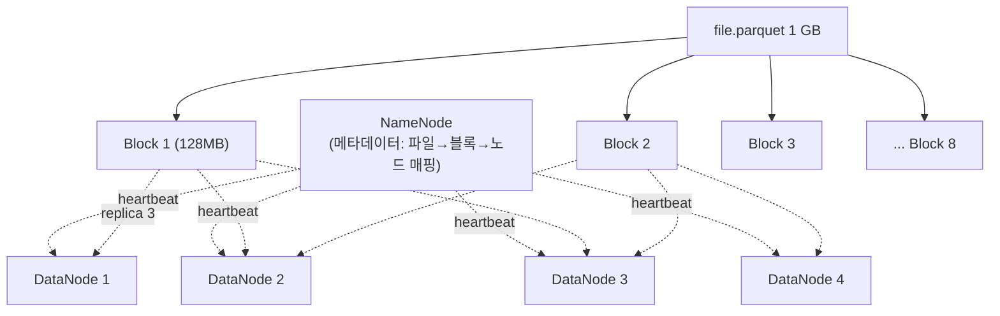
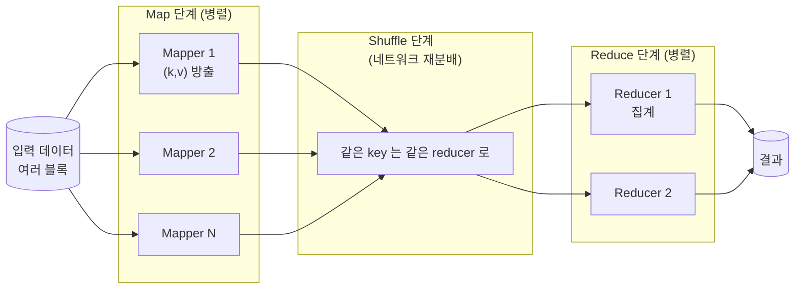
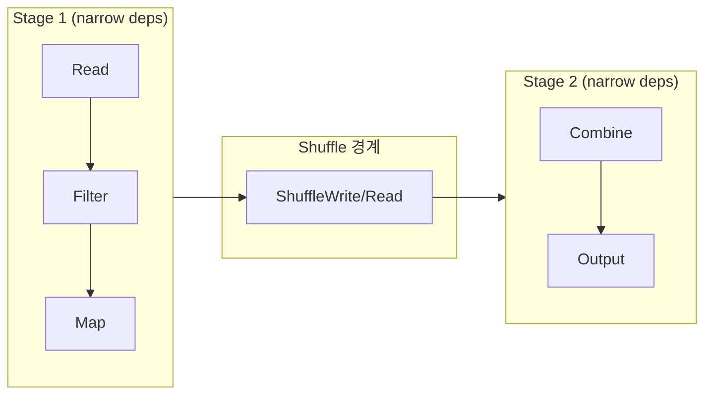
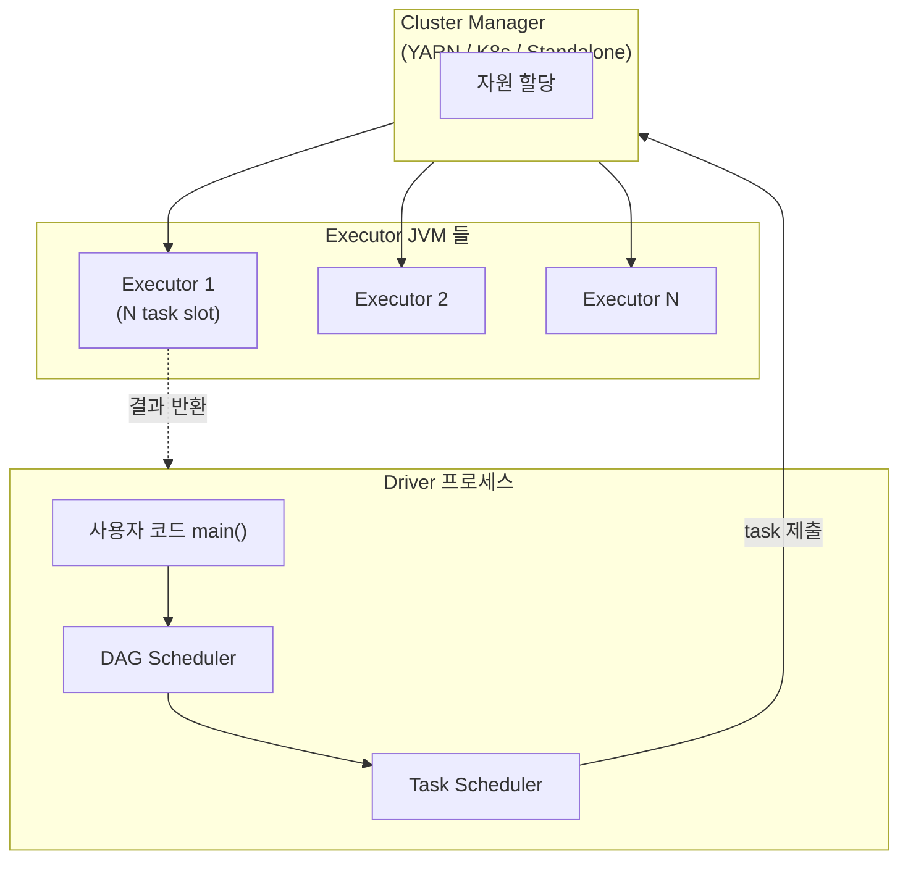

## 정의

**Hadoop** 은 *2006 야후에서 시작된 분산 저장 + 분산 처리 오픈소스 플랫폼*. Google 이 2003-2004 년에 발표한 **GFS** (분산 파일시스템) 와 **MapReduce** (분산 처리 모델) 논문을 오픈소스로 구현한 것이 출발점.

**Spark** 는 *2009 UC Berkeley AMPLab 에서 시작된 인메모리 분산 처리 엔진*. MapReduce 의 디스크 I/O 병목을 해결하기 위해 **RDD** (Resilient Distributed Dataset) 개념을 도입해 반복 계산에서 **10-100 배 빠른 성능** 을 제공.

두 시스템 모두 *단일 서버로 처리 불가능한 규모의 데이터* 를 여러 서버로 나눠 처리하는 것이 목적. 오늘날 [[data-lake|데이터 레이크]] / [[data-warehouse|데이터 웨어하우스]] 위의 대규모 처리 엔진은 대부분 이 두 계보를 잇는다.

## Hadoop 의 두 축

Hadoop 은 원래 **저장 (HDFS)** + **처리 (MapReduce)** 두 컴포넌트로 시작. 이후 **YARN** (자원 관리) 이 분리되어 3 요소가 됨.



### HDFS (Hadoop Distributed File System)

파일을 **고정 크기 블록** (기본 128 MB) 으로 나눠 여러 노드에 분산 저장 + 복제.



**핵심 특성**:
- **큰 블록 (128 MB 기본)**: 파일당 블록 수 감소 -> NameNode 부담 감소, sequential I/O 최적
- **복제 계수 3** (기본): 노드/랙/데이터센터 장애에 대비
- **Write-Once-Read-Many**: append 만 가능, 임의 수정 불가 (log-structured 사고)
- **Rack awareness**: 복제본을 다른 랙에 분산 (물리 장애 격리)

**한계**:
- **NameNode 는 단일 지점 병목** (HA 로 완화)
- **작은 파일 다수** 는 부적합 (파일당 블록 오버헤드)
- **저지연 요구** (< 100 ms) 부적합 (배치 지향)

클라우드 시대에는 [[aws-s3|S3]] 같은 객체 저장소가 사실상 HDFS 를 대체 ([[aws-emr|EMR]] 은 EMRFS 로 S3 를 HDFS 처럼 접근).

### MapReduce

*큰 데이터를 작은 조각으로 나눠 병렬 처리 -> 결과를 합치는* 프로그래밍 모델. Google 이 2004 년에 발표.



**예: WordCount**

```
Map:    "hello world" → [("hello", 1), ("world", 1)]
Shuffle: 같은 word 를 같은 reducer 로 보냄
Reduce: [("hello", 1), ("hello", 1), ...] → ("hello", 42)
```

**MapReduce 의 한계** (Spark 등장의 이유):
- **단계마다 디스크 write** (Map 결과 -> disk -> Shuffle -> disk -> Reduce)
- **반복 알고리즘** (ML 학습, PageRank) 이 매우 느림 (매 iteration 마다 디스크 왕복)
- **표현력 제한** (map + reduce 로 표현 어려운 알고리즘 다수)

### YARN (Yet Another Resource Negotiator)

*컴퓨트 자원 (CPU, 메모리) 을 여러 애플리케이션에 분배* 하는 스케줄러. Hadoop 2.x 부터 MapReduce 로부터 분리.

**구성**:
- **ResourceManager** (마스터): 전체 자원 스케줄링
- **NodeManager** (워커): 각 노드의 컨테이너 관리
- **ApplicationMaster** (앱별): 애플리케이션의 태스크 조율

YARN 위에서 MapReduce, Spark, Flink, Hive 등이 함께 실행 가능 -> Hadoop 이 *단일 처리 엔진이 아닌 플랫폼* 이 됨.

## Spark 의 등장

*"디스크 I/O 를 줄이자"* 가 핵심 통찰.

### RDD (Resilient Distributed Dataset)

Spark 의 원류 추상. *메모리에 분산 저장된 불변 컬렉션*.

**"Resilient" 의 의미**: 데이터 자체를 복제해서 저장하지 않고, *데이터를 만드는 계보 (lineage)* 만 저장. 노드 장애 시 lineage 를 다시 실행해 복구.

```
raw = sc.textFile("s3://.../logs")           # RDD 1
words = raw.flatMap(lambda l: l.split())      # RDD 2 (lineage: raw → flatMap)
counts = words.map(lambda w: (w, 1))          # RDD 3
result = counts.reduceByKey(lambda a, b: a+b) # RDD 4
result.saveAsTextFile("s3://.../out")         # Action
```

- **Transformation** (map, filter, join): 지연 실행 (lazy), lineage 만 기록
- **Action** (count, collect, save): 실제 실행 트리거

### DAG 스케줄러

Transformation 을 DAG (Directed Acyclic Graph) 로 표현 -> **stage** (shuffle 경계) 로 나눔 -> **task** 로 분해 -> executor 에서 병렬 실행.



- **Narrow dependency** (map, filter): 파티션 1 → 파티션 1 (shuffle X)
- **Wide dependency** (groupBy, join): 파티션 다수 → 파티션 재분배 (shuffle O)

Shuffle 이 성능 병목이므로 *shuffle 을 최소화* 하는 게 Spark 튜닝의 핵심.

### DataFrame / Dataset (2015+)

RDD 는 저수준. *Catalyst Optimizer* 가 최적화할 수 있도록 **스키마와 SQL 문법** 을 얹은 것이 DataFrame / Dataset.

```python
# RDD (저수준, 최적화 여지 없음)
raw.filter(lambda r: r[2] > 100).map(lambda r: (r[0], r[3]))

# DataFrame (Catalyst 가 파티션 프루닝, 컬럼 프루닝, predicate pushdown 자동)
df.select("id", "amount").filter("amount > 100")

# SQL (같은 최적화 자동)
spark.sql("SELECT id, amount FROM t WHERE amount > 100")
```

**Catalyst 가 자동으로**:
- Predicate pushdown ([[apache-parquet|Parquet]] statistics 활용)
- Column pruning
- Constant folding
- Join reordering
- Whole-stage code generation (Java bytecode 생성)

현대에는 **DataFrame API + SQL** 이 사실상 표준. RDD 는 직접 사용 드묾.

### 아키텍처



- **Driver**: 사용자 코드 실행, DAG 생성, 태스크 분배
- **Executor**: 실제 데이터 처리 (여러 task 동시 실행 = slot)
- **Cluster Manager**: 자원 할당 (YARN / [[aws-emr|EMR]] / K8s / Standalone)

### Spark 컴포넌트

Spark 는 *하나의 엔진* 위에 여러 상위 라이브러리 제공.

| 컴포넌트 | 용도 |
|:---|:---|
| **Spark Core** | RDD, DAG, 실행 엔진 |
| **Spark SQL** | DataFrame + SQL 쿼리 (Catalyst 최적화) |
| **Structured Streaming** | DataFrame API 로 스트리밍 (micro-batch or continuous) |
| **MLlib** | 분산 머신러닝 (일부 알고리즘) |
| **GraphX** | 그래프 분석 (거의 사용 안 됨, GraphFrames 로 대체) |

## MapReduce vs Spark

| 축 | MapReduce | Spark |
|:---|:---|:---|
| **저장** | 단계마다 디스크 | 메모리 우선 (부족 시 디스크 spill) |
| **모델** | Map + Reduce 2 단계 | 임의 DAG (map, filter, join, groupBy, ...) |
| **속도** | 기준 | 10-100 배 (반복 알고리즘) |
| **API** | Java 위주 | Scala, Python, R, SQL, Java |
| **상호작용** | 배치 only | REPL / 노트북 (Zeppelin, Jupyter) |
| **스트리밍** | X (Storm 별도) | Structured Streaming |
| **ML** | Mahout 별도 | MLlib 내장 |
| **표현력** | 낮음 | 높음 (SQL, DataFrame, MLlib) |
| **디버깅** | 어려움 | Spark UI |

**결론**: 새 프로젝트는 사실상 **Spark**. MapReduce 는 레거시 유지만.

## 관리형 Spark / Hadoop

| 서비스 | 특징 |
|:---|:---|
| **[[aws-emr\|Amazon EMR]]** | Hadoop 생태계 완전 관리형, EC2/Serverless/EKS |
| **[[aws-glue\|AWS Glue]]** | 서버리스 Spark ETL |
| **Databricks** | Spark 창시자들의 상용, Delta Lake |
| **Google Dataproc** | GCP 관리형 |
| **Azure HDInsight / Synapse** | Azure |
| **자체 호스팅** | Cloudera, Hortonworks (인수 통합) |

## 언제 Spark 를 쓰나

**적합**:
- 수 GB ~ PB 규모 배치 처리
- ETL 파이프라인 (raw -> 정제)
- ML 특징 엔지니어링 + 학습
- 대규모 join / aggregation
- 반복 알고리즘 (K-means, GraphX, PageRank)
- 로그/이벤트 스트림 분석 (Structured Streaming)

**부적합 (더 나은 대안)**:
- 초저지연 (< 100 ms) 처리 -> [[aws-kinesis-data-analytics|Flink]] / Kafka Streams
- 트랜잭션 처리 -> [[postgresql|Postgres]] / OLTP DB
- 작은 데이터 (< 10 GB) -> pandas / DuckDB / Polars
- 단순 SQL 애드혹 -> [[aws-athena|Athena]] / [[aws-redshift|Redshift]]

## Spark 성능 튜닝의 큰 축

1. **파일 포맷**: [[apache-parquet|Parquet]] + ZSTD (CSV/JSON 대비 10-100 배)
2. **파티셔닝**: partition 컬럼으로 프루닝
3. **Shuffle 최소화**: `repartition` 남용 X, broadcast join 활용
4. **Broadcast join**: 작은 테이블 (~ 100 MB) 을 executor 에 복제
5. **AQE (Adaptive Query Execution)**: 런타임 통계로 자동 최적화 (Spark 3.x 기본 on)
6. **Executor 크기**: 너무 크면 GC 문제, 너무 작으면 오버헤드 (경험적 4-8 core, 16-32 GB)
7. **Cache / Persist**: 반복 참조 데이터만
8. **Skew 처리**: Salting, AQE skew join

## 함정

> [!WARNING]
> **`collect()` 를 큰 데이터에** = Driver OOM. Driver 는 단일 JVM. 큰 결과는 `write` / `foreachPartition` 로.

> [!CAUTION]
> **Shuffle 남용**. `groupBy`, `join`, `distinct`, `repartition` 는 shuffle. Wide dependency 를 반복하면 성능 급락.

> [!WARNING]
> **작은 파일 (Small files) 수천 개** = task 수 폭증 + 스케줄링 오버헤드. Compaction 후 read.

> [!IMPORTANT]
> **UDF 는 Catalyst 최적화 우회**. 가능하면 built-in 함수 사용. Python UDF 는 특히 느림 (직렬화 오버헤드).

> [!CAUTION]
> **Skewed key** = 특정 task 만 오래 걸림 (전체가 그 task 에 blocked). AQE skew join 또는 salting.

> [!WARNING]
> **HDFS 는 클라우드에서 임시**. [[aws-emr|EMR]] 등에서 클러스터 종료 시 데이터 손실. 결과는 [[aws-s3|S3]] 에.

> [!IMPORTANT]
> **RDD 직접 사용 지양**. DataFrame / SQL 이 Catalyst 최적화 받아 훨씬 빠름. 특수한 경우만 RDD.

## 관련 위키

- [[mpp|MPP (대량 병렬 처리)]] - 다른 계보의 분산 처리
- [[data-warehouse|Data Warehouse]] - Spark 의 소비 대상
- [[data-lake|Data Lake]] - Spark 의 저장소
- [[apache-parquet|Apache Parquet]] - Spark 의 표준 포맷
- [[etl|ETL / ELT]] - Spark 의 대표 워크로드
- [[aws-emr|Amazon EMR]] - AWS 관리형 Hadoop/Spark
- [[aws-glue|AWS Glue]] - 서버리스 Spark ETL
- [[aws-athena|Amazon Athena]] - Trino 기반 SQL 대안
- [[aws-s3|AWS S3]] - HDFS 대체 저장소
