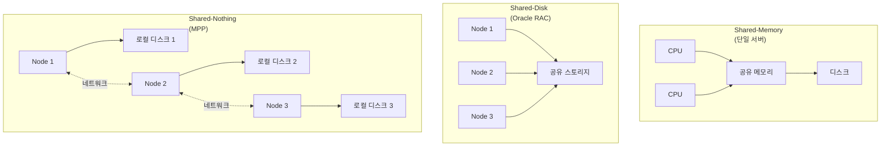
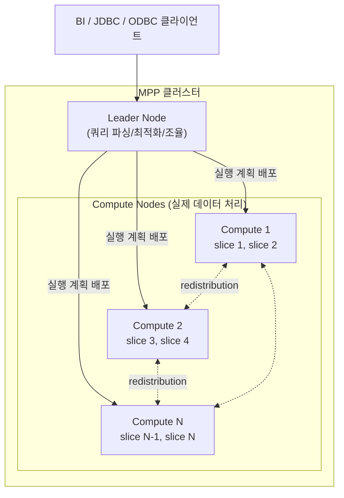
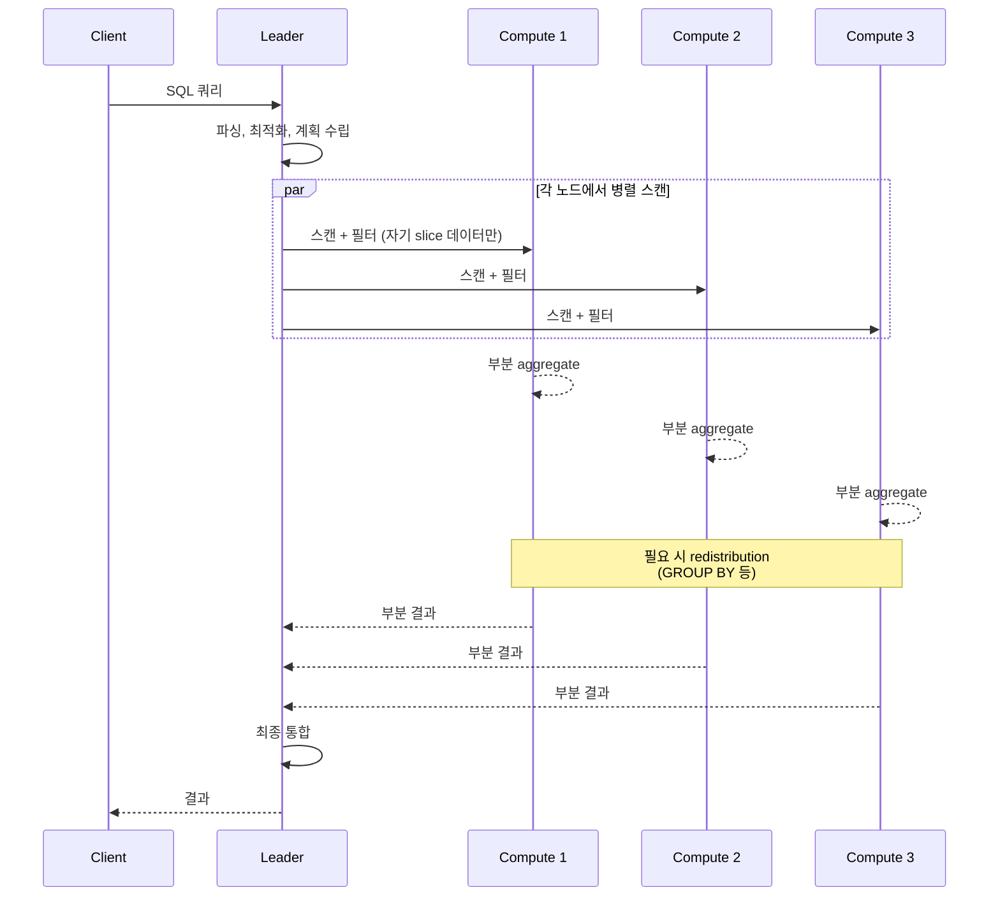
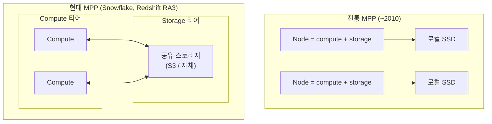

## 정의

**MPP** (Massively Parallel Processing, 대량 병렬 처리) 는 *하나의 대규모 쿼리를 수십 - 수백 노드에 나눠 동시에 실행하는 아키텍처*. 각 노드가 **자기 데이터 조각만** 처리한 뒤 결과를 통합. [[data-warehouse|데이터 웨어하우스]] 의 표준 아키텍처.

대표 시스템: [[aws-redshift|Amazon Redshift]], Snowflake, Google BigQuery, Teradata, Greenplum, Vertica, IBM Netezza, ClickHouse.

## 왜 MPP 인가

단일 서버 DB ([[postgresql|Postgres]], MySQL) 는 CPU / 메모리 / 디스크 자원이 한계. 100 억 행 aggregation 은 시간 단위로 느려짐.

**MPP 의 답**: *데이터를 여러 노드에 나눠 저장하고, 쿼리를 각 노드에서 병렬 실행*. 노드 100 개면 이론상 100 배 빠름 (실제로는 shuffle 오버헤드 등으로 낮음).

## 세 가지 분산 아키텍처

MPP 를 이해하려면 *분산 시스템의 세 축* 을 알아야 함.



| 축 | Shared-Memory | Shared-Disk | Shared-Nothing (MPP) |
|:---|:---|:---|:---|
| **자원** | CPU/메모리 공유 | 디스크 공유 | 각자 소유 |
| **확장** | Scale-up (단일 서버 강화) | Scale-out (제한적) | Scale-out (선형 확장) |
| **동시성** | 락 경합 | 락 경합 (분산 락) | 없음 (독립) |
| **장애 격리** | 서버 전체 다운 | 디스크 SPOF | 노드 하나만 |
| **네트워크 부담** | 없음 | 중간 | 큼 (shuffle) |
| **대표** | 단일 [[postgresql\|Postgres]] | Oracle RAC | Redshift, Snowflake |

**MPP 는 shared-nothing** = *각 노드가 자기 자원을 완전 소유*. 네트워크로만 통신. 노드 수를 늘리면 (거의) 선형으로 성능 증가.

## MPP 클러스터 구조

전형적인 MPP 는 **leader + compute** 로 구성.



### Leader Node

- 클라이언트 연결 종단
- SQL 파싱, 검증
- 쿼리 최적화 (통계 기반)
- 실행 계획을 compute node 에 배포
- 각 compute 의 부분 결과를 통합해 클라이언트에 반환
- **데이터를 직접 처리하지 않음** (조율만)

### Compute Node

- 실제 데이터 저장 + 처리
- 여러 **slice** (병렬 실행 단위) 로 분할 (노드당 코어 수 만큼)
- Leader 로부터 받은 실행 계획을 자기 slice 에서 실행
- 필요 시 다른 노드로 데이터 재분배 (**shuffle / redistribution**)

## 데이터 분산 전략 (Distribution)

MPP 의 성능은 *데이터를 어떻게 노드에 나눠놓았는가* 에 좌우.

### 1. Hash Distribution (Key)

특정 컬럼 값을 hash 해서 slice 결정.

```
customer_id 1  → hash → slice 3 (Node 2)
customer_id 42 → hash → slice 7 (Node 4)
```

**장점**: 같은 key 를 조인 시 **co-located join** (네트워크 이동 없음).

```sql
-- customers.customer_id 로 hash 분산
-- orders.customer_id 로 hash 분산
-- 같은 key -> 같은 slice -> 로컬 join
SELECT ... FROM customers JOIN orders ON customers.customer_id = orders.customer_id;
```

**단점**: **skew** (특정 key 에 몰림) 시 그 slice 만 과부하.

### 2. Round-Robin / EVEN

행을 순서대로 다음 slice 에 배정. 균등 분산.

**장점**: skew 없음, 완전 균등.
**단점**: 조인 시 항상 redistribute 필요.

**적합**: 조인 안 하는 fact table, 로그.

### 3. Replicated / ALL

*모든 노드에 같은 복사본*. 작은 dimension table 에.

**장점**: 어떤 fact table 과도 조인 시 redistribute 불필요.
**단점**: 저장 공간 N 배 (N = 노드 수).

**적합**: 수백만 행 이하 dimension (date_dim, product_dim).

### 4. Automatic

시스템이 데이터 크기 / 접근 패턴 기반으로 자동 선택. Redshift AUTO, Snowflake 자동 등.

## 쿼리 실행 흐름



**핵심 통찰**: *가능한 한 각 노드에서 부분 aggregate 를 먼저* 하고 (예: 각 노드에서 COUNT), 마지막에 leader 가 합침 (SUM of COUNTs). 이걸 못하면 모든 원본 데이터를 leader 로 모아야 함.

## Redistribution (Shuffle)

같은 join key 가 다른 노드에 있으면, 조인 전에 **네트워크로 재분배** 필요.

```
Case 1: co-located join (좋음)
  customer.customer_id = order.customer_id
  둘 다 customer_id 로 hash 분산 -> 같은 slice -> 로컬 join

Case 2: redistribute (나쁨)
  customer.customer_id = order.city
  order 를 customer_id 로 redistribute -> 네트워크 이동 -> 느림

Case 3: broadcast (dimension 작을 때)
  small dim × huge fact
  small dim 을 모든 노드에 복사 -> 각 노드에서 로컬 join
```

**Redistribution 이 성능 병목**. 실행 계획 (`EXPLAIN`) 에서 `DS_DIST_INNER`, `DS_BCAST_INNER` 등을 확인.

## MPP 의 강점

1. **선형 확장성**: 노드 2 배 -> 처리량 (거의) 2 배
2. **컬럼형 저장 최적**: 컬럼 단위로 압축 + 필요 컬럼만 스캔
3. **대규모 aggregation**: SUM, COUNT, GROUP BY 가 병렬로 나뉨
4. **분석 쿼리 특화**: OLAP 워크로드에 이상적

## MPP 의 한계

1. **작은 트랜잭션 부적합**: INSERT 한 행씩은 매우 느림 (bulk COPY 필요)
2. **JOIN 이 잘못 설계되면** 성능 급락 (redistribution 폭탄)
3. **데이터 skew** 에 취약 (한 slice 만 과부하)
4. **동시 사용자 한계** (leader 병목)
5. **비싼 노드**: 스토리지 + 컴퓨트가 결합 -> 확장 유연성 낮음

## 현대 MPP: Compute-Storage 분리

전통 MPP (Netezza, Teradata) 는 노드 안에 로컬 SSD/HDD 저장. Compute 를 늘리려면 스토리지도 함께.

**현대** (Snowflake 2015+, Redshift RA3, BigQuery) 는 **compute 와 storage 를 분리**.



**이점**:
- Compute 만 늘리기 / 줄이기 가능 (탄력적)
- 여러 워크로드가 같은 데이터 공유 (data sharing)
- 스토리지는 사실상 무한 (S3)
- 유휴 시 compute 만 종료 (비용 절감)

**대표 사례**:
- [[aws-redshift-serverless|Redshift Serverless]]: compute 완전 자동 스케일
- Snowflake: multi-cluster virtual warehouse
- BigQuery: 서버리스, slot 예약

## MPP vs Spark (분산 처리의 두 계보)

같은 "분산 대규모 처리" 지만 철학이 다름.

| 축 | MPP | [[hadoop-spark\|Spark]] |
|:---|:---|:---|
| **주 목적** | 분석 SQL 쿼리 | 임의 데이터 처리 (ETL, ML, 스트리밍) |
| **저장** | 자체 (컬럼형, 최적화) | 외부 ([[aws-s3\|S3]], HDFS) |
| **인터페이스** | SQL 중심 | DataFrame, RDD, SQL |
| **자원 모델** | 클러스터 고정 or 자동 | Executor 온디맨드 |
| **실행 모델** | Push-based (leader → compute) | DAG based, lazy |
| **최적화** | Cost-based optimizer (통계) | Catalyst (스키마 기반) |
| **적합** | BI, 대시보드, 반복 SQL | ETL, ML, 임시 대량 처리 |
| **대표** | Redshift, Snowflake | Databricks, [[aws-emr\|EMR]], [[aws-glue\|Glue]] |

**현대는 융합**: [[aws-redshift-spectrum|Redshift Spectrum]] 은 S3 (data lake) 쿼리, Databricks 는 Delta Lake + Photon (MPP 스타일 벡터화) -> **Lakehouse** 방향.

## 대표 MPP 시스템

| 시스템 | 특징 |
|:---|:---|
| **[[aws-redshift\|Amazon Redshift]]** | PostgreSQL 기반 MPP, RA3 (compute-storage 분리), Serverless |
| **Snowflake** | Multi-cloud, virtual warehouse, 데이터 공유 우수 |
| **Google BigQuery** | 서버리스, Dremel 기반, slot 모델 |
| **Databricks SQL** | Delta Lake + Photon (벡터화 엔진) |
| **Teradata** | 원조 MPP (1979-), 온프렘 대세 |
| **Greenplum** | 오픈소스 (PostgreSQL 기반, VMware Tanzu) |
| **Vertica** | 컬럼형 MPP, 광고/통신 산업 |
| **ClickHouse** | 오픈소스, 실시간 분석 특화, 매우 빠름 |
| **IBM Netezza** | 하드웨어 어플라이언스 원조 |
| **Firebolt** | 신생, 성능 강조 |

## 함정

> [!WARNING]
> **행 단위 INSERT/UPDATE** = MPP 의 최악의 워크로드. bulk load (COPY, [[apache-parquet|Parquet]] batch) 만.

> [!CAUTION]
> **분산 키 설계 실수** = redistribution 폭탄. 자주 조인하는 컬럼을 distribution key 로.

> [!WARNING]
> **데이터 skew** (특정 key 에 몰림) = 한 slice 만 과부하, 전체 쿼리가 그 slice 에 blocked. Cardinality 확인.

> [!IMPORTANT]
> **작은 dimension 을 hash 분산** 하면 조인마다 redistribute. ALL / replicated 로.

> [!CAUTION]
> **`SELECT *`** = 컬럼형의 이점 상실. 필요 컬럼만.

> [!WARNING]
> **동시 사용자 많음** = leader node 병목. Concurrency scaling / Serverless 로 완화.

> [!IMPORTANT]
> **MPP 는 OLTP 대체 X**. 트랜잭션 워크로드는 [[postgresql|Postgres]] 같은 OLTP DB. MPP 는 OLAP 전용.

## 관련 위키

- [[data-warehouse|Data Warehouse]] - MPP 의 주 응용
- [[hadoop-spark|Hadoop / Spark]] - 다른 분산 처리 계보
- [[aws-redshift|Amazon Redshift]] - AWS MPP DW
- [[aws-redshift-serverless|Redshift Serverless]] - MPP 서버리스
- [[apache-parquet|Apache Parquet]] - 컬럼형 저장 포맷
- [[sharding-vs-partitioning|샤딩 vs 파티셔닝]] - 분산 저장 원리
- [[postgresql|PostgreSQL]] - Shared-memory 대비
- [[aws-athena|Amazon Athena]] - Trino 기반 서버리스 대안
