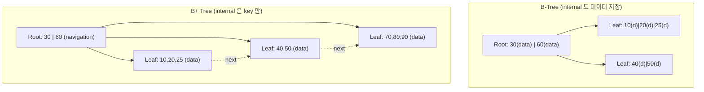
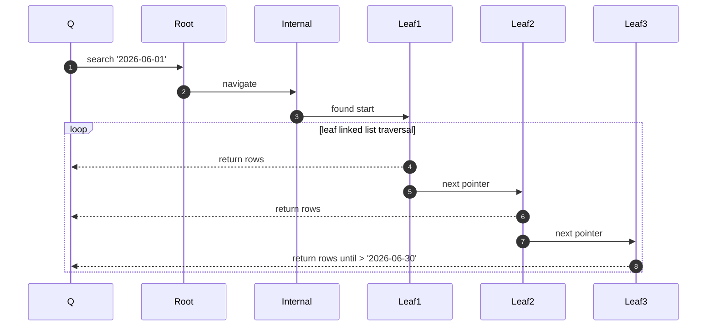
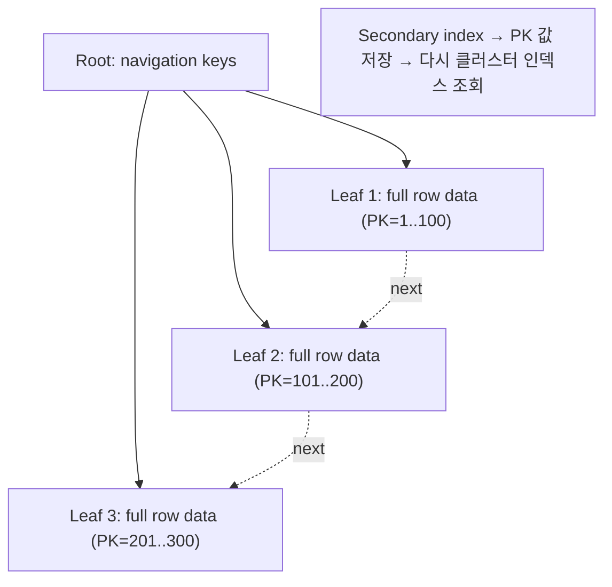
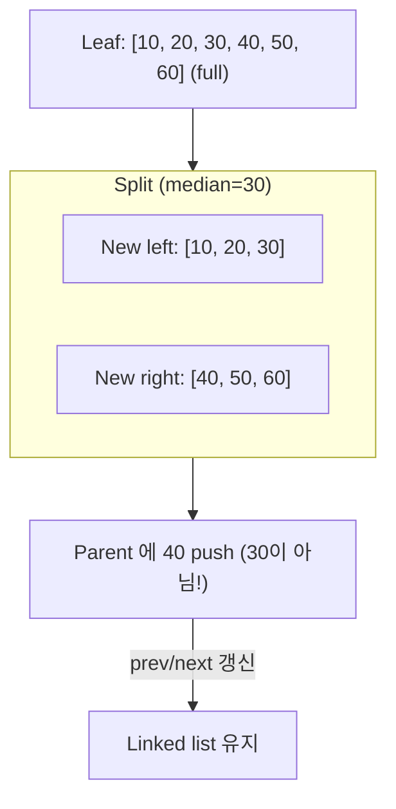
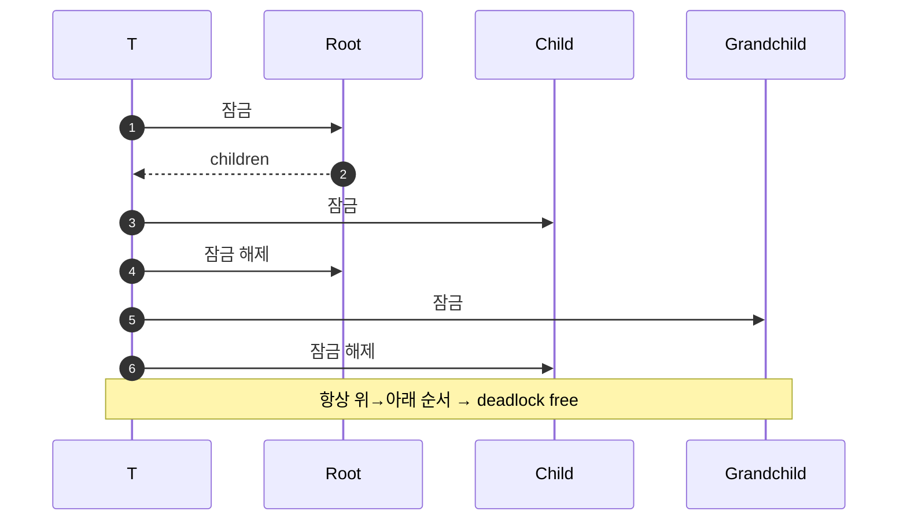

## 정의

**B+ Tree** = B-Tree 의 변형. *모든 데이터가 leaf 에만*, *internal node 는 navigation key만*. Leaf 들이 *linked list* 로 연결.

> [!IMPORTANT]
> *현대 RDB 의 표준 인덱스*. PostgreSQL, MySQL InnoDB, Oracle, SQL Server 모두 B+ Tree 기반.

## B-Tree vs B+ Tree



| | B-Tree | B+ Tree |
|---|---|---|
| Internal 에 데이터 | *예* | 아니오 (key 만) |
| Leaf 연결 (linked list) | 아니오 | *예* |
| Range scan | 각 노드 순회 | *linked list scan (빠름!)* |
| Fan-out | 작음 (data 도 저장) | *큼* (navigation key 만) |
| 트리 깊이 | 깊음 | *얕음* |
| Point lookup | *early exit 가능* | 항상 leaf 까지 |
| 공간 효율 | 나쁨 (중복) | 좋음 |

## Range Scan 의 우월성

```sql
SELECT * FROM orders WHERE created_at BETWEEN '2026-06-01' AND '2026-06-30';
```



> Leaf 만 순회 → *disk sequential I/O*. B-Tree 는 매번 root 부터 다시 시작해야 함.

## Clustered Index (InnoDB)

MySQL InnoDB 는 *Primary Key 의 B+ Tree leaf 가 실제 row 데이터*:



vs PostgreSQL 은 *heap 별도, 인덱스는 heap tuple ID 만*. 자세한 건 [[mysql-innodb]], [[postgresql]].

## Leaf Linked List

```
Leaf 1: [10, 20, 25] → Leaf 2: [40, 50] → Leaf 3: [70, 80, 90] → null
```

각 leaf 페이지 header:

```
- prev_leaf pointer
- next_leaf pointer
- n_keys
- keys[] + values[] (or row data)
```

> [!TIP]
> *Reverse range scan* 도 O(k). `prev_leaf` 로 역방향 순회.

## Fan-out 계산 (실전)

InnoDB 페이지 = 16KB:

```
Internal node fan-out:
  key (bigint 8B) + pointer (6B) = 14B
  16KB / 14B ≈ 1170 children

Height 계산:
  N = 10^9, fan-out = 1170
  h = ceil(log_1170(10^9)) ≈ 3
  → 3 disk read 로 도달!
```

## Split 알고리즘 (B+ Tree)



> **B+ Tree 는 중간 key 를 *복사* 해서 parent 에 push** (B-Tree 는 *이동*). Leaf 에도 유지되어야 range scan 가능.

## Sequential Insert 의 함정

```
PK = auto-increment (1, 2, 3, ...) 만 삽입
→ 항상 *마지막 leaf* 에만 삽입
→ 마지막 leaf 만 자꾸 split
→ tree 오른쪽으로 편향 성장
```

InnoDB 는 *change buffer* 로 완화. 다른 DB 는 *bulk load* 시 자동 balance.

## Random Insert 의 함정

UUID v4 primary key:

```
UUID_v4 = random
→ 매 insert 마다 *다른 leaf 페이지*
→ Cache miss + 페이지 분할 폭증
→ 쓰기 성능 5-10배 저하
```

**해결**:
- Auto-increment BIGINT (관계형 정통)
- ULID / UUID v7 (시간 순 정렬 가능)
- InnoDB: `innodb_autoinc_lock_mode` 조정

## Reverse Scan + ORDER BY DESC

```sql
SELECT * FROM orders ORDER BY created_at DESC LIMIT 10;
```

- B+ Tree 의 *leaf prev pointer* 로 마지막에서 역행.
- MySQL InnoDB 는 자동 지원.
- PostgreSQL 은 *reverse index* 옵션 (`CREATE INDEX ... DESC`).

## Concurrency: Latch Coupling



InnoDB, PG 모두 *latch coupling* 기본. 자세한 건 [[b-tree-internals]].

## Bulk Loading

```sql
COPY orders FROM '...' -- 대량 로드
```

B+ Tree 를 *bottom-up 으로 구축* (sort + fill):

1. 데이터 정렬 (외부 정렬).
2. Leaf 페이지 sequential fill (fillfactor 90%).
3. Internal 페이지 bottom-up 생성.

일반 insert 보다 *수배 빠름*.

## Fillfactor

```sql
CREATE INDEX idx_orders ON orders(id) WITH (fillfactor = 90);
```

- 90% = 페이지의 10% 여유. Insert 시 분할 지연.
- 100% = 쓰기 성능 저하 + 잦은 분할.
- Read-only 인덱스는 100% (공간 절약).

## 흔한 함정

> [!WARNING]
> 1. **UUID v4 PK** = 성능 킬러. UUID v7 / ULID / BIGINT.
> 2. **Fillfactor 100** = 쓰기 많은 테이블에서 분할 폭증.
> 3. **Descending index 안 만듦** = 자주 `ORDER BY x DESC` 하면 성능 손해.
> 4. **Multi-column index 순서 잘못** = *가장 선택도 높은* 컬럼을 앞으로.

## 관련 위키

- [[btree-indexing]]
- [[b-tree-internals]]
- [[r-tree]]
- [[mysql-innodb]]
- [[postgresql]]
