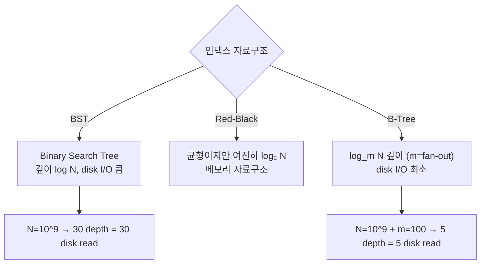
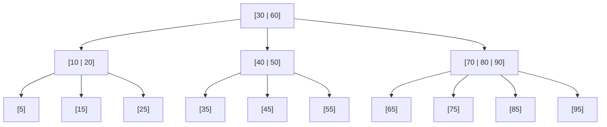
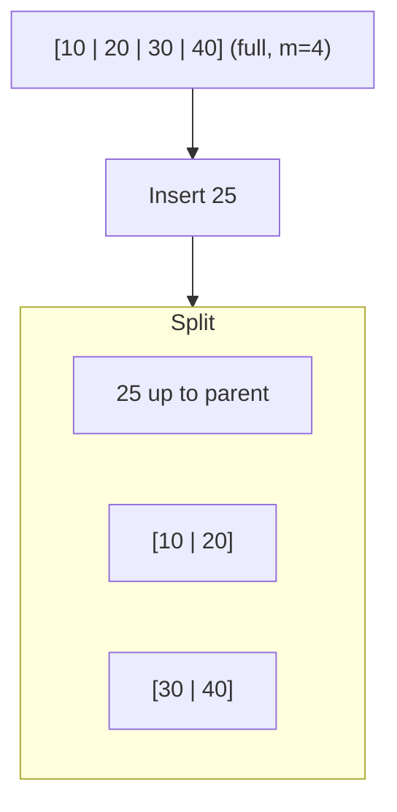
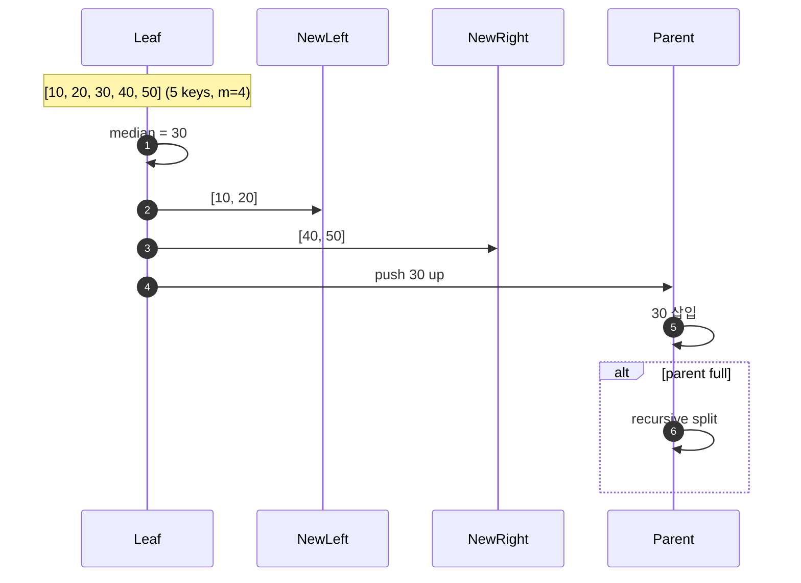
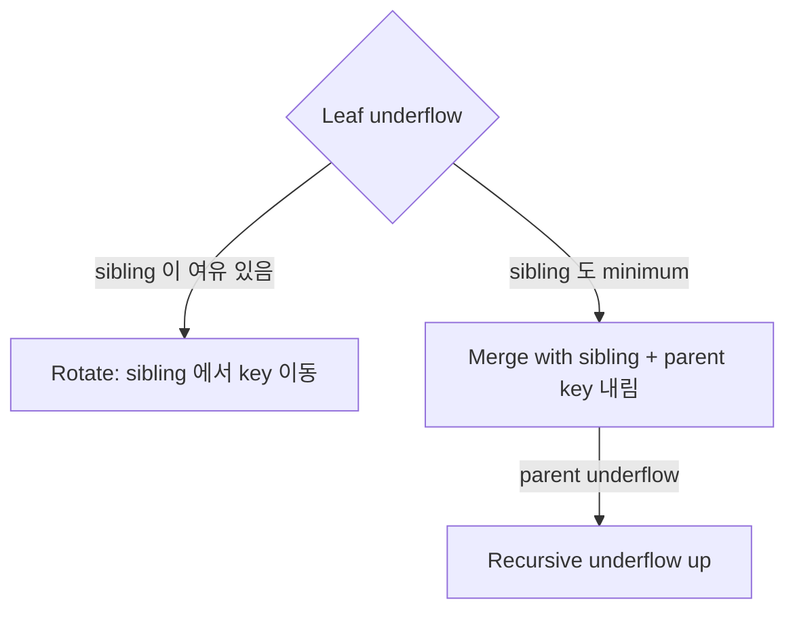
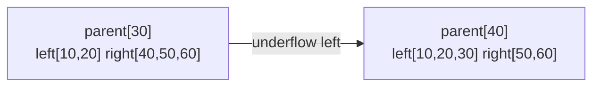
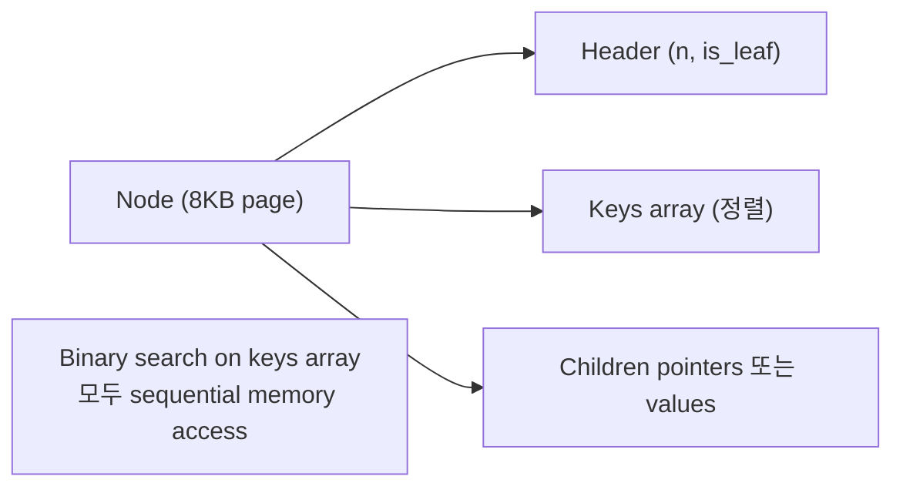
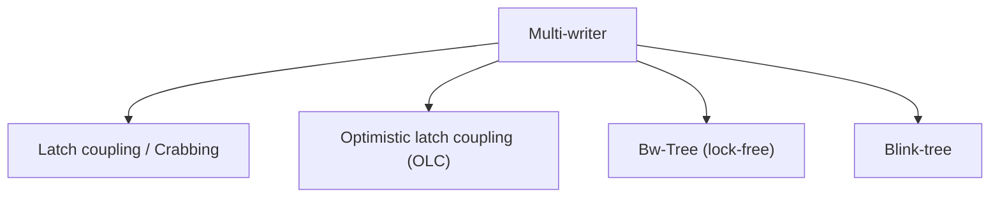

## 정의

**B-Tree** (Bayer & McCreight, 1972) = *디스크 I/O 최적화된 balanced multi-way search tree*. *모든 leaf 깊이 동일* + *노드당 큰 fan-out*.

기존 개요는 [[btree-indexing]] 참고. 본 페이지는 *내부 알고리즘* 에 집중.

## 왜 B-Tree?



**핵심**: *한 노드 = 한 disk page (8-16KB)*. Fan-out 이 크면 *깊이가 얕음* → I/O 최소.

## 정의 (Knuth)

*Order m* 인 B-Tree 는:

1. 모든 leaf 는 같은 깊이.
2. 각 노드 (root 제외) 는 *⌈m/2⌉-1 ~ m-1 keys*.
3. Root 는 *1 ~ m-1 keys*.
4. 각 internal node 는 *k+1 children* (k = keys).
5. 노드 내 keys 정렬됨.

## 구조 (Order 4 예)



## Search: O(log_m N)

```
search(root, key):
  node = root
  while node is not null:
    i = 0
    while i < node.n and key > node.keys[i]:
      i++
    if i < node.n and key == node.keys[i]:
      return node.values[i]   # HIT
    if node.is_leaf:
      return null              # MISS
    node = node.children[i]
```

각 노드에서 *binary search* (또는 linear if 노드 작음).

## Insertion + Split

새 key 삽입 → *leaf full 이면 split*:



```
insert(node, key):
  if node.is_leaf:
    insert_in_order(node.keys, key)
    if node.n > m-1:
      split(node)
  else:
    child = find_child(node, key)
    insert(child, key)
```

### Split (leaf full)



*중간값을 parent 로 push*. Root split 시 *tree 깊이 +1*.

## Deletion + Merge

Key 삭제 → *leaf 가 minimum (⌈m/2⌉-1) 미만* → *sibling 에서 빌리거나 merge*:



```
delete(node, key):
  if node.is_leaf:
    node.keys.remove(key)
    if node.n < ⌈m/2⌉ - 1:
      rebalance(node)
  else:
    # Internal: 후속자 (in-order successor) 로 교체 후 삭제
    successor = min_of_right_subtree(node, key)
    node.replace(key, successor)
    delete(right_child, successor)
```

## Rotation (borrow from sibling)



## Merge


## Height 분석

```
N keys, fan-out m
Height h:
  minimum: m^h - 1 keys
  → h = log_m(N)

N = 10^9, m = 100 → h ≈ 4.5 = 최대 5 disk read
```

## Cache-friendly 구현



*페이지 내부 = 배열 + binary search*. Cache miss 최소.

## 동시성 (Concurrency)



| 기법 | 의미 |
|---|---|
| **Latch coupling** | Parent lock 잡고 child lock, parent 해제. Deadlock 없음 |
| **Optimistic (OLC)** | Version 기반, 낙관적. 실패 시 재시도 |
| **Bw-Tree** (Microsoft) | Lock-free, delta record + consolidation |
| **Blink-tree** | Right-link pointer, split 중 lookup 가능 |

## PostgreSQL 특화

| 기법 | 의미 |
|---|---|
| **Nbtree** | PG 의 B-Tree (nbtree.c) |
| **HOT** (Heap Only Tuple) | 인덱스 update 안 하는 tuple 최적화 |
| **Duplicate deduplication** (PG 13+) | 중복 key 압축 저장 |
| **Bottom-up index deletion** (PG 14+) | HOT 실패 시 인덱스 정리 |

## 흔한 함정

> [!WARNING]
> 1. **Random insert 순서** = split 폭증. Sequential insert (auto-increment) 가 최적.
> 2. **UUID v4 primary key + B-Tree** = *random* → 페이지 분할 극심. ULID / UUID v7 (정렬 가능) 권장.
> 3. **Bloat** = MVCC 로 dead tuple 누적. `REINDEX CONCURRENTLY` 정기.
> 4. **Fan-out 계산** = column 폭 큰 index = 노드당 key 수 적음 = 트리 깊음. *포함할 컬럼 최소*.

## 관련 위키

- [[btree-indexing]] (개요)
- [[b-plus-tree-internals]]
- [[r-tree]]
- [[gin-index-deep]]
- [[postgresql]]
