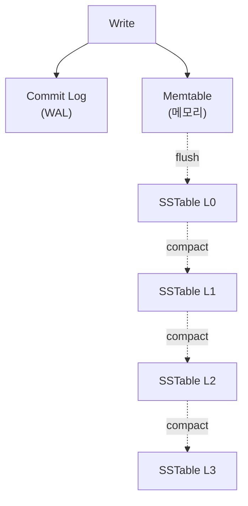
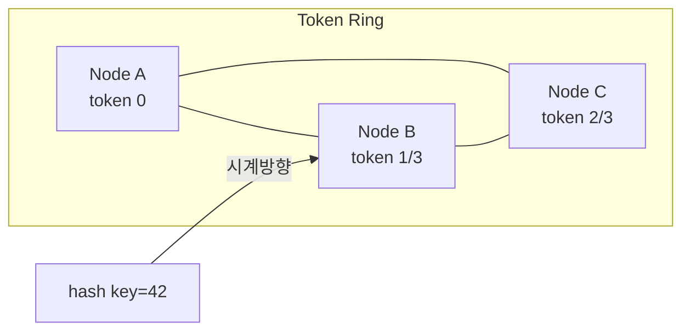
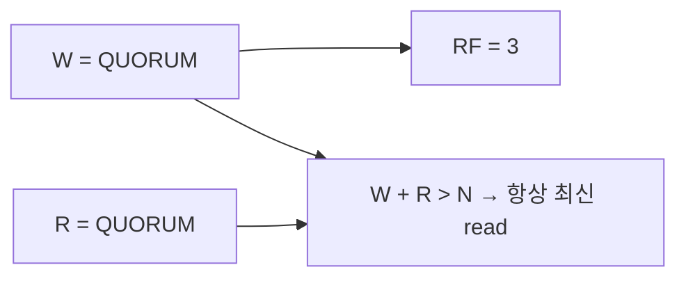
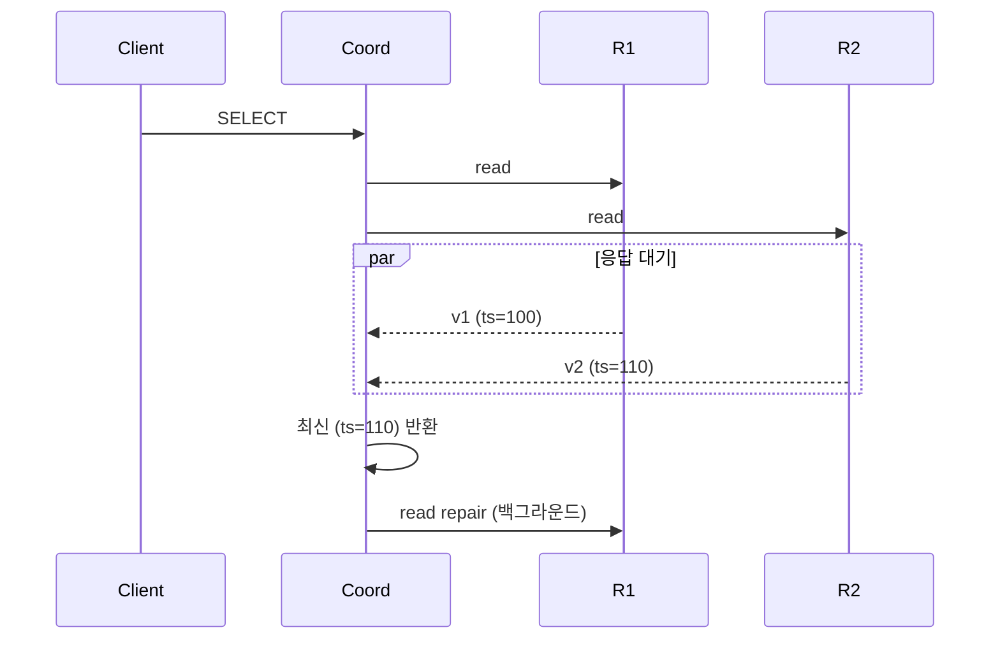
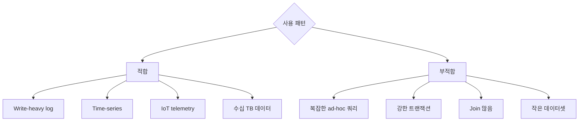
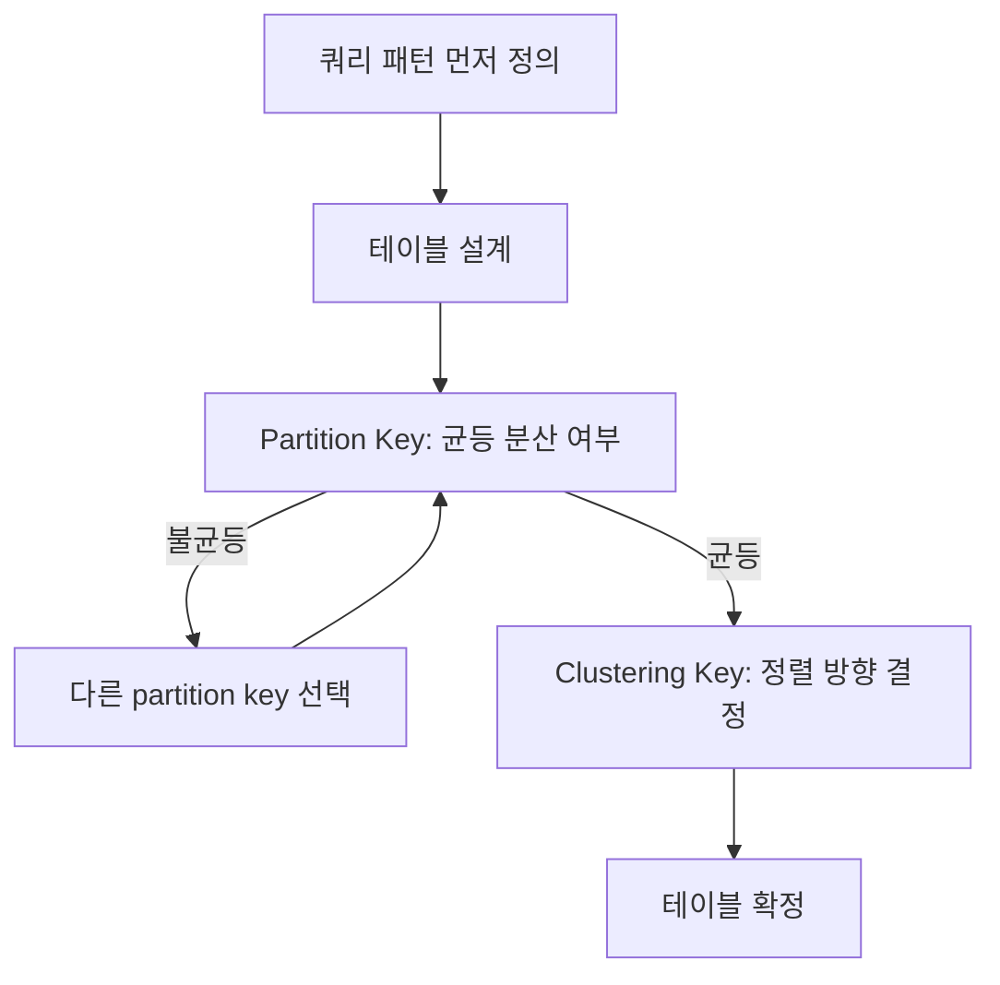
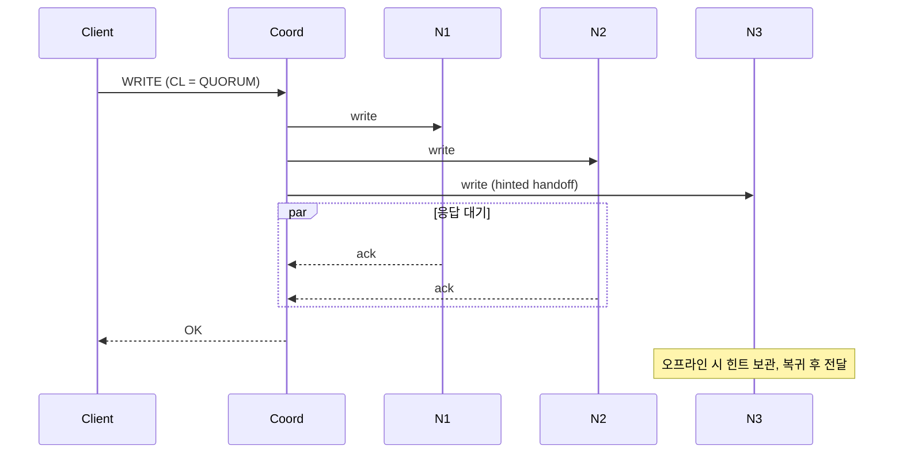

## 정의

**Apache Cassandra** = *마스터리스 (peer-to-peer) 분산 KV 스토어*. *write 우선*, *eventually consistent*, *수평 무한 확장*. 2008 Facebook 의 Dynamo + BigTable 결합.

**ScyllaDB** = Cassandra 호환 *C++ 재구현*. *10x throughput*.

## 핵심 특성

| | Cassandra |
|---|---|
| 토폴로지 | *peer-to-peer* (master 없음) |
| 일관성 | *튜닝 가능* (per query) |
| 스토리지 | *LSM-tree* (write-optimized) |
| 쿼리 언어 | *CQL* (SQL-like) |
| 인덱스 | primary key + secondary (제한) |
| Join | *없음* |
| 트랜잭션 | *제한적* (LWT, lightweight transaction) |

## LSM-Tree (Log-Structured Merge-Tree)



| 컴포넌트 | 의미 |
|---|---|
| **Commit Log** | WAL (crash recovery) |
| **Memtable** | 메모리 정렬 자료 |
| **SSTable** | 불변 정렬 파일 (디스크) |
| **Compaction** | SSTable 들을 *큰 SSTable 로 병합* |

```anim:external-merge-sort
{}
```

> 외부 정렬 머지의 일반 직관. LSM-tree 의 *compaction* 도 *level 들을 순차 머지*.

### LSM vs B-tree

| 항목 | B-tree | LSM |
|---|---|---|
| Write | *in-place* (random) | *append* (sequential) |
| Read | 1 lookup | *여러 SSTable 검색* |
| Write amplification | 작음 | 큼 (compaction) |
| Read amplification | 작음 | 큼 |
| 적합 | OLTP read-heavy | write-heavy, log-like |

## 클러스터 토폴로지



- *consistent hashing ring*.
- *N 개 노드*, *Replication Factor (RF)* 만큼 복제.
- *전체가 peer*. master 없음.

## Consistency Level (per query)

| Level | 의미 |
|---|---|
| `ANY` | 어떤 노드라도 응답 (write) |
| `ONE` | 1 노드 응답 |
| `TWO`, `THREE` | 2 / 3 노드 |
| `QUORUM` | 과반 (RF/2 + 1) |
| `LOCAL_QUORUM` | 같은 DC 안 과반 |
| `EACH_QUORUM` | 모든 DC 의 과반 |
| `ALL` | 모든 replica |

### Quorum 의 W + R > N 조건



> RF = 3, W = QUORUM (2), R = QUORUM (2). W + R = 4 > 3 → *최소 1 노드는 양쪽 모두 봄* → *strong consistency*.

## Read Path



> *Last-write-wins by timestamp*. *시계 어긋남* 이 *데이터 정정* 의 함정.

## CQL (Cassandra Query Language)

```sql
CREATE KEYSPACE shop
  WITH replication = { 'class': 'NetworkTopologyStrategy', 'dc1': 3 };

CREATE TABLE orders (
  user_id UUID,
  order_id TIMEUUID,
  total INT,
  status TEXT,
  PRIMARY KEY (user_id, order_id)
) WITH CLUSTERING ORDER BY (order_id DESC);

-- partition key = user_id, clustering key = order_id
SELECT * FROM orders WHERE user_id = ? AND order_id > ?;
INSERT INTO orders (user_id, order_id, total, status)
  VALUES (?, now(), ?, ?);
```

| 키 | 의미 |
|---|---|
| **Partition Key** | partition (노드) 결정 |
| **Clustering Key** | partition 안의 정렬 |

## LWT (Lightweight Transaction)

```sql
INSERT INTO users (id, email) VALUES (?, ?) IF NOT EXISTS;
UPDATE users SET email = ? WHERE id = ? IF email = ?;
```

- *Paxos 기반*. *4 round-trip*.
- *느림*. 가끔만 사용.

## 적합 / 부적합



## 흔한 함정

> [!WARNING]
> 1. **Secondary index 남용** = 거의 항상 *전체 노드 fan-out*. 모든 access pattern 에 *전용 테이블*.
> 2. **Tombstone (삭제 마커) 누적** = 압축 안 되면 read 폭증. `gc_grace_seconds` + 정기 repair.
> 3. **Cross-partition query** = 비싸다. partition key 디자인이 *결정적*.
> 4. **Strong consistency 기대** = QUORUM 으로도 *시계 어긋남 시 잘못된 결과*. *NTP + 보수적 timestamp*.

## Compaction 전략

| 전략 | 특징 | 적합 |
|---|---|---|
| **STCS** (Size-Tiered) | 비슷한 크기 SSTable 병합 | write-heavy |
| **LCS** (Leveled) | 고정 크기 level 유지 | read-heavy, 공간 효율 |
| **TWCS** (Time-Window) | 시간 창 단위 병합 | time-series, TTL |

```sql
ALTER TABLE orders
  WITH compaction = {
    'class': 'TimeWindowCompactionStrategy',
    'compaction_window_unit': 'HOURS',
    'compaction_window_size': 1
  };
```

> [!TIP]
> Time-series 데이터는 TWCS + TTL 조합. 오래된 데이터가 자동 삭제되어 tombstone 누적 없음.

## 데이터 모델링 원칙



1. **쿼리 주도 설계**: 먼저 쿼리를 정의하고, 그에 맞는 테이블을 만든다.
2. **1 쿼리 = 1 테이블**: 각 access pattern 에 전용 테이블.
3. **Partition 크기**: 100MB 이하 권장. 너무 크면 hot partition.
4. **Denormalization**: 중복 저장은 의도적. 조인 없음.
5. **TTL 활용**: 만료 데이터는 `INSERT ... USING TTL` 로 자동 삭제.

## nodetool 운영 명령어

```bash
# 클러스터 상태 확인
nodetool status

# 특정 키가 어느 노드에 있는지 확인
nodetool getendpoints shop orders <partition_key>

# 수동 compaction 실행
nodetool compact shop orders

# replica 동기화 (repair)
nodetool repair shop

# Tombstone 현황 확인
nodetool cfstats shop.orders | grep "Tombstone"

# 노드 드레인 (점검 전)
nodetool drain
```

## Bloom Filter

각 SSTable 은 *Bloom Filter* 를 가진다. 읽기 시 SSTable 을 열기 전에 키가 없음을 빠르게 판별.

- **False positive 가능**: 있다고 했지만 없음 → 실제 SSTable 열어 확인
- **False negative 없음**: 없다고 하면 진짜 없음
- `bloom_filter_fp_chance` 로 정밀도 조정 (낮을수록 메모리 더 사용)

```sql
ALTER TABLE orders
  WITH bloom_filter_fp_chance = 0.01;  -- 기본 0.1, 낮을수록 정확
```

## Write Path 상세



- **Hinted Handoff**: 대상 노드 다운 시 코디네이터가 임시 보관. 복귀 후 데이터 전달.
- commit log 에 먼저 기록 후 memtable 업데이트: 내구성 보장.
- `ANY` consistency 는 hint 만으로 성공 → 실제 replica 에 아직 없을 수 있음.

## Read Repair & Anti-Entropy

| 메커니즘 | 시점 | 설명 |
|---|---|---|
| **Read Repair** | 읽기 직후 백그라운드 | 응답 노드 간 불일치 발견 시 자동 수정 |
| **Anti-Entropy** | 수동 (`nodetool repair`) | Merkle tree 비교로 전체 데이터 동기화 |

> [!WARNING]
> **Repair 를 주기적으로 실행하지 않으면** 노드 간 데이터 드리프트가 누적됩니다. `gc_grace_seconds` 이내에 반드시 repair 완료.

## 관련 위키

- [[dynamodb]] (비슷한 디자인)
- [[mongodb]]
- [[sharding-vs-partitioning]]
- [[distributed-systems-consensus]]
- [[wal-write-ahead-log]]
