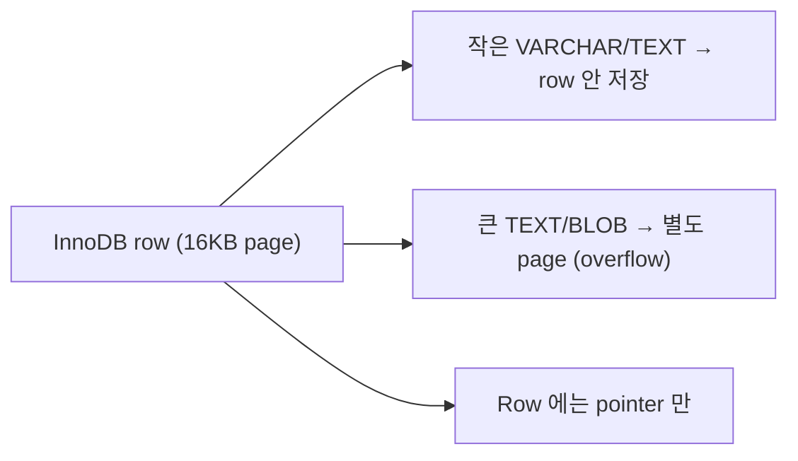
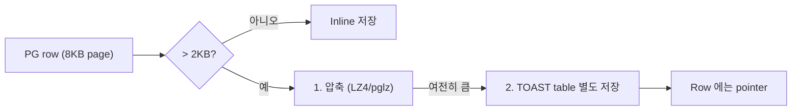
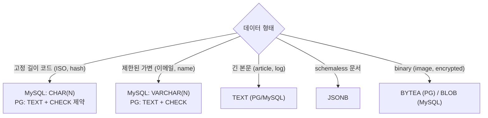

## 정의

문자열 저장 타입 4가지 비교. *성능 + 저장 + 유연성* 트레이드오프.

## 4가지 비교 (PostgreSQL)

| 타입 | 최대 길이 | 저장 방식 | 뒤 공백 | 사용 |
|---|---|---|---|---|
| `CHAR(N)` | N (고정) | *padding* | 붙임 | 옛 표준, 거의 안 씀 |
| `VARCHAR(N)` | N | 실제 크기 | 유지 | 옛 습관, 대부분 상황 |
| `TEXT` | *무제한* | 실제 크기 | 유지 | *PG 권장* |
| `JSONB` | 무제한 (내부 1GB) | binary + toast | - | 구조화된 문서 |

## PostgreSQL 의 특별한 진실

```
PostgreSQL: CHAR, VARCHAR, TEXT 는 *성능 동일*
→ 모두 내부적으로 *varlena* (variable-length array) 로 저장
→ length 검증 오버헤드만 다름
```

> [!IMPORTANT]
> **PostgreSQL 에서는 거의 항상 `TEXT` 사용**. `VARCHAR(N)` 은 *길이 제약 필요* 할 때만. `CHAR(N)` 은 사실상 *legacy*.

## 저장 크기 비교

```
'hello' (5 chars)
  CHAR(20)   → 20 bytes (padding + length header)
  VARCHAR(20) → 5 + 1 header = 6 bytes
  VARCHAR    → 5 + 1 header = 6 bytes (제약 없음)
  TEXT       → 5 + 1 header = 6 bytes
  JSONB      → 파싱된 binary + headers ≈ 20+ bytes
```

## MySQL 의 차이

MySQL 은 *진짜 다르다*:

| | CHAR(N) | VARCHAR(N) |
|---|---|---|
| 저장 | *N bytes 고정* | *실제 크기 + 1-2 byte header* |
| 뒤 공백 | 저장 X (`TRIM` 자동) | 저장 O |
| 성능 | *약간 빠름* (고정) | 약간 느림 |
| 사용 | 고정 길이 (해시, 코드) | 대부분 |

```sql
-- MySQL 만의 팁
country_code CHAR(2)      -- 항상 2자리
sha256_hex   CHAR(64)     -- 항상 64자
description  VARCHAR(1000) -- 가변
big_text     TEXT          -- BLOB 영역
```

## InnoDB 의 TEXT 특별함



- 768 bytes 이내 → row 내 저장
- 초과 → *별도 페이지 + pointer*
- 결과: *TEXT 자주 안 쓰는 컬럼* 은 성능 손실 없음

## PostgreSQL TOAST



*The Oversized-Attribute Storage Technique*. PostgreSQL 자동 처리.

## JSONB 의 특별함

```sql
CREATE TABLE events (
  id BIGSERIAL PRIMARY KEY,
  event_type TEXT,
  payload JSONB
);
```

vs `TEXT` 로 JSON 저장:

| | TEXT (JSON) | JSONB |
|---|---|---|
| 저장 | *원본 텍스트* | *binary parsed* |
| 인덱싱 | 어려움 | *GIN 가능* |
| Query | `->` 매번 parse | 빠름 |
| Key 순서 | 보존 | 손실 |
| Insert 속도 | *빠름* | 느림 (parse) |
| Read 속도 | 느림 | *빠름* |

자세한 JSONB 는 [[postgresql-jsonb]].

## 성능 벤치마크 (직관)

<ChartJs
  client:visible
  type="bar"
  title="1000만 row 저장, 컬럼 타입별 크기 (PG)"
  caption="평균 20 char 문자열 기준. VARCHAR/TEXT 사실상 동일. JSONB 는 key 이름 반복 저장."
  height="240px"
  data={{
    labels: ['CHAR(20)', 'VARCHAR(20)', 'VARCHAR', 'TEXT', 'JSONB'],
    datasets: [
      { label: '테이블 크기 (MB)', data: [230, 215, 215, 215, 320], backgroundColor: ['#ef4444','#f59e0b','#3b82f6','#22c55e','#a78bfa'] },
    ],
  }}
  options={{ scales: { y: { title: { display: true, text: 'MB' } } } }}
/>

## 언제 무엇을?



## PostgreSQL 권장 pattern

```sql
-- ✓ 권장
CREATE TABLE users (
  id         BIGSERIAL PRIMARY KEY,
  email      TEXT NOT NULL UNIQUE CHECK (length(email) <= 320),
  name       TEXT NOT NULL CHECK (length(name) BETWEEN 1 AND 100),
  country    TEXT NOT NULL CHECK (length(country) = 2 AND country ~ '^[A-Z]{2}$'),
  bio        TEXT,
  preferences JSONB NOT NULL DEFAULT '{}'
);

-- ✗ 옛 습관
CREATE TABLE users (
  email      VARCHAR(320),
  name       VARCHAR(100),
  country    CHAR(2),
  bio        VARCHAR(2000),
  preferences JSONB
);
```

## MySQL 권장 pattern

```sql
CREATE TABLE users (
  id         BIGINT PRIMARY KEY AUTO_INCREMENT,
  email      VARCHAR(320) NOT NULL UNIQUE,
  name       VARCHAR(100) NOT NULL,
  country    CHAR(2) NOT NULL,
  bio        TEXT,
  preferences JSON  -- MySQL 8.0+
) ENGINE=InnoDB DEFAULT CHARSET=utf8mb4 COLLATE=utf8mb4_0900_ai_ci;
```

## 인덱싱 제약

```sql
-- PostgreSQL: 인덱스 key 최대 2704 bytes (BTree)
CREATE INDEX ON users(email);   -- ✓
CREATE INDEX ON users(bio);      -- 큰 bio 에러

-- 부분 인덱스 (prefix)
CREATE INDEX ON users((left(bio, 100)));

-- MySQL: 인덱스 prefix length 명시
CREATE INDEX idx_bio ON users(bio(255));   -- 앞 255 chars 만
```

## Collation (정렬 규칙)

```sql
-- PostgreSQL
CREATE TABLE t (
  name TEXT COLLATE "ko-KR-x-icu"
);

-- MySQL
name VARCHAR(100) CHARACTER SET utf8mb4 COLLATE utf8mb4_ko_0900_as_cs
```

| Collation | 의미 |
|---|---|
| `utf8mb4_bin` | binary (정확 매칭) |
| `utf8mb4_0900_ai_ci` | 대소문자/악센트 무시 |
| `ko_KR.UTF-8` | 한국어 정렬 |

## 흔한 함정

> [!WARNING]
> 1. **PG 에서 VARCHAR(N) 성능 이유로 사용** = *같은 성능*. TEXT + CHECK 로.
> 2. **MySQL 에서 모든 곳에 TEXT** = row 밖 저장 → 성능 손실. VARCHAR 우선.
> 3. **CHAR 의 뒤 공백 사고** = `WHERE name = 'koa'` vs `'koa   '` → 결과 다름.
> 4. **UTF-8 3-byte vs 4-byte** = MySQL 옛 `utf8` 은 *3-byte* (이모지 저장 안 됨). *`utf8mb4`* 필수.

## 관련 위키

- [[postgresql]]
- [[mysql-innodb]]
- [[postgresql-jsonb]]
- [[b-plus-tree-internals]] (인덱스)
- [[wal-write-ahead-log]] (TOAST 저장)
