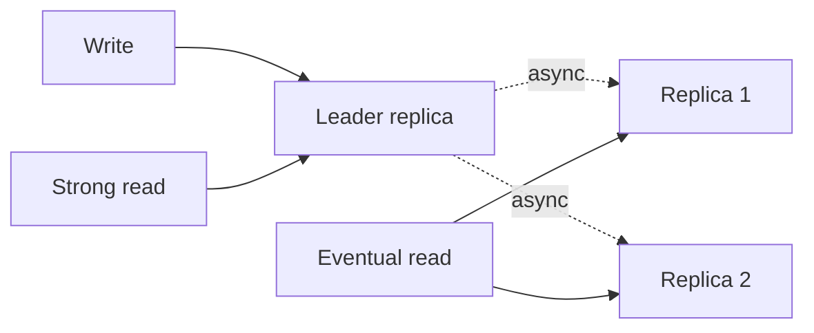
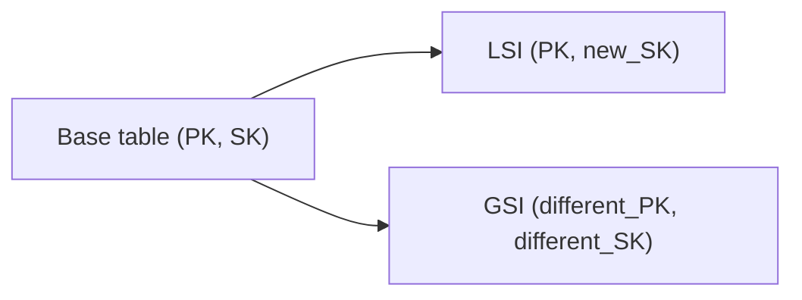
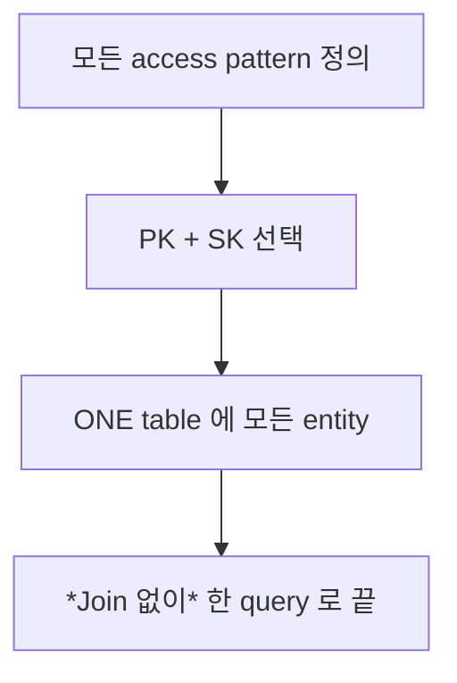
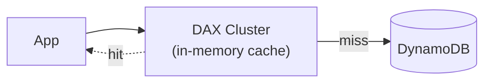
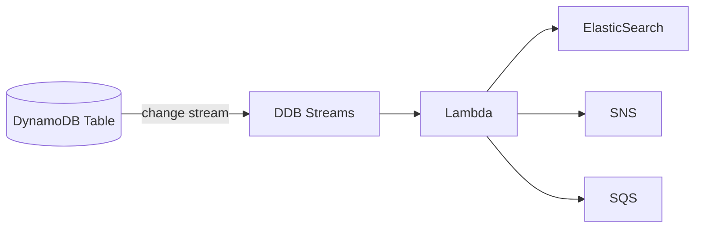
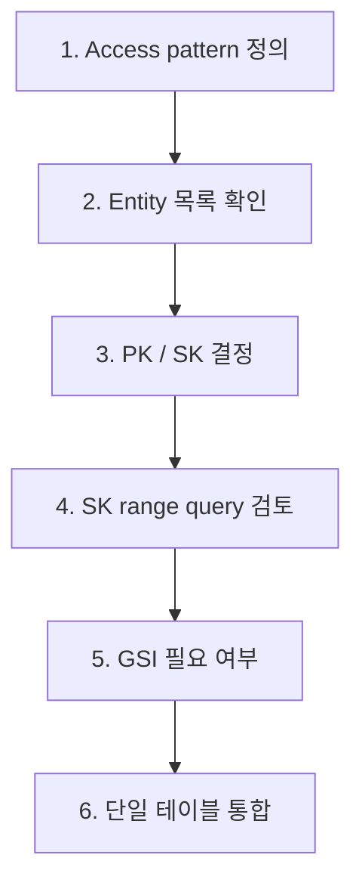

## 정의

**DynamoDB** 는 AWS 의 *fully managed key-value + document NoSQL*. *low-latency, infinite scale, schemaless*. **single-table design** 이 트레이드마크 패턴.

## 핵심 키

```
Primary Key = Partition Key (PK)
           또는 Partition Key + Sort Key (PK + SK) ← Composite
```

| 키 | 의미 |
|---|---|
| **PK (Partition Key)** | hash → 물리 partition 결정 |
| **SK (Sort Key)** | 같은 PK 안의 *정렬 키* |

> [!IMPORTANT]
> *DynamoDB 의 모든 query 는 PK 를 *반드시* 지정*. *SK 는 range query 가능*. 이 제약이 *single-table design 을 강제*.

## Item 예시

| PK | SK | Type | Data |
|---|---|---|---|
| `USER#42` | `PROFILE` | user | name, email |
| `USER#42` | `ORDER#2026-06-25#o_1` | order | total, items |
| `USER#42` | `ORDER#2026-06-24#o_2` | order | total, items |
| `USER#42` | `ADDR#home` | address | city, street |
| `ORDER#o_1` | `META` | order | userId, status |

*한 테이블에 여러 entity type 동시 저장*. 한 query 로 *user 의 모든 데이터*:

```
PK = USER#42  → 모든 row (PROFILE, ORDER, ADDR)
PK = USER#42 AND SK begins_with(ORDER#) → 주문만
```

## Capacity Mode

| 모드 | 의미 |
|---|---|
| **Provisioned** | RCU/WCU 미리 설정 |
| **On-Demand** | 자동 스케일, 사용량 청구 |

| 단위 | 1 RCU | 1 WCU |
|---|---|---|
| Eventually consistent | 2 read/sec (4KB) | - |
| Strongly consistent | 1 read/sec | - |
| Write | - | 1 write/sec (1KB) |

## Strongly vs Eventually Consistent Read



| | Strong | Eventual |
|---|---|---|
| Latency | 약간 높음 | 낮음 |
| Cost (RCU) | 2배 | 기본 |
| 일관성 | *항상 최신* | *최근 쓰기 못 봄 가능* |

## GSI vs LSI

| | LSI (Local) | GSI (Global) |
|---|---|---|
| PK | *같은 base table 의 PK* | *임의 키* |
| 동시 생성 | *create 시만* | 언제든 |
| 일관성 | strong / eventual | *eventual 만* |
| 크기 제한 | 10GB / PK | 없음 |
| 개수 | 5 | 20 |



## Single-Table Design



> [!IMPORTANT]
> *RDB 사고 (테이블 = entity)* 와 *완전 다른 패러다임*. *access pattern 을 먼저 정의*, 그에 맞춰 *PK/SK 디자인*. 잘못 설계하면 *전체 마이그레이션*.

## Query vs Scan

```bash
# Query (효율적, PK 필수)
QUERY PK = "USER#42" AND SK begins_with "ORDER#"

# Scan (전체 테이블 순회, 비효율)
SCAN FilterExpression: "status = paid"
```

> [!WARNING]
> *Scan 은 거의 항상 안티패턴*. 모든 partition 순회 → 비용 폭발. *Scan 이 자주 필요하면 *디자인 결함**.

## DAX (DynamoDB Accelerator)



- *마이크로초 단위 latency*.
- *write-through* 캐시.
- *읽기 중심* 워크로드에서 효과.

## Streams + Lambda



*Change Data Capture*. *secondary index 가 부족할 때* Streams 로 *외부 검색 인덱스* 동기화.

## PartiQL

```sql
-- SQL-like 쿼리
SELECT * FROM "MyTable" WHERE PK = 'USER#42' AND begins_with("SK", 'ORDER#');
```

> 익숙한 SQL 문법이지만 *내부는 여전히 PK/SK 제약 적용*. *RDB 쿼리처럼 작성하면 Scan 폭발*.

## 흔한 함정

> [!WARNING]
> 1. **Hot partition** = 특정 PK 에 트래픽 집중. *분산 키 디자인* (해시 prefix).
> 2. **너무 큰 item** = 400KB 제한. 큰 데이터는 *S3* + DDB 에 *참조*.
> 3. **Scan 의존 쿼리** = 비용 폭발. GSI 추가.
> 4. **eventual consistency 무시** = 방금 쓴 값이 *없을 수* 있음. strong read 명시 또는 *재시도*.

## TTL (Time to Live)

아이템에 `ttl` (Unix timestamp) 속성 추가 → 만료 시 *자동 삭제*.
만료 후 최대 48시간 내 삭제 (정확한 시각 미보장).

```bash
aws dynamodb update-time-to-live \
  --table-name Orders \
  --time-to-live-specification "Enabled=true,AttributeName=ttl"
```

```python
import time
item = {
    'PK': 'SESSION#xyz',
    'SK': 'META',
    'ttl': int(time.time()) + 3600   # 1시간 후 만료
}
```

> [!TIP]
> TTL 만료 전까지는 read 에서 *필터링이 필요*. DDB 는 만료 시각이 지나도 즉시 삭제 보장 안 됨.

## Transactions

*ACID 보장*, 최대 100 item, 동일/다른 테이블 가능.

```python
client.transact_write(
    TransactItems=[
        {
            'Put': {
                'TableName': 'Orders',
                'Item': {'PK': {'S': 'ORDER#1'}, 'status': {'S': 'PLACED'}},
                'ConditionExpression': 'attribute_not_exists(PK)',
            }
        },
        {
            'Update': {
                'TableName': 'Inventory',
                'Key': {'PK': {'S': 'ITEM#42'}},
                'UpdateExpression': 'SET stock = stock - :d',
                'ExpressionAttributeValues': {':d': {'N': '1'}},
                'ConditionExpression': 'stock >= :d',
            }
        },
    ]
)
```

- `TransactWriteItems` / `TransactGetItems`.
- *2배 WCU/RCU 비용*.
- 실패 시 전체 롤백.

## Conditional Writes

낙관적 동시성 제어. 조건 실패 시 `ConditionalCheckFailedException`.

```python
table.update_item(
    Key={'PK': 'USER#42', 'SK': 'PROFILE'},
    UpdateExpression='SET version = :new, updatedAt = :ts',
    ConditionExpression='version = :cur',
    ExpressionAttributeValues={
        ':cur': 1,
        ':new': 2,
        ':ts': '2026-06-17T10:00:00Z',
    },
)
```

낙관적 잠금 패턴: `version` 속성으로 *동시 업데이트 충돌 감지*.

## Access Pattern 설계 워크플로



> *entity 먼저 설계 후 access pattern 억지* = 나중에 전체 마이그레이션. 반드시 *access pattern 우선* 설계.

## Global Tables

*다중 리전 Active-Active* 복제. 글로벌 레이턴시 최소화.

```bash
aws dynamodb create-global-table \
  --global-table-name Orders \
  --replication-group \
    RegionName=us-east-1 \
    RegionName=ap-northeast-2
```

- 각 리전에서 *읽기/쓰기 모두 가능*.
- *eventual consistency* (복제 지연 수백 ms).
- 충돌 해결: *last-writer-wins* (timestamp 기반).

## Backup / PITR

```bash
# On-demand 백업
aws dynamodb create-backup \
  --table-name Orders \
  --backup-name orders-backup-20260617

# PITR 활성화 (최대 35일 복구)
aws dynamodb update-continuous-backups \
  --table-name Orders \
  --point-in-time-recovery-specification \
    PointInTimeRecoveryEnabled=true

# 특정 시각으로 복구
aws dynamodb restore-table-to-point-in-time \
  --source-table-name Orders \
  --target-table-name Orders-Restored \
  --restore-date-time 2026-06-15T10:00:00Z
```

## 관련 위키

- [[mongodb]] (문서 DB 대안)
- [[Redis]] (KV 대안)
- [[aws-iam]] (DDB 권한)
- [[sharding-vs-partitioning]]
- [[aws-lambda]] (Streams + Lambda CDC)
- [[aws-s3]] (400KB 초과 데이터 저장)
