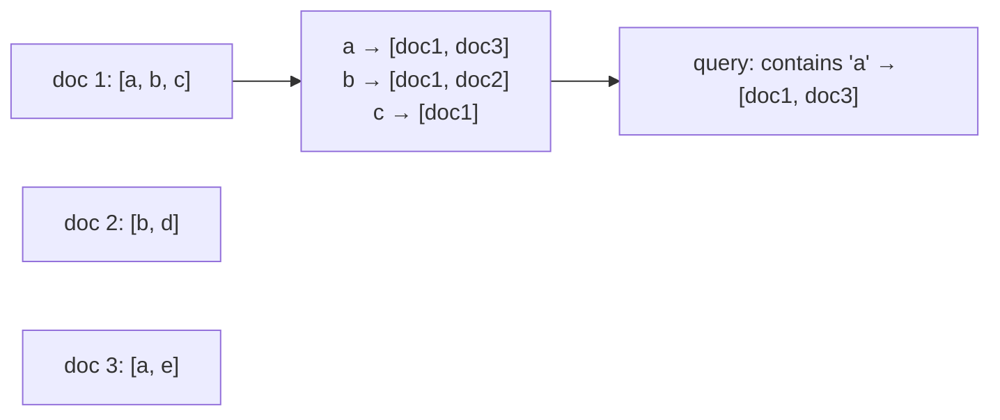
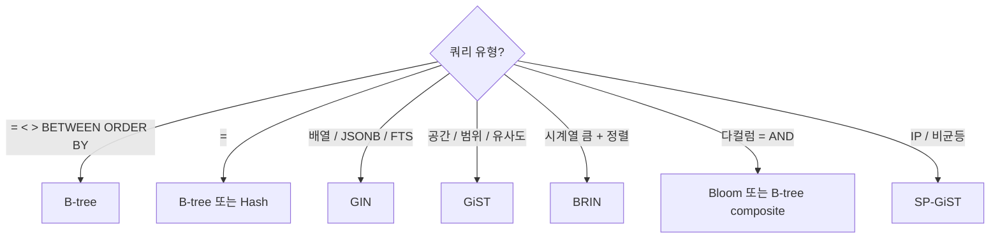

## 정의

*B-tree* 외 PostgreSQL 의 *특수 인덱스* 들. 자세한 B-tree 는 [[btree-indexing]] 참고.

| 인덱스 | 적합 |
|---|---|
| B-tree | *= < > BETWEEN ORDER BY* (default) |
| Hash | *=* 만 |
| GIN | *다값 (배열, JSONB, full-text)* |
| GiST | *공간, 범위, 유사도* |
| SP-GiST | *공간 partitioning* (Quadtree, kd-tree) |
| BRIN | *큰 시계열, 잘 정렬된 데이터* |
| Bloom | *다컬럼 동등성 (확률)* |

## GIN (Generalized Inverted Index)

*하나의 컬럼이 여러 값* 인 경우 (배열, JSONB, tsvector).

```sql
CREATE INDEX idx_tags ON posts USING gin(tags);
SELECT * FROM posts WHERE tags @> ARRAY['ruby', 'rails'];   -- 빠름

CREATE INDEX idx_jsonb ON events USING gin(payload jsonb_path_ops);
SELECT * FROM events WHERE payload @> '{"type": "click"}';

CREATE INDEX idx_fts ON articles USING gin(to_tsvector('english', body));
SELECT * FROM articles WHERE to_tsvector('english', body) @@ to_tsquery('postgres');
```



> [!TIP]
> *JSONB 의 가장 흔한 인덱스*. `@>`, `?`, `?&`, `?|` 연산자 가속.

## GiST (Generalized Search Tree)

*tree 구조의 일반화*. 공간 + 범위 + 유사도 검색.

```sql
-- PostGIS 공간
CREATE INDEX idx_geom ON places USING gist(geom);
SELECT * FROM places WHERE ST_DWithin(geom, ST_Point(-122, 37), 1000);

-- 범위 타입
CREATE INDEX idx_range ON bookings USING gist(during);
SELECT * FROM bookings WHERE during && '[2026-06-25, 2026-06-26)'::tsrange;

-- pg_trgm 유사도
CREATE EXTENSION pg_trgm;
CREATE INDEX idx_name_trgm ON users USING gist(name gist_trgm_ops);
SELECT * FROM users WHERE name % 'koa';   -- 유사 매치
```

## BRIN (Block Range Index)

큰 테이블 + *물리 순서 ≈ 논리 순서* 일 때. *block 의 min/max* 만 저장.

```sql
CREATE INDEX idx_created ON events USING brin(created_at);
SELECT * FROM events WHERE created_at >= '2026-06-25';
```

| | B-tree | BRIN |
|---|---|---|
| 크기 | 큼 (~ 10% of table) | *작음* (~0.01%) |
| 정밀도 | 정확 | 대략 (block range) |
| 적합 | 일반 | *시계열, append-only* |

> [!IMPORTANT]
> *수억 row 의 시계열* 에서 *BRIN 이 B-tree 의 1/100 메모리*. 단 *INSERT 순서와 정렬 컬럼이 일치* 해야 효과.

## Hash Index

```sql
CREATE INDEX idx_email_hash ON users USING hash(email);
SELECT * FROM users WHERE email = 'koa@x.com';   -- 빠름
SELECT * FROM users WHERE email LIKE 'koa%';     -- 사용 안 됨
```

- *= 검색만*. range 불가.
- *PostgreSQL 10+ 부터 WAL 지원* (이전엔 replication 안 됨).
- *B-tree 가 거의 항상 더 좋음*. *극히 큰 컬럼* 의 *= 만 검색* 일 때 약간 우위.

## SP-GiST

```sql
-- IP 주소 등 partitioning 자연
CREATE INDEX idx_ip ON logs USING spgist(client_ip);
```

*Quadtree, kd-tree, radix tree* 를 *generic 으로 구현*. *비균등 분포* 데이터에 강함.

## Bloom Index

```sql
CREATE EXTENSION bloom;
CREATE INDEX idx_multi ON events USING bloom(user_id, type, source)
  WITH (length = 80, col1 = 4, col2 = 4, col3 = 4);

SELECT * FROM events WHERE user_id = 42 AND type = 'click';
```

- *다컬럼 동등성*.
- *확률적*: false positive 가능 (PG 가 *재검증*).
- *모든 컬럼 동시 조회* 에서 *큰 B-tree 다수* 대신.

## 인덱스 선택 매트릭스



## 인덱스 크기 비교 (1억 row)

<ChartJs
  client:visible
  type="bar"
  title="1억 row, 인덱스 종류별 크기 (직관)"
  caption="BRIN 이 압도적으로 작음. GIN 은 다값이라 크다."
  height="240px"
  data={{
    labels: ['B-tree', 'Hash', 'GIN (배열)', 'GiST (공간)', 'BRIN'],
    datasets: [
      {
        label: '인덱스 크기 (GB)',
        data: [3.2, 2.8, 8.5, 4.1, 0.03],
        backgroundColor: ['#3b82f6', '#a78bfa', '#f59e0b', '#22c55e', '#10b981'],
      },
    ],
  }}
  options={{
    scales: { y: { type: 'logarithmic', title: { display: true, text: 'GB (log)' } } },
    plugins: { legend: { display: false } },
  }}
/>

## 흔한 함정

> [!WARNING]
> 1. **JSONB 에 *B-tree* 인덱스** = 잘못. GIN 으로.
> 2. **모든 컬럼에 인덱스** = INSERT 폭증. *사용 안 되는 인덱스* `pg_stat_user_indexes.idx_scan = 0` 으로 식별.
> 3. **BRIN + 무작위 insert** = 효과 *0*. *clustered insert* 가 전제.
> 4. **`hash index` 의존** = 옛 버전은 *WAL 안됨* → replica 에 없음. PG 10+ 만.

## 관련 위키

- [[btree-indexing]] (default)
- [[postgresql]]
- [[query-explain-plan]]
- [[Redis Vector Search]] (벡터 인덱스 대안)
