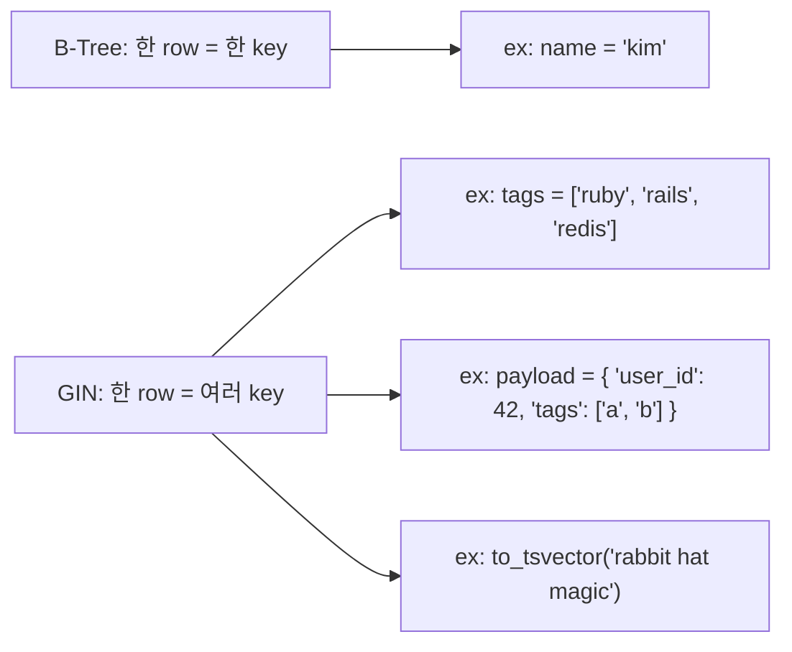
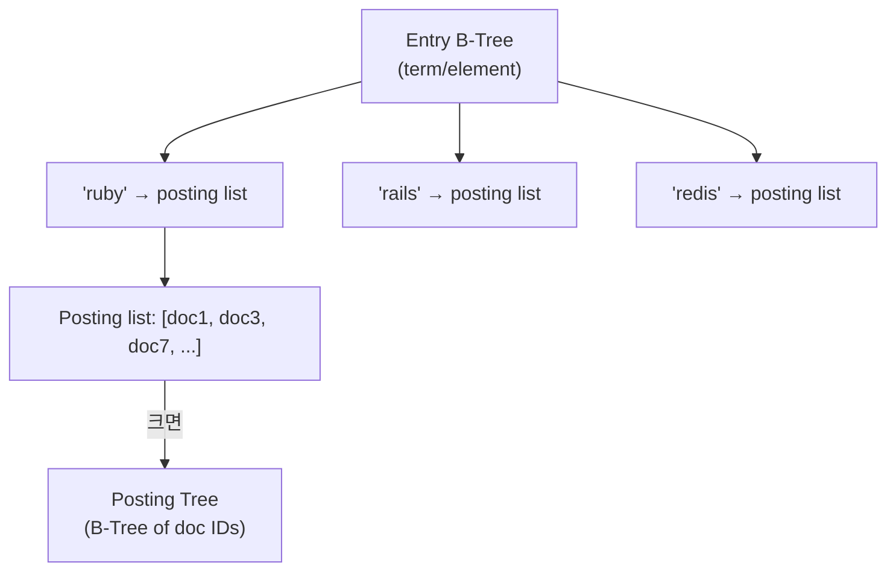
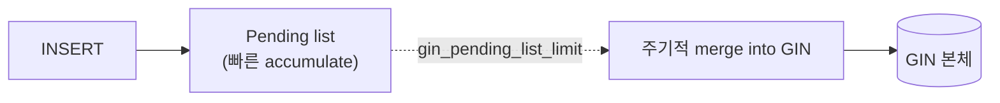

## 정의

**GIN (Generalized Inverted Index)** = *한 값이 여러 항목* 을 가지는 데이터 (배열, JSON, tsvector) 의 *역색인*. PostgreSQL 의 강력한 확장점.

일반 인덱스 비교는 [[gin-gist-hash-indexes]] 참고. 본 페이지는 *내부 구조* 에 집중.

## 왜 GIN?



## 구조



| 구성 | 의미 |
|---|---|
| **Entry Tree** | 모든 term 의 B-Tree |
| **Posting List** | Term → doc ID 목록 (작을 때 배열) |
| **Posting Tree** | Term 의 doc 이 많을 때 B-Tree |

## 예시 (배열 컬럼)

```sql
CREATE TABLE posts (
  id BIGSERIAL PRIMARY KEY,
  tags TEXT[]
);

INSERT INTO posts (tags) VALUES
  ('{"ruby","rails","redis"}'),   -- id=1
  ('{"rails","postgres"}'),        -- id=2
  ('{"ruby","postgres","json"}');  -- id=3

CREATE INDEX idx_tags ON posts USING gin(tags);
```

내부:

```
Entry B-Tree:
  'json'     → [3]
  'postgres' → [2, 3]
  'rails'    → [1, 2]
  'redis'    → [1]
  'ruby'     → [1, 3]

Query: tags @> ARRAY['ruby', 'postgres']
  → 'ruby' posting: [1, 3]
  → 'postgres' posting: [2, 3]
  → 교집합: [3]
```

## 연산자

| 연산자 | 의미 | 예 |
|---|---|---|
| `@>` (contains) | 왼쪽이 오른쪽 포함 | `tags @> ARRAY['ruby']` |
| `<@` (contained by) | 왼쪽이 오른쪽에 포함 | `tags <@ ARRAY['ruby','rails','redis']` |
| `&&` (overlap) | 하나라도 공통 | `tags && ARRAY['ruby','python']` |
| `?` (key exists) | JSON key 존재 | `payload ? 'user_id'` |
| `?|` (any key) | 여러 key 중 하나 | `payload ?| array['a','b']` |
| `?&` (all keys) | 모든 key 존재 | `payload ?& array['a','b']` |

## jsonb_ops vs jsonb_path_ops

```sql
-- 1. jsonb_ops (기본): 모든 key 와 value 인덱싱
CREATE INDEX idx_payload_full ON events USING gin(payload);

-- 2. jsonb_path_ops: @> 만 인덱싱 (더 작음, 더 빠름)
CREATE INDEX idx_payload_path ON events USING gin(payload jsonb_path_ops);
```

| | jsonb_ops | jsonb_path_ops |
|---|---|---|
| 인덱스 크기 | *큼* | *~1/3* |
| 지원 연산자 | `@>`, `?`, `?|`, `?&`, `@?`, `@@` | *`@>` 만* |
| Insert 속도 | 느림 | *빠름* |
| Query 속도 | 보통 | *빠름 (@>)* |

> [!IMPORTANT]
> *대부분 `@>` 만 쓴다* → **`jsonb_path_ops` 권장**. 크기 1/3, 속도 3x.

## Full-Text Search (tsvector)

```sql
CREATE TABLE articles (
  id BIGSERIAL PRIMARY KEY,
  body TEXT,
  body_tsv TSVECTOR GENERATED ALWAYS AS (to_tsvector('english', body)) STORED
);

CREATE INDEX idx_body_tsv ON articles USING gin(body_tsv);

-- 검색
SELECT * FROM articles
WHERE body_tsv @@ to_tsquery('english', 'rabbit & hat');

-- 랭킹
SELECT *, ts_rank(body_tsv, query) AS rank
FROM articles, to_tsquery('english', 'rabbit') query
WHERE body_tsv @@ query
ORDER BY rank DESC;
```

## pg_trgm (LIKE 최적화)

```sql
CREATE EXTENSION pg_trgm;

CREATE INDEX idx_name_trgm ON users
USING gin(name gin_trgm_ops);

-- Prefix / suffix / substring 모두 인덱스 활용!
SELECT * FROM users WHERE name LIKE '%kim%';
SELECT * FROM users WHERE name ILIKE 'kim%';
SELECT * FROM users WHERE name % 'kim';   -- 유사도
```

> `pg_trgm` = *3-gram (trigram)* 분해 → GIN. LIKE 성능 획기적 향상.

## Fastupdate + Pending List



*기본 활성*. INSERT/UPDATE 폭증 시 GIN 재계산이 비쌈 → *일단 임시 저장* + *배치 merge*.

```sql
-- 비활성 (query 성능 우선)
CREATE INDEX ... USING gin(...) WITH (fastupdate = off);

-- 임계값 조정
gin_pending_list_limit = 4MB
```

> [!CAUTION]
> Pending list 가 크면 *query 시 pending list + GIN 둘 다 스캔* → 느림. `VACUUM` 이 merge 트리거.

## GIN 크기 문제

```sql
-- 인덱스 크기 확인
SELECT pg_size_pretty(pg_relation_size('idx_payload_full'));

-- 재빌드 (bloat 정리)
REINDEX INDEX CONCURRENTLY idx_payload_full;
```

큰 GIN 인덱스 (수십 GB) 는 흔함. *`jsonb_path_ops`* 로 크기 대폭 감소.

## GIN + partial index

```sql
-- 특정 조건만 인덱싱
CREATE INDEX idx_recent_tags ON posts USING gin(tags)
WHERE created_at > now() - interval '30 days';
```

**Hot data** 만 인덱싱 → 크기 감소 + 빌드 시간 단축.

## Insert 성능

```
GIN insert cost:
  - term 하나마다 posting list update
  - N terms in row → N updates

배열 컬럼에 30개 tag 삽입:
  30 개의 posting list 업데이트 = 매우 비쌈

대안:
  - fastupdate ON (기본): 임시 저장
  - Bulk load: COPY + CREATE INDEX (기존 인덱스 drop)
```

## GIN vs GiST vs Bloom

| | GIN | GiST | Bloom |
|---|---|---|---|
| 자료구조 | Inverted | Balanced tree | Bit vector |
| Insert 속도 | *느림* | 빠름 | 매우 빠름 |
| Query 속도 | *빠름* | 중간 | 매우 빠름 (fp) |
| 다값 지원 | *예* | 예 | 아니오 |
| 사용 | jsonb, array, tsvector | spatial, range | multi-column = |

## 흔한 함정

> [!WARNING]
> 1. **`jsonb_ops` 항상 사용** = 크기 3배, 속도 저하. `@>` 만이면 `jsonb_path_ops`.
> 2. **Pending list 무한 성장** = query 느림. VACUUM 정기.
> 3. **작은 배열에도 GIN** = 배열 항목 수 <10 면 별도 컬럼 + B-Tree 가 나을 수도.
> 4. **HOT update 안 됨 in GIN** = GIN 은 *tuple ID 저장* → row 위치 바뀌면 update.

## 관련 위키

- [[gin-gist-hash-indexes]]
- [[postgresql-jsonb]]
- [[b-tree-internals]]
- [[r-tree]]
- [[postgresql]]
