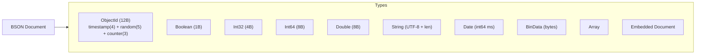
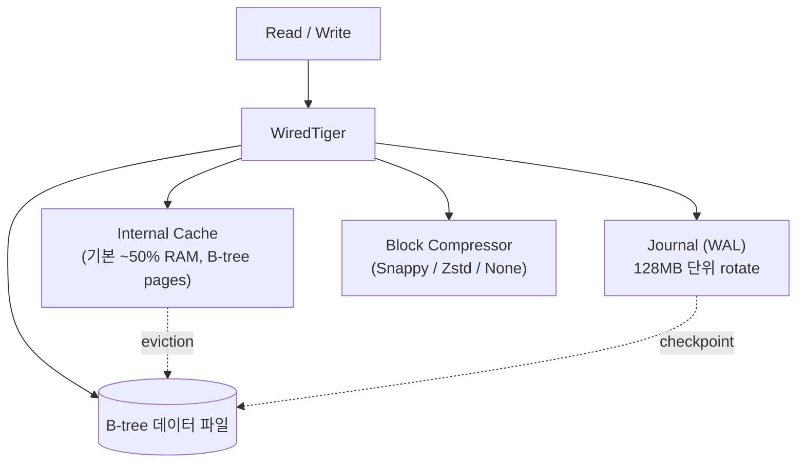
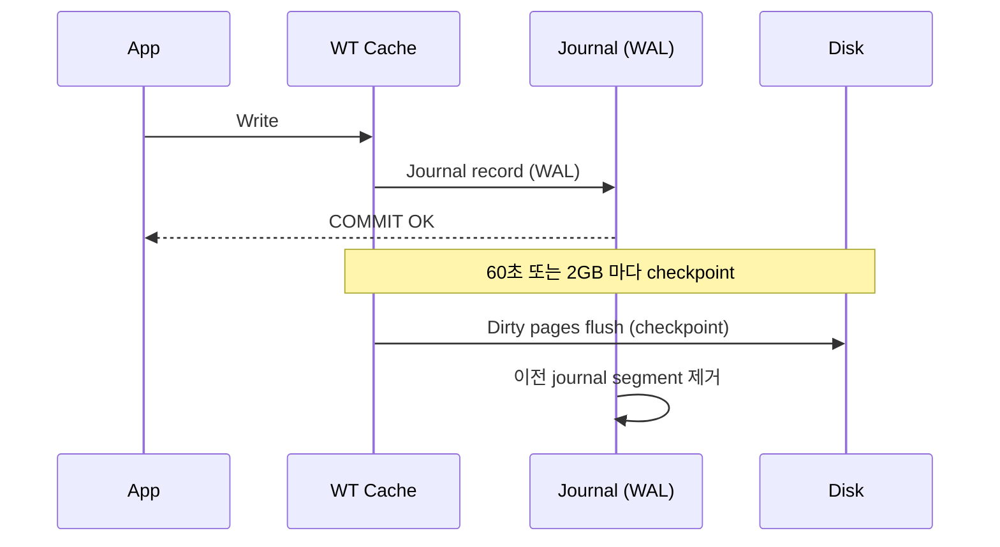
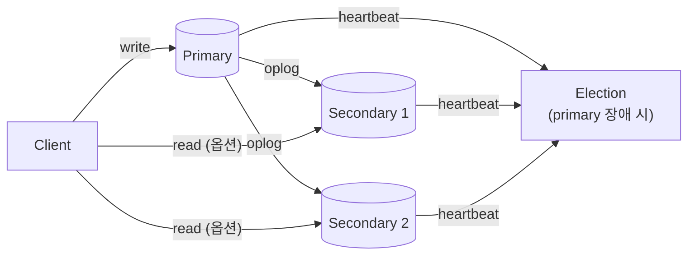
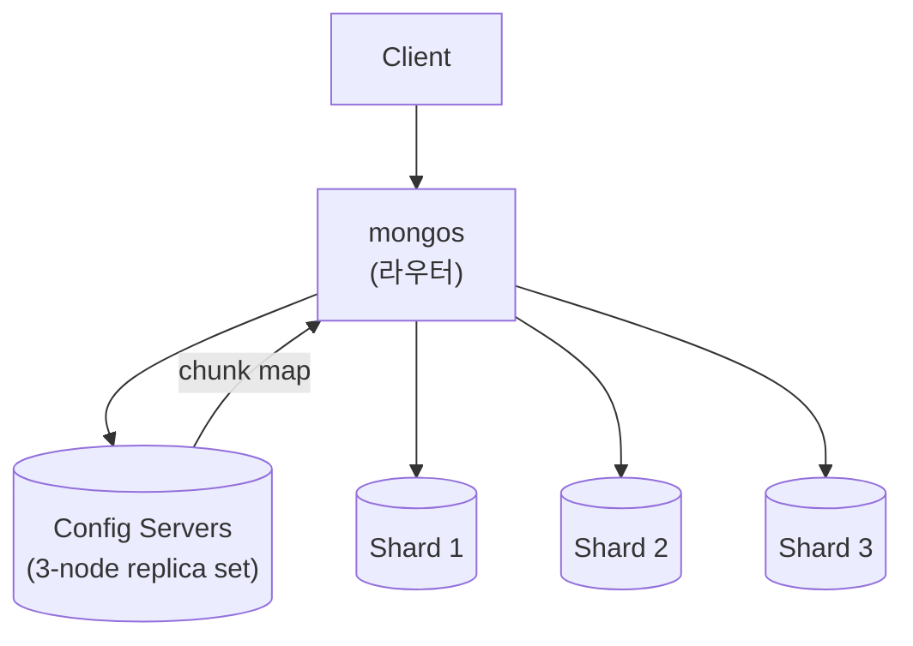
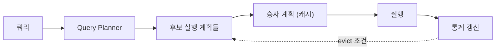

## 정의

**MongoDB** 는 *BSON (binary JSON) 문서 기반 NoSQL DB*. *schema-less* 라기보다 *flexible schema*. 2026 시점 *Atlas (managed)* 가 대다수.

## 핵심 개념

| RDB | MongoDB |
|---|---|
| Database | Database |
| Table | Collection |
| Row | Document (BSON) |
| Column | Field |
| Index | Index (B-tree) |
| JOIN | `$lookup` (aggregation) |
| Foreign key | 없음 (수동 관리) |

## BSON 형식

*Binary JSON* = JSON 의 바이너리 직렬화. JSON 보다 *빠른 파싱, 타입 정보 내장*.



| BSON 타입 | JSON 대응 | 특징 |
|---|---|---|
| ObjectId | string | 12 bytes. 시간 포함 → 정렬 가능 |
| Date | string | int64 (ms). 타입 보존 |
| Int32 / Int64 | number | 정수 타입 구분 |
| Decimal128 | number | 고정소수점 (금융) |
| BinData | string (base64) | 바이너리 직접 저장 |

```js
// ObjectId 구조
const id = new ObjectId("64a7b3c1d2e3f4a5b6c7d8e9");
id.getTimestamp();  // Date: 2023-07-06T...
```

## 문서 모델

```json
{
  "_id": "ObjectId(64a7...)",
  "name": "koa",
  "email": "koa@x.com",
  "addresses": [
    { "type": "home", "city": "Seoul" },
    { "type": "work", "city": "SF" }
  ],
  "tags": ["admin", "pro"],
  "createdAt": "ISODate(2026-06-25T00:00:00Z)"
}
```

*nested + 배열* 자유로움. *non-join read* 가 빠름.

## WiredTiger 스토리지 엔진



### 내부 체크포인트



- *Document-level locking* (이전 MongoDB < 3.2 의 글로벌 lock 에서 진화).
- Snappy (기본) / Zstd 압축으로 *디스크 사용 50-70% 절감*.
- `wiredTigerCacheSizeGB` = 기본 min(50% RAM - 1GB, 256MB) 이상.

## Replica Set



- 1 primary + N secondary.
- *oplog (operations log)* = capped collection. 변경 연산 순서 보존.
- *자동 failover*: primary 응답 없으면 election → 새 primary.
- *읽기 분산*: `readPreference: secondaryPreferred`.

```js
// Read preference 예시
db.orders.find({ status: "paid" }).readPref("secondaryPreferred")

// Write concern
db.orders.insertOne(doc, { writeConcern: { w: "majority", j: true } })
```

## Read / Write Concern

| Write Concern | 의미 |
|---|---|
| `w: 1` | primary 기록 후 OK (기본) |
| `w: "majority"` | 과반 secondary 복제 후 OK |
| `j: true` | journal (WAL) fsync 후 OK |

| Read Concern | 의미 |
|---|---|
| `local` | primary 의 최신 (기본, 복제 무관) |
| `majority` | 과반이 commit 한 데이터만 |
| `linearizable` | 가장 강력, 느림 |
| `snapshot` | 트랜잭션 내 일관 뷰 |

> [!TIP]
> 금융/재고 등 *강한 일관성* 필요 → `w: majority` + `j: true` + `readConcern: majority`. 느리지만 데이터 손실 없음.

## Sharding



- *shard key* 로 분산 (ranged / hashed / zone sharding).
- *chunk* 단위 (기본 128MB) 자동 balancing.
- mongos 는 *stateless router*. Config server 에서 라우팅 정보 조회.

## Aggregation Pipeline

```js
db.orders.aggregate([
  { $match: { status: "paid" } },
  { $lookup: {
      from: "users",
      localField: "userId",
      foreignField: "_id",
      as: "user"
  }},
  { $unwind: "$user" },
  { $group: { _id: "$user.country", total: { $sum: "$amount" } } },
  { $sort: { total: -1 } },
  { $limit: 10 },
]);
```

| Stage | 의미 |
|---|---|
| `$match` | WHERE |
| `$project` | SELECT |
| `$group` | GROUP BY |
| `$sort` | ORDER BY |
| `$limit` / `$skip` | LIMIT / OFFSET |
| `$lookup` | LEFT JOIN |
| `$unwind` | 배열 분해 |
| `$facet` | 다중 sub-pipeline |
| `$bucket` | 범위 그룹화 |
| `$setWindowFields` | 윈도우 함수 (5.0+) |

> [!TIP]
> *aggregation 순서 최적화*: `$match` 와 `$project` 를 *최대한 일찍*. 인덱스 활용 + 처리량 감소.

## Index

| 종류 | 의미 |
|---|---|
| Single field | 단일 |
| Compound | 다중 |
| Multikey | 배열 필드 |
| Text | full-text |
| 2dsphere | 공간 |
| Hashed | sharding 친화 |
| Wildcard | 임의 필드 |
| TTL | 자동 만료 |

```js
db.orders.createIndex({ userId: 1, createdAt: -1 });
db.events.createIndex({ createdAt: 1 }, { expireAfterSeconds: 86400 });

// Explain 로 인덱스 활용 확인
db.orders.find({ userId: "abc" }).explain("executionStats");
// COLLSCAN → IXSCAN 확인
```

## Change Streams

*실시간 데이터 변경 스트림*. CDC (Change Data Capture) 패턴.

```js
// 컬렉션 변경 감지
const changeStream = db.orders.watch([
  { $match: { "operationType": { $in: ["insert", "update"] } } }
]);

changeStream.on("change", (change) => {
  console.log(change.fullDocument);
  console.log(change.updateDescription.updatedFields);
});
```

| 필드 | 의미 |
|---|---|
| `operationType` | `insert` / `update` / `delete` / `replace` |
| `fullDocument` | 변경 후 전체 문서 |
| `updateDescription` | 변경된 필드 목록 |
| `resumeToken` | 스트림 재개 위치 |

> Change Streams 는 *oplog* 기반. *Replica Set / Sharded Cluster* 에서만 동작.

## Transactions (4.0+, 4.2+ sharded)

```js
const session = db.startSession();
session.startTransaction({
  readConcern: { level: "snapshot" },
  writeConcern: { w: "majority" }
});
try {
  await coll1.updateOne({ _id: 1 }, { $inc: { x: 1 } }, { session });
  await coll2.insertOne({ ref: 1 }, { session });
  await session.commitTransaction();
} catch (e) {
  await session.abortTransaction();
}
```

> [!CAUTION]
> *과거 MongoDB = 트랜잭션 없음* 이미지가 강했으나, 4.0+ 부터 *multi-document ACID*. *Sharded 트랜잭션은 비용 큼*, *document 안에 묶을 수 있으면 그게 정통*.

## 쿼리 최적화



```js
// 실행 계획 확인
db.orders.find({ status: "paid", userId: "abc" }).explain("allPlansExecution")

// 인덱스 강제 사용
db.orders.find({ status: "paid" }).hint({ status: 1 })

// 쿼리 통계 (Atlas / mongod)
db.setProfilingLevel(2)  // 모든 쿼리 로깅
db.system.profile.find().sort({ millis: -1 }).limit(5)
```

## 흔한 함정

> [!WARNING]
> 1. **`_id` ObjectId 의 random 분포** = MongoDB 는 `_id` index 의 *단조 증가 (timestamp prefix)* 설계. UUID v4 를 `_id` 로 쓰면 random insert = B-tree 분할 폭증.
> 2. **`$lookup` (join) 남용** = NoSQL 답지 않은 비용. *임베드 (embedding) 가 정통 패턴*.
> 3. **transaction 남용** = single document 안의 동작은 *항상 atomic*. transaction 은 진짜 필요할 때만.
> 4. **shard key 잘못 선택** = *write 분포가 균등하지 않은 키* 가 가장 큰 함정. 변경 불가 (6.0+ 재선택 가능).
> 5. **Change Stream 없이 polling** = `find({updatedAt: {$gt: ...}})` 루프 = 인덱스 있어도 부하. Change Streams 가 push 방식으로 효율적.
> 6. **Write Concern w:1 + 재시작** = primary 장애 시 *1초 미만 데이터 손실*. 중요 데이터는 `w: majority`.

## 관련 위키

- [[postgresql]] (대안)
- [[dynamodb]] (NoSQL 대안)
- [[cassandra]] (분산 NoSQL)
- [[sharding-vs-partitioning]]
