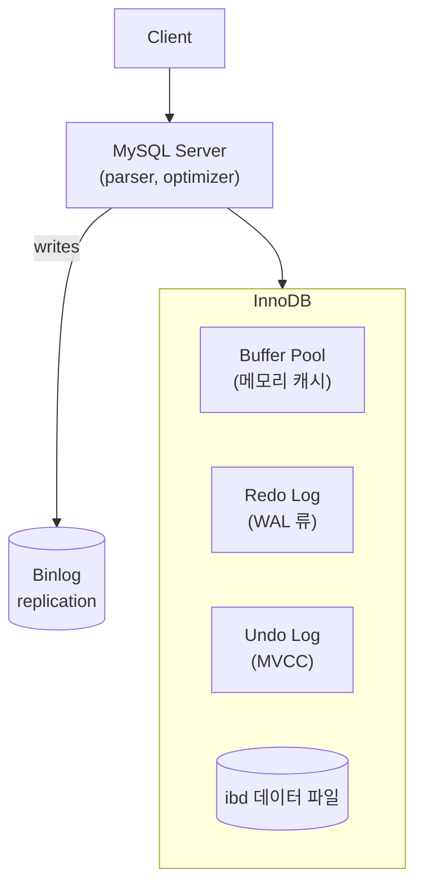
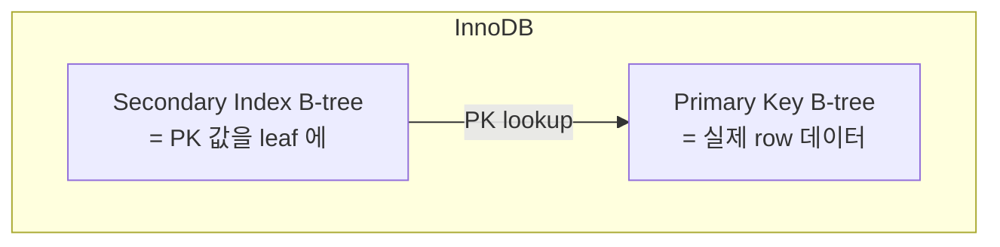
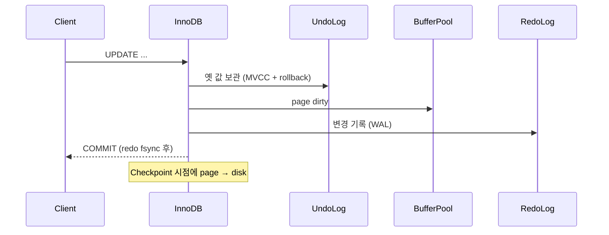
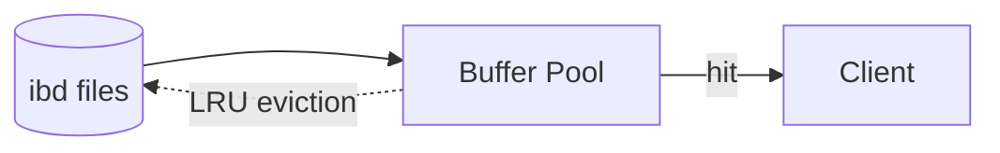
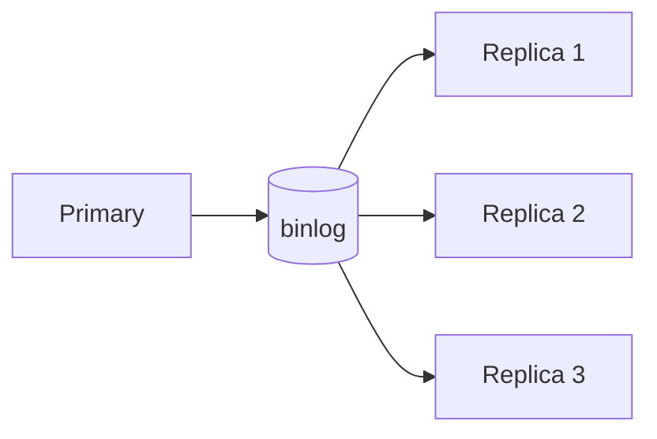

## 정의

**MySQL** + **InnoDB** (기본 스토리지 엔진) 의 *clustered index + redo log* 기반 *행 기반 RDBMS*. *웹 / SaaS* 의 가장 흔한 backbone.

## 아키텍처

## Clustered Index (vs PostgreSQL)

| | PostgreSQL | MySQL InnoDB |
|---|---|---|
| Primary 데이터 저장 | heap + 별도 인덱스 | *primary key 의 B-tree leaf* |
| Secondary index → 데이터 | `tid` (heap 위치) | *primary key 값* |
| 결과 | secondary index lookup = *1 hop* | secondary index lookup = *2 hop* (인덱스 → PK → 데이터) |
| PK 영향 | 작음 | *큼* (변경 시 secondary index 도 갱신) |

> [!IMPORTANT]
> InnoDB 의 PK 선택은 *결정적*. *큰 PK* (UUID) = 모든 secondary index 가 *큰 leaf*. *AUTO_INCREMENT BIGINT* 가 보통 정답.

## Redo Log + Undo Log

| 로그 | 역할 |
|---|---|
| Redo Log | crash recovery, *WAL* |
| Undo Log | MVCC + rollback |
| Binlog | replication, point-in-time recovery |

## Isolation Level (InnoDB 기본)

| Level | InnoDB 기본 | 의미 |
|---|---|---|
| READ UNCOMMITTED | | dirty read |
| READ COMMITTED | | 다른 트랜잭션의 commit 된 것만 |
| **REPEATABLE READ** | *기본* | *같은 쿼리는 같은 결과* (snapshot) |
| SERIALIZABLE | | 완전 격리 |

> InnoDB 의 *REPEATABLE READ* 는 *next-key lock* 으로 *phantom read 방지*. PostgreSQL 의 *Read Committed* 기본과 *기본값이 다름*.

자세한 건 [[transaction-isolation-levels]].

## Buffer Pool

- 메모리에 *page 단위 (16KB) 캐시*.
- `innodb_buffer_pool_size` = *총 RAM 의 70-80%* 가 운영 표준.
- *Hit ratio* `Innodb_buffer_pool_read_requests / Innodb_buffer_pool_reads`.

## Lock

| Lock | 의미 |
|---|---|
| Shared (S) | 다른 S 와 호환, X 와 충돌 |
| Exclusive (X) | 단독 |
| Intention (IS, IX) | table-level 의도 표시 |
| Record lock | row 단일 |
| Gap lock | row 사이 간격 |
| Next-key lock | record + gap (phantom 방지) |
| Auto-inc lock | AUTO_INCREMENT 동기 |

> [!CAUTION]
> *next-key lock* 이 의도치 않게 *넓은 범위* 를 lock → deadlock 잦음. `SHOW ENGINE INNODB STATUS\G` 의 *deadlock log* 확인.

## Replication

- *Async* (기본): primary 가 즉시 OK
- *Semi-sync*: 적어도 1개 replica 가 receive 후 OK
- *Group Replication*: 다수 노드 합의

## MySQL vs PostgreSQL

| 항목 | MySQL | PostgreSQL |
|---|---|---|
| 스토리지 엔진 | InnoDB (+ MyISAM legacy) | 단일 |
| 인덱스 | clustered (PK = data) | heap + index |
| 확장성 (extension) | 적음 | *매우 많음* |
| JSON 인덱싱 | OK | *JSONB + GIN 우수* |
| 복제 | binlog 기반 | streaming WAL |
| 트랜잭션 DDL | 옛 버전 X (8.0+ 부분) | *대부분 트랜잭션* |
| 운영 도구 | percona, mysql workbench | psql + 풍부한 ecosystem |
| 라이센스 | GPL (commercial 도) | PostgreSQL License |

## 흔한 함정

> [!WARNING]
> 1. **PK = UUID v4** = clustered index *random write* → 페이지 분할 폭증. ULID / 정렬 가능 UUID 또는 *BIGINT*.
> 2. **`SELECT * `의 *MVCC* 비용** = old version chain 따라가기. unused 컬럼 안 가져오기.
> 3. **deadlock 무시** = `SHOW ENGINE INNODB STATUS` 의 *LATEST DEADLOCK* 모니터링.
> 4. **binlog format 이 `STATEMENT`** = 비결정적 함수 (NOW(), UUID()) → replica 와 *다른 결과*. ROW 또는 MIXED 권장.

## 관련 위키

- [[postgresql]] (비교)
- [[mvcc]]
- [[btree-indexing]]
- [[transaction-isolation-levels]]
- [[wal-write-ahead-log]]
- [[query-explain-plan]]
