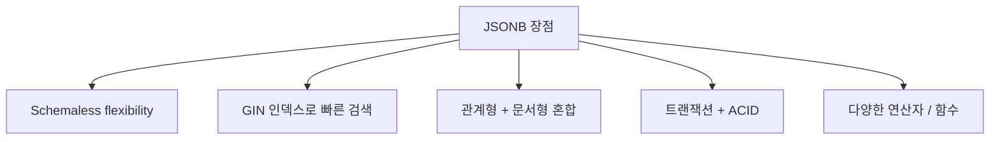
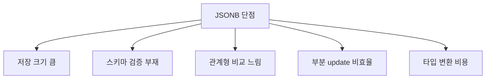

## 정의

**JSONB** (Binary JSON, PG 9.4+) = PostgreSQL 의 *binary 직렬화된 JSON*. *인덱싱 가능 + 빠른 query* 가 `json` 과의 핵심 차이.

> [!IMPORTANT]
> 2026 시점 *PostgreSQL 에서 schema-less + 관계형 결합* 의 표준. *MongoDB 대안* + *NoSQL/SQL 혼합* 의 답.

## json vs jsonb

| | `json` | `jsonb` |
|---|---|---|
| 저장 | *텍스트 그대로* | *binary parsed* |
| 입력 속도 | 빠름 | 느림 (parse 비용) |
| Query 속도 | 매번 parse | *빠름* |
| 인덱싱 | 제한 | *GIN 가능* |
| Key 순서 | 보존 | *손실* |
| Whitespace | 보존 | 손실 |
| 중복 key | 모두 보존 | *마지막만* |

> 거의 항상 *`jsonb`*. `json` 은 *원본 형식 보존* 필요 (서명, 감사) 시만.

## 장점



### 1. Schemaless 유연성

```sql
CREATE TABLE events (
  id BIGSERIAL PRIMARY KEY,
  event_type TEXT,
  payload JSONB,
  created_at TIMESTAMPTZ DEFAULT NOW()
);

INSERT INTO events (event_type, payload) VALUES
  ('click', '{"user_id": 42, "page": "/home", "duration": 1500}'),
  ('purchase', '{"user_id": 42, "product_id": 99, "amount": 50000, "items": [{"sku": "A"}, {"sku": "B"}]}'),
  ('error', '{"code": 500, "stack": "...", "context": {"db": "down"}}');
```

### 2. GIN 인덱스 + 풍부한 query

```sql
-- 인덱스 (전체 JSONB)
CREATE INDEX idx_payload_gin ON events USING gin(payload);

-- jsonb_path_ops: @> 만 빠르게 (더 작은 인덱스)
CREATE INDEX idx_payload_path ON events USING gin(payload jsonb_path_ops);

-- 특정 키만
CREATE INDEX idx_user_id ON events ((payload->>'user_id'));
```

자세한 인덱스 비교는 [[gin-gist-hash-indexes]].

### 3. 풍부한 연산자

```sql
-- containment (@>)
SELECT * FROM events WHERE payload @> '{"user_id": 42}';
SELECT * FROM events WHERE payload @> '{"items": [{"sku": "A"}]}';

-- key 존재 (?)
SELECT * FROM events WHERE payload ? 'error_code';

-- key 다수 (?| 또는 ?&)
SELECT * FROM events WHERE payload ?| array['error_code', 'warning_code'];

-- 경로 추출
SELECT payload->>'user_id' AS uid, payload->'items'->0->>'sku' FROM events;

-- JSONPath (PG 12+)
SELECT * FROM events WHERE payload @? '$.items[*].sku ? (@ == "A")';

-- 갱신
UPDATE events SET payload = payload || '{"processed": true}' WHERE id = 1;
UPDATE events SET payload = jsonb_set(payload, '{user_id}', '99') WHERE id = 1;
UPDATE events SET payload = payload - 'temp_field' WHERE id = 1;
```

### 4. 트랜잭션 + ACID

```sql
BEGIN;
UPDATE accounts SET balance = balance - 100 WHERE id = 1;
UPDATE accounts SET metadata = jsonb_set(metadata, '{last_transfer}', '"2026-06-25"') WHERE id = 1;
COMMIT;
```

> MongoDB 에서는 *문서 안* 트랜잭션 OK, *컬렉션 간* 은 느림. *PostgreSQL = 어디든 ACID*.

## 단점



### 1. 저장 크기

```sql
CREATE TABLE t1 (
  a INT, b INT, c TEXT
);
INSERT INTO t1 VALUES (1, 2, 'hello');
-- row size: ~40 bytes

CREATE TABLE t2 (
  data JSONB
);
INSERT INTO t2 VALUES ('{"a": 1, "b": 2, "c": "hello"}');
-- row size: ~80 bytes (key 이름이 반복 저장)
```

> *JSONB 는 key 이름이 매 row 마다 반복*. 1억 row * 50 byte key 이름 = 5GB 낭비.

### 2. 스키마 검증 없음

```sql
INSERT INTO events VALUES (..., '{"user_id": "not-a-number"}');
-- 통과! (string 도 OK)

-- 컬럼 분리면
INSERT INTO events VALUES (..., 'not-a-number');
-- 에러
```

> *typo, 잘못된 타입 silent 통과*. 운영 사고 단골.

### 3. 부분 update 의 비효율

```sql
-- 작은 변경도 *전체 row 재작성* (MVCC)
UPDATE events SET payload = jsonb_set(payload, '{processed}', 'true') WHERE id = 1;
-- → 옛 row 삭제 마크 + 새 row 작성. 큰 JSONB 일수록 비쌈.
```

자세한 MVCC 는 [[mvcc]].

### 4. JOIN 비효율

```sql
-- payload->>'user_id' 로 join 하면 *인덱스 활용 어려움*
SELECT u.name FROM events e JOIN users u ON u.id::text = e.payload->>'user_id';
-- → 매 row JSON path 추출 + 타입 cast
```

> 자주 JOIN 하는 필드는 *별도 컬럼* 으로 분리.

## 사용 패턴 (좋은 vs 나쁜)

### ✓ 좋은 사용

```sql
-- 이벤트 / 로그 / 감사
events (event_type TEXT, payload JSONB)

-- 동적 스키마 (사용자 정의 필드)
form_responses (form_id INT, answers JSONB)

-- 외부 API 응답 캐시
api_cache (endpoint TEXT, response JSONB, expires_at TIMESTAMPTZ)

-- 자주 안 변하는 metadata
products (id INT, sku TEXT, metadata JSONB)
```

### ✗ 나쁜 사용

```sql
-- 자주 조회 + 매번 같은 필드만
users (id INT, profile JSONB)
-- → name, email 등을 *컬럼으로* 분리해야 함

-- 자주 update
counters (id INT, data JSONB /* { "count": 100 } */)
-- → INT 컬럼이 *수십배 빠름*

-- JOIN 자주
orders (id INT, user_data JSONB /* { "user_id": ... } */)
-- → user_id 별도 컬럼 + FK
```

## 인덱스 전략

| 패턴 | 인덱스 |
|---|---|
| `payload @> '{...}'` | `gin(payload jsonb_path_ops)` (작고 빠름) |
| `payload ? 'key'` | `gin(payload)` |
| `payload->>'user_id' = '42'` | `((payload->>'user_id'))` |
| `(payload->>'user_id')::int > 1000` | `(((payload->>'user_id')::int))` |
| 자주 쓰는 필드 | *별도 컬럼 + 일반 인덱스* |

## Hybrid 패턴 (권장)

```sql
CREATE TABLE events (
  id BIGSERIAL PRIMARY KEY,
  event_type TEXT NOT NULL,
  user_id BIGINT NOT NULL,        -- 자주 JOIN/검색 → 별도 컬럼
  created_at TIMESTAMPTZ NOT NULL,
  payload JSONB                    -- 나머지 schemaless
);

CREATE INDEX idx_user_created ON events (user_id, created_at);
CREATE INDEX idx_event_type ON events (event_type);
CREATE INDEX idx_payload ON events USING gin(payload jsonb_path_ops);
```

> *자주 쓰는 = 컬럼*, *나머지 = JSONB*. 양쪽 장점.

## JSONB vs MongoDB

| | PG JSONB | MongoDB |
|---|---|---|
| ACID | *Yes* | 문서 단위 |
| JOIN | *Yes* | $lookup (느림) |
| Schema | 옵션 | flexible |
| Indexing | GIN + B-tree | 다양 |
| Aggregation | SQL + JSONB | aggregation pipeline |
| Scale | 큰 단일 + read replica | sharded native |

> *관계형 + 문서 혼합* + *<1TB* = PG JSONB. *수십 TB 분산* = MongoDB.

## 흔한 함정

> [!WARNING]
> 1. **모든 데이터 JSONB** = JOIN 폭증 + 인덱스 폭증. *자주 쓰는 건 컬럼*.
> 2. **GIN 인덱스 빌드 시간** = 큰 테이블 30분-수 시간. CONCURRENTLY 옵션 + 운영 시간.
> 3. **jsonb_set 의 NULL** = `jsonb_set(payload, '{a}', null::jsonb)` 가 *key 자체 삭제 안 함*. `payload - 'a'` 사용.
> 4. **숫자 key 검색의 타입** = `payload->>'id' = '42'` (text). `(payload->>'id')::int = 42` (cast).

## 관련 위키

- [[postgresql]]
- [[mvcc]]
- [[gin-gist-hash-indexes]]
- [[mongodb]] (대안)
- [[query-explain-plan]]
