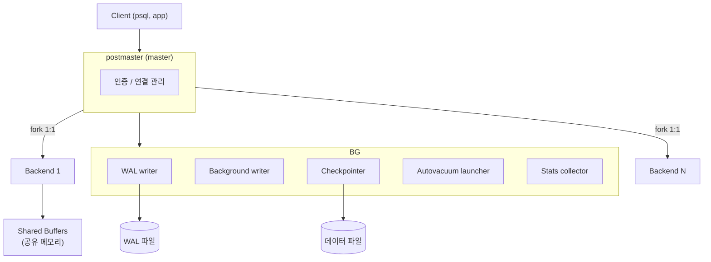
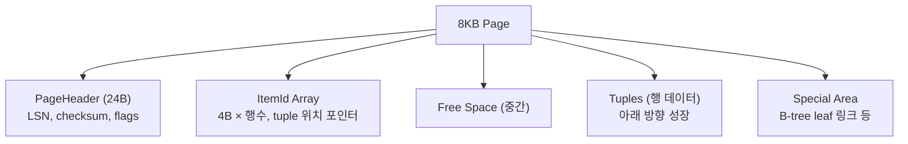
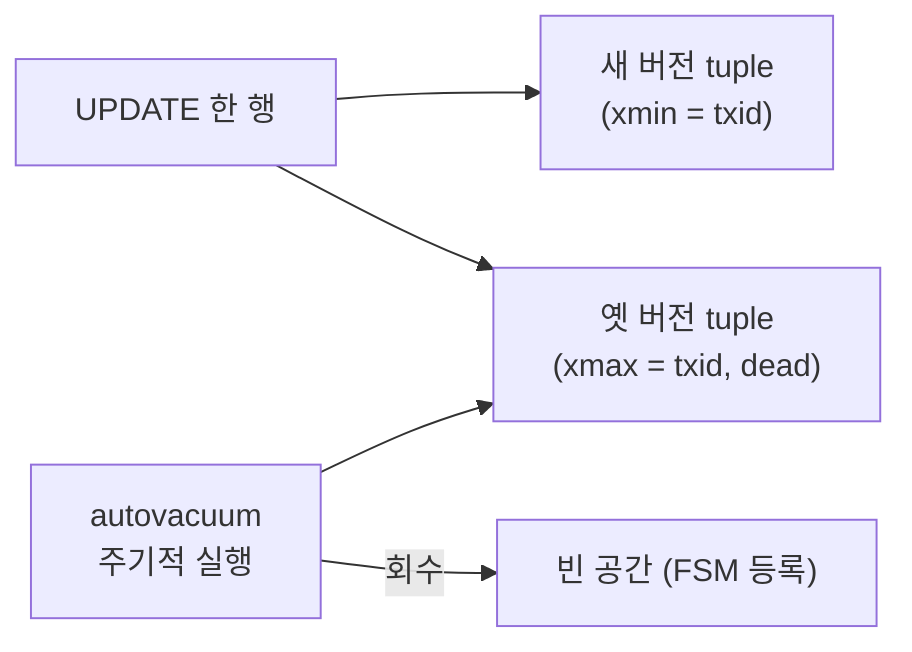
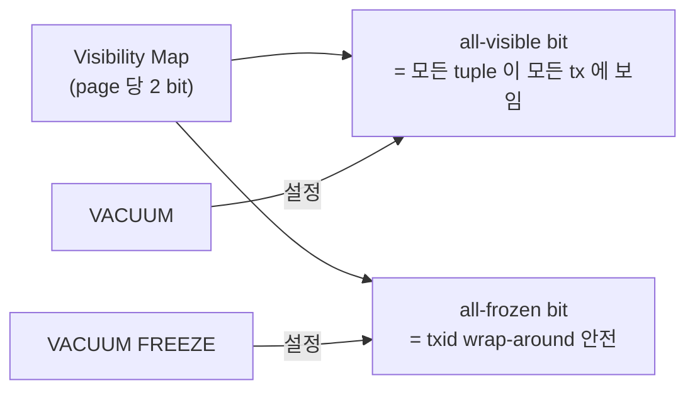
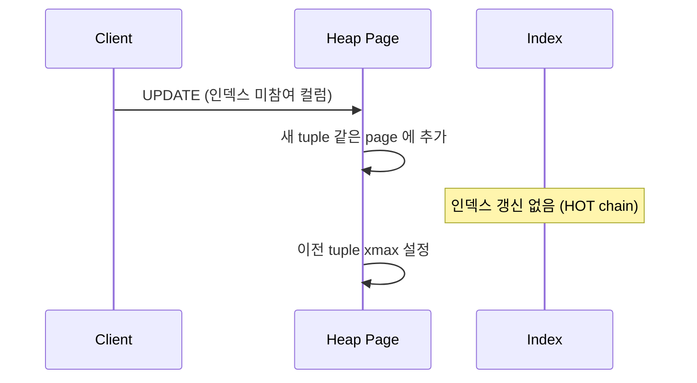
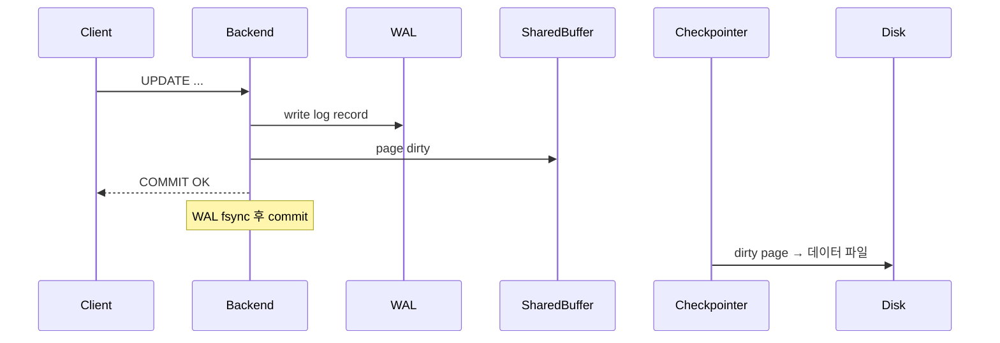
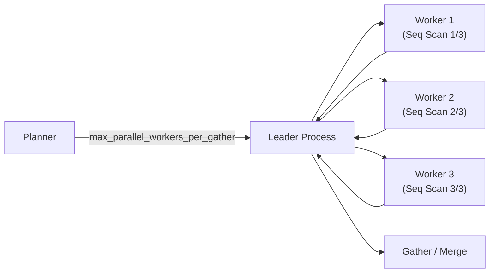

## 정의

**PostgreSQL** 은 *오픈소스 ORDBMS*. 1986 UC Berkeley *POSTGRES* 의 후예. *MVCC, 확장 가능 타입, JSONB, full-text search, GIS (PostGIS), 벡터 (pgvector)* 등 *무거운 데이터 시스템* 의 표준.

## 아키텍처 개요



> [!IMPORTANT]
> *프로세스 per connection*. 1000 연결 = 1000 OS 프로세스. *connection pool (PgBouncer)* 가 *거의 필수*.

## 스토리지 레이아웃: 8KB Page

PostgreSQL 은 *8KB page (block)* 단위로 데이터를 저장. 테이블/인덱스 모두 동일 형식.



| 영역 | 크기 | 의미 |
|---|---|---|
| PageHeader | 24 bytes | LSN, 체크섬, 플래그 |
| ItemId | 4 bytes × 행 수 | tuple 위치 포인터 |
| Tuple | 가변 | HeapTupleHeader + 실제 데이터 |
| Special | 가변 | 인덱스 종류별 메타 |

```sql
-- 총 page 수 확인
SELECT relpages, pg_size_pretty(relpages::bigint * 8192) AS size
FROM pg_class WHERE relname = 'orders';
```

## MVCC + VACUUM

자세한 건 [[mvcc]] 참고. PostgreSQL 의 *dead tuple* 누적 → *VACUUM* 으로 회수.



| VACUUM 종류 | 동작 |
|---|---|
| `VACUUM` | dead tuple 표시, 공간 회수 |
| `VACUUM ANALYZE` | + 통계 갱신 |
| `VACUUM FULL` | *table rewrite*. LOCK 필요. 운영 중 금지 |
| autovacuum | 자동 |

> [!CAUTION]
> *autovacuum 이 따라잡지 못하면* `pg_stat_user_tables.n_dead_tup` 증가 → *쿼리 느려짐 + transaction ID wrap-around* 위험.

## Visibility Map + Transaction ID Freeze



- *all-visible 페이지* 는 VACUUM 이 스킵 → 빠른 vacuum.
- *txid* 는 32bit → 약 21억 한도. *Freeze* 로 영구 보존.
- `vacuum_freeze_min_age`, `vacuum_freeze_table_age` 튜닝.

```sql
-- 위험 수위 확인
SELECT datname, age(datfrozenxid) AS xid_age
FROM pg_database
ORDER BY xid_age DESC;
-- age > 1.5억 이면 경고 수준
```

## HOT Update (Heap-Only Tuple)

*같은 page 안에서* 인덱스 컬럼을 수정하지 않는 UPDATE:



> *HOT* 조건: *인덱스 컬럼 변경 없음* + *같은 page 에 여유 공간*. `fillfactor = 80` 으로 여유 확보.

```sql
SELECT relname, n_tup_hot_upd, n_tup_upd,
       round(n_tup_hot_upd::numeric / NULLIF(n_tup_upd, 0) * 100, 1) AS hot_pct
FROM pg_stat_user_tables
WHERE schemaname = 'public'
ORDER BY n_tup_upd DESC;
```

## WAL (Write-Ahead Log)



- COMMIT = *WAL fsync* 면 OK. 데이터 파일은 *나중에 checkpoint 시*.
- *crash recovery* = WAL replay.
- *streaming replication* 도 WAL 전송.

자세한 건 [[wal-write-ahead-log]] 참고.

## TOAST (큰 컬럼 압축)

> The Oversized-Attribute Storage Technique

```
row size > 2KB 이면:
1. 압축 (LZ4 / pglz)
2. 그래도 크면 → toast 테이블에 분할 저장 (최대 1GB)
```

대용량 텍스트 / JSONB / bytea 가 *자동 처리*.

| TOAST 전략 | 의미 |
|---|---|
| `PLAIN` | 압축/외부화 안 함 |
| `EXTENDED` | 압축 후 외부화 (기본) |
| `EXTERNAL` | 압축 없이 외부화 |
| `MAIN` | 압축 시도, 외부화 가능 |

```sql
ALTER TABLE docs ALTER COLUMN body SET STORAGE EXTERNAL;
```

## Autovacuum 튜닝

```sql
ALTER TABLE orders SET (
  autovacuum_vacuum_scale_factor  = 0.01,   -- 1% dead 시 실행 (기본 20%)
  autovacuum_vacuum_cost_delay    = 2,       -- ms (기본 20ms)
  autovacuum_analyze_scale_factor = 0.005
);
```

| 파라미터 | 기본값 | 의미 |
|---|---|---|
| `autovacuum_vacuum_scale_factor` | 0.2 | 테이블의 20% dead 시 실행 |
| `autovacuum_vacuum_threshold` | 50 | 최소 dead 행 수 |
| `autovacuum_vacuum_cost_delay` | 2ms | I/O 스로틀 |
| `autovacuum_max_workers` | 3 | 동시 vacuum worker 수 |

> [!TIP]
> *대형 테이블* 은 `scale_factor = 0.01` 로 *더 자주* 실행하되, `cost_delay` 를 줄여 빠르게.

## 병렬 쿼리 (Parallel Query)



```sql
SET max_parallel_workers_per_gather = 4;

EXPLAIN SELECT count(*) FROM large_table;
-- Gather (cost=...)
--   -> Parallel Seq Scan on large_table
```

> *집계, 대형 seq scan, hash join* 에서 자동 병렬화.

## 핵심 도구

| 도구 | 의미 |
|---|---|
| `psql` | CLI |
| `pg_dump` / `pg_restore` | 논리 백업 |
| `pg_basebackup` | physical 백업 |
| `pg_rewind` | replica → primary 빠른 동기화 |
| `pgbench` | 벤치마크 |
| `EXPLAIN (ANALYZE, BUFFERS)` | 쿼리 plan + 실행 통계 |
| `pg_stat_*` | 통계 view |

자세한 건 [[query-explain-plan]] 참고.

## 인덱스 종류

| 인덱스 | 용도 |
|---|---|
| B-tree | 일반 (default) |
| Hash | 등가 검색만 |
| GIN | 다값 (배열, JSONB, full-text) |
| GiST | 공간, 범위 |
| SP-GiST | 공간 partitioning |
| BRIN | 큰 시계열 (작은 인덱스) |
| Bloom | 다컬럼 (확률적) |

자세한 건 [[gin-gist-hash-indexes]], [[gin-index-deep]] 참고.

## 확장 (Extension)

```sql
CREATE EXTENSION postgis;             -- 공간
CREATE EXTENSION pgvector;            -- 벡터
CREATE EXTENSION pg_stat_statements;  -- 쿼리 통계
CREATE EXTENSION pg_trgm;             -- 트라이그램 (LIKE 최적화)
CREATE EXTENSION timescaledb;         -- 시계열
CREATE EXTENSION pg_partman;          -- 파티션 자동화
```

> *PostgreSQL 의 최대 강점*. 코어를 확장으로 무한 확장.

## 흔한 함정

> [!WARNING]
> 1. **`SELECT *` + 인덱스 only scan 기대** = TOAST 컬럼 있으면 *table fetch 강제*. 필요 컬럼만.
> 2. **너무 많은 인덱스** = INSERT/UPDATE 느려짐. `pg_stat_user_indexes.idx_scan = 0` 으로 미사용 식별.
> 3. **`pg_dump` 의 논리 백업만 의존** = 대용량은 *시간 폭증*. `pg_basebackup + WAL archive` 가 정통.
> 4. **autovacuum disable** = transaction ID wrap-around → DB 정지. 절대 끄지 말 것.
> 5. **HOT 조건 미확인** = fillfactor 100% + 넓은 행 = HOT 실패 → 인덱스 bloat 폭증.
> 6. **Freeze 지연** = `age(datfrozenxid) > 200,000,000` 이면 비상. `VACUUM FREEZE` 수동 실행.

## 관련 위키

- [[mvcc]], [[btree-indexing]]
- [[gin-gist-hash-indexes]], [[gin-index-deep]]
- [[query-explain-plan]]
- [[transaction-isolation-levels]]
- [[wal-write-ahead-log]]
- [[mysql-innodb]] (비교)
- [[postgresql-jsonb]]
- [[char-varchar-text-jsonb]]
