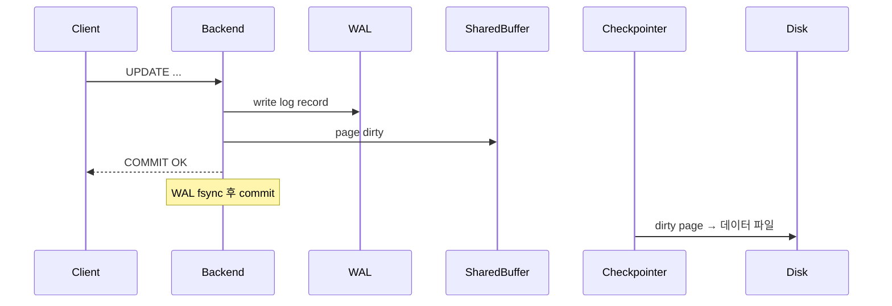

## 정의

**PostgreSQL** 은 *오픈소스 ORDBMS*. 1986 UC Berkeley *POSTGRES* 의 후예. *MVCC, 확장 가능 타입, JSONB, full-text search, GIS (PostGIS), 벡터 (pgvector)* 등 *무거운 데이터 시스템* 의 표준.

## 프로세스 모델

```mermaid
flowchart TB
    Postmaster[postmaster<br/>master process] --> BG[Background workers]
    BG --> WAL_W[WAL writer]
    BG --> BG_W[Background writer]
    BG --> Checkpointer[Checkpointer]
    BG --> Autovacuum[Autovacuum launcher]
    BG --> Stats[Stats collector]
    Postmaster -->|fork| C1[Backend 1<br/>(connection)]
    Postmaster -->|fork| C2[Backend 2]
    Postmaster -->|fork| C3[Backend N]
```

> [!IMPORTANT]
> *프로세스 per connection*. 1000 연결 = 1000 OS 프로세스. *connection pool (PgBouncer)* 가 *거의 필수*.

## MVCC + VACUUM

자세한 건 [[mvcc]] 참고. PostgreSQL 의 *dead tuple* 누적 → *VACUUM* 으로 회수.

```mermaid
flowchart LR
    Update[UPDATE 한 행] --> NewVer[새 버전 tuple]
    Update --> DeadVer[옛 버전 tuple<br/>(dead)]
    Auto[autovacuum<br/>주기적 실행] --> DeadVer
    Auto -->|회수| Space[빈 공간]
```

| VACUUM 종류 | 동작 |
|---|---|
| `VACUUM` | dead tuple 표시, 공간 회수 |
| `VACUUM ANALYZE` | + 통계 갱신 |
| `VACUUM FULL` | *table rewrite*. LOCK 필요. 운영 중 금지 |
| autovacuum | 자동 |

> [!CAUTION]
> *autovacuum 이 따라잡지 못하면* `pg_stat_user_tables.n_dead_tup` 증가 → *쿼리 느려짐 + transaction ID wrap-around* 위험.

## WAL (Write-Ahead Log)



- COMMIT = *WAL fsync* 면 OK. 데이터 파일은 *나중에 checkpoint 시*.
- *crash recovery* = WAL replay.
- replication 도 *WAL streaming*.

## TOAST (큰 컬럼 압축)

> The Oversized-Attribute Storage Technique

```
row size > 2KB 이면:
1. 압축 (LZ4 / pglz)
2. 그래도 크면 → toast 테이블에 *분할 저장*
```

대용량 텍스트 / JSONB / bytea 가 *자동 처리*. 사용자 코드 불필요.

## 핵심 도구

| 도구 | 의미 |
|---|---|
| `psql` | CLI |
| `pg_dump` / `pg_restore` | 백업 |
| `pg_basebackup` | physical 백업 |
| `pg_rewind` | replica → primary 빠른 동기화 |
| `pgbench` | 벤치마크 |
| `EXPLAIN` | 쿼리 plan |
| `pg_stat_*` | 통계 view |

## EXPLAIN ANALYZE

```sql
EXPLAIN (ANALYZE, BUFFERS) SELECT * FROM users WHERE email = 'koa@x.com';
```

자세한 건 [[query-explain-plan]] 참고.

## 인덱스 종류

| 인덱스 | 용도 |
|---|---|
| B-tree | 일반 (default) |
| Hash | 등가 검색만 |
| GIN | 다값 (배열, JSONB, full-text) |
| GiST | 공간, 범위 |
| SP-GiST | 공간 partitioning |
| BRIN | 큰 시계열 (작은 인덱스) |
| Bloom | 다컬럼 (확률적) |

자세한 건 [[gin-gist-hash-indexes]] 참고.

## 확장 (Extension)

```sql
CREATE EXTENSION postgis;      -- 공간
CREATE EXTENSION pgvector;     -- 벡터
CREATE EXTENSION pg_stat_statements;  -- 쿼리 통계
CREATE EXTENSION pg_trgm;      -- 트라이그램 (LIKE 최적화)
CREATE EXTENSION timescaledb;  -- 시계열
```

> *PostgreSQL 의 최대 강점*. 코어를 *확장 으로 거대화*.

## 흔한 함정

> [!WARNING]
> 1. **`SELECT *` + 인덱스 only scan 기대** = TOAST 컬럼 있으면 *table fetch 강제*. 필요 컬럼만.
> 2. **너무 많은 인덱스** = INSERT/UPDATE 느려짐. 사용 안 되는 인덱스 `pg_stat_user_indexes.idx_scan = 0` 으로 식별.
> 3. **`pg_dump` 의 *논리 백업* 만 의존** = 대용량은 *시간 폭증*. *pg_basebackup + WAL archive* 가 정통.
> 4. **autovacuum disable** = transaction ID wrap-around → DB 정지. 절대 끄지 말 것.

## 관련 위키

- [[mvcc]], [[btree-indexing]]
- [[gin-gist-hash-indexes]]
- [[query-explain-plan]]
- [[transaction-isolation-levels]]
- [[wal-write-ahead-log]]
- [[mysql-innodb]] (비교)
