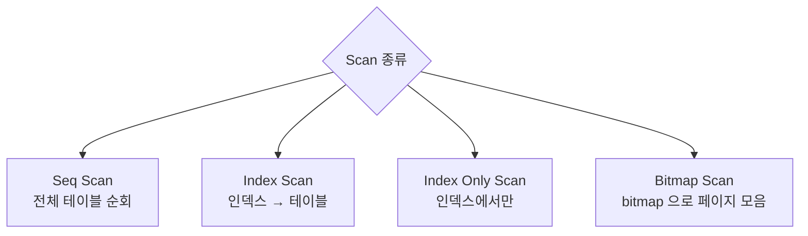

## 정의

**EXPLAIN** = *쿼리 실행 계획 표시*. **EXPLAIN ANALYZE** = *실제로 실행 + 실제 시간 측정*.

```sql
EXPLAIN (ANALYZE, BUFFERS, VERBOSE, FORMAT TEXT)
SELECT u.name, COUNT(o.id)
FROM users u LEFT JOIN orders o ON o.user_id = u.id
WHERE u.created_at > '2026-01-01'
GROUP BY u.id, u.name;
```

## Scan 종류



| Scan | 의미 | 적합 |
|---|---|---|
| **Seq Scan** | 전체 테이블 | 작은 테이블, 대부분 row 반환 |
| **Index Scan** | 인덱스 → row | 선택적 (적은 row) |
| **Index Only Scan** | 인덱스 only (heap 안 봄) | covering index |
| **Bitmap Index Scan** | 여러 인덱스 결합 + bitmap | 다 인덱스 조합 |
| **Bitmap Heap Scan** | bitmap → 페이지 fetch | 위와 짝 |
| **Tid Scan** | 직접 tid 접근 | 극히 드뭄 |

## Join 종류

| Join | 동작 | 적합 |
|---|---|---|
| **Nested Loop** | for outer { for inner } | 작은 inner + 인덱스 |
| **Hash Join** | hash 빌드 → 룩업 | 큰 양쪽, 등가 조건 |
| **Merge Join** | 정렬된 양쪽 머지 | 양쪽 정렬됨, 범위 조건 |

```anim:grace-hash-join
{}
```

> 위 애니메이션은 *Grace Hash Join* (메모리 부족 시 분할 hash). 대용량 join 의 일반 직관.

## EXPLAIN ANALYZE 출력 읽기

```
Aggregate  (cost=1024.50..1024.51 rows=1 width=8) (actual time=15.234..15.236 rows=1 loops=1)
  ->  Hash Join  (cost=12.50..1020.50 rows=1600 width=4) (actual time=0.234..14.123 rows=1542 loops=1)
        Hash Cond: (o.user_id = u.id)
        ->  Seq Scan on orders o  (cost=0.00..900.00 rows=50000 width=8) (actual time=0.012..5.234 rows=49832 loops=1)
        ->  Hash  (cost=10.00..10.00 rows=200 width=8) (actual time=0.190..0.190 rows=215 loops=1)
              ->  Index Scan using idx_users_created on users u  (cost=0.42..10.00 rows=200 width=8) (actual time=0.012..0.123 rows=215 loops=1)
                    Index Cond: (created_at > '2026-01-01'::date)
Planning Time: 0.345 ms
Execution Time: 15.456 ms
```

| 필드 | 의미 |
|---|---|
| `cost=A..B` | A = 시작 비용, B = 총 비용 (페이지 수 단위) |
| `rows=N` | 예상 row 수 |
| `width=N` | 평균 row 바이트 |
| `actual time=A..B` | 실제 시작/종료 ms |
| `rows=actual` | 실제 row 수 |
| `loops=N` | 이 노드가 *N번 실행* |
| `Planning Time` | optimizer 시간 |
| `Execution Time` | 실행 시간 |

> [!IMPORTANT]
> *예상 vs 실제* row 수 차이가 *수십배* 면 *통계 부정확* → `ANALYZE table_name` 으로 갱신.

## 자주 보는 안티 패턴

### 1. Seq Scan on 큰 테이블

```
Seq Scan on big_table  (rows=10000000)
  Filter: (status = 'pending')
  Rows Removed by Filter: 9990000
```

→ 인덱스 추가 또는 *partial index* (`WHERE status = 'pending'`).

### 2. Nested Loop on 큰 양쪽

```
Nested Loop  (loops=100000)
  ->  Index Scan on table_a
  ->  Index Scan on table_b
```

→ 한쪽이 *수만 row* 면 *Hash Join* 으로 가야 함. `set enable_nestloop = off` 로 테스트.

### 3. Sort + Disk

```
Sort  (Sort Method: external merge  Disk: 1234kB)
```

→ `work_mem` 부족. session 또는 query 단위 증가.

```anim:sort-spill
{}
```

> 외부 정렬 (disk spill) 동작 직관. *임시 파일이 디스크에 쓰임*.

### 4. Bitmap Heap Scan + 작은 rows

```
Bitmap Heap Scan  (rows=10)
  ->  Bitmap Index Scan
```

→ 좋은 패턴. 인덱스가 *적절히* 작동.

## 자주 쓰는 옵션

```sql
EXPLAIN (
  ANALYZE,      -- 실제 실행
  BUFFERS,      -- shared/local/temp buffer hits
  VERBOSE,      -- 컬럼 / 함수 상세
  COSTS OFF,    -- cost 숨김 (clean diff)
  FORMAT JSON   -- 도구 분석
) ...
```

## 시각화 도구

| 도구 | 비고 |
|---|---|
| [explain.depesz.com](https://explain.depesz.com/) | 색상 코딩 |
| [pev2 (Dalibo)](https://explain.dalibo.com/) | tree 시각화 |
| [pg_stat_statements](https://www.postgresql.org/docs/current/pgstatstatements.html) | 누적 통계 |
| [auto_explain](https://www.postgresql.org/docs/current/auto-explain.html) | 느린 쿼리 자동 로깅 |

## 흔한 함정

> [!WARNING]
> 1. **`EXPLAIN` (without ANALYZE) 만 신뢰** = optimizer 의 *추정*. 실제 행동은 다를 수 있다.
> 2. **`actual rows` 와 `rows=` 차이 무시** = stale 통계. ANALYZE 필요.
> 3. **`Hash Join` 의 *큰 memory*** = work_mem 부족 시 disk spill. 그래도 *Nested Loop 보다 빠를 수* 있다.
> 4. **planner hint 부재** = PostgreSQL 은 *공식 hint 없음*. SET 변수로 *간접 제어*. (MySQL 은 `STRAIGHT_JOIN` 등 hint 직접.)

## 관련 위키

- [[btree-indexing]], [[gin-gist-hash-indexes]]
- [[postgresql]], [[mysql-innodb]]
- [[mvcc]]
- [[transaction-isolation-levels]]
