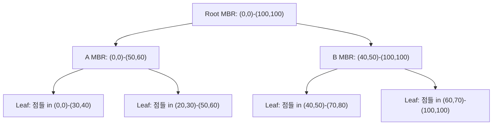
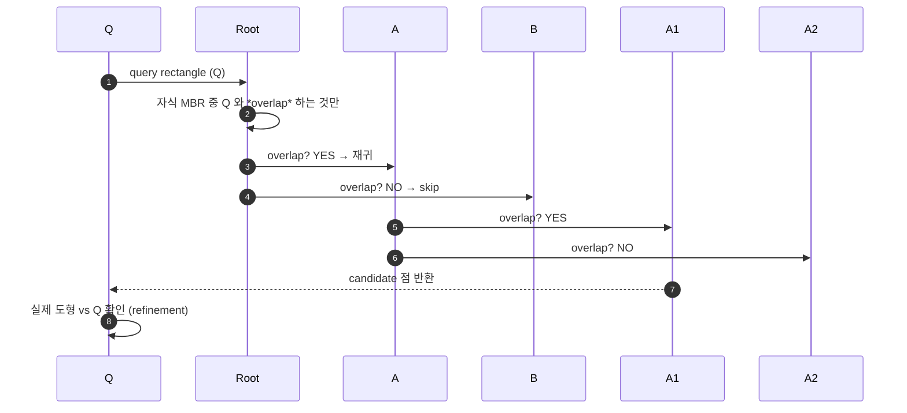
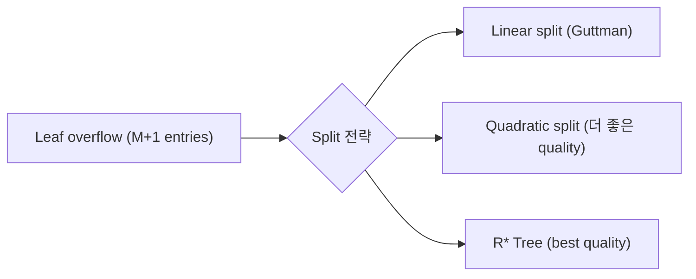
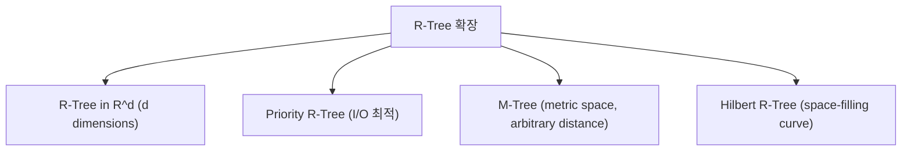

## 정의

**R-Tree** (Guttman, 1984) = *공간 데이터 (2D, 3D)* 를 인덱싱하는 *balanced tree*. 각 노드는 *Minimum Bounding Rectangle (MBR)* 을 저장.

> [!IMPORTANT]
> *지도, GIS, 위치 기반 서비스, 3D 게임, CAD* 의 표준. PostGIS, MySQL Spatial, SQL Server Spatial 모두 R-Tree 계열.

## 왜 B-Tree 로 안 되나?

```
공간 데이터: (x, y) 좌표
Query: "이 사각형 안의 점들"
```

B-Tree 는 *1차원* 정렬만 가능:

```sql
-- ✗ 각 축을 별도 인덱스 → 매우 비효율
CREATE INDEX ON points(x);
CREATE INDEX ON points(y);
SELECT * FROM points WHERE x BETWEEN 10 AND 20 AND y BETWEEN 30 AND 40;
-- 두 인덱스 AND, 대부분 안 씀
```

R-Tree = *n차원 공간의 계층적 분할*.

## 구조 (2D 예)



각 노드가 *자기 자식들을 감싸는 최소 사각형 (MBR)* 저장. B-Tree 처럼 *balanced*.

## MBR (Minimum Bounding Rectangle)

```
점: (10, 20)
선분: (5, 5) - (15, 25) → MBR = (5,5)-(15,25)
원: 중심 (10, 10), 반지름 5 → MBR = (5,5)-(15,15)
폴리곤: 모든 꼭짓점 감싸는 최소 사각형
```

R-Tree 는 *실제 도형이 아닌 MBR 로 계산* → 빠름. Precision 은 별도 filter 로.

## Search



**2 단계 필터링**:

1. **Filter**: MBR 겹침 확인 (빠름, 근사)
2. **Refinement**: 실제 도형 vs 쿼리 (정확, 느림)

## Insertion + Split

새 도형 → *가장 적게 확장되는* 자식 선택 → leaf 도달:

```
insert(root, entry):
  if leaf:
    add entry to leaf
    if leaf overflow:
      split(leaf)
  else:
    best_child = choose_subtree(node, entry)
    insert(best_child, entry)
    update MBR of node
```

### Split 알고리즘 (핵심)



| 알고리즘 | 시간 | 품질 |
|---|---|---|
| Linear | O(N) | 낮음 |
| Quadratic | O(N²) | 중간 |
| R* Tree | O(N log N) | *최고* |

### R* Tree (2026 표준)

**Beckmann et al. (1990)** 의 개선:

- *Overflow 시 재삽입* (forced reinsertion).
- *Overlap 최소화* + *coverage 최소화* + *dead space 최소화*.
- PostGIS 의 GiST 가 R* 기반.

## R-Tree vs Quad-tree vs KD-Tree

| | R-Tree | Quad-tree | KD-Tree |
|---|---|---|---|
| Balanced | *예* | 아니오 | 아니오 |
| Disk I/O | *최적* | 나쁨 | 나쁨 |
| Dimension | 낮음 (2-6) | 2D | 낮음 (2-10) |
| DB 사용 | *표준* | 드묾 | 드묾 |
| 삽입 | 복잡 | 간단 | 복잡 |
| 갱신 | 느림 | 빠름 | 매우 느림 (rebuild) |

## PostGIS 사용

```sql
CREATE EXTENSION postgis;

CREATE TABLE places (
  id BIGSERIAL PRIMARY KEY,
  name TEXT,
  location GEOMETRY(Point, 4326)   -- WGS 84
);

CREATE INDEX idx_places_geom ON places USING gist(location);

-- 반경 검색
SELECT * FROM places
WHERE ST_DWithin(location, ST_MakePoint(126.97, 37.55)::geography, 1000);

-- 사각형 검색
SELECT * FROM places
WHERE location && ST_MakeEnvelope(126.9, 37.5, 127.0, 37.6, 4326);
```

> PostGIS 는 *GiST + R-Tree*. `&&` (overlap), `<@` (contains), `~=` (equal).

## PostGIS 의 성능 팁

```sql
-- 1. Geometry 대신 geography (구면 거리 정확)
location GEOGRAPHY(Point, 4326)

-- 2. SP-GiST 는 point 만 (더 빠름)
CREATE INDEX ON places USING spgist(location);

-- 3. Clustered index 로 physical order 개선
CLUSTER places USING idx_places_geom;

-- 4. Materialized bounding box column (자주 검색시)
ALTER TABLE places ADD COLUMN bbox BOX2D
  GENERATED ALWAYS AS (ST_Envelope(location)) STORED;
CREATE INDEX ON places USING gist(bbox);
```

## GiST vs SP-GiST vs BRIN (공간)

| 인덱스 | 적합 |
|---|---|
| **GiST** | 일반 (Point, Polygon, Range) - R-Tree 기반 |
| **SP-GiST** | Point only, Quadtree - 더 빠름 |
| **BRIN** | 시계열 좌표 (센서 데이터) |

자세한 건 [[gin-index-deep]] / [[gin-gist-hash-indexes]].

## R-Tree 알고리즘 (3D+)



**M-Tree** = *임의 거리 함수* (문자열 편집 거리 등) 가능. **HNSW** (벡터 검색) 은 완전히 다른 접근.

자세한 벡터 검색은 [[elasticsearch-vector-search]], [[Redis Vector Search]].

## 흔한 함정

> [!WARNING]
> 1. **`&&` (overlap) 만 쓰고 refinement 안 함** = MBR 겹치는 *false positive*. `ST_Intersects` 로 정밀.
> 2. **Geography vs Geometry 혼용** = 거리 단위 다름. 명시.
> 3. **SRID 불일치** = 검색 실패. `ST_Transform` 으로 통일.
> 4. **큰 폴리곤의 R-Tree** = MBR 이 너무 커서 *false positive 폭증*. 폴리곤 분할.

## 관련 위키

- [[b-tree-internals]]
- [[b-plus-tree-internals]]
- [[gin-index-deep]]
- [[gin-gist-hash-indexes]]
- [[postgresql]]
- [[elasticsearch-vector-search]] (다른 접근)
