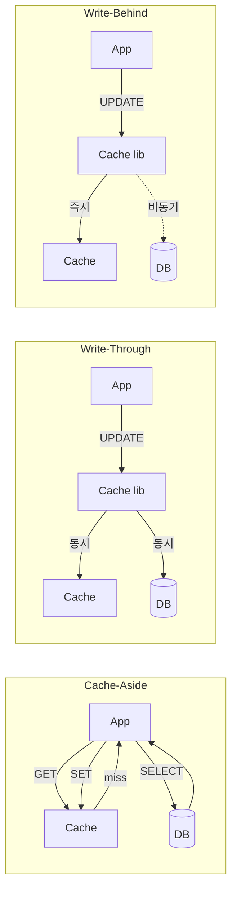
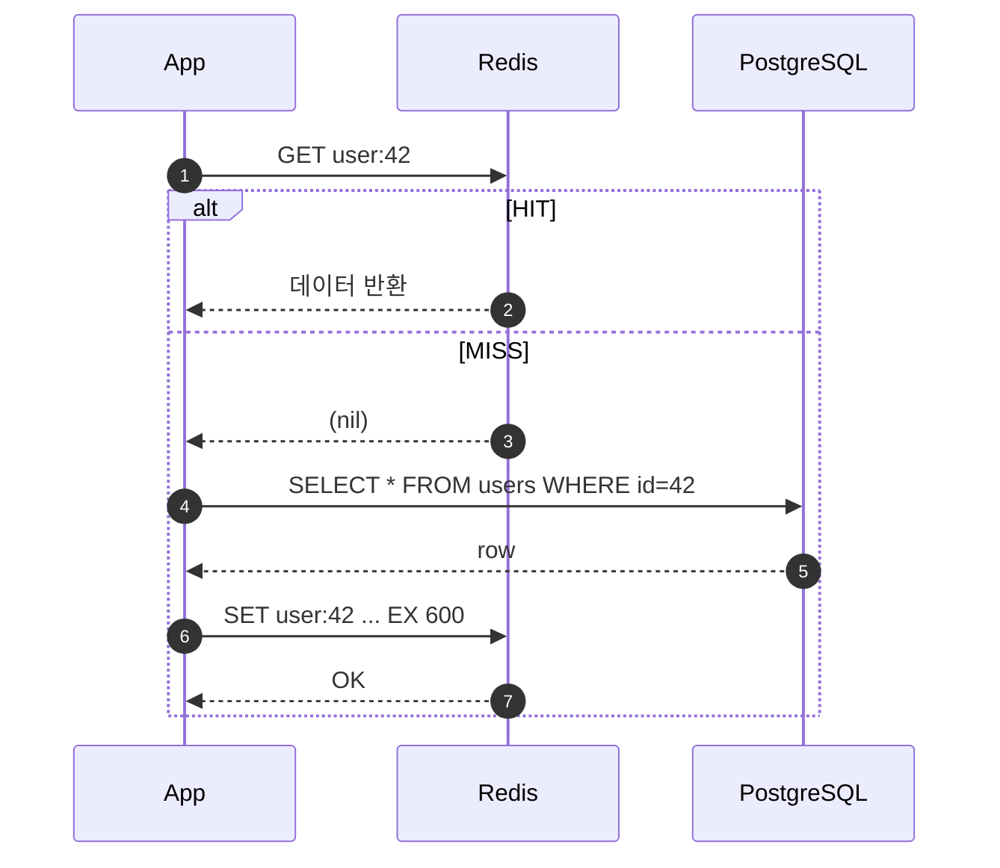
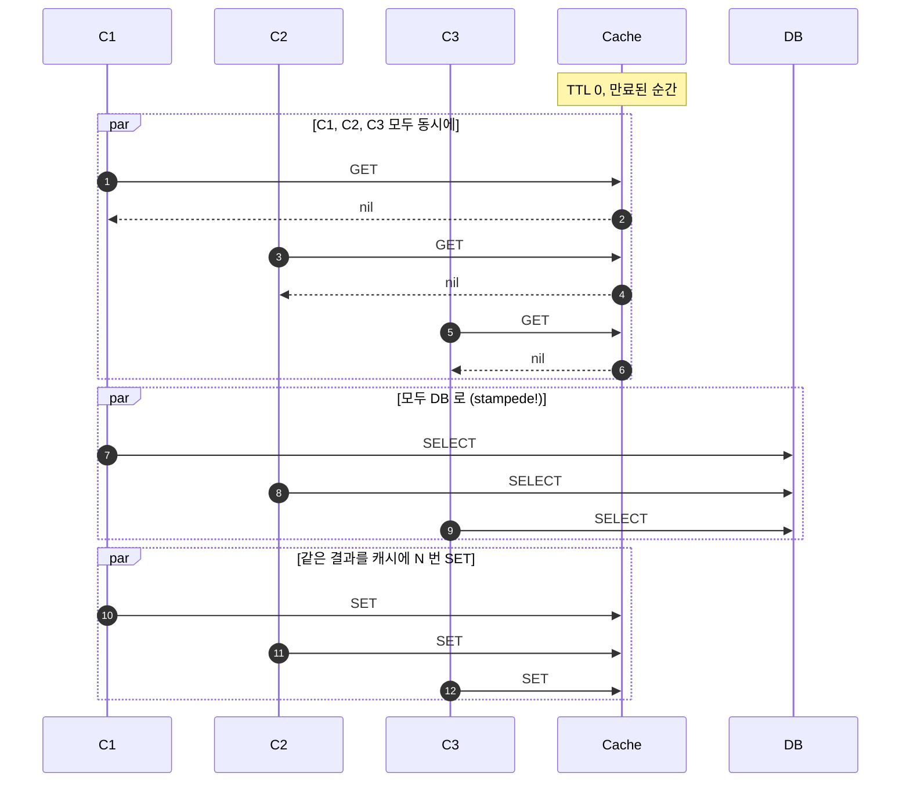

## 정의

**Cache Pattern** 은 *Redis (또는 다른 캐시)* 를 *어떤 경로로 읽고 쓰는지* 의 디자인 결정. 같은 인프라로도 *패턴 선택에 따라 일관성 / 지연 / 부하* 가 완전히 달라진다.

가장 흔한 다섯 가지:

1. **Cache-aside** (look-aside): *애플리케이션이* 캐시를 *직접* 본다. miss 면 DB 로 가서 *직접* 캐시에 채운다.
2. **Read-through**: *캐시 라이브러리* 가 miss 시 *자동* 으로 backing store 를 조회.
3. **Write-through**: write 시 *캐시 + DB 동시* 갱신. 일관성 ↑.
4. **Write-behind / Write-back**: 캐시 먼저 쓰고 *비동기* 로 DB 반영. 쓰기 빠름, 손실 위험.
5. **Refresh-ahead**: *TTL 만료 직전* 에 *백그라운드 refresh*. miss 자체를 줄임.

## Cache Hit / Miss 의 시각

행복 경로 (HIT):

```anim:redis-cache-hit
{}
```

캐시 채우는 경로 (MISS → DB → set):

```anim:redis-cache-miss
{}
```

> [!NOTE]
> 위 두 애니메이션은 *왼쪽 Client → Cache → DB* 의 표준 *cache-aside* 패턴. HIT 는 ~6ms, MISS 는 DB 왕복까지 더해 ~72ms 의 *직관 차이* 를 보여준다.

## 5가지 패턴 비교



매트릭스:

| 패턴 | 일관성 | 읽기 지연 | 쓰기 지연 | 복잡도 | 흔한 곳 |
|---|---|---|---|---|---|
| Cache-aside | 약 (TTL 의존) | miss 만 느림 | DB 만 영향 | 낮음 | *기본값*. Rails `Rails.cache.fetch`, Django |
| Read-through | 약 (TTL 의존) | miss 만 느림 | DB 만 영향 | 중간 | 캐시 라이브러리 / Hibernate L2 |
| Write-through | 강 (캐시 ↔ DB 같은 순간) | 캐시에서 즉시 | 둘 다 기다림 | 중간 | 결제 / 잔액 |
| Write-behind | 약 (지연된 일관성) | 캐시에서 즉시 | 캐시만 기다림 | 높음 (장애 시 손실) | 메트릭 / 로그 집계 |
| Refresh-ahead | 약 | 항상 빠름 | 백그라운드 | 높음 | 인기 콘텐츠, 메인 페이지 |

## Cache-aside 의 정석

`GET → miss → SELECT → SET`:



여러 언어로 같은 패턴:

<CodeWithOutput
  outputLanguage="text"
  outputLabel="동일"
  title="Cache-aside 의 본질"
  variants={[
    {
      label: 'ruby',
      language: 'ruby',
      code: `# Rails 의 표준
def find_user(id)
  Rails.cache.fetch("user:#{id}", expires_in: 10.minutes) do
    User.find(id)
  end
end`,
    },
    {
      label: 'python',
      language: 'python',
      code: `import redis, json
r = redis.Redis()

def find_user(id: int):
    key = f"user:{id}"
    cached = r.get(key)
    if cached:
        return json.loads(cached)
    user = db.query("SELECT * FROM users WHERE id=%s", id).fetchone()
    r.set(key, json.dumps(user), ex=600)
    return user`,
    },
    {
      label: 'typescript',
      language: 'typescript',
      code: `import { Redis } from 'ioredis';
const r = new Redis();

export async function findUser(id: number) {
  const key = \`user:\${id}\`;
  const cached = await r.get(key);
  if (cached) return JSON.parse(cached);

  const user = await db.queryOne('SELECT * FROM users WHERE id=$1', [id]);
  await r.set(key, JSON.stringify(user), 'EX', 600);
  return user;
}`,
    },
    {
      label: 'java',
      language: 'java',
      code: `@Service
class UserService {
  private final RedisTemplate<String, User> redis;
  private final UserRepo repo;

  public User find(long id) {
    var key = "user:" + id;
    User cached = redis.opsForValue().get(key);
    if (cached != null) return cached;

    User user = repo.findById(id).orElseThrow();
    redis.opsForValue().set(key, user, Duration.ofMinutes(10));
    return user;
  }
}`,
    },
  ]}
  output={`동일 입력 → 동일 응답. miss 시 첫 호출만 DB 왕복.`}
/>

## Cache Stampede (Thundering Herd / Dogpile)

TTL 이 *동시에 만료* 되면 *수많은 클라이언트* 가 *동시에 DB* 를 친다. *원래 막아주던 캐시* 가 *증폭기* 가 되는 사고.



### 완화 패턴 4가지

| 패턴 | 동작 | 단점 |
|---|---|---|
| **Single-flight (mutex)** | `SET key:lock NX EX` 잡은 *한 명* 만 DB 조회, 나머지는 *기다림 / 옛 값* 사용 | 락 노드 장애 시 데드락 위험 |
| **Probabilistic Early Expiration (XFetch)** | *남은 TTL 의 함수* 로 *확률적 미리 갱신*. 만료 전에 *극소수* 가 갱신 | 알고리즘 약간 복잡 |
| **Stale-while-revalidate** | TTL 만료 후에도 *N 초간 옛 값 응답* + *백그라운드 갱신* | *완전 stale* 응답을 허용해야 함 |
| **Jitter on TTL** | TTL = base + random(±N%) | *동시 만료 자체* 만 분산. 완전 해결 X |

### XFetch (Probabilistic Early Expiration)

논문 ([Vattani et al.](https://en.wikipedia.org/wiki/Cache_stampede)) 의 공식:

```
expiry = now + delta * beta * log(rand())
```

캐시에 *기록 시점에 평균 fetch 시간 `delta`* 를 함께 저장. 읽을 때 *위 식이 TTL 만료 시점을 넘으면* *자기가* 갱신.

```python
import math, random, time

def get_with_xfetch(r, key, fetch_fn, ttl_seconds, beta=1.0):
    payload = r.get(key)
    if payload is None:
        return refresh(r, key, fetch_fn, ttl_seconds)

    value, delta, expiry = decode(payload)
    now = time.time()
    if now - delta * beta * math.log(random.random()) >= expiry:
        # 만료 전이지만 *확률적으로 미리 갱신*
        return refresh(r, key, fetch_fn, ttl_seconds)
    return value
```

### Single-flight: SET NX 락

```python
def cache_aside_with_lock(r, key, fetch_fn, ttl=600):
    val = r.get(key)
    if val is not None:
        return val

    # 락 시도
    lock_key = f"lock:{key}"
    got = r.set(lock_key, "1", nx=True, ex=10)
    if got:
        try:
            fresh = fetch_fn()
            r.set(key, fresh, ex=ttl)
            return fresh
        finally:
            r.delete(lock_key)
    else:
        # 다른 클라이언트가 갱신 중. 잠시 기다렸다가 재시도
        time.sleep(0.05)
        return cache_aside_with_lock(r, key, fetch_fn, ttl)
```

## Eviction Policy (`maxmemory-policy`)

메모리 한도 (`maxmemory`) 초과 시 *어떤 키부터 버릴지*. 패턴 선택만큼 중요.

| Policy | 동작 | 권장 시나리오 |
|---|---|---|
| `noeviction` *(기본)* | 메모리 초과 시 *write 에러* | *데이터 손실 절대 안 됨* (primary store) |
| `allkeys-lru` | 모든 키 중 *최근 덜 쓰인 (LRU)* 제거 | *순수 캐시* |
| `allkeys-lfu` | *덜 자주 쓰인 (LFU)* 제거 | *인기 분포 편중* 환경 (롱테일) |
| `allkeys-random` | 무작위 | LRU 비용도 아까울 때 (드물게) |
| `volatile-lru` | *TTL 설정된 키 중* LRU | *세션 + 영구 데이터* 혼합 |
| `volatile-lfu` | TTL 키 중 LFU | 동일, 분포 편중 |
| `volatile-ttl` | *남은 TTL 짧은 키부터* | TTL 의 의미가 *우선순위* 일 때 |
| `volatile-random` | TTL 키 중 무작위 | 드물게 |

### LRU 의 동작 직관

```anim:lru-cache
{}
```

> [!NOTE]
> Redis 의 LRU 는 *근사 LRU* (`maxmemory-samples` 만큼 sampling). 정확한 LRU 가 아니다. `maxmemory-samples 10` 정도가 정확도 / 비용의 보통 타협점.

### Eviction 성능 비교 (직관)

같은 워크로드, 다른 정책에서의 *히트율 차이* 의 직관:

<ChartJs
  client:visible
  type="bar"
  title="Eviction 정책별 캐시 히트율 (가상 워크로드, 인기 분포 편중)"
  caption="롱테일 분포에서는 LFU 가 LRU 보다 안정적. 균등 분포에서는 차이 없음."
  height="280px"
  data={{
    labels: ['noeviction (full)', 'allkeys-random', 'allkeys-lru', 'allkeys-lfu', 'volatile-ttl'],
    datasets: [
      {
        label: '히트율 (%)',
        data: [99.5, 60.2, 84.7, 92.1, 78.5],
        backgroundColor: ['#94a3b8', '#f59e0b', '#3b82f6', '#22c55e', '#a78bfa'],
        borderWidth: 0,
      },
    ],
  }}
  options={{
    scales: { y: { title: { display: true, text: '히트율 (%)' }, suggestedMax: 100 } },
    plugins: { legend: { display: false } },
  }}
/>

## Negative Caching (404 / null 도 캐시)

DB miss 자체가 비싸면 *결과 없음* 도 캐시.

```python
def get_user(id):
    cached = r.get(f"user:{id}")
    if cached == NULL_SENTINEL:
        return None     # *없음* 도 캐시
    if cached is not None:
        return json.loads(cached)
    user = db_lookup(id)
    if user is None:
        r.set(f"user:{id}", NULL_SENTINEL, ex=60)   # 짧은 TTL
    else:
        r.set(f"user:{id}", json.dumps(user), ex=600)
    return user
```

> [!CAUTION]
> Negative cache TTL 은 *짧게* (예: 60초). 안 그러면 *방금 가입한 사용자가 한참 동안 안 보이는* 버그.

## 무효화 (Invalidation)

> "There are only two hard things in Computer Science: cache invalidation and naming things." (Phil Karlton)

### Write 시 캐시 *무효화* (가장 흔함)

```python
def update_user(id, **fields):
    db.update("UPDATE users SET ... WHERE id=%s", id, **fields)
    r.delete(f"user:{id}")     # 다음 GET 이 miss → 새로 채움
```

> *`SET` 으로 갱신* 보다 `DEL` 이 일반적으로 안전. 멀티 키 / 파생 캐시까지 정확히 갱신하기 어렵기 때문에 *지우고 다시 빠뜨리는* 패턴.

### Tagged Invalidation (Russian Doll)

특정 그룹의 캐시 *일괄 무효화* 가 필요할 때. *키에 버전 / 타임스탬프* 를 박는다.

```python
def get_post(post_id):
    version = r.get(f"post:{post_id}:version") or "0"
    return cached_get(f"post:{post_id}:v{version}")

def invalidate_post(post_id):
    r.incr(f"post:{post_id}:version")   # 옛 키들은 *자연 만료* 만 기다림
```

## 김신건의 현장 메모

- *Rails.cache.fetch* 의 *race_condition_ttl* 이 *single-flight + stale-while-revalidate* 의 *내장 버전*. 인기 페이지에 *반드시*.
- *Sidekiq job 결과* 를 캐시할 때 *영구 캐시 + 명시적 invalidation* 이 *짧은 TTL* 보다 *DB / Redis 모두 가벼웠다*.
- *Memcached 에서 Redis 로 갈아탄* 가장 큰 이유: *negative cache* 와 *데이터 구조* 였다. *Memcached* 는 *단순 캐시* 의 *끝까지 단단* 하지만, *해시 / 정렬셋 / 집합* 이 필요해지면 결국 Redis.
- *LFU 가 LRU 보다 좋은 경우* 의 직관: *"대부분의 트래픽은 인기 콘텐츠 20%"* 이면 LFU 가 강함. *균일 분포* 에서는 LRU 와 LFU 가 비슷.

## 관련 위키

- [[Redis]] (라이센스 / 신 기능)
- [[Redis Persistence]] (캐시 전용일 때 영속화 비활성)
- [[Redis Pub Sub vs Streams]] (캐시 무효화 fan-out)
- [[Zero Downtime Deployment]] (배포 시 캐시 워밍)

## 참고

- 공식: [Eviction policies](https://redis.io/docs/latest/develop/reference/eviction/)
- AWS: [Caching Best Practices](https://aws.amazon.com/caching/best-practices/)
- Wikipedia: [Cache stampede](https://en.wikipedia.org/wiki/Cache_stampede)
- Cloudflare: [SWR 적용](https://blog.cloudflare.com/origin-cache-control/)
